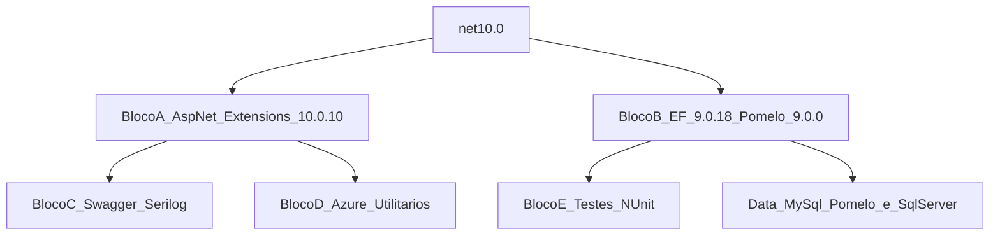

# Levantamento e Conjunto Homologado — SmartDigitalPsicoAPI (.NET 10)

**Documento:** Inventário + Conjunto Homologado do ciclo  
**Solução:** `SmartDigitalPsicoAPI/SmartDigitalPsicoAPI.sln`  
**Data do inventário:** 2026-07-31  
**SDK de referência no ambiente:** `.NET SDK 10.0.x` (migração a partir de `net8.0`)  
**Processo-base:** `DOCUMENTACAO/GuiaGenericoAtualizacaoPacotes.md`  
**Plano de ação (UpdateDotNet10):** `DOCUMENTACAO/UpdateDotNet10/PlanoAcaoMigracaoDotNet10.md`

---

## 1. Objetivo

Definir o **único conjunto de versões NuGet e TFMs** a aplicar na migração de `SmartDigitalPsicoAPI` de **.NET 8 → .NET 10**, de forma que:

1. Sejam **compatíveis entre si** (sem `NU1107` / `NU1202`)
2. Maximizem versões estáveis recentes
3. Respeitem a **trava Pomelo ↔ EF Core**
4. Preservem testes NUnit existentes e hosts adicionais (WindowsService, WebJob)
5. Atualizem Dockerfiles / README / `global.json` para SDK e runtime 10

Este documento **não implementa** a migração — apenas homologa o conjunto. A execução está em `DOCUMENTACAO/API/PlanoImplementacaoMigracaoDotNet10-SmartDigitalPsicoAPI.md`.

---

## 2. Escopo e não escopo

### 2.1 Escopo

| Categoria | Ação |
| --------- | ---- |
| Projetos C# da solução `SmartDigitalPsicoAPI.sln` | TFM `net10.0` |
| Pacotes NuGet | Aplicar **Conjunto Homologado v1** (Seção 7) |
| Central Package Management | Introduzir `SmartDigitalPsicoAPI/Directory.Packages.props` |
| Testes (`Domain.Test`, `Data.Test`) | TFM + Bloco E |
| Dockerfiles (`aspnet`/`sdk`) | Imagens **10.0** |
| README / `global.json` | Alinhar a SDK 10.x |
| Dead reference `MySql.EntityFrameworkCore` | Remover do grafo (código usa Pomelo) |

### 2.2 Não escopo

- Frontend / npm (fora desta pasta de solução)
- Alteração de regras de negócio, contratos REST ou schemas sem necessidade técnica
- Troca de bibliotecas por equivalentes (ex.: fork Pomelo comunitário) — decisão arquitetural separada
- Introdução de stack AI (Semantic Kernel etc.) — não há PackageReference hoje
- Pacote NuGet publicável multi-target — não existe na solução
- Sanitização de secrets em docs DevOps (`DevOps-ApplicationIAConfig-Variaveis.md`) — ciclo separado
- Relatório pós-execução (preencher `DOCUMENTACAO/UpdateDotNet10/RelatorioMigracaoDotNet10.md` após implementar)

---

## 3. Inventário de projetos

| Projeto | Caminho | Tipo | TFM atual | TFM alvo | No .sln? |
| ------- | ------- | ---- | --------- | -------- | -------- |
| SmartDigitalPsico.Domain | `SmartDigitalPsico.Domain/` | Class Library | net8.0 | **net10.0** | Sim |
| SmartDigitalPsico.Data | `SmartDigitalPsico.Data/` | Class Library + EF | net8.0 | **net10.0** | Sim |
| SmartDigitalPsico.Service | `SmartDigitalPsico.Service/` | Class Library | net8.0 | **net10.0** | Sim |
| SmartDigitalPsico.WebAPI | `SmartDigitalPsico.WebAPI/` | Web API | net8.0 | **net10.0** | Sim |
| SmartDigitalPsico.WindowsService | `SmartDigitalPsico.WindowsService/` | Worker | net8.0 | **net10.0** | Sim |
| SmartDigitalPsico.WebJob | `SmartDigitalPsico.WebJob/` | Worker / Azure WebJobs | net8.0 | **net10.0** | Sim |
| SmartDigitalPsico.Domain.Test | `SmartDigitalPsico.Domain.Test/` | Test (NUnit) | net8.0 | **net10.0** | Sim |
| SmartDigitalPsico.Data.Test | `SmartDigitalPsico.Data.Test/` | Test (NUnit) | net8.0 | **net10.0** | Sim |
| docker-compose | `docker-compose.dcproj` | Docker Compose tooling | — | Sem TFM .NET | Sim |

**Cadeia de referência:**

```text
SmartDigitalPsico.WebAPI
  └── SmartDigitalPsico.Service
        └── SmartDigitalPsico.Data
              └── SmartDigitalPsico.Domain

SmartDigitalPsico.WindowsService → Service, Data
SmartDigitalPsico.WebJob → Service
SmartDigitalPsico.Domain.Test → Domain
SmartDigitalPsico.Data.Test → Data
```

**Estado de governança de pacotes hoje:**

- Sem `Directory.Packages.props` / CPM
- Sem `Directory.Build.props`
- Sem `global.json`
- Versões inline em cada `.csproj`
- Dois Dockerfiles pinados em `mcr.microsoft.com/dotnet/aspnet:8.0` e `sdk:8.0`
- `azure-pipelines.yml` no repo é stub; CI real é externo (Azure DevOps)

---

## 4. Inventário de PackageReference (versões atuais)

### 4.1 SmartDigitalPsico.Domain

| Pacote | Versão atual |
| ------ | ------------ |
| AutoMapper | 14.0.0 |
| Azure.Data.Tables | 12.11.0 |
| Azure.Storage.Blobs | 12.24.0 |
| DocumentFormat.OpenXml (+ Framework) | 3.3.0 |
| FluentValidation | 12.0.0 |
| HtmlSanitizer | 9.0.884 |
| Microsoft.AspNetCore.Authentication.JwtBearer | 8.0.16 |
| Microsoft.Extensions.Identity.Core | 9.0.5 |
| Microsoft.IdentityModel.JsonWebTokens | 8.12.0 |
| Microsoft.VisualStudio.Azure.Containers.Tools.Targets | 1.21.2 |
| Newtonsoft.Json | 13.0.3 |
| PDFsharp / PDFsharp-MigraDoc | 6.2.0 |
| Polly / Polly.Core | 8.5.2 |
| QuestPDF | 2025.5.1 |
| Swashbuckle.AspNetCore / Filters | 8.1.4 / 8.0.3 |
| System.IO.Packaging / System.Text.Json | 9.0.5 |
| System.Security.Claims | 4.3.0 |
| Serilog / Serilog.AspNetCore / Serilog.Extensions.Hosting / Sinks | 4.3.0 / 9.0.0 / 9.0.0 / 6.0.0 / 7.0.0 |

### 4.2 SmartDigitalPsico.Data

| Pacote | Versão atual |
| ------ | ------------ |
| Azure.Data.Tables | 12.11.0 |
| Azure.Identity | 1.14.0 |
| Bogus | 35.6.3 |
| Microsoft.EntityFrameworkCore (+ Abstractions / Design / Tools) | 8.0.16 |
| Microsoft.EntityFrameworkCore.SqlServer | 8.0.16 |
| Microsoft.Extensions.Caching.Memory | 9.0.5 |
| Microsoft.Extensions.Configuration.FileExtensions / Json | 9.0.5 |
| MySql.EntityFrameworkCore (Oracle) | **9.0.3** (não usado no DI) |
| Newtonsoft.Json | 13.0.3 |
| Pomelo.EntityFrameworkCore.MySql | 8.0.3 |
| System.Drawing.Common / System.Formats.Asn1 / System.Text.Json | 9.0.5 |

### 4.3 SmartDigitalPsico.Service

| Pacote | Versão atual |
| ------ | ------------ |
| AutoMapper | 14.0.0 |
| Azure.ResourceManager.Authorization | 1.1.4 |
| Azure.Storage.Blobs / Queues | 12.24.0 / 12.22.0 |
| FluentValidation (+ DI Extensions) | 12.0.0 |
| Microsoft.Graph | 5.80.0 |
| System.Text.Json | 9.0.5 |

### 4.4 SmartDigitalPsico.WebAPI

| Pacote | Versão atual |
| ------ | ------------ |
| Azure.Identity | 1.14.0 |
| Microsoft.EntityFrameworkCore (+ Abstractions / Design / SqlServer / Tools) | 8.0.16 |
| Microsoft.Extensions.Configuration (+ Binder, CommandLine, EnvVars, Json) | 9.0.5 |
| Microsoft.VisualStudio.Azure.Containers.Tools.Targets | 1.21.2 |
| Swashbuckle.AspNetCore | 8.1.4 |
| Serilog / AspNetCore / Extensions.Hosting / Sinks | 4.3.0 / 9.0.0 / 9.0.0 / 6.0.0 / 7.0.0 |
| System.Text.Json | 9.0.5 |

### 4.5 SmartDigitalPsico.WindowsService

| Pacote | Versão atual |
| ------ | ------------ |
| Microsoft.Extensions.Hosting / Hosting.WindowsServices | 9.0.5 |
| Serilog / AspNetCore / Extensions.Hosting / Sinks | 4.3.0 / 9.0.0 / 9.0.0 / 6.0.0 / 7.0.0 |

### 4.6 SmartDigitalPsico.WebJob

| Pacote | Versão atual |
| ------ | ------------ |
| Microsoft.Azure.WebJobs (+ Core) | 3.0.41 |
| Microsoft.Azure.WebJobs.Extensions | 5.0.0 |
| Microsoft.Extensions.Hosting | 9.0.5 |
| Serilog | 4.3.0 |

### 4.7 SmartDigitalPsico.Domain.Test / Data.Test

| Pacote | Versão atual |
| ------ | ------------ |
| Bogus | 35.6.3 |
| Microsoft.EntityFrameworkCore.InMemory | 8.0.16 |
| Microsoft.NET.Test.Sdk | 17.14.1 |
| Moq | 4.20.72 |
| Moq.EntityFrameworkCore | 9.0.0.5 |
| NUnit / NUnit3TestAdapter / NUnit.Analyzers | 4.3.2 / 5.0.0 / 4.8.1 |
| coverlet.collector | 6.0.4 |
| System.Formats.Asn1 / System.Text.Json | 9.0.5 |

---

## 5. Problemas detectados no estado atual

| ID | Problema | Impacto | Tratamento no Conjunto v1 |
| -- | -------- | ------- | ------------------------- |
| P1 | `Microsoft.Extensions.*` / `System.Text.Json` em **9.0.5** com TFM **net8.0** | Grafo à frente do runtime | Subir TFM para `net10.0` e alinhar Extensions em **10.0.10** |
| P2 | `Pomelo` **8.0.3** trava EF na major 8 | Impede EF 10 | Pomelo **9.0.0** + EF **9.0.18** (runtime net10) |
| P3 | `MySql.EntityFrameworkCore` **9.0.3** (Oracle) no csproj sem uso no DI | Grafo confuso / risco de conflito | **Remover** PackageReference; MySQL via Pomelo apenas |
| P4 | Swashbuckle **8.x** com ASP.NET 10 | Breaking OpenAPI | Swashbuckle **10.2.3** + Filters **10.0.1** |
| P5 | AutoMapper **14.0.0** desatualizado vs latest estável | Segurança / manutenção | Subir para **16.2.0** (major; validar licença dual) |
| P6 | Sem CPM | Drift entre projetos | Introduzir `Directory.Packages.props` |
| P7 | Dockerfiles em `aspnet:8.0` / `sdk:8.0` | Imagem incompatível com net10 | Atualizar para **10.0** |
| P8 | Moq.EntityFrameworkCore **9.0.0.5** com EF 8 no produto | Drift testes ↔ runtime | Alinhar EF InMemory **9.0.18** + Moq.EF **9.0.0.10** |
| P9 | README declara .NET 8 | Docs desalinhados | Atualizar para SDK / .NET 10 |

**Uso real de ORM (código):** `ServiceCollectionConfigureORM.cs` registra Pomelo (`UseMySql`) ou SqlServer (`UseSqlServer`). Appsettings default: `UseSqlServer: true`. Migrations em `Migrations\MySql\` e pasta `Migrations\SqlServer\`.

---

## 6. Princípio de seleção de versões

Cada pacote na **última versão estável** que seja **simultaneamente**:

1. Compatível com **`net10.0`**
2. Compatível com os demais pacotes do **mesmo bloco**
3. Sem `preview`/`rc`/`beta` em produção

**Verificação de referência:** NuGet.org + inventário cruzado com ciclo homologado 2026-07-31 (patches AspNet/EF/Pomelo).

**Regra de ouro Microsoft:**

- Pacotes `Microsoft.AspNetCore.*` / `Microsoft.Extensions.*` / `System.Text.Json` do ciclo .NET 10 → **mesmo patch `10.0.10`**
- Pacotes `Microsoft.EntityFrameworkCore.*` + providers → **mesma major**, limitada pelo provider mais restritivo (**Pomelo 9**)
- `Moq.EntityFrameworkCore` segue a **major do EF** (9.x), **não** a major 10 do Moq.EF (exige EF 10)

---

## 7. Conjunto Homologado v1 — versões a aplicar

### 7.1 Grafo de blocos



### 7.2 Dependências rígidas (não violar)

| Se usar | Então obrigatoriamente |
| ------- | ---------------------- |
| `Pomelo.EntityFrameworkCore.MySql` **9.0.0** | Todos `Microsoft.EntityFrameworkCore.*` em **9.0.18** |
| `Microsoft.EntityFrameworkCore` **9.x** | SqlServer/Design/Tools/InMemory/Abstractions no **mesmo 9.0.18** |
| `net10.0` + Web API | Todos `Microsoft.AspNetCore.*` em **10.0.10** |
| Qualquer `Microsoft.AspNetCore.*` **10.x** | `Microsoft.Extensions.*` e `System.Text.Json` em **10.0.10** |
| `Swashbuckle.AspNetCore` **10.x** | ASP.NET Core **10.x** |
| EF **9.x** nos testes | `Moq.EntityFrameworkCore` **9.0.0.10** (não 10.x) |

### 7.3 Bloco A — Plataforma .NET 10 (`10.0.10` em todos)

| Pacote | Atual | **Aplicar** | Justificativa |
| ------ | ----- | ----------- | ------------- |
| Microsoft.AspNetCore.Authentication.JwtBearer | 8.0.16 | **10.0.10** | Ciclo ASP.NET 10 |
| Microsoft.Extensions.Caching.Memory | 9.0.5 | **10.0.10** | — |
| Microsoft.Extensions.Configuration (+ Binder, CommandLine, EnvVars, FileExtensions, Json) | 9.0.5 | **10.0.10** | — |
| Microsoft.Extensions.Hosting | 9.0.5 | **10.0.10** | WindowsService / WebJob |
| Microsoft.Extensions.Hosting.WindowsServices | 9.0.5 | **10.0.10** | — |
| Microsoft.Extensions.Identity.Core | 9.0.5 | **10.0.10** | — |
| System.Text.Json | 9.0.5 | **10.0.10** | — |
| System.Formats.Asn1 | 9.0.5 | **10.0.10** | — |
| System.IO.Packaging | 9.0.5 | **10.0.10** | — |
| System.Drawing.Common | 9.0.5 | **10.0.10** | — |
| System.Security.Claims | 4.3.0 | **4.3.0** | Pacote legado; manter |

### 7.4 Bloco B — Persistência (EF 9 alinhado a Pomelo 9)

| Pacote | Atual | **Aplicar** | Por que não a latest absoluta |
| ------ | ----- | ----------- | ------------------------------ |
| Microsoft.EntityFrameworkCore (+ Abstractions) | 8.0.16 | **9.0.18** | Pomelo oficial máximo = **9.0.0** |
| Microsoft.EntityFrameworkCore.Design / Tools | 8.0.16 | **9.0.18** | Amarrado ao EF principal |
| Microsoft.EntityFrameworkCore.SqlServer | 8.0.16 | **9.0.18** | Mesma major do EF |
| Microsoft.EntityFrameworkCore.InMemory | 8.0.16 | **9.0.18** | Testes |
| Pomelo.EntityFrameworkCore.MySql | 8.0.3 | **9.0.0** | Latest oficial; sem 10.x no NuGet |
| MySql.EntityFrameworkCore | 9.0.3 | **Remover** | Dead reference; DI usa só Pomelo |

> Pomelo 9 + EF 9 **rodam em runtime `net10.0`**. O runtime é .NET 10; a **lib EF** permanece na major 9.

### 7.5 Bloco C — OpenAPI, logging, tokens

| Pacote | Atual | **Aplicar** | Justificativa |
| ------ | ----- | ----------- | ------------- |
| Swashbuckle.AspNetCore | 8.1.4 | **10.2.3** | Exige ASP.NET 10 |
| Swashbuckle.AspNetCore.Filters | 8.0.3 | **10.0.1** | Alinha major ao Swashbuckle 10 |
| Serilog | 4.3.0 | **4.4.0** | — |
| Serilog.AspNetCore | 9.0.0 | **10.0.0** | Ciclo .NET 10 |
| Serilog.Extensions.Hosting | 9.0.0 | **10.0.0** | Alinha a Hosting 10 |
| Serilog.Sinks.Console | 6.0.0 | **6.1.1** | — |
| Serilog.Sinks.File | 7.0.0 | **7.0.0** | 8.x ainda pré-release |
| Microsoft.IdentityModel.JsonWebTokens | 8.12.0 | **8.22.0** | Patch da linha 8.x |

### 7.6 Bloco D — Azure, utilitários e domínio

| Pacote | Atual | **Aplicar** | Justificativa |
| ------ | ----- | ----------- | ------------- |
| Azure.Identity | 1.14.0 | **1.21.0** | — |
| Azure.Storage.Blobs | 12.24.0 | **12.29.1** | — |
| Azure.Storage.Queues | 12.22.0 | **12.27.1** | — |
| Azure.Data.Tables | 12.11.0 | **12.11.0** | Já na latest |
| Azure.ResourceManager.Authorization | 1.1.4 | **1.1.7** | — |
| AutoMapper | 14.0.0 | **16.2.0** | Major; verificar licença dual AutoMapper 15+ |
| FluentValidation (+ DI Extensions) | 12.0.0 | **12.1.1** | — |
| Newtonsoft.Json | 13.0.3 | **13.0.4** | — |
| Polly / Polly.Core | 8.5.2 | **8.7.0** | — |
| Microsoft.Graph | 5.80.0 | **5.105.0** | Segura major 5 no v1 (major 6 = breaking) |
| Bogus | 35.6.3 | **35.6.5** | — |
| HtmlSanitizer | 9.0.884 | **9.0.886** ou latest 9.x estável | Evitar major breaking sem teste |
| DocumentFormat.OpenXml (+ Framework) | 3.3.0 | **3.5.1** | — |
| PDFsharp / PDFsharp-MigraDoc | 6.2.0 | **6.2.4** | Evita 7.0 preview |
| QuestPDF | 2025.5.1 | **2026.7.2** | Calendário 2026.x |
| Microsoft.VisualStudio.Azure.Containers.Tools.Targets | 1.21.2 | **1.23.0** | — |
| Microsoft.Azure.WebJobs (+ Core) | 3.0.41 | **3.0.41** | Manter se latest estável da linha; validar restore |
| Microsoft.Azure.WebJobs.Extensions | 5.0.0 | **5.0.0** | Validar peers no restore; subir patch se existir estável |

> Na implementação: confirmar latest estável de WebJobs/HtmlSanitizer via `dotnet list package --outdated` e ajustar só se não houver breaking; registrar desvio no relatório.

### 7.7 Bloco E — Testes

| Pacote | Atual | **Aplicar** | Justificativa |
| ------ | ----- | ----------- | ------------- |
| Microsoft.NET.Test.Sdk | 17.14.1 | **17.14.1** ou latest 17.x estável | — |
| NUnit | 4.3.2 | **4.3.2** ou latest 4.x estável | — |
| NUnit3TestAdapter | 5.0.0 | **5.0.0** ou latest 5.x | — |
| NUnit.Analyzers | 4.8.1 | latest 4.x estável | — |
| Moq | 4.20.72 | **4.20.72** ou latest 4.x | — |
| Moq.EntityFrameworkCore | 9.0.0.5 | **9.0.0.10** | Compatível com EF 9; **não** usar 10.x |
| coverlet.collector | 6.0.4 | **6.0.4** ou latest 6.x | — |
| Microsoft.EntityFrameworkCore.InMemory | 8.0.16 | **9.0.18** | Bloco B |
| Bogus | 35.6.3 | **35.6.5** | Bloco D |

---

## 8. O que **não** aplicar no v1

| Tentativa | Resultado | Versão correta |
| --------- | --------- | -------------- |
| EF Core **10.0.10** + Pomelo **9.0.0** | `NU1107` | EF **9.0.18** |
| `Moq.EntityFrameworkCore` **10.x** + EF **9** | Incompatível | **9.0.0.10** |
| `Microsoft.AspNetCore.*` **8.x** + `net10.0` | `NU1202` / compile fail | **10.0.10** |
| Swashbuckle **8/9.x** + ASP.NET **10** | Breaking OpenAPI | Swashbuckle **10.2.3** |
| Manter `MySql.EntityFrameworkCore` + Pomelo | Grafo dual confuso | Remover Oracle package |
| Pomelo fork comunitário | Fora do escopo | Aguardar Pomelo oficial 10 |
| Microsoft.Graph **6.x** sem migração de código | Breaking | Manter **5.105.0** no v1 |
| `Microsoft.Extensions.*` **10.0.10** + AspNetCore **8.x** | Grafo inconsistente | Alinhar Bloco A inteiro |

---

## 9. Conjunto Homologado v2 — futuro (quando Pomelo 10 oficial existir)

Quando `Pomelo.EntityFrameworkCore.MySql` **10.0.x** estável publicar no NuGet oficial ([issue #2007](https://github.com/PomeloFoundation/Pomelo.EntityFrameworkCore.MySql/issues/2007)), substituir **apenas o Bloco B** (e Moq.EF / InMemory) e avaliar majors adiadas:

| Pacote | v1 (hoje) | **v2 (futuro)** |
| ------ | --------- | --------------- |
| Microsoft.EntityFrameworkCore.* | 9.0.18 | **10.0.10** (ou patch vigente) |
| Pomelo.EntityFrameworkCore.MySql | 9.0.0 | **10.0.x** oficial |
| Moq.EntityFrameworkCore | 9.0.0.10 | Avaliar **10.x** |
| Microsoft.Graph | 5.105.0 | Avaliar **6.x** |

Blocos A/C e maior parte de D permanecem; só revalidar peers.

**Não usar** fork comunitário sem RFC arquitetural explícita.

---

## 10. Centralização — amostra `Directory.Packages.props` (Conjunto v1)

Aplicar em `SmartDigitalPsicoAPI/Directory.Packages.props` na implementação. Remover atributos `Version=` dos `.csproj`. Remover referência a `MySql.EntityFrameworkCore`.

```xml
<Project>
  <PropertyGroup>
    <ManagePackageVersionsCentrally>true</ManagePackageVersionsCentrally>
  </PropertyGroup>

  <ItemGroup>
    <!-- Bloco A — Plataforma .NET 10 -->
    <PackageVersion Include="Microsoft.AspNetCore.Authentication.JwtBearer" Version="10.0.10" />
    <PackageVersion Include="Microsoft.Extensions.Caching.Memory" Version="10.0.10" />
    <PackageVersion Include="Microsoft.Extensions.Configuration" Version="10.0.10" />
    <PackageVersion Include="Microsoft.Extensions.Configuration.Binder" Version="10.0.10" />
    <PackageVersion Include="Microsoft.Extensions.Configuration.CommandLine" Version="10.0.10" />
    <PackageVersion Include="Microsoft.Extensions.Configuration.EnvironmentVariables" Version="10.0.10" />
    <PackageVersion Include="Microsoft.Extensions.Configuration.FileExtensions" Version="10.0.10" />
    <PackageVersion Include="Microsoft.Extensions.Configuration.Json" Version="10.0.10" />
    <PackageVersion Include="Microsoft.Extensions.Hosting" Version="10.0.10" />
    <PackageVersion Include="Microsoft.Extensions.Hosting.WindowsServices" Version="10.0.10" />
    <PackageVersion Include="Microsoft.Extensions.Identity.Core" Version="10.0.10" />
    <PackageVersion Include="System.Text.Json" Version="10.0.10" />
    <PackageVersion Include="System.Formats.Asn1" Version="10.0.10" />
    <PackageVersion Include="System.IO.Packaging" Version="10.0.10" />
    <PackageVersion Include="System.Drawing.Common" Version="10.0.10" />
    <PackageVersion Include="System.Security.Claims" Version="4.3.0" />

    <!-- Bloco B — Persistência EF 9 + Pomelo 9 -->
    <PackageVersion Include="Microsoft.EntityFrameworkCore" Version="9.0.18" />
    <PackageVersion Include="Microsoft.EntityFrameworkCore.Abstractions" Version="9.0.18" />
    <PackageVersion Include="Microsoft.EntityFrameworkCore.Design" Version="9.0.18" />
    <PackageVersion Include="Microsoft.EntityFrameworkCore.InMemory" Version="9.0.18" />
    <PackageVersion Include="Microsoft.EntityFrameworkCore.SqlServer" Version="9.0.18" />
    <PackageVersion Include="Microsoft.EntityFrameworkCore.Tools" Version="9.0.18" />
    <PackageVersion Include="Pomelo.EntityFrameworkCore.MySql" Version="9.0.0" />

    <!-- Bloco C — OpenAPI / Serilog / Tokens -->
    <PackageVersion Include="Swashbuckle.AspNetCore" Version="10.2.3" />
    <PackageVersion Include="Swashbuckle.AspNetCore.Filters" Version="10.0.1" />
    <PackageVersion Include="Serilog" Version="4.4.0" />
    <PackageVersion Include="Serilog.AspNetCore" Version="10.0.0" />
    <PackageVersion Include="Serilog.Extensions.Hosting" Version="10.0.0" />
    <PackageVersion Include="Serilog.Sinks.Console" Version="6.1.1" />
    <PackageVersion Include="Serilog.Sinks.File" Version="7.0.0" />
    <PackageVersion Include="Microsoft.IdentityModel.JsonWebTokens" Version="8.22.0" />

    <!-- Bloco D — Azure e utilitários -->
    <PackageVersion Include="Azure.Identity" Version="1.21.0" />
    <PackageVersion Include="Azure.Storage.Blobs" Version="12.29.1" />
    <PackageVersion Include="Azure.Storage.Queues" Version="12.27.1" />
    <PackageVersion Include="Azure.Data.Tables" Version="12.11.0" />
    <PackageVersion Include="Azure.ResourceManager.Authorization" Version="1.1.7" />
    <PackageVersion Include="AutoMapper" Version="16.2.0" />
    <PackageVersion Include="FluentValidation" Version="12.1.1" />
    <PackageVersion Include="FluentValidation.DependencyInjectionExtensions" Version="12.1.1" />
    <PackageVersion Include="Newtonsoft.Json" Version="13.0.4" />
    <PackageVersion Include="Polly" Version="8.7.0" />
    <PackageVersion Include="Polly.Core" Version="8.7.0" />
    <PackageVersion Include="Microsoft.Graph" Version="5.105.0" />
    <PackageVersion Include="Bogus" Version="35.6.5" />
    <PackageVersion Include="HtmlSanitizer" Version="9.0.886" />
    <PackageVersion Include="DocumentFormat.OpenXml" Version="3.5.1" />
    <PackageVersion Include="DocumentFormat.OpenXml.Framework" Version="3.5.1" />
    <PackageVersion Include="PDFsharp" Version="6.2.4" />
    <PackageVersion Include="PDFsharp-MigraDoc" Version="6.2.4" />
    <PackageVersion Include="QuestPDF" Version="2026.7.2" />
    <PackageVersion Include="Microsoft.VisualStudio.Azure.Containers.Tools.Targets" Version="1.23.0" />
    <PackageVersion Include="Microsoft.Azure.WebJobs" Version="3.0.41" />
    <PackageVersion Include="Microsoft.Azure.WebJobs.Core" Version="3.0.41" />
    <PackageVersion Include="Microsoft.Azure.WebJobs.Extensions" Version="5.0.0" />

    <!-- Bloco E — Testes -->
    <PackageVersion Include="Microsoft.NET.Test.Sdk" Version="17.14.1" />
    <PackageVersion Include="NUnit" Version="4.3.2" />
    <PackageVersion Include="NUnit3TestAdapter" Version="5.0.0" />
    <PackageVersion Include="NUnit.Analyzers" Version="4.8.1" />
    <PackageVersion Include="Moq" Version="4.20.72" />
    <PackageVersion Include="Moq.EntityFrameworkCore" Version="9.0.0.10" />
    <PackageVersion Include="coverlet.collector" Version="6.0.4" />
  </ItemGroup>
</Project>
```

Nos `.csproj`, após CPM:

```xml
<PackageReference Include="Newtonsoft.Json" />
```

(sem `Version=`).

---

## 11. Relação com UpdateDotNet10 e GuiaGenerico

| Documento | Papel |
| --------- | ----- |
| `DOCUMENTACAO/GuiaGenericoAtualizacaoPacotes.md` | Processo genérico (inventário → conjunto → fases) |
| `DOCUMENTACAO/UpdateDotNet10/PlanoAcaoMigracaoDotNet10.md` | Plano operacional SmartDigitalPsicoAPI (fases + checklist) |
| `DOCUMENTACAO/UpdateDotNet10/RascunhoPlanoUpdateDotNet10.md` | RFC + prompt para IA |
| `DOCUMENTACAO/UpdateDotNet10/RelatorioMigracaoDotNet10.md` | Evidências (template pendente até executar) |
| `DOCUMENTACAO/API/PlanoImplementacaoMigracaoDotNet10-SmartDigitalPsicoAPI.md` | Checklist fase a fase |
| Este levantamento | Conjunto Homologado v1/v2 + inventário de pacotes |

**Características deste ciclo SmartDigitalPsicoAPI:** 8 projetos C# no `.sln`; sem pacote NuGet publicável; 2 projetos NUnit; MySQL (Pomelo) + SqlServer; sem Semantic Kernel nos csproj; Docker .NET presente; Bloco A **10.0.10**; EF v1 **9.0.18** + Pomelo **9.0.0**; remoção de `MySql.EntityFrameworkCore`.

---

## 12. Evidências do inventário

```text
Fonte: leitura dos .csproj da solução SmartDigitalPsicoAPI.sln
Data: 2026-07-31
ORM em código: Pomelo UseMySql + UseSqlServer (ServiceCollectionConfigureORM.cs)
MySql.EntityFrameworkCore: presente no csproj Data, ausente no DI
Docker: aspnet:8.0 / sdk:8.0 (raiz e WebAPI)
CPM / global.json: ausentes
Pomelo latest estável oficial (referência ciclo): 9.0.0
ASP.NET / Extensions patch .NET 10 (referência ciclo): 10.0.10
EF Core 9 último patch (referência ciclo): 9.0.18
```

Na Fase 0 da implementação, revalidar com:

```powershell
cd SmartDigitalPsicoAPI
dotnet list SmartDigitalPsicoAPI.sln package --outdated
dotnet list SmartDigitalPsicoAPI.sln package --vulnerable --include-transitive
```

---

## 13. Próximo passo

Executar conforme:

**`DOCUMENTACAO/API/PlanoImplementacaoMigracaoDotNet10-SmartDigitalPsicoAPI.md`**

Após a execução, preencher `DOCUMENTACAO/UpdateDotNet10/RelatorioMigracaoDotNet10.md`.
