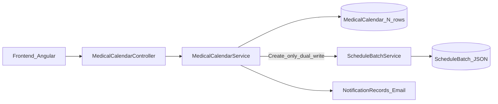
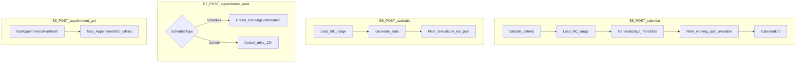
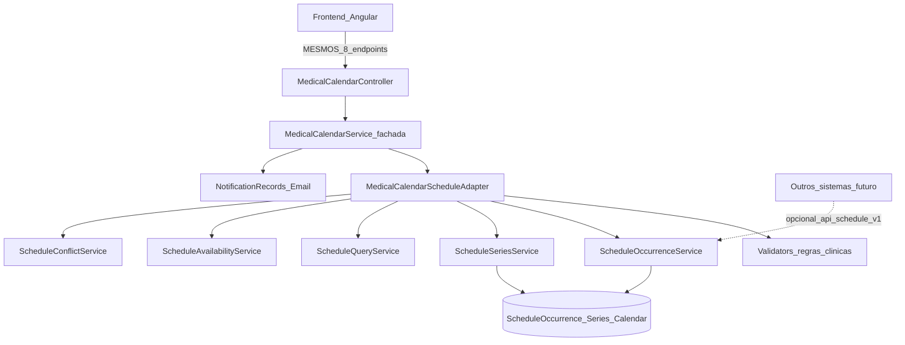
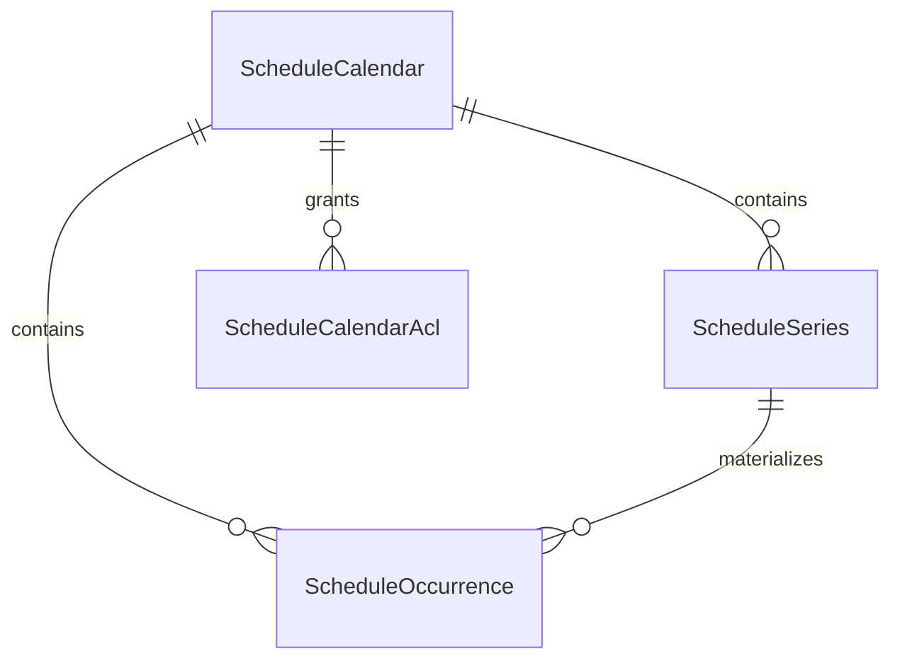

# Levantamento de Requisitos — Módulo Genérico de Agendamento

**Documento:** Levantamento de requisitos (produto + técnico)  
**Solução de origem:** `SmartDigitalPsicoAPI/SmartDigitalPsicoAPI.sln`  
**Plano de implementação:** `DOCUMENTACAO/API/2026-08-PlanoImplementacao-ModuloAgendamentoGenerico.md`  
**Controller congelado (FE):** `SmartDigitalPsico.WebAPI/Controllers/v1/Principals/MedicalCalendarController.cs`  
**Data:** 2026-08-01 (rev. FE-compat)  
**Status:** RASCUNHO HOMOLOGÁVEL — sem implementação neste ciclo

> Objetivo: consolidar requisitos para um **módulo genérico de agendamento** (estilo Google Agenda), performático e extratável — **sem alterar rotas, verbos HTTP, status codes nem shapes de DTO** consumidos pelo frontend Angular via `MedicalCalendarController`.

---

## 1. Objetivo e motivação

### 1.1 Objetivo

Criar um módulo genérico de agendamento que:

1. Substitua e melhore, **por baixo**, o fluxo atual de `MedicalCalendarService` (persistência, conflitos, recorrência, slots)
2. Evolua o conceito de `ScheduleBatch` para um modelo **normalizado, indexável e escalável**
3. Mantenha a **API médica atual 100% compatível** com o frontend existente
4. Disponibilize o core (services) para reuso / futura API multi-sistema — **sem obrigar mudança no Angular do SDP**
5. Siga **SOLID**, DTOs, repositories e helpers com alta coesão e baixo acoplamento

### 1.2 Motivação

O calendário médico concentra regras e performance em um serviço ~1000+ linhas, com dual-write parcial para `ScheduleBatch` e leituras em `MedicalCalendar`. Isso gera manutenção difícil, conflitos incorretos e baixa reutilização. A solução é **refatorar o backend mantendo o contrato HTTP do FE**.

### 1.3 Princípio de compatibilidade com o frontend (obrigatório)

| Regra | Detalhe |
| ----- | ------- |
| **Não alterar endpoints medical** | Mesmas rotas, verbos, nomes de actions e padrões de `Ok`/`BadRequest` |
| **Não alterar DTOs públicos medical** | `Add/Update/Delete/GetMedicalCalendarDto`, `CalendarCriteriaDto`, `CalendarDto`, `ScheduleCriteriaDto`, `AppointmentCriteriaDto`, `AppointmentDto`, etc. |
| **Não alterar envelope** | Continuar `ServiceResponse<T>` |
| **Não alterar auth** | `[Authorize("Bearer")]` + `SetUserId` / culture como hoje |
| **Mudança só interna** | Persistência, services genéricos, helpers, adapter — atrás da fachada `IMedicalCalendarService` |
| **API `api/schedule/v1`** | Opcional / fase futura para **outros sistemas**; **não** é contrato do frontend SDP |

---

## 2. Escopo e não escopo

### 2.1 Escopo

| Categoria | Incluso |
| --------- | ------- |
| Modelo genérico | `ScheduleCalendar`, `ScheduleSeries`, `ScheduleOccurrence` |
| Core services | CRUD ocorrência/série, query range, disponibilidade, conflitos |
| Fachada SDP | `MedicalCalendarController` + `IMedicalCalendarService` **sem breaking change** |
| Adapter clínico | Regras Medical/Patient, working hours, appointments 23h/12h |
| Notificações | Pipeline existente via adapter |
| Migração de dados | Cutover interno MC/Batch → novo SoT |
| Extração futura | Boundary livre de FKs médicos |

### 2.2 Não escopo (v1)

| Item | Motivo |
| ---- | ------ |
| Alterar rotas/DTOs do `MedicalCalendarController` | Evitar mudança no frontend |
| Obrigar o Angular a consumir `api/schedule/v1` | FE continua em `api/medical/v1/MedicalCalendar` |
| GraphQL | Projeto é REST |
| Push FCM/APNs | Canal inexistente |
| Sync Google Calendar | Fase futura (`Readme`) |
| Hard-cut sem fachada | Migração gradual atrás dos mesmos endpoints |
| Implementação de código neste documento | Apenas levantamento |

---

## 3. Análise do legado (as-is)

### 3.1 Fluxo atual (visão geral)



| Aspecto | MedicalCalendar | ScheduleBatch |
| ------- | --------------- | ------------- |
| Persistência | 1 linha por ocorrência | 1 linha + JSON `ScheduleData` |
| Consumido pelo FE | **Sim** (única API) | Não (sem controller) |
| Create | Sim + dual-write | `CreateOrUpdateBatchAsync` |
| Update / Delete | Sim | **Não sincronizado** |
| Token | `TokenRecurrence` | `UniqueToken` (desalinhado no create) |
| Acoplamento | `MedicalId`, `PatientId` | `MedicalId`, `PatientId` |

### 3.2 Componentes inventariados

#### MedicalCalendar

| Camada | Caminho |
| ------ | ------- |
| Entity | `Domain/ModelEntity/MedicalCalendar.cs` |
| Service | `Service/DataEntity/Principals/MedicalCalendarService.cs` |
| Interface | `Domain/Interfaces/Service/IMedicalCalendarService.cs` |
| Repository | `Data/Repository/Principals/MedicalCalendarRepository.cs` |
| Controller | `WebAPI/Controllers/v1/Principals/MedicalCalendarController.cs` |
| EF config | `Data/Context/Configure/Entity/MedicalCalendarConfiguration.cs` |
| Validators | `Domain/Validation/Principals/Calendar/*` |
| DTOs schedule | `Domain/DTO/Medical/MedicalCalendar/*` |
| DTOs calendar/appointment | `Domain/DTO/Medical/Calendar/*` |

#### ScheduleBatch

| Camada | Caminho |
| ------ | ------- |
| Entity / Item | `Domain/ModelEntity/Schedule/ScheduleBatch.cs`, `ScheduleItem.cs` |
| Service | `Service/Bussines/Schedule/ScheduleBatchService.cs` |
| Repository | `Data/Repository/Schedule/ScheduleBatchRepository.cs` |
| Controller | **Inexistente** |

### 3.3 Contrato HTTP congelado — `MedicalCalendarController`

**Base imutável:** `api/medical/v1/MedicalCalendar`  
**Auth imutável:** `[Authorize("Bearer")]`  
**Pré-processamento imutável por action:** `setUserIdCurrent()` + `SetCurrentCulture()`

#### 3.3.1 Catálogo completo dos 8 endpoints

| # | HTTP | Rota completa | Action controller | Service | Request body / route | Response `ServiceResponse<T>` | Sucesso | Erro |
| - | ---- | ------------- | ----------------- | ------- | -------------------- | ----------------------------- | ------- | ---- |
| E1 | GET | `.../MedicalCalendar/schedule/{id}` | `FindByID` | `FindByID` | route `id` (int) | `GetMedicalCalendarDto` | `200 Ok` | `400 BadRequest` se `!Success` |
| E2 | POST | `.../MedicalCalendar/schedule` | `Create` | `Create` | `AddMedicalCalendarDto` | `GetMedicalCalendarDto` | `200 Ok` | `400` se `!Success` |
| E3 | PUT | `.../MedicalCalendar/schedule` | `Update` | `Update` | `UpdateMedicalCalendarDto` | `GetMedicalCalendarDto` | `200 Ok` | `400` se `Data == null` |
| E4 | DELETE | `.../MedicalCalendar/schedule` | `Delete` | `DeleteOneOrRecurrence` | `DeleteMedicalCalendarDto` | `bool` | `200 Ok` | `400` se `!Success` |
| E5 | POST | `.../MedicalCalendar/calendar` | `GetMonthlyCalendar` | `GetMonthlyCalendar` | `CalendarCriteriaDto` | `CalendarDto` | `200 Ok` | sempre `Ok` (erro no envelope) |
| E6 | POST | `.../MedicalCalendar/available` | `GetAvailableMedicalCalendar` | `GetAvailableMedicalCalendar` | `CalendarCriteriaDto` | `CalendarDto` | `200 Ok` | sempre `Ok` |
| E7 | POST | `.../MedicalCalendar/appointment/send` | `SendAppointments` | `RequestAppointment` | `ScheduleCriteriaDto` | `CalendarDto` (*) | `200 Ok` | sempre `Ok` |
| E8 | POST | `.../MedicalCalendar/appointment/get` | `GetAppointments` | `GetAppointments` | `AppointmentCriteriaDto` | `AppointmentDto[]` | `200 Ok` | sempre `Ok` |

(*) Assinatura do controller tipa `ServiceResponse<CalendarDto>`, enquanto a interface do service declara `ServiceResponse<bool>` para `RequestAppointment` — **comportamento legado a preservar no contrato HTTP observado pelo FE**; qualquer ajuste interno deve manter o JSON que o Angular já consome.

**Hypermedia:** E1–E4 usam `[TypeFilter(typeof(HyperMediaFilterrAttribute))]`. E5–E8 não.

#### 3.3.2 DTOs de contrato (não breaking)

**`AddMedicalCalendarDto` / `UpdateMedicalCalendarDto` / base `ActionMedicalCalendarDtoBase` + `GetMedicalCalendarDtoBase`:**

| Campo | Tipo | Uso |
| ----- | ---- | --- |
| `Id` (base entity dto) | long | Update / Get |
| `Enable` | bool | |
| `MedicalId`, `PatientId?` | long | Relacionamento clínico |
| `Title`, `Description`, `Location` | string | |
| `StartDateTime`, `EndDateTime?` | DateTime | |
| `IsAllDay` | bool | |
| `Status` | `EStatusCalendar` | |
| `ColorCategoryHexa`, `TimeZone` | string | |
| `IsPushedCalendar` | bool | |
| `RecurrenceDays` | `DayOfWeek[]` | |
| `RecurrenceType` | `ERecurrenceCalendarType` | |
| `RecurrenceEndDate?`, `RecurrenceCount` | DateTime? / short | |
| `UpdateSeries` | bool | Update série |
| `TokenRecurrence` | string | Série |
| `CreatedUserId?`, `ModifyUserId?` | long? | |

**`GetMedicalCalendarDto`:** herda action base + nav `Medical`, `Patient?`, `CreatedUser?`, `ModifyUser?` + `Links` (HATEOAS).

**`DeleteMedicalCalendarDto`:** `Id`, `DeleteSeries`, `TokenRecurrence`, `MedicalId`, `PatientId`.

**`CalendarCriteriaDto`:** `MedicalId`, `Month`, `Year`, `StartDate?`, `EndDate?`, `IntervalInMinutes`, `FilterDaysAndTimesWithAppointments`, `FilterByDate?` (+ `UserIdLogged` ignorado no JSON).

**`CalendarDto`:** `MedicalId`, `MedicalName`, `Days[]` → cada `DayCalendarDto` tem `Date`, `IsPast`, `TimeSlots[]` → `TimeSlotDto` (`StartTime`, `EndTime?`, `IsAvailable`, `IsPast`, `MedicalCalendar?`).

**`ScheduleCriteriaDto`:** `AppointmentDateTime`, `Reason`, `TimeZone`, `ScheduleType` (`EScheduleCalendarType`), `PatientId`, `MedicalId`.

**`AppointmentCriteriaDto`:** herda criteria base + `PatientId`.

**`AppointmentDto`:** `MedicalName`, `MedicalId`, `StartDateTime`, `EndDateTime`, `Status`, `TimeZone`, `Location`, `Description`, `IsPast`.

#### 3.3.3 Fluxos por endpoint (as-is)

```mermaid
flowchart TD
  subgraph e1 [E1_GET_schedule_id]
    A1[FindByID] --> B1[MedicalCalendar_repo]
  end

  subgraph e2 [E2_POST_schedule]
    A2[Validate_DTO] --> B2{Recurrence?}
    B2 -->|Yes| C2[Generate_N_MC_rows]
    B2 -->|No| D2[Insert_one_MC]
    C2 --> E2n[Notifications]
    D2 --> E2n
    E2n --> F2[migrationProcess_ScheduleBatch]
    F2 --> G2[Email_notify]
  end

  subgraph e3 [E3_PUT_schedule]
    A3[Lookup_CreatedDate] --> B3[Validate]
    B3 --> C3{UpdateSeries?}
    C3 -->|Yes| D3[Delete_regen_series]
    C3 -->|No| E3u[Update_one]
    D3 --> F3[Notify]
    E3u --> F3
  end

  subgraph e4 [E4_DELETE_schedule]
    A4{DeleteSeries?} -->|Yes| B4[Delete_by_token]
    A4 -->|No| C4[Delete_one]
    B4 --> D4[Clean_NotificationRecords]
    C4 --> D4
  end
```





#### 3.3.4 Interface de serviço da fachada (assinaturas a preservar)

```csharp
// IMedicalCalendarService — contrato da fachada SDP (não breaking)
Task<ServiceResponse<GetMedicalCalendarDto>> FindByID(...);      // via IEntityBaseService
Task<ServiceResponse<GetMedicalCalendarDto>> Create(AddMedicalCalendarDto);
Task<ServiceResponse<GetMedicalCalendarDto>> Update(UpdateMedicalCalendarDto);
Task<ServiceResponse<bool>> DeleteOneOrRecurrence(DeleteMedicalCalendarDto);
Task<ServiceResponse<CalendarDto>> GetMonthlyCalendar(CalendarCriteriaDto);
Task<ServiceResponse<CalendarDto>> GetAvailableMedicalCalendar(CalendarCriteriaDto);
Task<ServiceResponse<bool>> RequestAppointment(ScheduleCriteriaDto);
Task<ServiceResponse<AppointmentDto[]>> GetAppointments(AppointmentCriteriaDto);
```

O controller continua sendo o **único** ponto de integração do frontend SDP com o calendário.

### 3.4 Modelo de dados atual

#### MedicalCalendar

`EntityBase` + `MedicalId`, `PatientId?`, `Title`, `StartDateTime`, `EndDateTime?`, `IsAllDay`, `Status`, `ColorCategoryHexa`, `IsPushedCalendar`, `TimeZone`, `Location`, `Description`, `RecurrenceDays`, `RecurrenceType`, `RecurrenceEndDate`, `RecurrenceCount`, `TokenRecurrence`, `ReasonCancellation`, users de auditoria.

#### ScheduleBatch

`MedicalId`, `PatientId?`, `ScheduleData` (JSON ≤ ~65KB), `UniqueToken`, `StartPeriod`, `EndPeriod`.

### 3.5 Regras de negócio (preservar no adapter; corrigir implementação)

#### Conflitos

1. Create/Update médico: overlap `Start < other.End && End > other.Start`
2. Query atual usa **contenção** → falsos negativos
3. Helpers corretos no repo existem e não são usados
4. Appointment paciente: conflito por start **exato** (inconsistente)
5. ScheduleBatch não cruza com MC

#### Recorrência

`None|Daily|Weekly|Monthly|Yearly`; materialização N rows; `UpdateSeries` regenera; dual-write batch só no Create.

#### Working hours / grade

Futuro + working days/hours do médico; intervalo 15–1440 min; range critérios ≤ 90 dias.

#### Appointments (paciente) — regras clínicas no adapter

| Ação | Regra |
| ---- | ----- |
| Agendar | `PendingConfirmation`; duração = intervalo médico; ≥ **23h** |
| Cancel `PendingConfirmation` | → `Canceled` |
| Cancel `Confirmed` | → `PendingCancellation` |
| Cancel | ≥ **12h** antes; status Confirmed ou PendingConfirmation |

#### Notificações

Records `BeforeAppointment` + e-mail no create; delete limpa records; cancel appointment **não** limpa (gap a corrigir **sem** mudar endpoint).

#### Permissões

Ownership médico no create/update/list; `available` com rigor menor (gap a alinhar sem mudar contrato, se possível via mesma response).

### 3.6 Gargalos de performance

| Problema | Evidência |
| -------- | --------- |
| DB/validate por ocorrência na recorrência | `AddEventAsync` |
| Conflito por contenção | `GetMedicalCalendarsForMedicalAsync` |
| N+1 Medical/User nos validators | `MedicalCalendarValidator` |
| Slots O(dias × slots × calendários) | `GenerateTimeSlots` |
| Dual-write Create | `migrationProcess` |
| JSON 65KB + filter in-memory | `ScheduleBatchRepository` |
| Update/Delete sem sync batch | `MedicalCalendarService` |
| Tokens desalinhados | Guid novo no batch |

### 3.7 Padrões do host

Camadas WebAPI → Service → Data → Domain; JWT Bearer; `ServiceResponse<T>`; FluentValidation; notificações Email + job; testes NUnit principalmente em Data/Domain.

---

## 4. Arquitetura alvo (to-be) — FE intacto



**Regra de ouro:** o Angular **não precisa saber** que o SoT mudou. Apenas a fachada e o adapter mudam.

---

## 5. Requisitos funcionais (to-be)

Prioridade: **P0** = MVP backend + FE estável; **P1** = cutover SDP; **P2** = multi-sistema / extração.

### 5.1 Compatibilidade frontend (P0 absoluto)

| ID | Requisito | Prioridade |
| -- | --------- | ---------- |
| RF-FE-01 | Manter as 8 rotas de `MedicalCalendarController` sem alteração | P0 |
| RF-FE-02 | Manter verbos HTTP, path params e bodies atuais | P0 |
| RF-FE-03 | Manter shapes JSON dos DTOs medical/calendar/appointment | P0 |
| RF-FE-04 | Manter padrões de status HTTP por action (Ok/BadRequest) | P0 |
| RF-FE-05 | Manter HypermediaFilter em E1–E4 | P0 |
| RF-FE-06 | Regressão black-box dos 8 endpoints obrigatória antes do cutover | P0 |
| RF-FE-07 | **Proibido** exigir mudanças no Angular para esta feature | P0 |

### 5.2 Cadastro e ciclo de vida (core + fachada)

| ID | Requisito | Prioridade |
| -- | --------- | ---------- |
| RF-01 | Criar ocorrência única (via E2) | P0 |
| RF-02 | Editar ocorrência (via E3, `UpdateSeries=false`) | P0 |
| RF-03 | Excluir ocorrência (via E4, `DeleteSeries=false`) | P0 |
| RF-04 | Criar série recorrente (via E2) | P0 |
| RF-05 | Editar série (`UpdateSeries=true` + `TokenRecurrence`) | P0 |
| RF-06 | Split “esta e seguintes” | P2 |
| RF-07 | Excluir série (`DeleteSeries=true`) | P0 |
| RF-08 | Exceções de série | P2 |
| RF-09 | Campos de conteúdo já existentes nos DTOs medical | P0 |

### 5.3 Visualização (via E5/E6 — mesmos DTOs)

| ID | Requisito | Prioridade |
| -- | --------- | ---------- |
| RF-10 | Query por range/mês retornando `CalendarDto` | P0 |
| RF-11–13 | Views dia/semana/mês via critérios já usados pelo FE (`Month/Year` ou `StartDate/EndDate`) | P0 |
| RF-14 | Time slots com `IntervalInMinutes` | P0 |
| RF-15 | Free/busy genérico (não exposto ao FE SDP na v1) | P2 |

### 5.4 Conflitos

| ID | Requisito | Prioridade |
| -- | --------- | ---------- |
| RF-16 | Overlap real | P0 |
| RF-17 | Query overlap no repositório | P0 |
| RF-18 | Validação em lote na recorrência | P0 |
| RF-19 | Serviço interno `CheckConflict` (não precisa de rota medical nova) | P0 |
| RF-20 | Política warning vs reject | P2 |

### 5.5 Filtros / multiusuário (core)

| ID | Requisito | Prioridade |
| -- | --------- | ---------- |
| RF-21 | Filtros por Owner/Subject/status/período no core | P0 |
| RF-22 | Busca textual | P2 |
| RF-23 | Stats de série | P1 (interno / futuro) |
| RF-24 | `ScheduleCalendar` com Tenant/Owner | P0 |
| RF-25 | ACL Owner/Editor/Viewer | P1 |
| RF-26 | Autorização na fachada medical (regras atuais + gaps) | P0 |
| RF-27 | Map Medical→Owner, Patient→Subject no adapter | P0 |

### 5.6 Integração via API

| ID | Requisito | Prioridade |
| -- | --------- | ---------- |
| RF-28 | **Contrato público SDP =** `api/medical/v1/MedicalCalendar/*` (imutável) | P0 |
| RF-29 | Envelope `ServiceResponse<T>` | P0 |
| RF-30 | Swagger medical permanece a referência do FE | P0 |
| RF-31 | API genérica `api/schedule/v1` para **outros sistemas** | P2 (após FE estável no novo SoT) |
| RF-32 | Idempotência opcional | P2 |

### 5.7 Notificações

| ID | Requisito | Prioridade |
| -- | --------- | ---------- |
| RF-33 | Eventos de domínio após create/update/cancel | P0 |
| RF-34 | Adapter grava `NotificationRecords` + e-mail | P1 |
| RF-35 | Core sem templates clínicos | P0 |
| RF-36 | Cancel limpa notifications (corrigir gap, sem mudar E7) | P1 |

### 5.8 Regras clínicas (adapter)

| ID | Requisito | Prioridade |
| -- | --------- | ---------- |
| RF-37 | Working days/hours | P0 |
| RF-38 | 23h / 12h | P0 |
| RF-39 | PendingConfirmation / PendingCancellation | P0 |
| RF-40 | `MedicalCalendarService` como fachada permanente para o FE | P0 |

---

## 6. Requisitos não funcionais

| ID | Requisito | Meta |
| -- | --------- | ---- |
| RNF-01 | Leitura range (E5/E6) | P95 < 100 ms ≤ 5k ocorrências |
| RNF-02 | Create série (E2) | 1 conflict-window query + `AddRange` |
| RNF-03 | Escalabilidade | Índices compostos; milhares de ocorrências/owner |
| RNF-04 | Índices | Calendar+Start+End; Owner+Start; SeriesToken; Tenant+Owner |
| RNF-05 | Segurança | JWT host; sem vazamento cross-owner |
| RNF-06 | Manutenibilidade | Services por operação; helpers sem I/O |
| RNF-07 | Testabilidade | Unit helpers + integração overlap + **regressão HTTP medical** |
| RNF-08 | Disponibilidade | Notificações assíncronas |
| RNF-09 | Extração | Core sem `Medical`/`Patient` |
| RNF-10 | Observabilidade | Stopwatch em E2/E5/conflict |
| RNF-11 | Cap de série | Configurável |
| RNF-12 | Zero breaking FE | Nenhuma mudança obrigatória no Angular |

---

## 7. Modelo de dados proposto (to-be)

JSON `ScheduleData` **não** continua como SoT. Evolução do conceito batch → série + ocorrências normalizadas.

### 7.1 Diagrama



### 7.2 Tabelas (resumo)

- **`ScheduleCalendar`:** `TenantKey`, `OwnerKey`, `Name`, `TimeZoneDefault`, auditoria  
- **`ScheduleSeries`:** `CalendarId`, `SeriesToken` UK, recorrência, `StartPeriod`/`EndPeriod`, keys  
- **`ScheduleOccurrence`:** `CalendarId`, `SeriesId?`, `SeriesToken?`, keys, título, `StartDateTime`/`EndDateTime` (End obrigatório no core), status, TZ, etc.  
- **`ScheduleCalendarAcl` (P1):** `PrincipalKey`, `Role`

### 7.3 Índices

1. `(CalendarId, StartDateTime, EndDateTime)`  
2. `(OwnerKey, StartDateTime)`  
3. `(SeriesToken)` em Occurrence  
4. UNIQUE `(SeriesToken)` em Series  
5. `(TenantKey, OwnerKey)` em Calendar  

### 7.4 Mapeamento legado → novo (interno; FE não vê)

| Legado | Destino |
| ----- | ------- |
| `MedicalCalendar` | `ScheduleOccurrence` (+ Series se recorrente) |
| `ScheduleBatch` JSON | Reconciliação; não SoT |
| `TokenRecurrence` | `SeriesToken` alinhado |
| `MedicalId` / `PatientId` | `OwnerKey` / `SubjectKey` (`medical:{id}`, `patient:{id}`) |
| Ids retornados ao FE | Adapter deve garantir que `GetMedicalCalendarDto.Id` (e campos) continuem coerentes com o que o FE espera — ver plano (estratégia de Id / mapa de migração) |

### 7.5 Status

Core: enum enxuto. Adapter mapeia `EStatusCalendar` rico usado nos DTOs medical.

---

## 8. Contratos de API

### 8.1 Contrato público SDP (obrigatório, imutável)

Somente:

```text
GET    api/medical/v1/MedicalCalendar/schedule/{id}
POST   api/medical/v1/MedicalCalendar/schedule
PUT    api/medical/v1/MedicalCalendar/schedule
DELETE api/medical/v1/MedicalCalendar/schedule
POST   api/medical/v1/MedicalCalendar/calendar
POST   api/medical/v1/MedicalCalendar/available
POST   api/medical/v1/MedicalCalendar/appointment/send
POST   api/medical/v1/MedicalCalendar/appointment/get
```

Qualquer evolução de performance/modelo **termina** nessas actions.

### 8.2 API genérica `api/schedule/v1` (opcional — P2)

Destinada a **outros sistemas** / extração do módulo. **Não** substitui o FE do SDP.

| Método | Rota | Service | Nota |
| ------ | ---- | ------- | ---- |
| POST/GET | `/calendars` | `ScheduleCalendarService` | Fora do FE SDP |
| CRUD | `/occurrences`, `/series` | Occurrence/Series | Fora do FE SDP |
| POST | `/query/range`, `/available`, `/freebusy` | Query/Availability | Fora do FE SDP |
| POST | `/conflicts/check` | Conflict | Pode existir só como service interno na v1 |

Na v1 do SDP, esses controllers **podem ser omitidos**; o valor entrega-se pela fachada medical.

---

## 9. Separação de responsabilidades

### 9.1 Camada pública SDP (FE)

| Componente | Papel |
| ---------- | ----- |
| `MedicalCalendarController` | **Congelado** — HTTP only |
| `MedicalCalendarService` | Fachada: mapeia DTOs medical ↔ core; orquestra adapter + notificações |

### 9.2 Services do core (reutilizáveis)

| Service | Responsabilidade |
| ------- | ---------------- |
| `ScheduleCalendarService` | Agendas + ACL |
| `ScheduleOccurrenceService` | CRUD ocorrência |
| `ScheduleSeriesService` | Séries |
| `ScheduleQueryService` | Grade/range → dados para montar `CalendarDto` |
| `ScheduleAvailabilityService` | Slots |
| `ScheduleConflictService` | Overlap |
| `MedicalCalendarScheduleAdapter` | Regras clínicas + mapeamento keys/status/DTOs |

### 9.3 Helpers (sem I/O)

`RecurrenceMaterializer`, `ScheduleOverlapHelper`, `TimeSlotGenerator`, `SchedulePeriodHelper`, `ScheduleKeyHelper`.

### 9.4 Repositories

`IScheduleOccurrenceRepository` (overlap, range, bulk, by token), `IScheduleSeriesRepository`, `IScheduleCalendarRepository`.

### 9.5 Organização

- Core: `Service/Bussines/Schedule/`  
- Adapter: `Service/Bussines/Schedule/Adapters/`  
- Fachada: `Service/DataEntity/Principals/MedicalCalendarService.cs` (fina)

---

## 10. Mapeamento endpoint medical → core (to-be)

| Endpoint | Fluxo interno alvo |
| -------- | ------------------ |
| E1 GET schedule/{id} | Adapter → Occurrence by id (+ mapa ExternalId se necessário) → `GetMedicalCalendarDto` |
| E2 POST schedule | Regras clínicas → Series ou Occurrence create → notify → **sem** JSON batch |
| E3 PUT schedule | `UpdateSeries`? Series regenerate : Occurrence update → notify |
| E4 DELETE schedule | Delete series/one no core → limpar notifications |
| E5 POST calendar | Query range + TimeSlotGenerator + map `CalendarDto`/`TimeSlotDto` |
| E6 POST available | Availability service → mesmo `CalendarDto` filtrado |
| E7 POST appointment/send | Adapter clínico Schedule/Cancel → Occurrence create/update status |
| E8 POST appointment/get | Query por patient/month → `AppointmentDto[]` |

---

## 11. Gaps atuais vs alvo

| Capacidade | Hoje | Alvo |
| ---------- | ---- | ---- |
| Contrato FE | MedicalCalendar | **Igual (congelado)** |
| SoT | Dual-write frágil | Occurrence + Series |
| API genérica multi-sistema | N/A | P2 `api/schedule/v1` |
| Conflito | Contenção / exact start | Overlap |
| Performance recorrência / slots | N validates / O(n³) | Batch + generator eficiente |
| ScheduleBatch JSON | Sidecar | Removido como SoT |
| Tokens | Desalinhados | `SeriesToken` único |
| Cancel + notifications | Gap | Corrigido no adapter |
| Extração | Acoplado | Core genérico |

---

## 12. Critérios de aceite

1. **Nenhuma alteração** em rotas/verbos/DTOs/status patterns de `MedicalCalendarController` exigindo mudança no Angular.
2. Os 8 endpoints passam regressão black-box (payloads equivalentes).
3. Modelo normalizado com índices de overlap.
4. Conflito usa overlap real.
5. Create série (E2) sem N round-trips de conflito.
6. E5 mensal atende RNF-01 no ambiente de carga.
7. Core sem referência a entidades `Medical`/`Patient`.
8. Adapter preserva working hours, 23h/12h, status appointment.
9. Dual-write JSON `ScheduleBatch` eliminado no Create.
10. Testes: helpers + overlap repo + regressão medical HTTP.

---

## 13. Riscos e premissas

| Risco | Mitigação |
| ----- | --------- |
| Quebra silenciosa de JSON | Contrato freeze + testes de snapshot/contrato por endpoint |
| Id de ocorrência muda após migração | `ScheduleMigrationMap` / ExternalId; ou shadow Ids — detalhar no plano |
| Divergência MC vs Batch | MC prevalece na migração |
| Tentação de “melhorar” DTOs medical | Rejeitar no code review; só additive não breaking se inevitável |
| Expor `api/schedule/v1` cedo demais | P2; FE não depende dela |

**Premissas:** JWT permanece; MySQL/SqlServer; materialização de recorrência na v1; FE Angular continua único consumidor medical.

---

## 14. Referências

| Artefato | Caminho |
| -------- | ------- |
| Controller (congelado) | `WebAPI/Controllers/v1/Principals/MedicalCalendarController.cs` |
| Service fachada | `Service/DataEntity/Principals/MedicalCalendarService.cs` |
| ScheduleBatchService | `Service/Bussines/Schedule/ScheduleBatchService.cs` |
| DTOs medical | `Domain/DTO/Medical/MedicalCalendar/*`, `Domain/DTO/Medical/Calendar/*` |
| Plano | `DOCUMENTACAO/API/2026-08-PlanoImplementacao-ModuloAgendamentoGenerico.md` |

---

## 15. Glossário

| Termo | Significado |
| ----- | ----------- |
| Contrato congelado | Rotas/DTOs medical imutáveis para o FE |
| Fachada | `MedicalCalendarService` fino sobre o core |
| Adapter SDP | Regras clínicas + mapeamento DTO/keys |
| Core Schedule | Services/repos genéricos extratáveis |
| SoT | Source of Truth |
| P2 schedule API | API multi-sistema futura, não usada pelo Angular SDP |

---

**Fim do Levantamento de Requisitos.**  
Implementação: `2026-08-PlanoImplementacao-ModuloAgendamentoGenerico.md`.
