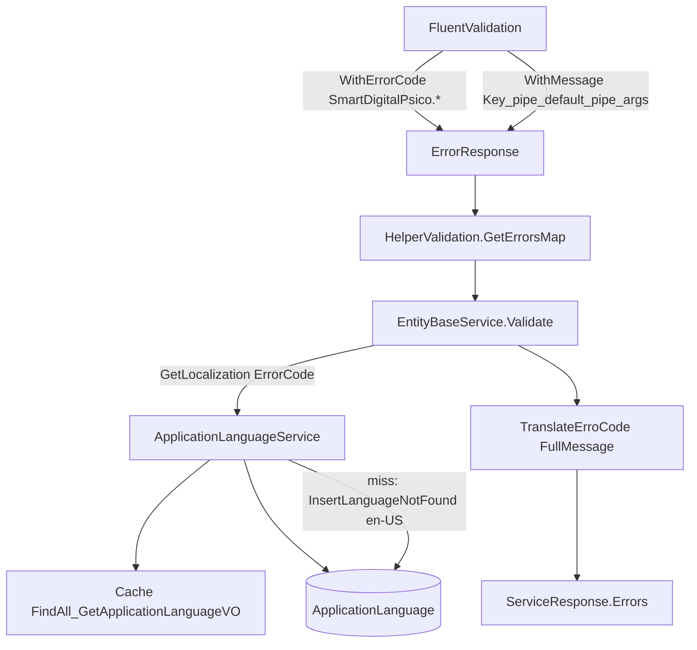
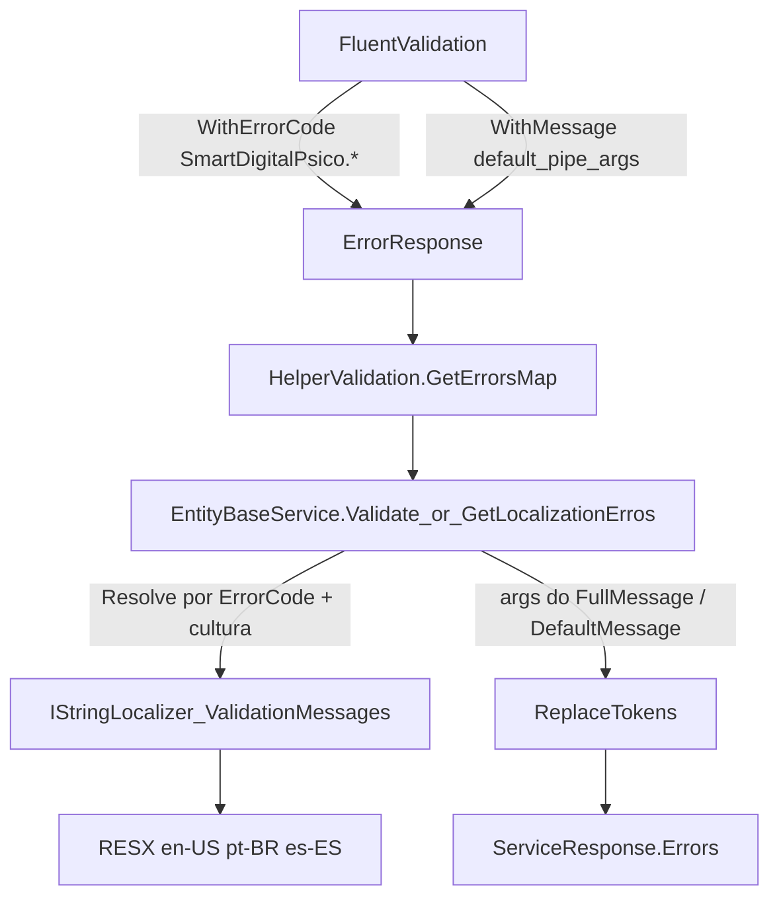

# Levantamento de Requisitos — i18n dos FluentValidators via RESX

**Documento:** Levantamento de requisitos (produto + técnico)  
**Solução de origem:** `SmartDigitalPsicoAPI/SmartDigitalPsicoAPI.sln`  
**Data:** 2026-08-02  
**Status:** RASCUNHO — sem implementação neste ciclo  

> Objetivo: migrar o processo de idiomas das mensagens de **FluentValidation** — chave = `WithErrorCode` (`SmartDigitalPsico.*`), `WithMessage` sem prefixo legado `*_Key|`, abandono da busca em `ApplicationLanguage` (banco) para erros de validação, e resources **RESX** em inglês, português e espanhol.

---

## 1. Objetivo e motivação

### 1.1 Objetivo

1. Padronizar a chave de tradução dos validators no formato já adotado:
   - `SmartDigitalPsico.<Validator>.<Entidade|Dto>.<Campo>`
   - ou `SmartDigitalPsico.<Validator>.<Entidade|Dto>.<Campo>.<Regra>`
2. Remover o formato legado de mensagem `Chave_Key|texto default|args` de todos os `.WithMessage`
3. Recuperar a tradução a partir do **`ErrorCode`** (FluentValidation `WithErrorCode`), não mais do prefixo da mensagem
4. Substituir cache + tabela `ApplicationLanguage` + auto-insert no caminho de **erros de validação** por arquivos **`.resx`** (en-US, pt-BR, es-ES)
5. Gerar entradas RESX para cada `WithErrorCode` existente; se faltar resource, usar o default do `WithMessage` (sem gravar no banco)

### 1.2 Motivação

| Problema atual | Impacto |
| -------------- | ------- |
| Chave embutida em `WithMessage` (`FileSizeKB_Validator_MaxSize_Key\|…`) | Duplicação com `WithErrorCode`; chave frágil e inconsistente com o padrão estruturado |
| Lookup em `ApplicationLanguage` (cache → DB → auto-seed en-US) | Latência, side-effect de insert em miss, seed incompleto, difícil versionar tradução no Git |
| `TranslateErroCode` ainda parseia pipe + underscore e pode sobrescrever fluxo | Comportamento opaco; FE às vezes recebe default EN mesmo após `GetLocalization` |
| Sem `.resx` no repositório | Traduções de validator não são reviewáveis em PR nem empacotadas com o Domain |

### 1.3 Princípio de compatibilidade

| Regra | Detalhe |
| ----- | ------- |
| **Contrato `ErrorResponse`** | Manter `ErrorCode`, `Message`, `Name`, `DefaultMessage`, `FullMessage` |
| **FE / envelope** | Continuar `ServiceResponse<T>` + lista `Errors` |
| **Cultura** | Continuar header `X-Culture` (`RequestCultureMiddleware`) |
| **Chave exposta** | Preferir `SmartDigitalPsico.*` já emitido pelos validators (não voltar a `*_Validator_*_Key`) |
| **Sem breaking de API HTTP** | Sem mudança de rotas/DTOs públicos |

---

## 2. Escopo e não escopo

### 2.1 Escopo (fase 1 — este levantamento)

| Categoria | Incluso |
| --------- | ------- |
| Validators | Todos os `AbstractValidator` em `SmartDigitalPsico.Domain/Validation/**` (~54 arquivos, ~318 `.WithMessage`) |
| Error codes | Convenção `ValidationErrorCodes` + `.WithErrorCode` imediatamente antes de `.WithMessage` |
| Helper | `HelperValidation` (parse de mensagem/args sem key no pipe) |
| Pipeline de validação | `EntityBaseService.Validate`, `GetLocalizationErros` |
| Localização de erros de validator | Novo caminho RESX + `IStringLocalizer` (sem DB) |
| Resources | `ValidationMessages.resx` (en-US default) + `ValidationMessages.pt-BR.resx` + `ValidationMessages.es-ES.resx` |
| Geração | Inventário de todas as chaves `WithErrorCode`; gerar resource ausente a partir do default EN do `WithMessage` |
| Testes | Atualizar/criar testes de helper e resolução RESX por cultura |

### 2.2 Não escopo (fase 2 — apenas mencionar)

| Item | Motivo |
| ---- | ------ |
| Mensagens de service (`I18nKeyConstants`, `RegisterCreated`, `Validate_Erro_Message`, etc.) | Continuam via `GetLocalization` / DB nesta fase |
| CRUD admin `ApplicationLanguageController` | Tabela e API podem permanecer para outros usos |
| Remover entidade/tabela `ApplicationLanguage` | Depende da migração completa de i18n (fase 2) |
| Tradução automática (MT) | Conteúdo pt/es deve ser curado; gerador só preenche default EN quando ausente |
| Alterar contrato Angular | Fora do escopo |
| Implementação de código neste documento | Apenas levantamento |

---

## 3. Análise do legado (as-is)

### 3.1 Fluxo atual



### 3.2 Formato legado de `WithMessage`

Padrão: `{LegacyKey}|{DefaultText}|{arg0}|{arg1}|…`

Exemplo atual ([`FileValidator.cs`](../../SmartDigitalPsico.Domain/Validation/Base/FileValidator.cs)):

```csharp
.WithErrorCode("SmartDigitalPsico.FileValidator.FileBase.FileSizeKB.LessThanOrEqualTo")
.WithMessage($"FileSizeKB_Validator_MaxSize_Key|The file size cannot exceed {{0}} MB.|{ConvertBytesToMegabytes(_maxFileSize)}");
```

| Parte | Uso hoje |
| ----- | -------- |
| `parts[0]` | Chave legada (`*_Key`) — usada como `ErrorCode` **se** não houver código estruturado |
| `parts[1]` | Texto default (EN) → `DefaultMessage` |
| `parts[2+]` | Argumentos para `{0}`, `{1}` via `ApplicationLanguageHelper.ReplaceTokensInMessage` |

### 3.3 Componentes envolvidos

| Peça | Caminho | Papel |
| ---- | ------- | ----- |
| Convenção de código | `Domain/Validation/ValidationErrorCodes.cs` | `SmartDigitalPsico.{Validator}.{Type}.{Field}[.{Rule}]` |
| Mapeamento FV → VO | `Domain/Validation/Helper/HelperValidation.cs` | `GetErrorsMap`, `TranslateErroCode` |
| Tokens | `Domain/Helpers/ApplicationLanguageHelper.cs` | `ReplaceTokensInMessage` / `ReplaceTokens` |
| Validate | `Service/.../EntityBaseService.cs` | `GetErrorsMap` → `GetLocalization(ErrorCode, DefaultMessage)` → `TranslateErroCode` |
| Lookup | `Service/.../ApplicationLanguageService.cs` | Cache → DB → auto-insert en-US; `ResourceKey = SharedResource` |
| Marker | `Domain/Interfaces/ISharedResource.cs` | Apenas nome → `"SharedResource"`; sem RESX real |
| Cultura | `Domain/Helpers/RequestCultureMiddleware.cs` | Header `X-Culture` |
| Culturas conhecidas | `Domain/Helpers/CultureDateTimeHelper.cs` | `en-US`, `pt-BR`, `es-ES` |

### 3.4 Comportamento problemático do helper

Em `HelperValidation.ConvertToErrorResponse` / `TranslateErroCode`:

- Detecta mensagem com `|` **e** `_` para decidir se é formato pipe.
- Se `ErrorCode` já é `SmartDigitalPsico.*`, preserva o código (correto).
- Ainda assim, após `GetLocalization`, `TranslateErroCode(ErrorResponse)` pode **reescrever `Message`** a partir do `FullMessage` tokenizado (default EN), anulando parcialmente a tradução do DB.
- Dependência de `_` no texto torna o parser frágil para mensagens futuras sem underscore.

### 3.5 Estado dos resources

- **Zero** arquivos `.resx` de validação no repositório.
- Seed `ApplicationLanguageMockData` cobre sobretudo chaves antigas (`ErrorValidator_*`, `Register*`), **não** o inventário completo de `SmartDigitalPsico.*` nem todas as `*_Validator_*_Key`.
- Miss de chave → insert automático en-US na tabela (side-effect em runtime).

---

## 4. Solução proposta (to-be)

### 4.1 Fluxo alvo



**Sem** passagem por `ApplicationLanguage` / cache `FindAll_GetApplicationLanguageVO` / `InsertLanguageNotFound` no caminho de erros de FluentValidation.

### 4.2 Novo formato de `WithMessage`

| Antes | Depois |
| ----- | ------ |
| `"FileSizeKB_Validator_MaxSize_Key\|The file size cannot exceed {0} MB.\|{n}"` | `"The file size cannot exceed {0} MB.\|{n}"` |
| `"Title_Validator_IsRequired_Key\|Title is required."` | `"Title is required."` |
| `"RG_Validator_Length_Key\|RG must be between {0} and {1} characters long.\|10\|15"` | `"RG must be between {0} and {1} characters long.\|10\|15"` |

Regras:

1. **Obrigatório:** `.WithErrorCode("SmartDigitalPsico....")` imediatamente antes de `.WithMessage(...)`.
2. **Proibido:** qualquer prefixo `*_Key|` (ou chave legada) dentro de `WithMessage`.
3. **Default:** texto em inglês (cultura neutra do assembly / `ValidationMessages.resx`).
4. **Args:** quando houver placeholders, manter pipe **somente** para valores: `template|{0value}|{1value}|…` **ou** evoluir o helper para extrair args de forma explícita (decisão de implementação: manter pipe-args sem key é suficiente e minimiza churn).

Exemplo alvo:

```csharp
.WithErrorCode("SmartDigitalPsico.FileValidator.FileBase.FileSizeKB.LessThanOrEqualTo")
.WithMessage($"The file size cannot exceed {{0}} MB.|{ConvertBytesToMegabytes(_maxFileSize)}");
```

Chave RESX:

`SmartDigitalPsico.FileValidator.FileBase.FileSizeKB.LessThanOrEqualTo`  
→ valor pt-BR: `O tamanho do arquivo não pode exceder {0} MB.`

### 4.3 Convenção de chave (inalterada / obrigatória)

Definida em `ValidationErrorCodes`:

```text
SmartDigitalPsico.<ValidatorClass>.<EntityOrDto>.<Field>
SmartDigitalPsico.<ValidatorClass>.<EntityOrDto>.<Field>.<RuleName>
```

Exemplos:

- `SmartDigitalPsico.MedicalCalendarScheduleFieldsValidator.MedicalCalendar.Title.NotEmpty`
- `SmartDigitalPsico.MedicalCalendarScheduleFieldsValidator.MedicalCalendar.Title.MaxLength`
- `SmartDigitalPsico.FileValidator.FileBase.FileSizeKB.LessThanOrEqualTo`

### 4.4 HelperValidation (requisitos de mudança)

1. **Não** derivar `ErrorCode` de `parts[0]` quando o código estruturado já existe (já parcial).
2. Parse de mensagem **sem** exigir `_` na string:
   - Se contém `|`: `DefaultMessage` = template (primeira parte); args = demais partes.
   - Se não contém `|`: mensagem inteira = default.
3. `TranslateErroCode`:
   - Localizar template traduzido por `ErrorCode`.
   - Aplicar `ReplaceTokens(template, args)`.
   - **Não** sobrescrever `ErrorCode` com fragmentos do pipe.
4. Remover / isolar lógica legada que assume `Key|text`.

### 4.5 Resolução de localização (requisitos)

Novo serviço/helper dedicado a mensagens de validação (nome sugerido na implementação: `ValidationMessageLocalizer` ou extensão de localizer tipado):

| Passo | Comportamento |
| ----- | ------------- |
| 1 | Ler `CultureInfo.CurrentUICulture` (setado por `X-Culture`) |
| 2 | `IStringLocalizer<ValidationMessages>` (ou equivalente) com chave = `ErrorCode` |
| 3 | Hit → template traduzido |
| 4 | Miss → usar `DefaultMessage` do `WithMessage` (EN) |
| 5 | **Nunca** inserir linha em `ApplicationLanguage` |
| 6 | Aplicar tokens `{0}`, `{1}`, … |

Culturas RESX alinhadas a `CultureDateTimeHelper`:

| Arquivo | Cultura |
| ------- | ------- |
| `ValidationMessages.resx` | Default / en-US |
| `ValidationMessages.pt-BR.resx` | pt-BR |
| `ValidationMessages.es-ES.resx` | es-ES |

Local sugerido:

`SmartDigitalPsico.Domain/Resources/ValidationMessages*.resx`

(DI / `AddLocalization` / embed no projeto Domain — detalhe do plano de implementação.)

### 4.6 Geração e manutenção de resources

1. **Inventário:** varrer todos os validators; coletar pares `(ErrorCode, DefaultMessage template)`.
2. **Gerar** entradas ausentes no `.resx` default com o texto EN do `WithMessage` (sem args).
3. **pt-BR / es-ES:** traduzir os valores; se ainda não traduzido, pode espelhar EN temporariamente com marcação no plano de implementação (débito explícito).
4. **Regra de PR:** nova regra FluentValidation = novo `WithErrorCode` + entrada nos três RESX (ou pelo menos default EN).
5. Chaves RESX = string exata do `ErrorCode` (incluindo pontos).

### 4.7 EntityBaseService (caminho Validate)

Requisito funcional:

- Em `Validate` / `GetLocalizationErros`, para erros originados de FluentValidation com `ErrorCode` `SmartDigitalPsico.*`, resolver mensagem via localizer RESX — **não** chamar `ApplicationLanguageService.GetLocalization`.
- Mensagens de service (`RegisterCreated`, etc.) **permanecem** no fluxo DB/cache até a fase 2.

---

## 5. Inventário de impacto

### 5.1 Validators (obrigatório limpar `*_Key|`)

Pasta: `SmartDigitalPsico.Domain/Validation/`

| Área | Exemplos de arquivos |
| ---- | -------------------- |
| Base | `FileValidator.cs` |
| Schedule | `MedicalCalendarScheduleFieldsValidator`, `ScheduleCalendarItemValidator`, `ScheduleBatchValidator`, … |
| Principals / Calendar | `MedicalCalendarValidator`, `UserValidator`, `MedicalValidator`, … |
| Patient | `PatientValidator`, `PatientFileValidator`, selects One/List, … |
| SystemDomains | `GenderValidator`, `OfficeValidator`, `Notification*`, … |
| DTO / Contracts | `ScheduleCriteriaDtoValidator`, `RecordValidator`, … |

Ordem sugerida de execução (implementação futura):

1. Ajustar `HelperValidation` + localizer RESX + wiring DI  
2. Gerar RESX a partir do inventário atual de `WithErrorCode` + defaults  
3. Remover `*_Key|` de todos os `WithMessage`  
4. Desviar `Validate` / `GetLocalizationErros` para RESX  
5. Testes + build Release

### 5.2 Helpers e services

| Arquivo | Mudança esperada (fase implementação) |
| ------- | ------------------------------------- |
| `HelperValidation.cs` | Novo parse; tradução por ErrorCode + args |
| `ApplicationLanguageHelper.cs` | Manter `ReplaceTokens*`; eventualmente overload só template+args |
| `EntityBaseService.cs` | Branch RESX para erros `SmartDigitalPsico.*` |
| `ApplicationLanguageService.cs` | Sem mudança obrigatória na fase 1 (continua para i18n de service) |
| `ISharedResource.cs` | Pode permanecer para fase 2; validators não dependem mais dele |
| Novo `Resources/ValidationMessages*.resx` | Criar en / pt-BR / es-ES |
| Testes Domain | `ApplicationLanguageHelperTests` + novos testes de localizer/helper |

### 5.3 O que NÃO muda na fase 1

- Schema / migrations de `ApplicationLanguage`
- Controller CRUD de idiomas
- Seed mock de `ApplicationLanguage` (pode ficar obsoleto para validators)
- Header `X-Culture` e lista de culturas

---

## 6. Contratos e exemplos

### 6.1 `ErrorResponse` (preservar)

| Campo | Origem to-be |
| ----- | ------------ |
| `ErrorCode` | `WithErrorCode` (`SmartDigitalPsico.*`) |
| `Name` | `PropertyName` FluentValidation |
| `DefaultMessage` | Template EN (sem key) extraído do `WithMessage` |
| `FullMessage` | Raw do FluentValidation (template[+args]) |
| `Message` | Template traduzido (RESX) + tokens aplicados |

### 6.2 Exemplo ponta a ponta

**Validator**

```csharp
RuleFor(e => e.Title)
    .NotEmpty()
    .WithErrorCode("SmartDigitalPsico.MedicalCalendarScheduleFieldsValidator.MedicalCalendar.Title.NotEmpty")
    .WithMessage("Title is required.");
```

**RESX**

| Cultura | Valor |
| ------- | ----- |
| en-US | `Title is required.` |
| pt-BR | `Título é obrigatório.` |
| es-ES | `El título es obligatorio.` |

**Request** com `X-Culture: pt-BR` → `Errors[].Message = "Título é obrigatório."`, `Errors[].ErrorCode = SmartDigitalPsico....Title.NotEmpty`.

---

## 7. Riscos e mitigações

| Risco | Mitigação |
| ----- | --------- |
| Chaves RESX com pontos (`.`) | Validar suporte do `IStringLocalizer` / gerar Designer com cuidado; usar chave literal |
| `TranslateErroCode` atual anular tradução | Reescrever helper antes de ligar RESX |
| Miss de resource em produção | Fallback para default EN do `WithMessage`; log warning; sem insert DB |
| pt/es incompletos no cutover | Aceitar fallback EN; checklist de tradução no plano de implementação |
| Parsers que ainda esperam `*_Key` | Grep CI: proibir `WithMessage(".*_Key\|` |
| Confusão fase 1 vs fase 2 | Documentar: só validators saem do DB |

---

## 8. Critérios de aceite

1. Nenhum `.WithMessage` em `Domain/Validation/**` contém o padrão `*_Key|` (ou chave legada antes do primeiro `|`).
2. Toda regra com `.WithMessage` possui `.WithErrorCode("SmartDigitalPsico....")` imediatamente antes.
3. Resolução de mensagem de erro de FluentValidation **não** consulta `ApplicationLanguage` (cache/DB) e **não** executa `InsertLanguageNotFound`.
4. Existem `ValidationMessages.resx`, `ValidationMessages.pt-BR.resx`, `ValidationMessages.es-ES.resx` com chaves = `ErrorCode`.
5. Para cada `WithErrorCode` do inventário existe entrada no RESX default; miss em runtime → default do `WithMessage` (sem persistência).
6. Com `X-Culture: pt-BR` / `es-ES` / `en-US`, `ErrorResponse.Message` reflete o resource correspondente (quando traduzido).
7. Contrato `ErrorResponse` / `ServiceResponse` preservado; build Release verde; testes de helper/localizer cobrindo parse de args e fallback.

---

## 9. Entregáveis da feature (quando implementar — fora deste doc)

| # | Entregável |
| - | ---------- |
| 1 | RESX en-US / pt-BR / es-ES + wiring localization |
| 2 | Refactor `HelperValidation` + branch em `EntityBaseService` |
| 3 | Limpeza de todos os `WithMessage` (remover `*_Key|`) |
| 4 | Gerador/script de inventário de chaves (opcional, recomendado) |
| 5 | Testes + doc de plano de implementação (arquivo separado) |

---

## 10. Referências de código (as-is)

- `SmartDigitalPsico.Domain/Validation/ValidationErrorCodes.cs`
- `SmartDigitalPsico.Domain/Validation/Helper/HelperValidation.cs`
- `SmartDigitalPsico.Domain/Validation/Base/FileValidator.cs`
- `SmartDigitalPsico.Domain/Helpers/ApplicationLanguageHelper.cs`
- `SmartDigitalPsico.Domain/Helpers/RequestCultureMiddleware.cs`
- `SmartDigitalPsico.Domain/Helpers/CultureDateTimeHelper.cs`
- `SmartDigitalPsico.Service/DataEntity/Generic/EntityBaseService.cs` (`Validate`, `GetLocalizationErros`)
- `SmartDigitalPsico.Service/DataEntity/SystemDomains/ApplicationLanguageService.cs` (`GetLocalization`, `InsertLanguageNotFound`)
- `SmartDigitalPsico.Domain/Interfaces/ISharedResource.cs`

---

**Fim do levantamento.** Nenhuma alteração de código, RESX ou migration faz parte deste documento.
