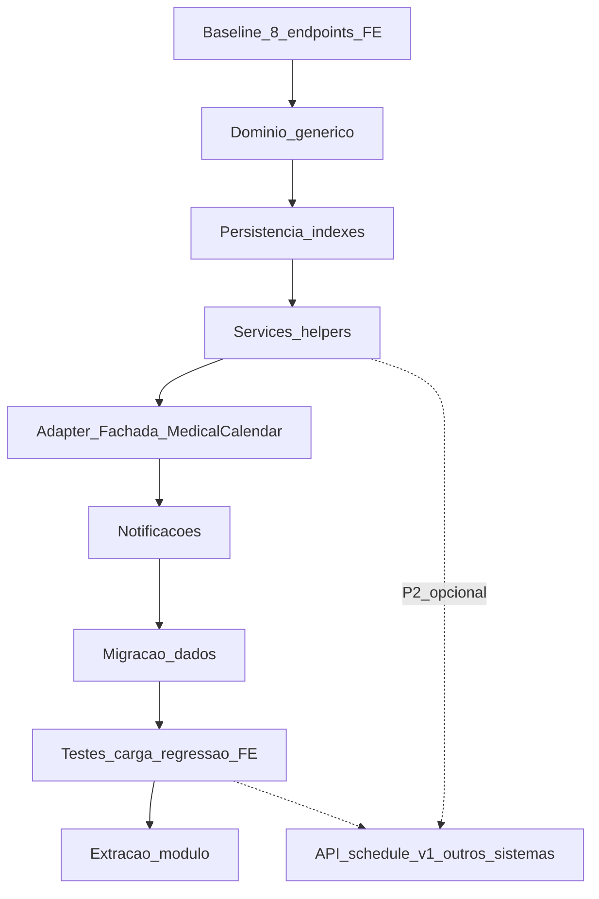
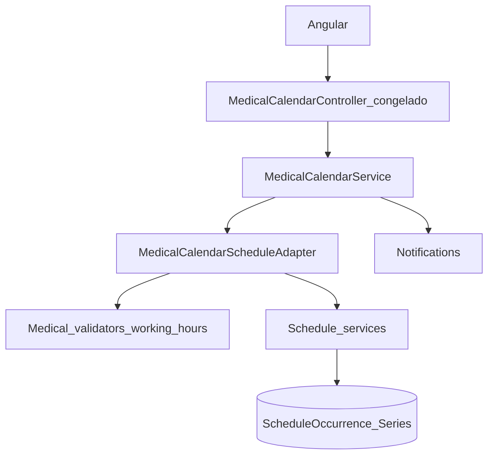

# Plano de Implementação — Módulo Genérico de Agendamento

**Documento:** Plano operacional executável  
**Solução:** `SmartDigitalPsicoAPI/SmartDigitalPsicoAPI.sln`  
**Levantamento:** `DOCUMENTACAO/API/2026-08-LevantamentoRequisitos-ModuloAgendamentoGenerico.md`  
**Controller FE (congelado):** `WebAPI/Controllers/v1/Principals/MedicalCalendarController.cs`  
**Data:** 2026-08-01 (rev. FE-compat)  
**Status:** PRONTO PARA EXECUÇÃO — este documento **não implementa** código

> Premissa central: **zero breaking change no frontend**. Os 8 endpoints de `MedicalCalendarController` permanecem idênticos (rotas, verbos, DTOs, padrões Ok/BadRequest). A evolução acontece **atrás** da fachada `IMedicalCalendarService`.

---

## 1. Objetivo

1. Eliminar gargalos de performance do calendário médico  
2. Unificar SoT em `ScheduleCalendar` / `ScheduleSeries` / `ScheduleOccurrence`  
3. **Preservar 100%** o contrato HTTP consumido pelo Angular  
4. Preparar core extratável (sem FKs Medical/Patient)  
5. Expor `api/schedule/v1` apenas como **P2 opcional** para outros sistemas — **não** é dependência do FE SDP  

---

## 2. Escopo e não escopo

### 2.1 Escopo

| Fase | Entrega |
| ---- | ------- |
| 0 | Baseline + checklist de regressão dos **8 endpoints medical** |
| 1–3 | Domínio, persistência, services/helpers do core |
| 4 | API `api/schedule/v1` **opcional/adiada (P2)** |
| 5–6 | Adapter + fachada medical + notificações (**caminho crítico SDP**) |
| 7–8 | Migração de dados + testes/carga + regressão FE |
| 9 | Boundary de extração |

### 2.2 Não escopo / proibido

- Alterar `MedicalCalendarController` (rotas, assinaturas, filtros Hypermedia, padrões de status)
- Alterar DTOs públicos em `Domain/DTO/Medical/MedicalCalendar/*` e `Domain/DTO/Medical/Calendar/*` de forma breaking
- Exigir mudanças no projeto Angular
- GraphQL, Google sync, push FCM
- Completar o modelo JSON `ScheduleBatch` como SoT

---

## 3. Pré-requisitos

| Item | Valor |
| ---- | ----- |
| Requisitos | Homologados (especialmente RF-FE-01…07) |
| Branch | `feature/schedule-generic-module` |
| SDK | .NET 10 |
| Banco | MySQL e/ou SqlServer |
| Baseline | Build + testes verdes |
| Contrato FE | Snapshot/collection dos 8 endpoints |

```powershell
cd SmartDigitalPsicoAPI
dotnet --version
dotnet build SmartDigitalPsicoAPI.sln -c Release
dotnet test SmartDigitalPsicoAPI.sln -c Release --no-build
```

---

## 4. Visão das fases



**Caminho crítico SDP:** F0 → F1 → F2 → F3 → F5 → F6 → F7 → F8 → F9.  
**F4** não bloqueia o FE.

---

## 5. Fase 0 — Baseline do contrato frontend

**Objetivo:** congelar o contrato observado pelo Angular.

### 5.1 Inventário imutável (não alterar)

| # | HTTP | Rota | Request | Response T | Status sucesso | Status erro |
| - | ---- | ---- | ------- | ---------- | -------------- | ----------- |
| E1 | GET | `schedule/{id}` | route id | `GetMedicalCalendarDto` | 200 | 400 se `!Success` |
| E2 | POST | `schedule` | `AddMedicalCalendarDto` | `GetMedicalCalendarDto` | 200 | 400 se `!Success` |
| E3 | PUT | `schedule` | `UpdateMedicalCalendarDto` | `GetMedicalCalendarDto` | 200 | 400 se `Data == null` |
| E4 | DELETE | `schedule` | `DeleteMedicalCalendarDto` | `bool` | 200 | 400 se `!Success` |
| E5 | POST | `calendar` | `CalendarCriteriaDto` | `CalendarDto` | 200 | 200 + envelope |
| E6 | POST | `available` | `CalendarCriteriaDto` | `CalendarDto` | 200 | 200 + envelope |
| E7 | POST | `appointment/send` | `ScheduleCriteriaDto` | conforme FE hoje | 200 | 200 + envelope |
| E8 | POST | `appointment/get` | `AppointmentCriteriaDto` | `AppointmentDto[]` | 200 | 200 + envelope |

Base: `api/medical/v1/MedicalCalendar` + `[Authorize("Bearer")]` + `setUserIdCurrent` + culture.

### 5.2 Atividades

1. Capturar exemplos reais de request/response (homolog ou mocks) para E1–E8.  
2. Catalogar regras clínicas que não podem regressir (working hours, 23h/12h, status appointment).  
3. Listar débitos a corrigir **só internamente** (contenção, N validates, slots, dual-write, tokens).  
4. Montar suite de regressão black-box (Postman/RestClient/integration) **obrigatória** antes do cutover.  
5. Decidir estratégia de **Id** pós-migração (ver §12.5) para E1/E3/E4 continuarem coerentes.

### 5.3 Critério de saída

- Checklist E1–E8 versionado.  
- Decisão: novo SoT normalizado; JSON batch não é SoT.  
- Aprovado: **controller medical não será editado** (salvo bugs críticos de segurança sem mudar contrato).

---

## 6. Fase 1 — Domínio genérico

Igual ao plano anterior: entidades `ScheduleCalendar`, `ScheduleSeries`, `ScheduleOccurrence`, ACL P1; DTOs em `DTO/Schedule/Generic/`; validators sem Medical; helpers; interfaces de service.

**Diferença FE-compat:** DTOs genéricos **não** substituem os DTOs medical. Mapeamento só no adapter/fachada.

### Critério de saída

Domain compila; zero `Medical`/`Patient` nas entidades novas.

---

## 7. Fase 2 — Persistência e índices

EF configs, DbSets, migrations MySQL/SqlServer, `GetOverlappingAsync` com predicado:

```text
StartDateTime < @end AND EndDateTime > @start AND Enable
```

Índices: Calendar+Start+End; Owner+Start; SeriesToken; UX SeriesToken; Tenant+Owner.

Tabela opcional **`ScheduleMigrationMap`**: `ExternalSource`, `ExternalId` (MedicalCalendar.Id), `OccurrenceId` — suporte a E1/E3/E4 sem quebrar Ids do FE.

### Critério de saída

Migration ok; teste prova overlap “atravessando” a janela.

---

## 8. Fase 3 — Services + helpers

Pastas:

```text
Service/Bussines/Schedule/
  Schedule*Service.cs
  Helpers/...
  Adapters/MedicalCalendarScheduleAdapter.cs   # Fase 5
```

Comportamentos: materialização em memória + 1 conflict query + `AddRange`; `TimeSlotGenerator` só na janela útil; sem `ToList().Find` por slot.

`ScheduleBatchService` JSON: deprecar; não completar stubs Create/Update do batch.

### Critério de saída

Core cobre operações internas; **ainda sem mudar** o controller medical; fachada ainda pode apontar para legado até F5.

---

## 9. Fase 4 — API `api/schedule/v1` (P2 — opcional)

**Não faz parte do caminho crítico do frontend SDP.**

| Quando fazer | Motivo |
| ------------ | ------ |
| Após F8 estável | FE já 100% no novo SoT via medical |
| Extração / outro sistema | Consumo multi-tenant genérico |

Se adiada: services do core são chamados **somente** pela fachada medical — suficiente para o SDP.

### Critério de saída (se executada)

Swagger `api/schedule/v1` documentado; **Angular SDP continua em medical**.

---

## 10. Fase 5 — Adapter + fachada MedicalCalendar (caminho crítico)

**Objetivo:** `MedicalCalendarService` vira fachada fina; **controller intocado**.

### 10.1 Arquitetura



### 10.2 Mapeamento endpoint → implementação interna

| Endpoint | Trabalho na fachada/adapter |
| -------- | --------------------------- |
| E1 FindByID | Resolver Id (mapa ou Id estável) → Occurrence → `GetMedicalCalendarDto` (+ navs se o FE depende) |
| E2 Create | Validação clínica → Series/Occurrence → notify → **remover** `migrationProcess` |
| E3 Update | `UpdateSeries`? regenerate series : update one → notify |
| E4 Delete | Delete series/one + limpar `NotificationRecords` |
| E5 Monthly | Query + slots → montar `CalendarDto` / `DayCalendarDto` / `TimeSlotDto` **idêntico** |
| E6 Available | Idem com filtro available/not past |
| E7 Appointment send | Schedule/Cancel clínico → create/update status |
| E8 Appointment get | Query mês/patient → `AppointmentDto[]` com `IsPast` |

### 10.3 Regras de não-quebra

1. Não mudar namespace/nome de propriedades JSON dos DTOs medical.  
2. Não mudar quando o controller devolve 400 vs 200.  
3. Hypermedia em E1–E4 permanece.  
4. Campos opcionais novos no JSON só se forem **additive** e ignoráveis pelo FE (evitar na v1).  
5. `IMedicalCalendarService` mantém assinaturas públicas.

### 10.4 Escrita / leitura na transição

| Etapa | Escrita | Leitura (ainda nos mesmos endpoints) |
| ----- | ------- | ------------------------------------ |
| 5a | Novo modelo (+ shadow MC opcional) | Legacy MC via flag |
| 5b | Somente novo modelo | Novo modelo via adapter |
| 5c | Sem shadow MC | Novo modelo |

**Default:** ir a **5b** assim que regressão E1–E8 passar.

### 10.5 Critério de saída

- Diff do arquivo `MedicalCalendarController.cs` = **vazio** (ou só comentário/doc se inevitável — preferir vazio).  
- Suite E1–E8 verde.  
- Sem `CreateOrUpdateBatchAsync` no Create.

---

## 11. Fase 6 — Notificações

Eventos internos → adapter cria/atualiza `NotificationRecords` + e-mail.  
Cancel (E7) deve limpar records (gap atual).  
Core sem templates clínicos.  
Dispatch continua no WebJob.

### Critério de saída

Create/Update/Cancel coerentes com comportamento esperado pelo produto; sem mudar contratos HTTP.

---

## 12. Fase 7 — Migração de dados

### 12.1 Fontes

| Fonte | Destino |
| ----- | ------- |
| `MedicalCalendar` Enable=true | `ScheduleOccurrence` (+ Series) |
| `TokenRecurrence` | `SeriesToken` |
| `ScheduleBatch` JSON | Reconciliação apenas; MC prevalece |

### 12.2 Job

1. `ScheduleCalendar` por MedicalId (`TenantKey=sdp`, `OwnerKey=medical:{id}`).  
2. Agrupar por token → Series + bulk occurrences.  
3. Sem token → avulsos.  
4. Preencher `ScheduleMigrationMap` (`MedicalCalendar.Id` → `OccurrenceId`).  
5. Relatório counts/órfãos; job idempotente.

### 12.3 Estratégia de Id para o FE (escolher uma e documentar no PR)

| Opção | Descrição | Preferência |
| ----- | --------- | ----------- |
| A | Manter `MedicalCalendar.Id` como Id exposto via mapa (Occurrence tem Id próprio; fachada traduz) | Boa se FE guarda Ids |
| B | Migrar com mesmo Id (identity insert / seed) se o provedor permitir | Ideal se viável |
| C | Aceitar novos Ids só se FE nunca cacheia Id de evento | Validar com time FE |

**Default do plano:** Opção **A** (mapa) se B for arriscada no MySQL/SqlServer.

### 12.4 Cutover

Migração homolog → maintenance breve → flag leitura novo SoT → monitor 24–72h → parar writes MC/Batch.

### 12.5 Critério de saída

Divergência ~0; rollback = flag leitura legacy; FE sem deploy.

---

## 13. Fase 8 — Testes e validação

### 13.1 Unitários

Overlap helper; RecurrenceMaterializer; TimeSlotGenerator; validators genéricos.

### 13.2 Integração Data

`GetOverlappingAsync`; bulk série; delete by token; migration map.

### 13.3 Regressão FE (obrigatória)

Replay E1–E8 com asserts de:

- status HTTP  
- `Success` / shape JSON  
- campos críticos (`Days`, `TimeSlots`, `Status`, `TokenRecurrence`, `IsPast`, etc.)

### 13.4 Carga

| Cenário | Meta |
| ------- | ---- |
| E5 30 dias / 5k ocorrências | P95 < 100 ms |
| E2 série 100 | < 1 s; 1 conflict query |
| Conflict interno | 1 query principal |

### 13.5 Critério de saída

Testes verdes + evidência de carga + **aprovação explícita: FE sem alterações**.

---

## 14. Fase 9 — Extração

Pacotes futuros: `Schedule.Domain` / `Data` / `Application`.  
Host SDP fica com controller medical, adapter, notificações, JWT.  
`AddScheduleModule(services)`.  
Lista de arquivos do core para mover.

---

## 15. Ordem de desligamento do legado

| Ordem | Componente | Ação |
| ----- | ---------- | ---- |
| 1 | `migrationProcess` / JSON dual-write | Remover na F5 |
| 2 | Leituras internas MC na fachada | Trocar por Occurrence |
| 3 | Writes `MedicalCalendar` | Parar pós-cutover F7 |
| 4 | `ScheduleBatchService` JSON | Obsolete → remover |
| 5 | Tabela `ScheduleBatch` | Arquivar depois |
| 6 | Tabela `MedicalCalendar` | Arquivar só quando nenhum consumidor interno |

**Nunca** dropar tabelas na mesma release do cutover.  
**Nunca** remover/alterar endpoints medical nesta feature.

---

## 16. Documentação e treinamento

| Entrega | Conteúdo |
| ------- | -------- |
| Nota FE | “Nenhuma mudança Angular necessária” |
| Swagger medical | Continua a referência do FE |
| Swagger schedule v1 | Só se F4 for feita |
| Runbook migração | F7 + rollback + estratégia de Id |
| Treinamento | Fachada vs core; overlap; por que controller não muda |

Arquivos futuros:

- `DOCUMENTACAO/API/GuiaIntegracao-ModuloAgendamentoGenerico.md` (foco outros sistemas)
- `DOCUMENTACAO/API/RunbookMigracao-MedicalCalendar-Para-Schedule.md`
- `DOCUMENTACAO/API/ContratoCongelado-MedicalCalendar-Frontend.md` (opcional: colar samples E1–E8)

---

## 17. Estrutura de pastas alvo

```text
Domain/EntityModels/Schedule/ ...
Domain/DTO/Schedule/Generic/ ...     # NÃO misturar com DTO/Medical
Domain/DTO/Medical/...               # CONGELADO para FE
Service/Bussines/Schedule/           # core + helpers + adapters
Service/DataEntity/Principals/
  MedicalCalendarService.cs          # FACHADA FINA (lógica pesada sai)
WebAPI/Controllers/v1/Principals/
  MedicalCalendarController.cs       # NÃO ALTERAR
WebAPI/Controllers/v1/Schedule/      # P2 opcional
```

---

## 18. Estimativa relativa

| Fase | Esforço | Bloqueia FE? |
| ---- | ------- | ------------ |
| F0 Baseline | XS | Não (só prep) |
| F1 Domínio | M | Não |
| F2 Persistência | M | Não |
| F3 Services | L | Não |
| F4 API schedule v1 | M | Não (P2) |
| F5 Adapter/fachada | L | Crítico (sem mudar FE) |
| F6 Notificações | S–M | Não |
| F7 Migração | M–L | Cutover backend |
| F8 Testes/regressão FE | M | Gate de release |
| F9 Extração | S | Não |

---

## 19. Riscos e mitigações

| Risco | Mitigação |
| ----- | --------- |
| Regressão Angular | Controller/DTOs congelados + suite E1–E8 |
| Id de evento muda | MigrationMap / identity insert (F7) |
| “Melhorar” API medical no meio do caminho | Code review: rejeitar PRs que toquem o controller |
| Dual-write eterno | Cutover F7 com prazo |
| Escopo GraphQL/Google | Recusar v1 |
| F4 atrasar F5 | F4 é P2; não bloquear |

---

## 20. Checklist de execução

### Gate FE (obrigatório)

- [ ] `MedicalCalendarController.cs` sem mudanças de contrato  
- [ ] DTOs medical/calendar sem breaking changes  
- [ ] Suite regressão E1–E8 verde  
- [ ] Confirmação: Angular não precisa de PR  

### Domínio / Data

- [ ] Entidades + índices + overlap query  
- [ ] Helpers + validators genéricos  
- [ ] `ScheduleMigrationMap` (se Opção A de Id)  

### Application

- [ ] Services core  
- [ ] Adapter + fachada medical  
- [ ] Remoção `migrationProcess`  
- [ ] Notificações + limpeza no cancel  

### Opcional P2

- [ ] Controllers `api/schedule/v1`  

### Qualidade / Cutover

- [ ] Unit + integração  
- [ ] Carga E2/E5  
- [ ] Job migração + relatório  
- [ ] Runbook + docs  

---

## 21. Referências

| Artefato | Caminho |
| -------- | ------- |
| Levantamento (rev. FE) | `DOCUMENTACAO/API/2026-08-LevantamentoRequisitos-ModuloAgendamentoGenerico.md` |
| Controller congelado | `WebAPI/Controllers/v1/Principals/MedicalCalendarController.cs` |
| Fachada atual | `Service/DataEntity/Principals/MedicalCalendarService.cs` |
| ScheduleBatchService | `Service/Bussines/Schedule/ScheduleBatchService.cs` |
| Interface fachada | `Domain/Interfaces/Service/IMedicalCalendarService.cs` |

---

**Fim do Plano de Implementação.**  
Próximo passo: homologar RF-FE + abrir branch e executar **Fase 0** (baseline dos 8 endpoints) antes de qualquer código de domínio.
