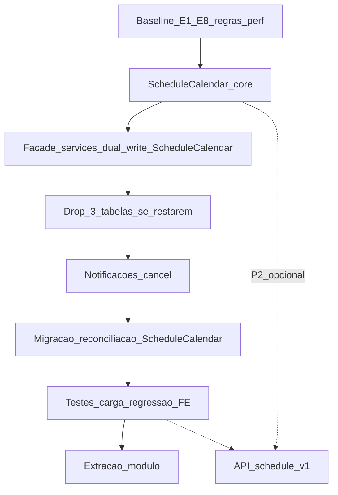
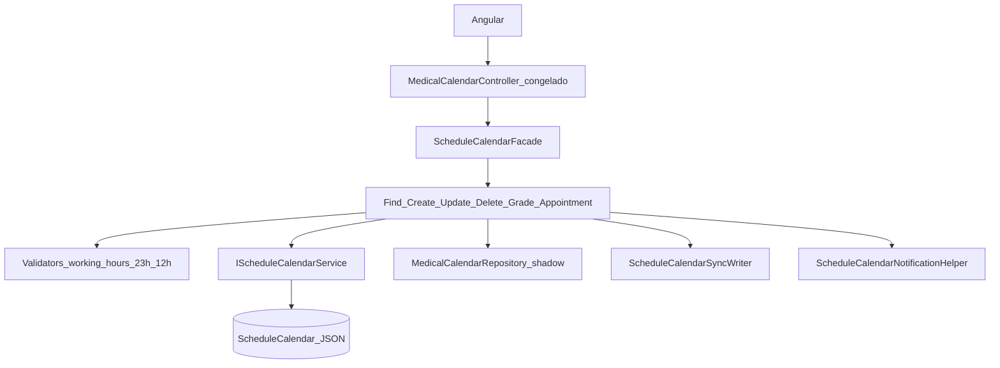

# Plano de Implementação — Módulo Genérico de Agendamento (Batch-JSON)

**Documento:** Plano operacional executável  
**Solução:** `SmartDigitalPsicoAPI/SmartDigitalPsicoAPI.sln`  
**Levantamento:** `DOCUMENTACAO/API/FEATURES/2026-08-LevantamentoRequisitos-ModuloAgendamentoGenerico.md`  
**Controller FE (congelado):** `WebAPI/Controllers/v1/Principals/MedicalCalendarController.cs`  
**Data:** 2026-08-02 (rev. **ScheduleCalendar + services por ação**)  
**Status:** EM EXECUÇÃO — SoT = `ScheduleCalendar` + JSON `ScheduleCalendarItem[]`

> Premissa central: **zero breaking change no frontend**. Os 8 endpoints de `MedicalCalendarController` permanecem idênticos.  
> Modelo: **1 tabela core genérica** (`ScheduleCalendar`, keys sem Medical/Patient); intervals em JSON; facade + **6 services por ação**; `ScheduleBatch` = legado Obsolete no path medical. **Não** Occurrence/Series/Calendar.

---

## 1. Objetivo

1. Eliminar gargalos de performance do calendário médico (conflito, recorrência, slots)  
2. SoT em **`ScheduleCalendar` + `ScheduleCalendarItem[]`** (genérico / reutilizável)  
3. Implementar `IScheduleCalendarService` (token, sync, conflito período + items)  
4. Quebrar adapter em Facade + Find/Create/Update/Delete/Grade/Appointment  
5. **Preservar 100%** o contrato HTTP Angular  
6. Dual-write: `MedicalCalendar` (shadow) + `ScheduleCalendar` (SoT); `ScheduleBatch` Obsolete no path medical  
7. `api/schedule/v1` = **P2 opcional**

---

## 2. Escopo e não escopo

### 2.1 Escopo

| Fase | Entrega |
| ---- | ------- |
| 0 | Baseline + checklist de regressão dos **8 endpoints medical** + inventário de regras clínicas e débitos de performance |
| B1 | Criar `ScheduleCalendar` + `IScheduleCalendarService` + migration + helpers |
| B2 | Split adapter → Facade + 6 services; dual-write ScheduleCalendar (**caminho crítico SDP**) |
| B3 | Drop código/migration das 3 tabelas normalizadas (se ainda presentes) |
| B4 | Notificações (limpar no cancel) |
| B5 | Migração / reconciliação MC → Batch (job; Ids via shadow MC) |
| B6 | Testes unitários + regressão E1–E8 + carga (metas RNF) |
| B7 | Boundary de extração (P2) |
| P2 | API `api/schedule/v1` (opcional / adiada) |

### 2.2 Não escopo / proibido

- Alterar `MedicalCalendarController` (rotas, assinaturas, Hypermedia, padrões Ok/BadRequest)
- Breaking changes nos DTOs `Domain/DTO/Medical/MedicalCalendar/*` e `Calendar/*`
- Exigir mudanças no Angular
- GraphQL, Google sync, push FCM
- Criar / completar SoT em `ScheduleOccurrence` / `ScheduleSeries` (modelo 3 tabelas; 1 row por intervalo)
- Usar `ScheduleBatch` como SoT do path medical (legado acoplado Medical — Obsolete)
- Dropar tabela `MedicalCalendar` na mesma release do cutover

---

## 3. Pré-requisitos

| Item | Valor |
| ---- | ----- |
| Requisitos | Homologados (RF-FE-01…07 + Batch-JSON) |
| SDK | .NET 10 |
| Banco | MySQL e/ou SqlServer |
| Baseline | Build + testes verdes |
| Contrato FE | Snapshot/collection dos 8 endpoints |

```powershell
cd SmartDigitalPsicoAPI
dotnet --version
dotnet build SmartDigitalPsicoAPI.sln -c Release
dotnet test SmartDigitalPsicoAPI.sln -c Release --no-build
```

---

## 4. Visão das fases



**Caminho crítico SDP:** F0 → B1 → B2 → B3 → B4 → B5 → B6 → B7.  
**P2** não bloqueia o FE.

---

## 5. Fase 0 — Baseline do contrato frontend + débitos

**Objetivo:** congelar o contrato observado pelo Angular e listar o que deve melhorar **sem** mudar endpoints.

### 5.1 Inventário imutável (não alterar)

| # | HTTP | Rota | Request | Response T | Status sucesso | Status erro |
| - | ---- | ---- | ------- | ---------- | -------------- | ----------- |
| E1 | GET | `schedule/{id}` | route id | `GetMedicalCalendarDto` | 200 | 400 se `!Success` |
| E2 | POST | `schedule` | `AddMedicalCalendarDto` | `GetMedicalCalendarDto` | 200 | 400 se `!Success` |
| E3 | PUT | `schedule` | `UpdateMedicalCalendarDto` | `GetMedicalCalendarDto` | 200 | 400 se `Data == null` |
| E4 | DELETE | `schedule` | `DeleteMedicalCalendarDto` | `bool` | 200 | 400 se `!Success` |
| E5 | POST | `calendar` | `CalendarCriteriaDto` | `CalendarDto` | 200 | 200 + envelope |
| E6 | POST | `available` | `CalendarCriteriaDto` | `CalendarDto` | 200 | 200 + envelope |
| E7 | POST | `appointment/send` | `ScheduleCriteriaDto` | conforme FE hoje | 200 | 200 + envelope |
| E8 | POST | `appointment/get` | `AppointmentCriteriaDto` | `AppointmentDto[]` | 200 | 200 + envelope |

Base: `api/medical/v1/MedicalCalendar` + `[Authorize("Bearer")]` + `setUserIdCurrent` + culture.  
Hypermedia: E1–E4.

### 5.2 Regras clínicas que não podem regressir

| Área | Regra |
| ---- | ----- |
| Working hours | Futuro; working days/hours do médico; `RecurrenceDays` ⊆ working days |
| Grade | Intervalo 15–1440 min; range critérios ≤ 90 dias |
| Agendar (E7) | `PendingConfirmation`; duração = intervalo médico; ≥ **23h** |
| Cancel (E7) | ≥ **12h**; `PendingConfirmation` → `Canceled`; `Confirmed` → `PendingCancellation` |
| Ownership | Create/Update/list alinhados ao médico dono |
| Notificações | Create gera records + e-mail; Delete limpa; Cancel deve limpar |

### 5.3 Débitos de performance a corrigir (só internamente)

| Débito | Correção alvo (ScheduleCalendar) |
| ------ | ------------------------------ |
| Contenção em vez de overlap | Overlap real em MC (transição) e período + items no Agenda |
| N validates / DB por ocorrência na recorrência | Materializar in-memory → **1** conflict-window → **1** write Agenda |
| N+1 nos validators (Medical/User) | Cache / load único por request |
|Slots O(dias × slots × calendários) + `Find` | `TimeSlotGenerator` só na janela útil + estrutura eficiente |
| Dual-write Create frágil / Guid ≠ token | `UniqueToken` = `TokenRecurrence` |
| Update/Delete sem sync Agenda | Sync completo nos action services + `IScheduleCalendarService` |
| JSON 65KB / filter in-memory | Pruning por `StartPeriod`/`EndPeriod` + cap de items |

### 5.4 Atividades

1. Capturar exemplos request/response (homolog ou mocks) para E1–E8.  
2. Catalogar regras da §5.2 na suite de regressão.  
3. Listar débitos da §5.3 no backlog da B1/B2.  
4. Montar suite black-box (Postman/RestClient/integration) **obrigatória** antes do cutover de leituras.  
5. Estratégia de **Id**: manter `MedicalCalendar.Id` exposto ao FE (shadow MC); Agenda usa `UniqueToken` = `TokenRecurrence`.

### 5.5 Critério de saída

- Checklist E1–E8 versionado.  
- Decisão registrada: **SoT = `ScheduleCalendar` + JSON**; **não** Occurrence/Series/Calendar; **não** `ScheduleBatch` como SoT.  
- Aprovado: controller medical **não** será editado (salvo segurança sem mudar contrato).

---

## 6. Fase B1 — Core `ScheduleCalendar` + helpers

Arquivos: `ScheduleCalendar` / `ScheduleCalendarService` / `ScheduleCalendarRepository` / migration `AddScheduleCalendar`  
Helpers: `Domain/Helpers/Schedule/*`

### 6.1 Trabalho

1. Entidade genérica **sem** MedicalId/PatientId (`TenantKey`/`OwnerKey`/`SubjectKey`).  
2. `IScheduleCalendarService`: CreateOrUpdate / DeleteByToken / GetByToken / GetOverlappingPeriod.  
3. `UniqueToken` alinhável a `TokenRecurrence`.  
4. Conflito: 1 query por overlap de período + overlap in-memory nos items.  
5. Helpers: `RecurrenceMaterializer`, `ScheduleOverlapHelper`, `TimeSlotGenerator`, `SchedulePeriodHelper`, `ScheduleKeyHelper`.  
6. Marcar `ScheduleBatch` / `IScheduleBatchService` como **Obsolete** (legado).  
7. Cap / alerta se `ScheduleData` aproximar 65KB.

### 6.2 Critério de saída

- Série de 50–100 ocorrências = **1** insert/update de Agenda.  
- Testes unitários de overlap / recurrence / slots verdes.  
- Zero dependência de Occurrence/Series/Calendar.  
- `ScheduleBatch` fora do path medical.

---

## 7. Fase B2 — Facade + services por ação (caminho crítico)

Pasta: `Service/Bussines/Schedule/Actions/`  
Contrato: `IScheduleCalendarFacade` → `ScheduleCalendarFacade`

### 7.1 Arquitetura



### 7.2 Mapeamento endpoint → implementação interna

| Endpoint | Service | Trabalho |
| -------- | ------- | -------- |
| E1 FindByID | Find | Lookup MC (shadow) → `GetMedicalCalendarDto` |
| E2 Create | Create | Validação clínica → insert MC + **1** Agenda SoT + notify |
| E3 Update | Update | `UpdateSeries`? regen MC + regen Agenda : update one + sync Agenda → notify |
| E4 Delete | Delete | Delete series/one MC + `DeleteByTokenAsync` Agenda + limpar `NotificationRecords` |
| E5 Monthly | Grade | Query MC (transição) + slots → `CalendarDto` idêntico |
| E6 Available | Grade | Idem com filtro available/not past |
| E7 Appointment send | Appointment | Schedule/Cancel clínico → create/update status (+ sync Agenda) |
| E8 Appointment get | Appointment | Query mês/patient → `AppointmentDto[]` com `IsPast` |

### 7.3 Dual-write (transição)

| Etapa | Escrita | Leitura (mesmos endpoints) |
| ----- | ------- | -------------------------- |
| B2a | MC + Agenda (token alinhado) | MC |
| B2b | MC + Agenda | Agenda (services montam DTOs medical) |
| B2c | Agenda (+ MC só se Ids ainda necessários) | Agenda |

**Default:** permanecer em **B2a** até regressão E1–E8 + carga verdes; cutover leitura = B2b.

### 7.4 Regras de não-quebra

1. Não mudar namespace/nome de propriedades JSON dos DTOs medical.  
2. Não mudar quando o controller devolve 400 vs 200.  
3. Hypermedia em E1–E4.  
4. Evitar campos JSON additive na v1.  
5. `IMedicalCalendarService` mantém assinaturas públicas.  
6. Diff de contrato do `MedicalCalendarController.cs` = **vazio**.

### 7.5 Critério de saída

- Suite E1–E8 verde em B2a.  
- `UniqueToken` = `TokenRecurrence` em todo dual-write.  
- Sem dual-write para Occurrence/Series/Calendar.  
- Sem dual-write para `ScheduleBatch`.

---

## 8. Fase B3 — Remover desvio das 3 tabelas

**Apagar ou parar de registrar** (se ainda existir):

- Entities `ScheduleCalendar`, `ScheduleSeries`, `ScheduleOccurrence`
- EF configs, repos, DTOs Generic do desvio, services Calendar/Occurrence/Series/Conflict/Query/Availability, `ScheduleGenericProfile`
- Enums só do desvio (`EScheduleStatus`, `EScheduleRecurrenceType`) se não referenciados
- DbSets em `EntityDataContext`
- Migration MySQL: `DropScheduleNormalizedTables`

**Manter:** `ScheduleCalendar` / `ScheduleCalendarItem`, helpers, Clinical facade/services.  
**Legado:** `ScheduleBatch` Obsolete (tabela permanece).

### Critério de saída

Build Release verde; zero referência às 3 tabelas no código de runtime.

---

## 9. Fase B4 — Notificações

1. Create/Update: `NotificationRecords` (`BeforeAppointment`) + e-mail via `ScheduleCalendarNotificationHelper`.  
2. Delete: limpar records por id(s).  
3. **Cancel (E7):** limpar records **sem** mudar contrato HTTP.  
4. Core Agenda sem templates clínicos; Clinical concentra regras.  
5. Preferir dispatch fora do caminho crítico (job), alinhado a RNF-08.

### Critério de saída

Create/Update/Cancel coerentes com o produto; E7 shape inalterado.

---

## 10. Fase B5 — Migração / reconciliação de dados

### 10.1 Fontes

| Fonte | Destino |
| ----- | ------- |
| `MedicalCalendar` Enable=true | Agrupar por `TokenRecurrence` → 1 `ScheduleCalendar` + `ScheduleCalendarItem[]` |
| Sem token | 1 agenda avulsa com token gerado estável |
| `ScheduleBatch` legado | Reconciliar opcionalmente → Agenda; Batch não é SoT |

### 10.2 Job

1. Agrupar MC por `MedicalId` + `TokenRecurrence`.  
2. Materializar `ScheduleItem[]`; calcular `StartPeriod`/`EndPeriod`.  
3. Upsert Batch com `UniqueToken` = token.  
4. Relatório: counts, órfãos, agendas &gt; cap; job idempotente.  
5. **Não** criar Occurrence/Series/Calendar.  
6. **Não** gravar em `ScheduleBatch` como SoT.

### 10.3 Estratégia de Id para o FE

| Opção | Descrição | Preferência |
| ----- | --------- | ----------- |
| A | Manter `MedicalCalendar.Id` via shadow MC enquanto E1/E3/E4 leem MC | **Default** na transição |
| B | Expor Id estável mapeado (mapa ExternalId → token/item) se cutover total de leitura | Pós B2b |
| C | Novos Ids só se FE nunca cacheia Id de evento | Validar com time FE |

### 10.4 Cutover

Homolog → maintenance breve → flag leitura Batch (B2b) → monitor 24–72h → reduzir writes MC quando seguro.

### 10.5 Critério de saída

Divergência ~0; rollback = flag leitura MC; FE sem deploy.

---

## 11. Fase B6 — Testes e validação

### 11.1 Unitários

- `ScheduleOverlapHelper`  
- `RecurrenceMaterializer`  
- `TimeSlotGenerator` (janela útil)  
- Regras de período / keys  

### 11.2 Integração Data

- Overlap de período em `ScheduleCalendar`  
- Create série = 1 row Agenda + N items JSON  
- Delete by token  
- Sync UpdateSeries  

### 11.3 Regressão FE (obrigatória)

Replay E1–E8 com asserts de:

- status HTTP  
- `Success` / shape JSON  
- campos críticos (`Days`, `TimeSlots`, `Status`, `TokenRecurrence`, `IsPast`, etc.)  
- regras 23h / 12h / working hours (casos negativos)

### 11.4 Carga (metas do levantamento, adaptadas a Batch)

| Cenário | Meta |
| ------- | ---- |
| E5 30 dias / até ~5k items no range | P95 &lt; 100 ms (ambiente alvo) |
| E2 série 100 | &lt; 1 s; **1** conflict-window; **1** write batch |
| Conflict interno | 1 query principal de batches na janela |

### 11.5 Critério de saída

Testes verdes + evidência de carga + **aprovação explícita: FE sem alterações**.

---

## 12. Fase B7 — Extração (P2)

Pacotes futuros: `Schedule.Domain` / `Data` / `Application`.  
Host SDP: controller medical, adapter, notificações, JWT.  
`AddScheduleModule(services)`.  
Evoluir FKs `MedicalId`/`PatientId` → `TenantKey`/`OwnerKey`/`SubjectKey`.

---

## 13. Fase P2 — API `api/schedule/v1` (opcional)

**Não** bloqueia o FE. Só após B6 estável, se outro sistema precisar.  
Angular SDP continua em medical.

---

## 14. Ordem de desligamento

| Ordem | Componente | Ação |
| ----- | ---------- | ---- |
| 1 | Dual-write Occurrence/Series (desvio) | Removido; usar Agenda |
| 2 | Código + tabelas das 3 entidades normalizadas | Drop (B3) |
| 3 | Dual-write / uso de `ScheduleBatch` no path medical | Obsolete; fora do path |
| 4 | Leituras internas só MC | Trocar por Agenda no cutover (B2b) |
| 5 | Writes `MedicalCalendar` | Reduzir pós-cutover estável |
| 6 | Tabela `MedicalCalendar` | Arquivar só quando nenhum consumidor (Ids/histórico) |
| — | **`ScheduleCalendar` / `IScheduleCalendarService`** | **Permanecem SoT** |
| — | Tabela `ScheduleBatch` | Arquivar depois (não nesta fatia) |

**Nunca** dropar `MedicalCalendar` na mesma release do cutover.  
**Nunca** remover/alterar endpoints medical nesta feature.

---

## 15. Documentação e treinamento

| Entrega | Conteúdo |
| ------- | -------- |
| Nota FE | “Nenhuma mudança Angular necessária” |
| Swagger medical | Continua a referência do FE |
| Swagger schedule v1 | Só se P2 for feita |
| Runbook migração | B5 + rollback + estratégia de Id |
| Treinamento | Fachada vs Batch; overlap; por que controller não muda; JSON items ≠ rows |

Arquivos futuros (opcional):

- `DOCUMENTACAO/API/GuiaIntegracao-ModuloAgendamentoGenerico.md`
- `DOCUMENTACAO/API/RunbookMigracao-MedicalCalendar-Para-ScheduleBatch.md`
- `DOCUMENTACAO/API/ContratoCongelado-MedicalCalendar-Frontend.md`

---

## 16. Estrutura de pastas alvo

```text
Domain/ModelEntity/Schedule/
  ScheduleCalendar.cs
  ScheduleCalendarItem.cs
  ScheduleBatch.cs              # legado Obsolete
Domain/Helpers/Schedule/
Service/Bussines/Schedule/
  ScheduleCalendarService.cs      # SoT genérico
  Clinical/
    ScheduleCalendarFacade.cs
    MedicalCalendar*Service.cs
    ScheduleCalendarSyncWriter.cs
    ScheduleCalendarNotificationHelper.cs
Service/DataEntity/Principals/
  MedicalCalendarService.cs     # FACHADA FINA
WebAPI/Controllers/v1/Principals/
  MedicalCalendarController.cs  # NÃO ALTERAR
Domain/DTO/Medical/...          # CONGELADO para FE
```

---

## 17. Estimativa relativa

| Fase | Esforço | Bloqueia FE? |
| ---- | ------- | ------------ |
| F0 Baseline | XS | Não (prep) |
| B1 Batch service | M–L | Não |
| B2 Adapter/fachada | L | Crítico (sem mudar FE) |
| B3 Drop 3 tabelas | S–M | Não |
| B4 Notificações | S | Não |
| B5 Migração | M–L | Cutover backend |
| B6 Testes/regressão/carga | M | Gate de release |
| B7 Extração | S | Não |
| P2 API schedule v1 | M | Não (P2) |

---

## 18. Riscos e mitigações

| Risco | Mitigação |
| ----- | --------- |
| Regressão Angular | Controller/DTOs congelados + suite E1–E8 |
| JSON &gt; 65KB | Cap de items + alerta no job |
| Query por campo interno do JSON | Sempre filtrar por período na tabela |
| Id de evento | Shadow MC (Opção A) até cutover documentado |
| “Melhorar” API medical no meio do caminho | Code review: rejeitar PRs que toquem o controller |
| Dual-write eterno | Cutover B5/B2b com prazo |
| Reintroduzir 3 tabelas | Rejeitar; SoT = Batch-JSON |
| Escopo GraphQL/Google | Recusar v1 |
| P2 atrasar B2 | P2 não bloqueia |

---

## 19. Checklist de execução

### Gate FE (obrigatório)

- [ ] `MedicalCalendarController.cs` sem mudanças de contrato  
- [ ] DTOs medical/calendar sem breaking changes  
- [ ] Suite regressão E1–E8 verde  
- [ ] Confirmação: Angular não precisa de PR  

### Baseline / performance

- [ ] Inventário E1–E8 + samples  
- [ ] Regras clínicas §5.2 na suite  
- [ ] Débitos §5.3 endereçados em B1/B2  

### Batch SoT → Agenda SoT

- [x] `ScheduleCalendar` + `IScheduleCalendarService`  
- [x] Token alinhado Create/Update/Delete via Writer  
- [x] Facade + 6 action services  
- [x] `ScheduleBatch` / `IScheduleBatchService` **Obsolete** no path medical  
- [x] Helpers sem I/O desnecessário  

### Application

- [x] Dual-write Agenda (não Occurrence / não Batch)  
- [x] Código 3 tabelas removido + migration drop (histórico)  
- [x] `ScheduleCalendarNotificationHelper` + limpeza no cancel  

### Qualidade / Cutover

- [ ] Unit + integração  
- [ ] Carga E2/E5 (metas §11.4)  
- [ ] Job migração + relatório  
- [ ] Runbook + docs  

### Opcional P2

- [ ] Controllers `api/schedule/v1`  

---

## 20. Referências

| Artefato | Caminho |
| -------- | ------- |
| Levantamento (ScheduleCalendar + services) | `DOCUMENTACAO/API/FEATURES/2026-08-LevantamentoRequisitos-ModuloAgendamentoGenerico.md` |
| Controller congelado | `WebAPI/Controllers/v1/Principals/MedicalCalendarController.cs` |
| Facade Clinical | `Service/Bussines/Schedule/Actions/ScheduleCalendarFacade.cs` |
| ScheduleCalendarService | `Service/Bussines/Schedule/ScheduleCalendarService.cs` |
| ScheduleCalendar / Item | `Domain/ModelEntity/Schedule/` |
| Config | `Data/Context/Configure/Entity/ScheduleCalendarConfiguration.cs` |

---

**Fim do Plano (rev. ScheduleCalendar + services por ação).**  
Próximo gate: suite E1–E8 + cutover de leitura ScheduleCalendar — **sem** reintroduzir Occurrence/Series/Calendar e **sem** usar Batch como SoT.
