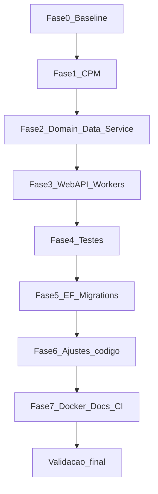

# Plano de Implementação — Migração SmartDigitalPsicoAPI .NET 8 → .NET 10

**Documento:** Plano operacional executável  
**Solução:** `SmartDigitalPsicoAPI/SmartDigitalPsicoAPI.sln`  
**Conjunto Homologado:** `DOCUMENTACAO/API/2026-07-LevantamentoConjuntoHomologado-SmartDigitalPsicoAPI.md`  
**Processo-base:** `DOCUMENTACAO/GuiaGenericoAtualizacaoPacotes.md`  
**Plano de ação / RFC / relatório:** `DOCUMENTACAO/UpdateDotNet10/PlanoAcaoMigracaoDotNet10.md`, `RascunhoPlanoUpdateDotNet10.md`, `RelatorioMigracaoDotNet10.md`  
**Data:** 2026-07-31  
**Status:** CONCLUÍDO (2026-08-01) — TFM `net10.0`, SDK pin `10.0.301` em `global.json`; ver `DOCUMENTACAO/UpdateDotNet10/RelatorioMigracaoDotNet10.md`

> Stack atual: **.NET 10** / ASP.NET Core, EF Core 9 + Pomelo 9, Swashbuckle 10. Frontend companion: Angular **22** (repositório UI).

---

## 1. Objetivo

Executar a migração de **todos os projetos .NET** da solução `SmartDigitalPsicoAPI` de `net8.0` para `net10.0`, aplicando o **Conjunto Homologado v1**, preservando:

- Integridade de migrations EF Core (MySQL/Pomelo e SqlServer)
- Funcionamento da WebAPI, WindowsService, WebJob, DI, Serilog, Swagger e autenticação JwtBearer
- Suíte NUnit existente (`Domain.Test`, `Data.Test`)
- Build local, Docker (imagens 10.0), README / `global.json` e alinhamento de CI externo
- Zero alteração de regra de negócio ou contrato público sem necessidade técnica

---

## 2. Escopo e não escopo

### 2.1 Escopo

| Categoria | Ação |
| --------- | ---- |
| Bibliotecas (Domain, Data, Service) | TFM + pacotes do Conjunto v1 |
| WebAPI, WindowsService, WebJob | `TargetFramework` → `net10.0` |
| Domain.Test, Data.Test | `net10.0` + Bloco E |
| NuGet | CPM via `SmartDigitalPsicoAPI/Directory.Packages.props` |
| Remoção | PackageReference `MySql.EntityFrameworkCore` |
| Dockerfiles | `aspnet:10.0` / `sdk:10.0` |
| README / global.json | SDK 10.x |
| Nota de pipeline Azure DevOps | Documentar alinhamento externo (stub in-repo) |

### 2.2 Não escopo

- Frontend / npm
- Introdução de Semantic Kernel / stack AI
- Pacote NuGet publicável multi-target (não existe)
- Fork Pomelo comunitário / EF Core 10 (reservado ao Conjunto v2)
- Refatoração arquitetural (ex.: limpar AspNetCore/Swagger do Domain)
- Commit/PR automático sem pedido explícito do responsável

---

## 3. Pré-requisitos

| Item | Valor |
| ---- | ----- |
| Branch | `chore/update-packages-smartdigitalpsicoapi-dotnet10` |
| SDK | .NET SDK **10.x** (`dotnet --list-sdks` deve listar 10.0.x) |
| Documento de versões | Conjunto Homologado v1 (não improvisar versões) |
| Baseline | Build Release + testes verdes **antes** de alterar TFMs |
| Banco | Instância SqlServer e/ou MySQL disponível para validar migrations |

```powershell
cd SmartDigitalPsicoAPI
dotnet --version          # esperado: 10.0.x
dotnet --list-sdks
```

---

## 4. Plano por fases



Validar **build** ao final de cada fase. Não avançar com erros de restore (`NU1107`/`NU1202`).

---

### Fase 0 — Preparação e baseline

1. Criar branch a partir da main/master estável.
2. Confirmar inventário ainda válido (reler o Conjunto Homologado).
3. Baseline:

```powershell
cd SmartDigitalPsicoAPI
dotnet restore SmartDigitalPsicoAPI.sln
dotnet build SmartDigitalPsicoAPI.sln -c Release
dotnet test SmartDigitalPsicoAPI.sln -c Release --no-build
dotnet list SmartDigitalPsicoAPI.sln package --outdated
dotnet list SmartDigitalPsicoAPI.sln package --vulnerable --include-transitive
```

4. Registrar avisos/vulnerabilidades atuais — devem ser tratados pelo Conjunto v1.
5. Commit baseline (opcional): *chore: baseline before SmartDigitalPsicoAPI net10 migration*.

**Critério de saída:** 0 erros de build e testes passando no estado atual `net8.0`.

---

### Fase 1 — Central Package Management (CPM)

1. Criar `SmartDigitalPsicoAPI/Directory.Packages.props` com o XML do Conjunto Homologado v1 (Seção 10 do levantamento).
2. Em **todos** os `.csproj` C# da solução, remover `Version="..."` de cada `PackageReference`.
3. Remover `PackageReference` de `MySql.EntityFrameworkCore`.
4. Manter `PrivateAssets` / `IncludeAssets` onde já existirem (Design/Tools).

**Abordagem recomendada (evitar limbo net8 + AspNet 10):**

1. Criar `Directory.Packages.props` com Conjunto v1.
2. Remover `Version=` dos csproj.
3. Em seguida executar Fases 2–4 sem commit intermediário “só CPM”, **ou** commit único “CPM + TFM net10 por camada”.

**Critério de saída:** restore sem conflito de versão; props único como fonte de verdade.

---

### Fase 2 — Bibliotecas internas (ordem de dependência)

Ordem obrigatória:

1. `SmartDigitalPsico.Domain` → `net10.0`
2. `SmartDigitalPsico.Data` → `net10.0`
3. `SmartDigitalPsico.Service` → `net10.0`

Para cada projeto:

```xml
<TargetFramework>net10.0</TargetFramework>
```

```powershell
dotnet build SmartDigitalPsico.Domain/SmartDigitalPsico.Domain.csproj -c Release
dotnet build SmartDigitalPsico.Data/SmartDigitalPsico.Data.csproj -c Release
dotnet build SmartDigitalPsico.Service/SmartDigitalPsico.Service.csproj -c Release
```

**Critério de saída:** três bibliotecas compilam em `net10.0` com Conjunto v1.

---

### Fase 3 — Executáveis (WebAPI + WindowsService + WebJob)

1. `SmartDigitalPsico.WebAPI` → `net10.0`
2. `SmartDigitalPsico.WindowsService` → `net10.0`
3. `SmartDigitalPsico.WebJob` → `net10.0`

```powershell
dotnet build SmartDigitalPsico.WebAPI/SmartDigitalPsico.WebAPI.csproj -c Release
dotnet build SmartDigitalPsico.WindowsService/SmartDigitalPsico.WindowsService.csproj -c Release
dotnet build SmartDigitalPsico.WebJob/SmartDigitalPsico.WebJob.csproj -c Release
dotnet build SmartDigitalPsicoAPI.sln -c Release
```

**Critério de saída:** solução Release com **0 erros** (exceto se testes ainda em net8 — preferir subir testes na Fase 4 imediatamente).

---

### Fase 4 — Projetos de teste

1. `SmartDigitalPsico.Domain.Test` → `net10.0`
2. `SmartDigitalPsico.Data.Test` → `net10.0`
3. Garantir Bloco E: InMemory **9.0.18**, Moq.EntityFrameworkCore **9.0.0.10**

```powershell
dotnet test SmartDigitalPsicoAPI.sln -c Release
```

**Critério de saída:** 100% dos testes existentes passando (ou falhas documentadas com causa raiz).

---

### Fase 5 — EF Core / migrations

Contextos: MySQL (Pomelo) e SqlServer em `SmartDigitalPsico.Data`; registro em `SmartDigitalPsico.Service/Configure/ServiceCollectionConfigureORM.cs`.

1. Confirmar Bloco B: EF **9.0.18** + Pomelo **9.0.0** + SqlServer **9.0.18** (sem drift); sem `MySql.EntityFrameworkCore`.
2. Listar migrations (ajustar provider/context conforme appsettings / startup):

```powershell
cd SmartDigitalPsicoAPI
dotnet ef migrations list `
  --project SmartDigitalPsico.Data/SmartDigitalPsico.Data.csproj `
  --startup-project SmartDigitalPsico.WebAPI/SmartDigitalPsico.WebAPI.csproj
```

3. Técnica da migration temporária (GuiaGenerico §7.3):

```powershell
dotnet ef migrations add ValidacaoPosUpdateDotNet10 `
  --project SmartDigitalPsico.Data/SmartDigitalPsico.Data.csproj `
  --startup-project SmartDigitalPsico.WebAPI/SmartDigitalPsico.WebAPI.csproj

# Se Up/Down VAZIOS → esperado (sem mudança de schema)
dotnet ef migrations remove --force `
  --project SmartDigitalPsico.Data/SmartDigitalPsico.Data.csproj `
  --startup-project SmartDigitalPsico.WebAPI/SmartDigitalPsico.WebAPI.csproj
```

4. Se a migration vier **não-vazia**: **parar**, investigar antes de commitar.
5. Em banco de teste: `dotnet ef database update` (ambiente limpo ou cópia) — validar caminho SqlServer **e**, se usado em homolog, MySQL.

**Critério de saída:** list/update OK; migration temporária vazia removida; sem schema não intencional.

---

### Fase 6 — Ajustes de código esperáveis

| Área | Sintoma típico | Ação |
| ---- | -------------- | ---- |
| Swashbuckle 10 / OpenAPI 2.x | Namespace / `AddSecurityRequirement` quebrado | Atualizar para APIs `Microsoft.OpenApi` 2.x |
| ASP.NET Core 10 | APIs obsoletas | Substituir por equivalentes .NET 10 se usados |
| AutoMapper 16 | Breaking na config/licença | Ajustar profiles/DI; validar testes |
| EF 9 + LINQ | `Contains` com arrays / avaliação cliente | Preferir `List<T>` onde necessário |
| JwtBearer 10 | Warnings menores | Smoke login JWT |
| Remoção Oracle MySQL EF | Compile/restore limpo | Confirmar ausência de usings órfãos |

Arquivos candidatos a revisão:

- `SmartDigitalPsico.WebAPI/Program.cs` e pastas `Configure/`
- Registros Swagger / autenticação (`ServiceCollectionConfigureSecurity.cs`)
- `SmartDigitalPsico.Data` DbContexts e repositórios com LINQ
- Profiles AutoMapper no Domain

**Critério de saída:** build Release limpo de erros; avisos de obsolescência novos tratados ou justificados; testes verdes.

---

### Fase 7 — Docker, docs e CI

1. Atualizar Dockerfiles:

- `SmartDigitalPsicoAPI/Dockerfile`
- `SmartDigitalPsicoAPI/SmartDigitalPsico.WebAPI/Dockerfile`

Trocar:

```dockerfile
FROM mcr.microsoft.com/dotnet/aspnet:8.0 AS base
FROM mcr.microsoft.com/dotnet/sdk:8.0 AS build
```

por:

```dockerfile
FROM mcr.microsoft.com/dotnet/aspnet:10.0 AS base
FROM mcr.microsoft.com/dotnet/sdk:10.0 AS build
```

2. Criar `SmartDigitalPsicoAPI/global.json`:

```json
{
  "sdk": {
    "version": "10.0.301",
    "rollForward": "latestFeature"
  }
}
```

(Ajustar `version` ao patch SDK instalado no CI/local.)

3. Atualizar `README.md` (e `Readme/READMERASCUNHO.md` se aplicável): requisito **.NET SDK 10**.
4. Pipeline Azure DevOps externo: alinhar task `UseDotNet@2` para `10.x` — o `azure-pipelines.yml` in-repo é stub; registrar checklist para o responsável de CI.
5. Validar build Docker:

```powershell
docker build -f SmartDigitalPsico.WebAPI/Dockerfile -t smartdigitalpsicoapi:net10 .
```

**Critério de saída:** docs locais alinhados; imagens 10.0; item de CI registrado.

---

## 5. Checklist de validação final

### 5.1 Restore e build

```powershell
cd SmartDigitalPsicoAPI
dotnet restore SmartDigitalPsicoAPI.sln
dotnet build SmartDigitalPsicoAPI.sln -c Release
```

- [ ] Restore sem `NU1107` / `NU1202`
- [ ] Build Release com 0 erros
- [ ] Sem drift EF (todos `Microsoft.EntityFrameworkCore.*` = 9.0.18; Pomelo = 9.0.0)
- [ ] Sem `MySql.EntityFrameworkCore` no grafo

### 5.2 Testes automatizados

```powershell
dotnet test SmartDigitalPsicoAPI.sln -c Release
```

- [ ] Domain.Test e Data.Test: 100% passando
- [ ] Moq.EntityFrameworkCore = 9.0.0.10; InMemory = 9.0.18

### 5.3 EF / migrations

- [ ] `migrations list` OK
- [ ] Migration temporária vazia (ou investigação concluída se não-vazia)
- [ ] `database update` em ambiente de teste OK (SqlServer e/ou MySQL)

### 5.4 Execução dos hosts

```powershell
dotnet run --project SmartDigitalPsico.WebAPI/SmartDigitalPsico.WebAPI.csproj
```

- [ ] Startup sem `InvalidOperationException` de DI
- [ ] Swagger acessível
- [ ] Autenticação JWT smoke: obter token e chamar endpoint protegido
- [ ] Logs Serilog sem segredos
- [ ] WindowsService inicia sem erro fatal (smoke)
- [ ] WebJob inicia sem erro fatal (smoke)

### 5.5 Docker

- [ ] Build das imagens com `aspnet:10.0` / `sdk:10.0` OK
- [ ] Container sobe e healthcheck responde (se aplicável)

---

## 6. Critérios de aceite

1. Todos os 8 projetos C# em `net10.0`.
2. CPM ativo; versões = Conjunto Homologado v1 (desvios só com justificativa no relatório).
3. Build Release 0 erros; `dotnet test` 100% passando.
4. Migrations validadas; sem schema acidental; sem Oracle MySQL EF no grafo.
5. WebAPI sobe; DI e Swagger OK; smoke JWT; workers smoke OK.
6. Dockerfiles em 10.0; README + `global.json` em SDK 10; CI externo anotado.
7. Sem alteração de contrato/negócio fora do necessário técnico.

---

## 7. Rollback

```powershell
git checkout chore/update-packages-smartdigitalpsicoapi-dotnet10
git reset --hard <commit-baseline-fase-0>

cd SmartDigitalPsicoAPI
dotnet restore SmartDigitalPsicoAPI.sln
dotnet build SmartDigitalPsicoAPI.sln -c Release
dotnet test SmartDigitalPsicoAPI.sln -c Release
```

Restaurar **sempre em conjunto:** `Directory.Packages.props`, todos os `.csproj`, Dockerfiles, `global.json`, README.

---

## 8. Riscos residuais

| Risco | Impacto | Mitigação |
| ----- | ------- | --------- |
| Pomelo 9 trava EF na major 9 | Sem EF 10 no v1 | Conjunto v2 quando Pomelo 10 oficial |
| AutoMapper 16 + licença | Compliance / breaking | Revisar uso; smoke mapeamentos + testes |
| Swashbuckle 10 / OpenAPI 2.x | Breaking compile | Fase 6 dirigida |
| Dual SqlServer/MySQL | Migrations divergentes | Validar ambos os caminhos usados em homolog |
| Pipeline Azure DevOps desalinhado | CI vermelho | Fase 7 — UseDotNet 10.x |
| WebJobs peers com Hosting 10 | Restore/runtime | Validar na Fase 3; pin documentado se necessário |
| Domain “gordo” (Swagger/JwtBearer) | Acoplamento | Fora de escopo; issue futura |

---

## 9. Ordem de commits sugerida (por fase)

1. `chore(api): add Directory.Packages.props and enable CPM`
2. `chore(api): migrate Domain/Data/Service to net10 and Conjunto v1`
3. `chore(api): migrate WebAPI/WindowsService/WebJob to net10`
4. `chore(api): migrate test projects to net10`
5. `fix(api): Swagger/OpenAPI and net10 compatibility adjustments`
6. `chore(api): bump Docker images and pin SDK 10 in global.json/README`

Ajustar mensagens ao estilo do repositório. Só commitar quando o responsável pedir.

---

## 10. Evidências a coletar na execução

Preencher `DOCUMENTACAO/UpdateDotNet10/RelatorioMigracaoDotNet10.md` com:

```text
Projetos .NET atualizados: 8
Pacotes NuGet alinhados ao Conjunto v1: N
Testes automatizados: N/N
Build Release: OK/FAIL
Migrations: vazia / investigada
Smoke WebAPI / JWT / workers: OK/FAIL
Docker build 10.0: OK/FAIL
MySql.EntityFrameworkCore removido: sim/não
Desvios do Conjunto v1: lista
```

---

## 11. Referências

- `DOCUMENTACAO/API/2026-07-LevantamentoConjuntoHomologado-SmartDigitalPsicoAPI.md`
- `DOCUMENTACAO/GuiaGenericoAtualizacaoPacotes.md`
- `DOCUMENTACAO/UpdateDotNet10/PlanoAcaoMigracaoDotNet10.md`
- `DOCUMENTACAO/UpdateDotNet10/RelatorioMigracaoDotNet10.md`
- `DOCUMENTACAO/UpdateDotNet10/RascunhoPlanoUpdateDotNet10.md`
- Pomelo EF Core 10 tracking: https://github.com/PomeloFoundation/Pomelo.EntityFrameworkCore.MySql/issues/2007
