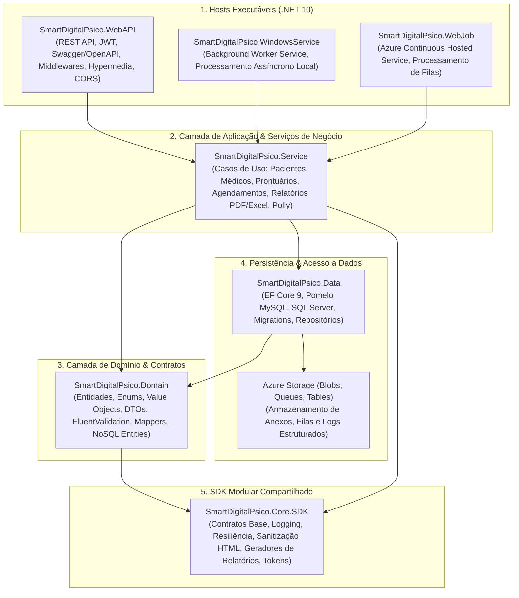

# Diretrizes para Ajuste de Issues e Code Smells — Backend (SmartDigitalPsico)

**Documento:** Guia operacional específico da solução backend SmartDigitalPsico  
**Solução:** [SmartDigitalPsicoAPI.sln](file:///c:/git/SMARTDIGITALPSICO/SmartDigitalPsicoAPI/SmartDigitalPsicoAPI.sln)  
**Target Framework:** `.NET 10` (`net10.0` em todos os projetos da solução)  
**Guia-Base Genérico:** [Diretrizes-CodeSmell-Backend-Generico.md](file:///c:/git/SMARTDIGITALPSICO/SmartDigitalPsicoAPI/DOCUMENTACAO/COVERAGE%20AND%20TEST/Diretrizes-CodeSmell-Backend-Generico.md)  
**Diretrizes de Cobertura:** [Diretrizes-Coverage-Backend-SmartDigitalPsico.md](file:///c:/git/SMARTDIGITALPSICO/SmartDigitalPsicoAPI/DOCUMENTACAO/COVERAGE%20AND%20TEST/Diretrizes-Coverage-Backend-SmartDigitalPsico.md)  
**Data da Revisão:** 2026-08-28  

---

## 1. Contexto Arquitetural e Governança no SmartDigitalPsico

A solução **SmartDigitalPsico Backend** (`SmartDigitalPsicoAPI.sln`) adota princípios de Clean Architecture e Domain-Driven Design (DDD), gerenciando prontuários eletrônicos de psicologia, cadastros de pacientes e médicos, agendamentos, registros de atendimento, geração de relatórios clínicos (PDF e OpenXML), auditoria e integrações em nuvem (Azure Storage):



### 1.1 Inventário de Projetos da Solução

| Projeto | Caminho | Tipo | TFM | Responsabilidade Principal |
| ------- | ------- | ---- | --- | -------------------------- |
| **SmartDigitalPsico.WebAPI** | `SmartDigitalPsico.WebAPI/` | Web API | `net10.0` | Controllers REST, autenticação e autorização JWT, documentação Swagger/OpenAPI, serialização JSON, injeção de dependência e middlewares de tratamento de exceções e auditoria. |
| **SmartDigitalPsico.WindowsService** | `SmartDigitalPsico.WindowsService/` | Worker Service | `net10.0` | Serviço de execução contínua em segundo plano no Windows para rotinas agendadas, envio de notificações e processamento assíncrono. |
| **SmartDigitalPsico.WebJob** | `SmartDigitalPsico.WebJob/` | Hosted Service | `net10.0` | Job contínuo do Azure WebJobs para monitoramento de filas do Azure Storage Queues e processamento de tarefas em lote. |
| **SmartDigitalPsico.Service** | `SmartDigitalPsico.Service/` | Class Library | `net10.0` | Regras de negócio de prontuários, pacientes, médicos, hospitalizações, medicamentos, geração de relatórios com QuestPDF/PDFsharp, exportação OpenXML e políticas de resiliência via Polly. |
| **SmartDigitalPsico.Domain** | `SmartDigitalPsico.Domain/` | Class Library | `net10.0` | Entidades de domínio ricas, enums, contratos de interfaces de repositórios/serviços, validadores FluentValidation, AutoMapper profiles e DTOs. |
| **SmartDigitalPsico.Data** | `SmartDigitalPsico.Data/` | Class Library | `net10.0` | Contexto EF Core 9 (`SmartDigitalPsicoDataContext`), provedores Pomelo MySQL e SQL Server, mapeamentos relacionais, repositórios genéricos/especializados e migrações. |
| **SmartDigitalPsico.Core.SDK** | `SmartDigitalPsico.Core.SDK/` | Class Library (Packable) | `net10.0` | Utilitários transversais, contratos universais, segurança JWT, sanitização de HTML com HtmlSanitizer e clientes de infraestrutura. |

---

## 2. Padrões Específicos de Resolução de Code Smells no SmartDigitalPsico

### 2.1 Gestão de Injeção de Dependências contra `csharpsquid:S107` (Muitos Parâmetros no Construtor)
- **Problema:** Serviços de negócio de entidades centrais (ex.: `PatientService`, `MedicalService`, `UserService`, `AuthService`) necessitam de múltiplos repositórios, serviços de auditoria, validadores, mappers e loggers, disparando `S107` (*Methods should not have too many parameters*).
- **Solução Arquitetural Homologada:**
  - Utilizar o padrão **Dependencies Object / ServicesCollection / RepositoriesCollection** padronizado em `SmartDigitalPsico.Domain.DependeciesCollection` e `SmartDigitalPsico.Service.DependencyInjection`.
  - Agrupar dependências transversais (loggers, mappers, cache) no agregador `Dependencies.Services` e dependências de repositório em `Dependencies.Repositories`.
  - **Regra:** Nunca suprimir `S107` com `#pragma warning disable`; refatorar agrupando dependências em modelos coesos.

---

### 2.2 Sanitização Rigorosa de Conteúdo HTML contra Injeção e XSS (`csharpsquid:S5144` / `S2077`)
- **Problema:** Prontuários psicológicos, registros de atendimento, anotações de evolução e descrições complementares aceitam texto formatado do frontend, podendo conter scripts maliciosos ou tags inseguras.
- **Solução Arquitetural Homologada:**
  - Processar todo input textual rico através do `HtmlSanitizer` configurado no `SmartDigitalPsico.Core.SDK` antes de persistir na camada de dados.
  - Assegurar que nenhum payload bruto seja renderizado ou exportado diretamente sem passar pelo sanitizador de HTML.

---

### 2.3 Gestão Determinística de Streams em Geração de Relatórios e PDFs (`csharpsquid:S2930` / `S3881` / `S2953`)
- **Problema:** Relatórios clínicos gerados via `QuestPDF`, `PDFsharp` e `DocumentFormat.OpenXml` criam `MemoryStream`, `FileStream` ou contextos de documentos que, se não descartados corretamente, geram vazamento de memória sob carga.
- **Solução Arquitetural Homologada:**
  - Utilizar blocos `using var stream = new MemoryStream();` para todo recurso que implementa `IDisposable` ou `IAsyncDisposable`.
  - Garantir que classes geradoras de relatórios encapsulando streams implementem formalmente o padrão `IDisposable` com `Dispose(bool disposing)`.

---

### 2.4 Persistência EF Core 9 e Multi-Database (MySQL Pomelo e SQL Server)
- **Problema:** Consultas LINQ com avaliação client-side forçada, falta de métodos assíncronos (`ToList()` em vez de `ToListAsync()`), ausência de `CancellationToken` ou rastreamento desnecessário de entidades disparam `S2259` e diminuem a performance.
- **Solução Arquitetural Homologada:**
  - Utilizar exclusivamente métodos assíncronos do EF Core: `ToListAsync()`, `FirstOrDefaultAsync()`, `AnyAsync()`, `SaveChangesAsync()`.
  - Passar `CancellationToken` explicitamente em todas as operações de repositório do `SmartDigitalPsicoDataContext`.
  - Garantir o uso de `AsNoTracking()` em todas as consultas somente de leitura (queries de listagem, buscas por ID para visualização e relatórios).

---

### 2.5 Governança de Segredos, Chaves de Criptografia e Configurações (`csharpsquid:S6437`)
- **Problema:** Chaves de assinatura de tokens JWT, strings de conexão com bancos de dados e credenciais do Azure Storage (`StorageAccountKey`) expostas no código disparam `S6437` (*Hard-coded credentials*).
- **Solução Arquitetural Homologada:**
  - Injetar segredos exclusivamente via `IConfiguration`, User Secrets (`dotnet user-secrets`) em desenvolvimento e Variáveis de Ambiente / Azure Key Vault em produção.
  - Nunca commitar valores de senhas ou chaves em arquivos `appsettings.json` de produção.

---

### 2.6 Central Package Management (`Directory.Packages.props`)
- **Problema:** Discrepâncias de versões de pacotes NuGet entre os 7 projetos de código e os 7 projetos de teste (ex.: versões incompatíveis de EF Core 9 ou Pomelo) causam conflitos de compilação `NU1107` / `NU1202`.
- **Solução Arquitetural Homologada:**
  - Todas as versões de pacotes devem ser gerenciadas centralmente no arquivo [Directory.Packages.props](file:///c:/git/SMARTDIGITALPSICO/SmartDigitalPsicoAPI/Directory.Packages.props).
  - Os arquivos `.csproj` individuais devem conter apenas `<PackageReference Include="..." />` sem atributo `Version`.

---

## 3. Configuração do Sonar e Exclusões Homologadas

Recomenda-se a seguinte configuração de exclusões no analisador estático para o SmartDigitalPsico:

```properties
# Exclusões de análise geral
sonar.exclusions=**/Migrations/**,**/obj/**,**/bin/**,**/*.designer.cs,**/*.g.cs,**/assets/**,**/Screenshot/**,**/wwwroot/**,**/publish-test/**

# Exclusões de cobertura de código
sonar.coverage.exclusions=**/*Test*/**,**/*Tests*/**,**/Program.cs,**/*Dto.cs,**/*Vo.cs,**/*Option*.cs,**/Migrations/**,**/*Mapper*.cs
```

> **Atenção:** Nunca adicionar exclusões arbitrárias para classes com regras de negócio (`SmartDigitalPsico.Service`, `SmartDigitalPsico.Domain` ou `SmartDigitalPsico.Core.SDK`) com o objetivo de burlar métricas.

---

## 4. Procedimento Operacional de Saneamento no SmartDigitalPsico

### Passo 1: Diagnóstico e Compilação com Roslyn Analyzers

```powershell
cd c:\git\SMARTDIGITALPSICO\SmartDigitalPsicoAPI

# 1. Executar compilação em modo Release com warnings visíveis
dotnet build SmartDigitalPsicoAPI.sln -c Release /p:TreatWarningsAsErrors=false

# 2. Executar verificação de formatação e análise estática Roslyn
dotnet format SmartDigitalPsicoAPI.sln --verify-no-changes --verbosity diagnostic
```

---

### Passo 2: Aplicação das Correções

Aplicar refatorações limpas nos projetos afetados (`SmartDigitalPsico.Domain`, `SmartDigitalPsico.Data`, `SmartDigitalPsico.Service`, `SmartDigitalPsico.WebAPI`, `SmartDigitalPsico.Core.SDK`, `SmartDigitalPsico.WindowsService`, `SmartDigitalPsico.WebJob`), respeitando:
1. Padrões estabelecidos em [Diretrizes-CodeSmell-Backend-Generico.md](file:///c:/git/SMARTDIGITALPSICO/SmartDigitalPsicoAPI/DOCUMENTACAO/COVERAGE%20AND%20TEST/Diretrizes-CodeSmell-Backend-Generico.md).
2. Não alteração de contratos públicos REST ou schemas de banco de dados sem alinhamento prévio.

---

### Passo 3: Validação da Suíte de Testes Automatizados

```powershell
# 1. Executar todos os testes automatizados da solução
dotnet test SmartDigitalPsicoAPI.sln -c Release --no-build

# 2. Executar análise com coleta de cobertura via Coverlet OpenCover
dotnet test SmartDigitalPsicoAPI.sln -c Release /p:CollectCoverage=true /p:CoverletOutputFormat=opencover
```

---

## 5. Checklist de Homologação

- [ ] `dotnet build SmartDigitalPsicoAPI.sln -c Release` conclui com 0 erros e 0 warnings novos.
- [ ] Todos os testes automatizados da solução aprovados com 100% de sucesso.
- [ ] Central Package Management (`Directory.Packages.props`) íntegro sem versões inline nos `.csproj`.
- [ ] Métodos assíncronos do EF Core utilizando `CancellationToken` e `AsNoTracking()` em leituras.
- [ ] Manipulação de HTML em prontuários e descrições utilizando `HtmlSanitizer`.
- [ ] Streams de relatórios PDF/Excel descartados deterministicamente via `using` / `Dispose`.
- [ ] Sem credenciais ou chaves de API/JWT hardcoded no código-fonte.
- [ ] Quality Gate do SonarCloud em conformidade (Rating A em Maintainability, Reliability e Security).

---

## 6. Referências Internas

- [SmartDigitalPsicoAPI.sln](file:///c:/git/SMARTDIGITALPSICO/SmartDigitalPsicoAPI/SmartDigitalPsicoAPI.sln) — Solução principal backend
- [Directory.Packages.props](file:///c:/git/SMARTDIGITALPSICO/SmartDigitalPsicoAPI/Directory.Packages.props) — Gestão centralizada de pacotes NuGet
- [Diretrizes-CodeSmell-Backend-Generico.md](file:///c:/git/SMARTDIGITALPSICO/SmartDigitalPsicoAPI/DOCUMENTACAO/COVERAGE%20AND%20TEST/Diretrizes-CodeSmell-Backend-Generico.md) — Guia genérico de Code Smells C#
- [Diretrizes-Coverage-Backend-SmartDigitalPsico.md](file:///c:/git/SMARTDIGITALPSICO/SmartDigitalPsicoAPI/DOCUMENTACAO/COVERAGE%20AND%20TEST/Diretrizes-Coverage-Backend-SmartDigitalPsico.md) — Diretrizes de cobertura e testes backend SmartDigitalPsico
- [2026-07-LevantamentoConjuntoHomologado-SmartDigitalPsicoAPI.md](file:///c:/git/SMARTDIGITALPSICO/SmartDigitalPsicoAPI/DOCUMENTACAO/API/2026-07-LevantamentoConjuntoHomologado-SmartDigitalPsicoAPI.md) — Levantamento do ecossistema .NET 10
