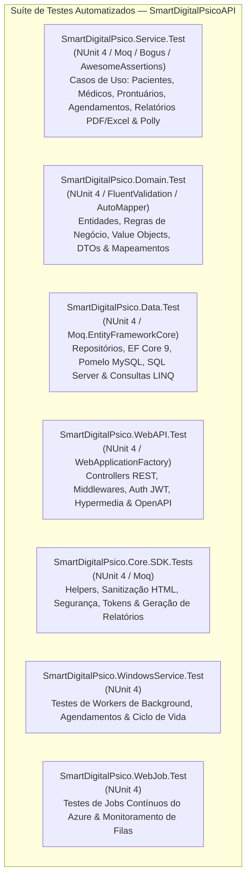

# Diretrizes para Testes Automatizados e Cobertura (Coverage) — Backend (SmartDigitalPsico)

**Documento:** Guia operacional específico da suíte de testes e cobertura backend SmartDigitalPsico  
**Solução:** [SmartDigitalPsicoAPI.sln](file:///c:/git/SMARTDIGITALPSICO/SmartDigitalPsicoAPI/SmartDigitalPsicoAPI.sln)  
**Target Framework:** `.NET 10` (`net10.0` em toda a suíte)  
**Meta de Cobertura:** **100% de Linhas e Ramos em Lógica de Negócio (Domain / Service / Core.SDK) e >90% Global**  
**Guia-Base Genérico:** [Diretrizes-Coverage-Backend-Generico.md](file:///c:/git/SMARTDIGITALPSICO/SmartDigitalPsicoAPI/DOCUMENTACAO/COVERAGE%20AND%20TEST/Diretrizes-Coverage-Backend-Generico.md)  
**Diretrizes de Code Smells:** [Diretrizes-CodeSmell-Backend-SmartDigitalPsico.md](file:///c:/git/SMARTDIGITALPSICO/SmartDigitalPsicoAPI/DOCUMENTACAO/COVERAGE%20AND%20TEST/Diretrizes-CodeSmell-Backend-SmartDigitalPsico.md)  
**Data da Revisão:** 2026-08-28  

---

## 1. Mapa Arquitetural da Suíte de Testes do SmartDigitalPsico

A suíte de testes automatizados do **SmartDigitalPsico Backend** é desenhada para cobrir todas as camadas da Clean Architecture, com foco primordial na integridade dos prontuários clínicos, validações de pacientes e médicos, persistência relacional, sanitização de segurança e serviços em segundo plano:



### 1.1 Detalhamento dos Projetos de Teste

| Projeto de Teste | Alvo / Escopo | Framework | Foco Principal e Metas de Cobertura |
| ---------------- | ------------- | --------- | ----------------------------------- |
| **`SmartDigitalPsico.Service.Test`** | `SmartDigitalPsico.Service` | NUnit 4 | Casos de uso de pacientes, médicos, prontuários, registros de atendimento, hospitalizações, medicamentos, geração de relatórios com QuestPDF/PDFsharp, exportação OpenXML e resiliência via Polly (**Meta: 100%**). |
| **`SmartDigitalPsico.Domain.Test`** | `SmartDigitalPsico.Domain` | NUnit 4 | Validação de entidades (Patient, Medical, User, Office, Specialty), validadores FluentValidation, Value Objects, AutoMapper profiles e DTOs (**Meta: 100%**). |
| **`SmartDigitalPsico.Core.SDK.Tests`** | `SmartDigitalPsico.Core.SDK` | NUnit 4 | Testes unitários do SDK: sanitização com HtmlSanitizer, segurança/tokens JWT, handlers de logging estruturado e extensões base (**Meta: 100%**). |
| **`SmartDigitalPsico.Data.Test`** | `SmartDigitalPsico.Data` | NUnit 4 | Consultas LINQ assíncronas, repositórios de dados, DbContext EF Core 9 (`SmartDigitalPsicoDataContext`), Pomelo MySQL, SQL Server e mapeamentos relacionais (**Meta: >90%**). |
| **`SmartDigitalPsico.WebAPI.Test`** | `SmartDigitalPsico.WebAPI` | NUnit 4 | Integração de endpoints REST, serialização JSON, filtros de autenticação JWT, tratamento global de exceções, hypermedia e middlewares (**Meta: >85%**). |
| **`SmartDigitalPsico.WindowsService.Test`** | `SmartDigitalPsico.WindowsService` | NUnit 4 | Execução dos workers em background, processamento de rotinas agendadas e tratamento de cancelamento via `CancellationToken` (**Meta: >80%**). |
| **`SmartDigitalPsico.WebJob.Test`** | `SmartDigitalPsico.WebJob` | NUnit 4 | Processamento de jobs assíncronos contínuos e simulação de triggers do Azure Storage Queues (**Meta: >80%**). |

---

## 2. Governança e Bibliotecas de Teste no SmartDigitalPsico

### 2.1 Stack de Testes Padronizada (.NET 10)

Todas as dependências de teste são centralizadas no [Directory.Packages.props](file:///c:/git/SMARTDIGITALPSICO/SmartDigitalPsicoAPI/Directory.Packages.props), garantindo integridade e conformidade de licenças:

- **`NUnit 4.6.1` / `NUnit3TestAdapter 6.2.0` / `NUnit.Analyzers 4.14.0`:** Framework de execução e testes unitários com análise estática de código de testes.
- **`AwesomeAssertions 9.6.0`:** Biblioteca de asserções fluentes com licença Apache 2.0 (evitando riscos de licença do FluentAssertions 8+).
- **`Moq 4.20.72`:** Criação de mocks, stubs e verificação estrita de chamadas de métodos (`Verify`).
- **`Moq.EntityFrameworkCore 9.0.0.10`:** Simulação precisa de `DbSet<T>` e queries LINQ assíncronas compatíveis com EF Core 9.
- **`Bogus 35.6.5`:** Geração dinâmica e determinística de massas de dados de teste (pacientes, médicos, prontuários, CPFs, e-mails).
- **`coverlet.collector 10.0.1` & `coverlet.msbuild 10.0.1`:** Coleta padronizada de cobertura no formato OpenCover.

---

## 3. Padrões de Implementação de Testes Unitários

### 3.1 Padrão Tripartite de Nomenclatura (`Metodo_Cenario_Resultado`)
```text
NomeDoMetodo_CenarioSobTeste_ResultadoEsperado
```

**Exemplos Homologados:**
- `CreatePatientAsync_WhenEmailAlreadyExists_ThrowsBusinessConflictException`
- `GetMedicalByIdAsync_WhenMedicalNotFound_ThrowsNotFoundException`
- `SanitizeHtml_WhenScriptTagPresent_RemovesMaliciousContent`
- `GenerateReportPdfAsync_WhenValidPatient_ReturnsByteArrayStream`

---

### 3.2 Comentários de Contexto e Estrutura AAA
Todo método de teste deve conter os comentários explicativos `// Cenário:` e `// Objetivo:` em português e blocos `// Arrange`, `// Act`, `// Assert`:

```csharp
// Cenário: Tentativa de cadastro de paciente com e-mail já existente na base de dados.
// Objetivo: Validar que o serviço lance exceção de negócio e não invoque a inserção no repositório.
[Test]
public async Task CreatePatientAsync_WhenEmailAlreadyExists_ThrowsBusinessConflictException()
{
    // Arrange
    var patientDto = new Faker<PatientCreateDto>()
        .RuleFor(p => p.Name, f => f.Person.FullName)
        .RuleFor(p => p.Email, f => f.Internet.Email())
        .RuleFor(p => p.Cpf, f => f.Random.Replace("###.###.###-##"))
        .Generate();

    _patientRepositoryMock
        .Setup(r => r.ExistsByEmailAsync(patientDto.Email, It.IsAny<CancellationToken>()))
        .ReturnsAsync(true);

    // Act
    Func<Task> act = async () => await _patientService.CreatePatientAsync(patientDto, CancellationToken.None);

    // Assert
    await act.Should().ThrowAsync<BusinessConflictException>()
        .WithMessage("*já cadastrado*");

    _patientRepositoryMock.Verify(r => r.InsertAsync(It.IsAny<Patient>(), It.IsAny<CancellationToken>()), Times.Never);
}
```

---

### 3.3 Utilização de Agregadores de Dependências em Testes
Para instanciar serviços que utilizam o agregador de dependências contra `S107`:

```csharp
// Arrange
var dependencies = new Dependencies();
var patientService = new PatientService(
    dependencies.Services, 
    dependencies.Config, 
    dependencies.Repositories, 
    _patientRepositoryMock.Object, 
    _patientValidatorMock.Object
);
```

---

## 4. Gestão de Gaps de Cobertura e Exclusões Homologadas

### 4.1 Tratamento de Gaps de Cobertura
Ao analisar o relatório de cobertura gerado:
1. **Identificar métodos não cobertos:** Filtrar classes com `CoveragePct < 100%`.
2. **Priorizar Lógica de Negócio e Serviços:** Focar imediatamente em `SmartDigitalPsico.Domain`, `SmartDigitalPsico.Service` e `SmartDigitalPsico.Core.SDK`.
3. **Exclusões Válidas no Sonar:** Confirmar se o arquivo é um DTO puro, VO anêmico, classe de configuração ou migration antes de criar testes redundantes (conforme `sonar.coverage.exclusions`).

### 4.2 Exclusões Homologadas de Cobertura
```properties
sonar.coverage.exclusions=**/*Test*/**,**/*Tests*/**,**/Program.cs,**/*Dto.cs,**/*Vo.cs,**/*Option*.cs,**/Migrations/**,**/*Mapper*.cs
```

---

## 5. Procedimento Operacional de Execução dos Testes

```powershell
cd c:\git\SMARTDIGITALPSICO\SmartDigitalPsicoAPI

# 1. Compilar toda a solução em modo Release
dotnet build SmartDigitalPsicoAPI.sln -c Release

# 2. Executar toda a suíte de testes automatizados
dotnet test SmartDigitalPsicoAPI.sln -c Release --no-build

# 3. Executar suíte completa com coleta de cobertura via Coverlet
dotnet test SmartDigitalPsicoAPI.sln -c Release /p:CollectCoverage=true /p:CoverletOutputFormat=opencover

# 4. Executar testes de um projeto específico isoladamente
dotnet test SmartDigitalPsico.Service.Test/SmartDigitalPsico.Service.Test.csproj -c Release /p:CollectCoverage=true /p:CoverletOutputFormat=opencover

# 5. Gerar relatório visual de cobertura HTML (se o ReportGenerator estiver instalado)
reportgenerator -reports:**/coverage.opencover.xml -targetdir:./CoverageReport -reporttypes:Html
```

---

## 6. Checklist de Homologação de Testes

- [ ] Todos os testes da solução executando e passando em modo Release com 100% de sucesso (0 falhas).
- [ ] Novos testes implementados seguindo a convenção tripartite `Metodo_Cenario_Resultado` em inglês.
- [ ] Comentários explicativos `// Cenário:` e `// Objetivo:` em português adicionados acima de cada método.
- [ ] Blocos `// Arrange`, `// Act`, `// Assert` demarcados explicitamente.
- [ ] Massa de dados dinamicamente instanciada via Bogus.
- [ ] Dependências mockadas via `Moq` e `Moq.EntityFrameworkCore`.
- [ ] Asserções com `AwesomeAssertions` e agrupamentos com `Assert.Multiple`.
- [ ] Métricas de cobertura dentro das metas estabelecidas (100% em Domain/Service/Core.SDK).

---

## 7. Referências Internas

- [SmartDigitalPsicoAPI.sln](file:///c:/git/SMARTDIGITALPSICO/SmartDigitalPsicoAPI/SmartDigitalPsicoAPI.sln) — Solução backend SmartDigitalPsico
- [Directory.Packages.props](file:///c:/git/SMARTDIGITALPSICO/SmartDigitalPsicoAPI/Directory.Packages.props) — Import centralizado de pacotes NuGet
- [Diretrizes-Coverage-Backend-Generico.md](file:///c:/git/SMARTDIGITALPSICO/SmartDigitalPsicoAPI/DOCUMENTACAO/COVERAGE%20AND%20TEST/Diretrizes-Coverage-Backend-Generico.md) — Guia genérico de cobertura backend
- [Diretrizes-CodeSmell-Backend-SmartDigitalPsico.md](file:///c:/git/SMARTDIGITALPSICO/SmartDigitalPsicoAPI/DOCUMENTACAO/COVERAGE%20AND%20TEST/Diretrizes-CodeSmell-Backend-SmartDigitalPsico.md) — Diretrizes de Code Smells backend SmartDigitalPsico
- [2026-07-LevantamentoConjuntoHomologado-SmartDigitalPsicoAPI.md](file:///c:/git/SMARTDIGITALPSICO/SmartDigitalPsicoAPI/DOCUMENTACAO/API/2026-07-LevantamentoConjuntoHomologado-SmartDigitalPsicoAPI.md) — Levantamento técnico da API
