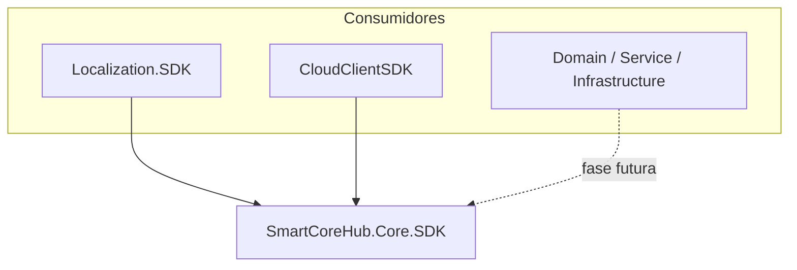

# SmartCoreHub.Core.SDK — Especificação Técnica

> **Complemento (2026-07-15):** as extrações pendentes identificadas após esta iniciativa (duplicados remanescentes, genéricos não catalogados e lacunas de implementação) foram executadas — ver [Extracao-Pendencias.md](./SmartCoreHub.Core.SDK-Extracao-Pendencias.md).

**Versão:** 1.1  
**Data:** 2026-07-13  
**Status:** Implementado (histórico da spec inicial preservado abaixo)  
**Documento base:** [SmartCoreHub.Core.SDK-RASCUNHO.md](./SmartCoreHub.Core.SDK-RASCUNHO.md)  
**Referências:** [PROJECT_GUIDELINES.md](../../../PROJECT_GUIDELINES.md), [SmartCoreHub.Localization.SDK-Requisitos.md](../SDK/SmartCoreHub.Localization.SDK-Requisitos.md)

> **Atualização v1.1 (pós-migração de genéricos):** o pacote é **um** NuGet multi-TFM. A premissa “zero acoplamento pesado / Core puro” foi **flexibilizada**: dependências EF Core, Dapper, Redis, Mongo, Cosmos e Azure entram **no mesmo** pacote, mas **somente** nos TFMs `net8.0`/`net10.0`. TFMs `netstandard`/`net6` permanecem leves. Ver [MigracaoGenericos.md](./SmartCoreHub.Core.SDK-MigracaoGenericos.md) e o [README do pacote](../../../../backend/Core/SmartCoreHub.Core.SDK/README.md).

---

## 1. Resumo executivo

O **SmartCoreHub.Core.SDK** é uma Class Library .NET empacotável via NuGet, alojada em `backend/Core/SmartCoreHub.Core.SDK`, destinada a centralizar primitivas de domínio, helpers, contratos de infraestrutura, padrões reutilizáveis e — nos TFMs modernos — implementações genéricas (repositórios, cache pesado, Azure).

### Objetivos

- Reduzir duplicação entre SDKs de feature (`Localization.SDK`, `CloudClientSDK`) e o backend (`Domain`, `Service`, `Infrastructure`).
- Oferecer contratos estáveis e versionados semanticamente para consumidores internos e externos.
- Seguir as convenções de empacotamento e publicação alinhadas ao `SmartCoreHub.Localization.SDK`.

### Premissas (atualizadas)

| Regra | Descrição |
| ----- | --------- |
| Projeto isolado em `backend/Core/` | Código packable do SDK; origem histórica por cópia/adaptação |
| Um NuGet | `PackageId=SmartCoreHub.Core.SDK` — sem pacotes companheiros |
| Deps pesadas condicionais | EF/Dapper/Redis/Mongo/Cosmos/Azure **apenas** em `net8.0`/`net10.0` |
| Sem referência a Domain/Service do monólito | O SDK não referencia `SmartCoreHub.Domain` / Infrastructure / Service |
| Cache Memory/Disk | Implementações leves disponíveis em todos os TFMs; Redis/Mongo/Cosmos em net8/net10 |

> **Histórico da spec v1.0:** as premissas “cópia sem movimentação”, “substituição gradual” e “zero EF/Dapper no Core” descreviam a fase inicial; a consolidação de genéricos e a remoção de shims supersedem o “Core puro” absoluto.

---

## 2. Arquitetura



### Direção de dependências

- `SmartCoreHub.Core.SDK` depende apenas de pacotes `Microsoft.Extensions.*` (condicionais por TFM).
- SDKs de feature referenciam `SmartCoreHub.Core.SDK` (fase posterior à estabilização do Core).
- Backend referencia Core.SDK apenas quando a migração gradual for aprovada por fase.

---

## 3. Estrutura de pastas e namespaces

```text
backend/
├── SmartCoreHub.sln
├── Directory.Build.props
├── Directory.Packages.props
├── SDKs/
│   ├── SmartCoreHub.Localization.SDK/     # referência de convenções NuGet
│   └── SmartCoreHub.ClientSDK/
└── Core/
    ├── SmartCoreHub.Core.SDK/
    │   ├── SmartCoreHub.Core.SDK.csproj
    │   ├── README.md
    │   ├── LICENSE
    │   ├── GlobalUsings.cs
    │   ├── Abstractions/       → SmartCoreHub.Core.SDK.Abstractions
    │   ├── Common/             → SmartCoreHub.Core.SDK.Common
    │   ├── Domain/             → SmartCoreHub.Core.SDK.Domain
    │   ├── Infrastructure/     → SmartCoreHub.Core.SDK.Infrastructure
    │   ├── Services/           → SmartCoreHub.Core.SDK.Services
    │   ├── Validation/         → SmartCoreHub.Core.SDK.Validation
    │   ├── Helpers/            → SmartCoreHub.Core.SDK.Helpers
    │   ├── Extensions/         → SmartCoreHub.Core.SDK.IdeExtensions
    │   ├── Http/               → SmartCoreHub.Core.SDK.Http
    │   ├── Authentication/     → SmartCoreHub.Core.SDK.Authentication
    │   ├── Caching/            → SmartCoreHub.Core.SDK.Caching
    │   ├── Exceptions/         → SmartCoreHub.Core.SDK.Exceptions
    │   ├── Logging/            → SmartCoreHub.Core.SDK.Logging
    │   ├── Mapping/            → SmartCoreHub.Core.SDK.Mapping
    │   ├── Constants/          → SmartCoreHub.Core.SDK.Constants
    │   ├── Events/             → SmartCoreHub.Core.SDK.Events
    │   ├── Specifications/     → SmartCoreHub.Core.SDK.Specifications
    │   ├── Security/           → SmartCoreHub.Core.SDK.Security
    │   └── Polyfills/          → (netstandard2.x)
    └── SmartCoreHub.Core.SDK.Tests/
```

Os projetos Core.SDK devem ser registrados na solução `backend/SmartCoreHub.sln`, na pasta virtual **Core**, separada da pasta **SDKs** (Localization, CloudClient).

---

## 4. API pública por módulo

### 4.1 Common — Result Pattern

Inspirado em `ServiceResponse<T>` do backend; implementação nova e desacoplada.

```csharp
namespace SmartCoreHub.Core.SDK.Common;

public record Error(string Code, string Message, Dictionary<string, object>? Metadata = null);

public class Result
{
    public bool IsSuccess { get; }
    public bool IsFailure => !IsSuccess;
    public IReadOnlyList<Error> Errors { get; }
    public static Result Success();
    public static Result Failure(Error error);
    public static Result Failure(IEnumerable<Error> errors);
}

public class Result<T> : Result
{
    public T Value { get; }  // lança InvalidOperationException se IsFailure
    public static Result<T> Success(T value);
    public static new Result<T> Failure(Error error);
    public static new Result<T> Failure(IEnumerable<Error> errors);
}
```

**Futuro:** `PaginatedResult<T>`, `ValidationResult`, exceções padronizadas.

### 4.2 Domain — Primitivas DDD

```csharp
namespace SmartCoreHub.Core.SDK.Domain;

public interface IEntity { Guid Id { get; } }

public abstract class EntityBase : IEntity, IEquatable<EntityBase>
{
    public Guid Id { get; protected set; }
    public DateTime CreatedAt { get; protected set; }
    public DateTime? UpdatedAt { get; protected set; }
    public bool IsActive { get; protected set; }
    public void UpdateModifiedDate();
    public void Activate();
    public void Deactivate();
}
```

**Nota:** O backend usa `BaseEntity` com `long Id`. O Core.SDK adota `Guid Id` para independência. Compatibilidade futura via `LongEntityBase` ou `IEntity<TId>`.

**Futuro:** `ValueObject`, `AuditableEntity`, `AggregateRoot`, `DomainEvent`, `IAggregateRoot`.

### 4.3 Validation — Guard Clauses

```csharp
namespace SmartCoreHub.Core.SDK.Validation;

public static class Guard
{
    public static void AgainstNull(object? argument, string argumentName);
    public static void AgainstEmptyString(string argument, string argumentName);
    public static void AgainstNegative(decimal argument, string argumentName);
}
```

### 4.4 Infrastructure — Persistência genérica (fase posterior)

Interfaces puras, sem ORM:

- `IRepository<T> where T : EntityBase` — CRUD assíncrono
- `IReadRepository<T>` — separação CQRS
- `IUnitOfWork` — `CommitAsync`, transações
- `InMemoryRepository<T>` — apenas no projeto de testes

### 4.5 Abstrações transversais (fase posterior)

| Interface | Responsabilidade |
| --------- | ---------------- |
| `IClock` / `SystemClock` | Tempo testável |
| `IAppLogger` / `NullAppLogger` | Logging desacoplado |
| `IAuthHeaderProvider` | Injeção de headers de autenticação |
| `IApiErrorMapper` | Mapeamento HTTP → exceções tipadas |
| `ICacheProvider` | Cache assíncrono |
| `ISmartCoreHubMapper` | Mapeamento genérico (sem AutoMapper/Mapster) |

---

## 5. Catálogo de origem no backend

Classes existentes mapeadas para cópia/adaptação. **Originais permanecem intactos.**

### Tier A — Fundação imediata (Fase 1–2)

| Origem | Classe | Destino Core.SDK | Estratégia |
| ------ | ------ | ---------------- | ---------- |
| `backend/Implementations/SmartCoreHub.Domain/Entities/Common/BaseEntity.cs` | `BaseEntity` | `backend/Core/SmartCoreHub.Core.SDK/Domain/EntityBase.cs` | Adaptar: `Guid Id`, namespace novo |
| `backend/Implementations/SmartCoreHub.Domain/Interfaces/Common/IClock.cs` | `IClock`, `SystemClock` | `backend/Core/SmartCoreHub.Core.SDK/Abstractions/IClock.cs` | Cópia quase direta |
| `backend/Implementations/SmartCoreHub.Domain/Interfaces/Common/IAppLogger.cs` | `IAppLogger`, `NullAppLogger` | `backend/Core/SmartCoreHub.Core.SDK/Logging/IAppLogger.cs` | Cópia quase direta |
| `backend/Implementations/SmartCoreHub.Domain/Helpers/ParallelOptionsHelper.cs` | `ParallelOptionsHelper` | `backend/Core/SmartCoreHub.Core.SDK/Helpers/ParallelOptionsHelper.cs` | Cópia direta |
| Rascunho | `Result`, `Result<T>`, `Error` | `backend/Core/SmartCoreHub.Core.SDK/Common/` | Novo — inspirado em ServiceResponse |
| Rascunho | `Guard` | `backend/Core/SmartCoreHub.Core.SDK/Validation/Guard.cs` | Novo — inspirado em InternalGuardValidators |

### Tier B — Infraestrutura SDK (Fase 3–4)

| Origem | Destino Core.SDK |
| ------ | ---------------- |
| `backend/SDKs/SmartCoreHub.Localization.SDK/Http/HttpHeaderNamesHelper.cs` + `backend/Implementations/SmartCoreHub.Service/API/Headers/HttpHeaderNamesHelper.cs` | `backend/Core/SmartCoreHub.Core.SDK/Http/HttpHeaderNamesHelper.cs` |
| `backend/SDKs/SmartCoreHub.Localization.SDK/Abstractions/IAuthHeaderProvider.cs` | `backend/Core/SmartCoreHub.Core.SDK/Abstractions/IAuthHeaderProvider.cs` |
| `backend/SDKs/SmartCoreHub.Localization.SDK/Authentication/ApiKeyAuthHeaderProvider.cs` | `backend/Core/SmartCoreHub.Core.SDK/Authentication/ApiKeyAuthHeaderProvider.cs` |
| `backend/SDKs/SmartCoreHub.Localization.SDK/Abstractions/IApiErrorMapper.cs` | `backend/Core/SmartCoreHub.Core.SDK/Abstractions/IApiErrorMapper.cs` |
| `backend/SDKs/SmartCoreHub.Localization.SDK/Caching/MemoryCacheProvider.cs` | `backend/Core/SmartCoreHub.Core.SDK/Caching/MemoryCacheProvider.cs` |
| `backend/SDKs/SmartCoreHub.ClientSDK/Services/BaseHttpService.cs` | `backend/Core/SmartCoreHub.Core.SDK/Http/HttpRequestExecutorBase.cs` |
| `backend/SDKs/SmartCoreHub.Localization.SDK/Polyfills/IsExternalInit.cs` | `backend/Core/SmartCoreHub.Core.SDK/Polyfills/IsExternalInit.cs` |

### Tier C — Domain avançado (Fase 5+)

| Origem | Destino Core.SDK |
| ------ | ---------------- |
| `backend/Implementations/SmartCoreHub.Domain/Entities/Common/AuditableBaseEntity.cs` | `backend/Core/SmartCoreHub.Core.SDK/Domain/AuditableEntity.cs` (desacoplar de `User`) |
| `backend/Implementations/SmartCoreHub.Domain/ValueObjects/ConnectionString.cs` | `backend/Core/SmartCoreHub.Core.SDK/Domain/ValueObjects/ConnectionString.cs` |
| `backend/Implementations/SmartCoreHub.Domain/Interfaces/Repositories/Generic/IGenericRepository.cs` | `backend/Core/SmartCoreHub.Core.SDK/Infrastructure/IRepository.cs` |
| `backend/Implementations/SmartCoreHub.Domain/Helpers/JsonSerializerHelper.cs` | `backend/Core/SmartCoreHub.Core.SDK/Helpers/JsonSerializerHelper.cs` |
| `backend/Implementations/SmartCoreHub.Domain/DTOs/Common/ServiceResponse.cs` | `backend/Core/SmartCoreHub.Core.SDK/Common/PaginatedResult.cs` (subset) |

### Excluídos do Core.SDK

- Validators FluentValidation específicos de domínio
- `BaseApiController`, `GenericService<T>` com EF
- Helpers de localização
- `GenericRepository<T>` (implementação EF) — apenas interface no Core

---

## 6. Roadmap de classes futuras

| Módulo | Classes planejadas |
| ------ | ------------------ |
| Domain | `ValueObject`, `AuditableEntity`, `AggregateRoot`, `DomainEvent`, `IEntity`, `IAggregateRoot`, `LongEntityBase` |
| Common | `PaginatedResult<T>`, `ValidationResult`, `BusinessException`, `NotFoundException`, `ConflictException`, etc. |
| Validation | `Guard`, `Ensure`, `ValidationHelper` |
| Helpers | `StringHelper`, `DateTimeHelper`, `NumberHelper`, `EnumHelper`, `JsonHelper`, `ReflectionHelper`, `CollectionHelper` |
| Extensions | `StringExtensions`, `DateTimeExtensions`, `GuidExtensions`, `EnumerableExtensions`, `ConfigurationExtensions` |
| Infrastructure | `IRepository<T>`, `IReadRepository<T>`, `IUnitOfWork`, `InMemoryRepository<T>` |
| Http | `HttpRequestExecutorBase`, `HttpHeaderNamesHelper` |
| Logging | `ILoggerAdapter<T>`, `LoggerHelper` (CorrelationId, sanitização) |
| Security | `HashHelper`, `EncryptionHelper`, `TokenHelper`, `SecureRandomHelper` |
| Caching | `ICacheProvider`, `MemoryCacheProvider` |
| Events | `IEvent`, `IDomainEvent`, `IEventPublisher`, `EventDispatcher` |
| Specifications | `ISpecification<T>`, `BaseSpecification<T>` |
| Mapping | `ISmartCoreHubMapper` |
| Constants | `DateFormats`, `RegexPatterns`, `ErrorCodes`, `Headers` |

---

## 7. NuGet e CI/CD

Espelhar `backend/SDKs/SmartCoreHub.Localization.SDK/SmartCoreHub.Localization.SDK.csproj`:

| Propriedade | Valor |
| ----------- | ----- |
| `PackageId` | `SmartCoreHub.Core.SDK` |
| `TargetFrameworks` | `netstandard2.0;netstandard2.1;net6.0;net8.0;net10.0` |
| Versionamento | Por data (`BuildDate`, `PackageBuildDate`) |
| Símbolos | `IncludeSymbols`, `snupkg` |
| Documentação | `GenerateDocumentationFile` |
| README/LICENSE | Empacotados no `.nupkg` |
| `GeneratePackageOnBuild` | `false` (pack após build multi-TFM) |

Pipeline inicial: **build + test**. Publicação NuGet em fase posterior (ver plano de implementação).

Documentação de referência:

- [Documentation/Features/FEITOS/NUGET-SDK-LOCALIZATION.md](../NUGET-SDK-LOCALIZATION.md)
- [Documentation/Features/FEITOS/NUGET-CLASSIC-PIPELINE-PUBLISH-ONLY.md](../NUGET-CLASSIC-PIPELINE-PUBLISH-ONLY.md)

---

## 8. Testes

| Aspecto | Padrão |
| ------- | ------ |
| Framework | xUnit |
| Asserts | FluentAssertions |
| Isolamento | Moq |
| Nomenclatura | `Metodo_Cenario_ResultadoEsperado` |
| Comentários | Português |
| Meta de cobertura | ≥ 90% nos módulos entregues |

---

## 9. Compatibilidade e versionamento

- Interfaces públicas só podem ter breaking changes em releases **major**.
- Documentar migrações no changelog do pacote.
- `InternalsVisibleTo` para projeto de testes.

---

## 10. Requisitos arquiteturais

- SOLID, Clean Architecture, DDD-friendly, CQRS-friendly
- Async-first onde aplicável
- Nullable enabled, implicit usings enabled
- XML documentation em APIs públicas
- Thread-safe quando aplicável
- Sonar-friendly (sem secrets em logs; usar sanitização futura em `LoggerHelper`)

---

## 11. Status de implementação

| Módulo | Status |
| ------ | ------ |
| Projeto em `backend/Core/` | Planejado |
| Common (`Result`, `Error`) | Planejado (Fase 2) |
| Domain (`EntityBase`) | Planejado (Fase 2) |
| Abstractions, Validation, Helpers | Planejado (Fase 3) |
| Http, Caching, Authentication | Planejado (Fase 4) |
| Demais módulos | Roadmap |
