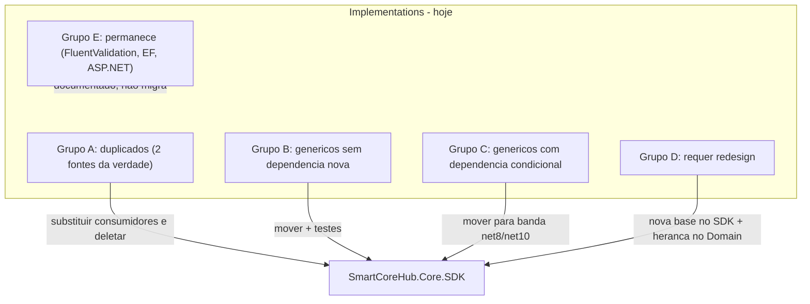
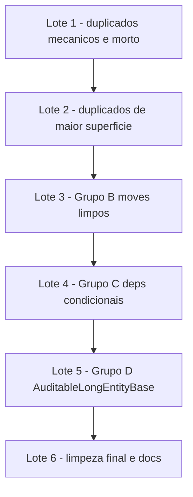

# SmartCoreHub.Core.SDK — Levantamento e plano das extrações pendentes

**Versão:** 1.1
**Data:** 2026-07-15
**Status:** ✅ Concluído — lotes 1–6 executados em 2026-07-15 (build/testes verdes; gates EF de 4d/4e e 5 com Up/Down vazios; greps de aceite §8.3 sem matches)
**Documentos base (histórico concluído):**
- [SmartCoreHub.Core.SDK-Especificacao.md](./SmartCoreHub.Core.SDK-Especificacao.md)
- [SmartCoreHub.Core.SDK-Substituicao.md](./SmartCoreHub.Core.SDK-Substituicao.md) (v1.4 — substituição de tipos leves concluída)
- [SmartCoreHub.Core.SDK-MigracaoGenericos.md](./SmartCoreHub.Core.SDK-MigracaoGenericos.md) (v1.6 — genéricos pesados consolidados no NuGet único)
- [SmartCoreHub.Core.SDK-Remocao-Shims.md](./SmartCoreHub.Core.SDK-Remocao-Shims.md) (lotes 1–7 concluídos)
- README do pacote: [`backend/Core/SmartCoreHub.Core.SDK/README.md`](../../../../backend/Core/SmartCoreHub.Core.SDK/README.md)

---

## 1. Objetivo

As iniciativas anteriores centralizaram no `SmartCoreHub.Core.SDK` os tipos genéricos leves (entidades base, interfaces, DTOs comuns, helpers) e as implementações pesadas (EF, Dapper, Redis, Mongo, Cosmos, Azure), removendo os shims `SCH_MIGR_*` e `SCH_MIG_GEN_*`. Porém, uma nova varredura completa de `backend/Implementations` (Domain, Service, Infrastructure) revelou que:

1. **Existem duplicações remanescentes** — tipos que foram *copiados* para o SDK mas cujos originais em `Implementations` nunca foram removidos nem viraram shim. Hoje há **duas fontes da verdade** para eles (violação da regra "Um alvo por tipo").
2. **Existem tipos genéricos/reutilizáveis nunca catalogados** — DTOs, contratos, enums e helpers sem nenhum acoplamento a feature que permanecem em `Implementations` sem motivo.
3. **Existem lacunas de implementação no SDK** — casos em que o SDK tem só o contrato (ex.: `IRichContentSanitizer`) e a implementação concreta continua exclusivamente no Domain.

Este documento consolida o **levantamento** (Grupos A–F), a **especificação das decisões** e o **plano de implementação em lotes** para fechar essas pendências.

### Regras não negociáveis (herdadas dos documentos anteriores)

| Regra | Descrição |
| ----- | --------- |
| **Centralizar o genérico** | Toda implementação genérica/reutilizável tem fonte única no NuGet `SmartCoreHub.Core.SDK`. |
| **Manter o específico** | Entidades de produto, repositórios de domínio, `SmartCoreHubDbContext`, EF configs, seed, middlewares de composição e validators de regra de negócio permanecem em `Implementations`. |
| **Um NuGet** | Sem pacotes satélites. Dependências pesadas só nos TFMs `net8.0`/`net10.0` (`Compile Remove` + `PackageReference` condicionais). |
| **Identificador `long`** | Nenhuma entidade EF troca `long Id` por `Guid`. Zero migration de schema por efeito colateral. |
| **Build obrigatório por lote** | `dotnet build SmartCoreHub.sln -c Release` verde ao fim de cada lote. |
| **Testes preservados e replicados** | Testes dos tipos migrados continuam nos projetos originais (enquanto o tipo existir) e são replicados/adaptados em `SmartCoreHub.Core.SDK.Tests`. |
| **Cobertura ≥ 90%** | Módulos migrados mantêm cobertura de linhas ≥ 90% no Core.SDK (Coverlet threshold). |
| **Zero regressão funcional** | Endpoints, contratos, schema, chaves de cache e formato de log idênticos antes/depois. |
| **Gate EF** | Migration de validação (Up/Down vazios) nas fases que tocarem entidade/repositório/EF (§8.2). |

---

## 2. Decisões de escopo (especificação)

| # | Tema | Decisão |
| - | ---- | ------- |
| 1 | **FluentValidation** | **Não entra no Core.SDK** (decisão reconfirmada em 2026-07-14). Os *DTOs* de validação genérica movem para o SDK; os *validators* FluentValidation permanecem em `SmartCoreHub.Domain`. |
| 2 | **ASP.NET Core** | Tipos genéricos acoplados a ASP.NET (`BaseApiController`, middlewares, DI extensions de documentação/CORS/performance) **não entram neste plano** — documentados como fase futura/opcional (§7, Grupo F). |
| 3 | **Novas dependências condicionais** | O SDK ganha, **somente em `net8.0`/`net10.0`**: `HtmlSanitizer` (Ganss.Xss) para `RichContentSanitizerHelper`; `AutoMapper` para `AutoMapperAdapter`; `System.IdentityModel.Tokens.Jwt`/`Microsoft.IdentityModel.Tokens` para `JwtTokenAdapter`. Padrão idêntico ao usado para EF/Dapper/Redis/Mongo/Cosmos/Azure. |
| 4 | **`AuditableBaseEntity`** | Redesign em camadas: o SDK ganha `AuditableLongEntityBase` (ids `long` + datas, **sem** navegação `User`); o Domain mantém `AuditableBaseEntity : AuditableLongEntityBase` adicionando apenas as navigation properties `User?`. Nenhuma coluna/migration muda. |
| 5 | **`GenericService<TEntity>`** | A implementação **permanece** em `SmartCoreHub.Service` (depende dos validators FluentValidation — consequência da decisão 1). O **contrato** `IGenericService<TEntity>` move para o SDK. |
| 6 | **Serilog** | `SerilogAdapter` move para o Core.SDK (banda `net8.0`/`net10.0`, `PackageReference` condicional a `Serilog`), implementando `IAppLogger`. O host (Service) apenas registra o adapter no DI. O `ProcessStopwatch` do SDK **não** ganha overload Serilog; consumidores usam o overload `IAppLogger`. |
| 7 | **Sem shims nesta rodada** | Diferente das iniciativas anteriores, os duplicados serão substituídos **diretamente** (migrar consumidores → deletar original) em lotes pequenos, sem fase de `[Obsolete]`. O monorepo é o único consumidor dos tipos afetados. |

### Visão geral



---

## 3. Grupo A — Duplicados: já existem no Core.SDK (remover/substituir em Implementations)

> Ação padrão: migrar consumidores para o tipo `SmartCoreHub.Core.SDK.*` → deletar o original → build + testes. Sem shim (decisão §2.7).

### 3.1 SmartCoreHub.Domain

| Arquivo original | Tipo(s) | Equivalente no Core.SDK | Consumidores a migrar | Observação |
| ---------------- | ------- | ----------------------- | --------------------- | ---------- |
| `Common/ProcessStopwatch.cs` | `ProcessStopwatch` | `Core.SDK/Domain/Common/ProcessStopwatch.cs` | `ApiKeyAuthenticationHandler`, `LocalizationImportExportService` (Service); `Domain.Tests` | Versão Domain tem overload `Serilog.ILogger`; SDK só `IAppLogger`. Consumidores migram para `IAppLogger` (§2.6). |
| `Helpers/CultureDateTimeHelper.cs` | `CultureDateTimeHelper` | `Core.SDK/Domain/Helpers/CultureDateTimeHelper.cs` | `LocalizationAdvancedQueryService`, `LocalizationOrchestrationFacadeService`; `Domain.Tests` | Cópia idêntica (o arquivo SDK declara "copia adaptada"). |
| `DTOs/Entities/CultureDisplayDto.cs` | `CultureDisplayDto` | `Core.SDK/Domain/DTOs/Entities/CultureDisplayDto.cs` | Serviços de query de localization, `ILocalizationContracts`, testes de API | Migrar junto com o helper acima. |
| `DTOs/Entities/TokenConfigurationDto.cs` | `TokenConfigurationDto`, `ITokenConfigurationDto` | `Core.SDK/Domain/DTOs/Entities/TokenConfigurationDto.cs` | `JwtTokenAdapter`, `SecurityTokenAdapterFactory` (Infrastructure); `AuthenticationExtensions` (Service); `TokenController` (API); testes | Shape idêntico. Pré-requisito do Lote 4 (JWT). |
| `Interfaces/IErrorGetLocalizationService.cs` | `IErrorGetLocalizationService` | `Core.SDK/Domain/Interfaces/IErrorGetLocalizationService.cs` | **Maior superfície**: quase todos os services (`UserService`, `PlanService`, `AuditService`, `GetErrorLocalizationService`, …) + records de `DependeciesCollection/Localization/*` | Assinatura idêntica; substituição mecânica de `using`, alto volume. |
| `Interfaces/Cloud/ICloudServiceFactory.cs` | `ICloudServiceFactory` | `Core.SDK/Domain/Interfaces/Cloud/ICloudServiceFactory.cs` | **Nenhum** (zero referências) | **Duplicado morto — deletar imediatamente.** |
| `Interfaces/Dapper/RepositoryImplementationKind.cs` | `RepositoryImplementationKind` | enum em `Core.SDK/Domain/Interfaces/Dapper/IRepositoryImplementationFactory.cs` | Interfaces de service de feature (`IApplicationService`, `IUserService`, `ITenantService`, `IPlanService`, `IBillingEventService`, `IApiKeyTokenService`, `ILocalizationContracts`, …) e `GenericService` | Swap mecânico de namespace. |
| `Sanitization/RichContentFormat.cs` | `RichContentFormat` | enum em `Core.SDK/Domain/Sanitization/RichContentSanitizerHelper.cs` | `LocalizedTextContentSanitizerHelper`, `LanguageMetadataContentNormalizerHelper`, `LanguageMetadata`, `LocalizationResourceDTO`, `LocalizationBatchDto`, `RichContentFormatMapperHelper` (Domain); `PlanService`, `PlanLocalizationSyncService`, `LanguageMetadataSerializer` | Depende do Lote 4 (implementação `RichContentSanitizerHelper` no SDK) para o corte completo. |
| `Sanitization/RichContentSanitizeOptions.cs` | `RichContentSanitizeOptions` | idem | idem | idem. |
| `Auditing/ChangeType.cs` + parte de `Auditing/IAuditContracts.cs` | `ChangeType`, `AuditRegistrationRequestBase<T>`, `AuditRegistrationRequest`, `AuditRegistrationTypedRequest<T>` | `Core.SDK/Domain/Auditing/AuditContracts.cs` | `LocalizationController`, `AuditController` (API); `LocalizationImportExportService`, `AuditService`, `LocalizationAuditService` (Service); `AuditLogConfiguration` (Infrastructure); migrations; testes | Membros idênticos. `ILocalizationAuditService`/`LocalizationResourceAuditChangeRequest` (mesmo arquivo) são de feature e **ficam**. |

### 3.2 SmartCoreHub.Infrastructure

| Arquivo original | Tipo(s) | Equivalente no Core.SDK | Consumidores a migrar | Observação |
| ---------------- | ------- | ----------------------- | --------------------- | ---------- |
| `Caching/Providers/MemoryCacheProvider.cs` | `MemoryCacheProvider` | `Core.SDK/Infrastructure/Caching/Providers/MemoryCacheProvider.cs` | `InfrastructureCacheProviderResolver` (Service), DI caching, `Service.Tests` | Quase idêntico; a cópia host só roteia options via `CacheOptionsBridge`. |
| `Caching/Common/CacheOptionsBridge.cs` | `CacheOptionsBridge` | — (one-liner `options ?? fallback`) | só o provider acima | Morre junto com o duplicado. |
| `Security/IJwtTokenAdapter.cs` | `ISecurityTokenAdapter` | `Core.SDK/Infrastructure/Security/ISecurityTokenAdapter.cs` | `JwtTokenService` (Service), `SecurityTokenAdapterFactory`, testes | Interface idêntica no SDK (que também define a factory). |
| `Security/SecurityTokenAdapterFactory.cs` (interface) | `ISecurityTokenAdapterFactory` | idem | idem | A **implementação** `SecurityTokenAdapterFactory` move no Lote 4 (JWT). |
| `Data/Configurations/DatabaseProviderResolver.cs` | `DatabaseProviderResolver` | `Core.SDK/Infrastructure/Data/Configurations/DatabaseProviderResolver.cs` | `DatabaseRoutineConfiguration`, `HelperCharSet`, EF configs, testes | SDK inclusive tem polyfill netstandard2.0 extra. |
| `Data/Configurations/DatabaseProviderType.cs` | `DatabaseProviderType` | `Core.SDK/Infrastructure/Data/Configurations/DatabaseProviderType.cs` | idem | Enum idêntico. |
| `Data/Configurations/IDatabaseRoutineDefinition.cs` | `IDatabaseRoutineDefinition` | `Core.SDK/Infrastructure/Data/Configurations/IDatabaseRoutineDefinition.cs` | `DatabaseRoutineConfiguration`, `GetActiveNonExpiredTokensRoutineDefinition` | Interface idêntica. |

### 3.3 SmartCoreHub.Service

| Arquivo original | Tipo(s) | Equivalente no Core.SDK | Consumidores | Observação |
| ---------------- | ------- | ----------------------- | ------------ | ---------- |
| `Services/ApiKey/ApiKeyTokenHelper.cs` (parte genérica) | métodos de parse/hash/prefix/secret/salt, fixed-time compare, parse de IPs permitidos | `Core.SDK/Service/Services/ApiKey/TokenHelper.cs` (**cópia verbatim já existe**) | `ApiKeyTokenService`, `TokenValidationService`, testes | **Split:** metade criptográfica delega/remove em favor do SDK `TokenHelper`; metade de mapeamento de DTO (`ToDto`, `ToCacheEntry`, `InvalidValidation`) é de feature e **fica**. |

---

## 4. Grupo B — Mover para o SDK sem novas dependências

> Ação padrão: mover arquivo para o Core.SDK (namespace `SmartCoreHub.Core.SDK.*`), migrar consumidores, replicar testes em `Core.SDK.Tests`. Nenhum `PackageReference` novo.

### 4.1 DTOs de autenticação e segurança (Domain)

| Arquivo | Tipo(s) | Destino sugerido no SDK | Dependências | Consumidores |
| ------- | ------- | ----------------------- | ------------ | ------------ |
| `DTOs/Common/LoginDto.cs` | `LoginDto` | `Domain/DTOs/Common/` | `System.ComponentModel.DataAnnotations` (BCL) | `AuthController` (API), `AuthenticationService`, `IAuthenticationService`, validators, testes |
| `DTOs/Common/RefreshTokenDto.cs` | `RefreshTokenDto` | `Domain/DTOs/Common/` | nenhuma | idem |
| `DTOs/Common/PasswordVerificationInput.cs` | `PasswordVerificationInput` | `Domain/DTOs/Common/` | nenhuma | `AuthenticationService`, validators, testes — par natural dos `IPasswordHasher`/`BcryptPasswordHasher` já no SDK |
| `DTOs/Security/ApiKeyTokenCacheEntry.cs` | `ApiKeyTokenCacheEntry` | `Domain/DTOs/Security/` | nenhuma | `ApiKeyTokenService`, `TokenValidationService`, `ApiKeyTokenHelper`, DI, testes |
| `DTOs/Security/ApiKeyTokenFormatOptions.cs` | `ApiKeyTokenFormatOptions` | `Domain/DTOs/Security/` | nenhuma | idem — par do `TokenHelper`/`ApiKeyAuthenticationSettings` já no SDK |
| `DTOs/Entities/TokenValidationResult.cs` | `TokenValidationResult` | `Domain/DTOs/Security/` | nenhuma (ids `long` primitivos) | `TokenValidationService`, `ITokenValidationService`, `ApiKeyAuthenticationHandler`, testes |
| `DTOs/Entities/TokenAuditDeduplicationOptions.cs` | `TokenAuditDeduplicationOptions` | `Domain/DTOs/Security/` | nenhuma | `TokenValidationService`, DI, testes |

### 4.2 Contrato de serviço genérico (Domain)

| Arquivo | Tipo | Destino | Dependências | Consumidores |
| ------- | ---- | ------- | ------------ | ------------ |
| `Interfaces/Services/Generic/IGenericService.cs` | `IGenericService<TEntity>` | `Domain/Interfaces/Services/Generic/` | Já usa só tipos SDK (`ServiceResponse`, `LongEntityBase`, `IUserContext`) + `System.Linq.Expressions` | Todas as interfaces de service de feature (`IApplicationService`, `IUserService`, `ITenantService`, `IPlanService`, `IApplicationConfigurationService`, `ICloudConfigurationService`, `IApplicationPlanSubscriptionService`, `IApiKeyTokenService`, `IBillingEventService`) + `GenericService` (Service) |

Contrapartida natural do `IGenericRepository<T>` já centralizado. A implementação `GenericService<TEntity>` **fica** em Service (§2.5).

### 4.3 DTOs de validação genérica (Domain) — somente DTOs

| Arquivo | Tipos que movem | Tipos que ficam (feature) |
| ------- | --------------- | ------------------------- |
| `DTOs/Common/GenericValidationDtos.cs` | `GenericEntityIdValidationDto`, `GenericPredicateValidationDto`, `GenericEntitiesValidationDto`, `GenericIdsValidationDto`, `GenericEntityUpdateValidationDto` (dependem só de `LongEntityBase` do SDK) | — |
| `DTOs/Common/InternalGuardValidationDtos.cs` | `PagingGuardValidationDto`, `SqlIdentifierGuardValidationDto`, `DbConnectionFactoryGuardValidationDto`, `EntityMemberIdentifierGuardValidationDto`, `BlobContainerNameGuardValidationDto`, `BlobOperationNamesGuardValidationDto`, `QueueNameGuardValidationDto`, `QueueMessageGuardValidationDto`, `QueueDeleteMessageGuardValidationDto`, `CloudProviderSupportGuardValidationDto`, `DatabaseProviderSupportGuardValidationDto`, `ResxSimpleResourceManagerGuardValidationDto` | `ApplicationDeactivationGuardValidationDto`, `ApplicationDeletionGuardValidationDto`, `CloudConfigurationResolutionGuardValidationDto`, `Localization*GuardValidationDto` (4), `PasswordChangeGuardValidationDto`, `PasswordResetGuardValidationDto`, `ApiKeyTokenValidationGuardDto`, `UserLoginGuardValidationDto` |

> Os validators FluentValidation correspondentes (`GenericValidationDtoValidators.cs`, `InternalGuardValidators.cs`) **permanecem no Domain** (§2.1) e passam a referenciar os DTOs pelo namespace do SDK. Manter os error codes atuais (`SmartCoreHub.Domain.*`) para não quebrar contrato de resposta.

### 4.4 Contratos genéricos de auditoria (Domain)

| Arquivo | Tipos que movem | Observação |
| ------- | --------------- | ---------- |
| `Auditing/IAuditContracts.cs` (parte genérica) | `IAuditLogRepository`, `IAuditService` (verificar merge com o `IAuditService` já existente em `Core.SDK/Domain/Auditing/AuditContracts.cs`) | `ILocalizationAuditService` e `LocalizationResourceAuditChangeRequest` ficam. `IAuditLogRepository` referencia a entidade `AuditLog` — só move integralmente após o Lote 5 (§6); caso contrário, mover apenas `GetHistoryAsync`/DTOs. |
| `DTOs/Entities/AuditHistoryDto.cs` | `AuditHistoryCriteriaDto`, `AuditHistoryItemDto` | Dependem só de `ChangeType` (já no SDK) e tipos BCL. O validator `AuditHistoryCriteriaDtoValidator` (FluentValidation) fica no Domain. |

### 4.5 Enums genéricos (Domain)

| Arquivo | Tipo | Observação |
| ------- | ---- | ---------- |
| `Enums/ETypeLocationSaveFiles.cs` | `ETypeLocationSaveFiles` | Completa a família do `ETypeLocationCache` já no SDK. Usado por `ApplicationConfigurationMetaData`, seed, DI. |
| `Enums/ETypeLocationQueueMessaging.cs` | `ETypeLocationQueueMessaging` | idem. |
| `Enums/TokenQueryExecutionMode.cs` | `TokenQueryExecutionMode` | Modo stored-procedure vs SQL inline (preocupação genérica de persistência). Sugerido renomear para `SqlQueryExecutionMode` no SDK; avaliar alias temporário para minimizar diff. Usado por `IApplicationTokenDapperRepository`, `ApplicationTokenDapperRepository`, DI, testes. |

### 4.6 Helpers de DI e infra (Domain / Service / Infrastructure)

| Arquivo | Tipo(s) | Destino | Dependências | Consumidores |
| ------- | ------- | ------- | ------------ | ------------ |
| `Domain/DependeciesCollection/Extensions/ServiceCollectionValidateExtensions.cs` | `ValidateNoCircularDependencies()` | `Others/Extensions/` (ou `Domain/DependenciesCollection/`) | `Microsoft.Extensions.DependencyInjection` (já referenciado) | `ServiceCollectionExtensions` (Service), Domain.Tests. Corrigir nome da pasta (`Dependecies` → `Dependencies`) no destino. |
| `Domain/DependeciesCollection/SharedDependeciesCollection.cs` | `ISharedDependeciesCollection`, `SharedDependeciesCollection` | idem | `Microsoft.Extensions.Configuration.Abstractions` + abstrações SDK (`IAppLogger`, `ISmartCoreHubMapper`) | `WebApplicationBuilderServicesConfigure`, `AuthenticationService`, testes |
| `Service/Services/Generic/UserContextServiceBase.cs` | `UserContextServiceBase` | `Service/Services/Generic/` | Só SDK (`IUserContext`) | Service, Service.Tests |
| `Service/Services/ApiKey/ApiKeyCacheKeys.cs` | `ApiKeyCacheKeys` | `Service/Services/ApiKey/` | nenhuma | `ApiKeyTokenService`, `TokenValidationService`, testes — par do `TokenHelper` do SDK |
| `Infrastructure/Data/Configurations/Routines/DatabaseRoutineStateStore.cs` | `DatabaseRoutineStateStore` | `Infrastructure/Data/Configurations/Routines/` | BCL puro (JSON em arquivo, thread-safe) | `DatabaseRoutineConfiguration`, Infrastructure.Tests |

---

## 5. Grupo C — Mover com nova dependência condicional (banda net8/net10)

> Padrão de empacotamento idêntico ao dos genéricos pesados: `Compile Remove` fora de `net8.0`/`net10.0` + `PackageReference` condicional + versão centralizada em `Directory.Packages.props`.

| Item | Origem | Nova dependência do SDK | Detalhes |
| ---- | ------ | ----------------------- | -------- |
| `RichContentSanitizerHelper` (implementação estática) | `Domain/Sanitization/RichContentSanitizerHelper.cs` | `HtmlSanitizer` (Ganss.Xss) | O SDK hoje só tem `IRichContentSanitizer` + enum + options. Mover a implementação (HTML/Markdown/plain, regex source-gen) e criar impl concreta de `IRichContentSanitizer` que delega à estática. Pré-requisito para o corte de `RichContentFormat`/`Options` no Domain (§3.1). |
| `AutoMapperAdapter` | `Domain/Mappings/AutoMapperAdapter.cs` | `AutoMapper` | Adapter fino (2 métodos) sobre `IMapper` implementando o `ISmartCoreHubMapper` do SDK. `AutoMapperProfile` (mapeamentos de feature) **fica** no Domain. `AddAutoMapperProviders` (Service) passa a registrar o adapter do SDK. |
| `JwtTokenAdapter` + `SecurityTokenAdapterFactory` | `Infrastructure/Security/JwtTokenAdapter.cs`, `SecurityTokenAdapterFactory.cs` | `System.IdentityModel.Tokens.Jwt`, `Microsoft.IdentityModel.Tokens` | Generate/validate/refresh JWT genérico. Trocar `TokenConfigurationDto` do Domain pelo do SDK (pré-requisito no Lote 1). As interfaces já existem no SDK (`ISecurityTokenAdapter`, `ISecurityTokenAdapterFactory`). |
| `CacheService` + `InfrastructureCacheProviderResolver` | `Service/Caching/CacheService.cs`, `InfrastructureCacheProviderResolver.cs` | nenhuma nova (providers pesados já estão no SDK) | Orquestrador `ICacheService` com seleção de provider por chamada (`AsyncLocal`) + métricas. Depende do dup `MemoryCacheProvider` do Infrastructure — mover **após** o Lote 2. Banda net8/net10 (resolver puxa Redis/Mongo/Cosmos). |
| `AddInfrastructureCaching` → `AddSdkCaching()` | `Infrastructure/Caching/DependencyInjection/InfrastructureCachingServiceCollectionExtensions.cs` | nenhuma nova (Redis/Mongo/Cosmos/`Azure.Identity` já condicionais) | Wiring DI completo do stack de cache SDK (metrics, serializer, 5 providers, `IConnectionMultiplexer`, `IMongoClient`, `CosmosClient`). Após remoção do dup, tudo que registra já é SDK. |
| `DatabaseRoutineConfiguration` | `Infrastructure/Data/Configurations/Routines/DatabaseRoutineConfiguration.cs` | nenhuma nova (EF já condicional) | Aplicador idempotente de rotinas SQL sobre `DatabaseFacade`. Move **sem** a lista default (contém `GetActiveNonExpiredTokensRoutineDefinition`, que é de feature e fica; o host passa a lista via parâmetro/DI). |
| `HelperCharSet` | `Infrastructure/Data/Configurations/Helper/HelperCharSet.cs` | nenhuma nova (EF já condicional) | Helper charset/collation MySQL para EF. **Consolidar** `ETypeDataBase` com o `DatabaseProviderType` já existente no SDK — não copiar um terceiro enum de banco. |
| `EntityTypeConfigurationConstants` (split) | `Infrastructure/Data/EntityTypeConfigurationConstants.cs` | nenhuma | Constantes de tipo de coluna varchar/text movem; `Language_Default_PTBR` e `ApplicationLanguage_ResourceKey_Default` são de feature e ficam. |
| `SmartCoreHubDataBaseConnectionFactory` → `EfDbConnectionFactory<TContext>` | `Infrastructure/Data/SmartCoreHubDataBaseConnectionFactory.cs` | nenhuma nova (EF já condicional) | Generalizar como factory genérica por `TContext` implementando `ISmartCoreHubDataBaseConnectionFactory` do SDK; consolidar a lógica de pooling MySQL duplicada em `ApiPerformanceExtensions` (Service). O host mantém uma subclasse/registro fechando `TContext = SmartCoreHubDbContext`. |

---

## 6. Grupo D — Requer redesign antes de mover

| Item | Origem | Bloqueio | Proposta |
| ---- | ------ | -------- | -------- |
| `AuditableBaseEntity` | `Domain/Entities/Common/AuditableBaseEntity.cs` | Navigation properties `User?` (entidade de produto) | SDK ganha `AuditableLongEntityBase : LongEntityBase` com `CreatedUserId`/`ModifyUserId` (`long?`) + datas, **sem** navs. Domain mantém `AuditableBaseEntity : AuditableLongEntityBase` adicionando somente `User? CreatedUser` / `User? ModifyUser`. Colunas/mapeamentos EF idênticos → gate EF com Up/Down vazios obrigatório. Consumidores (`FileExportHistory`, `ApplicationLanguage`) não mudam. |
| `AuditLog` + engine `AuditService` | `Domain/Auditing/AuditLog.cs`, `Service/Auditing/AuditService.cs` | Entidade EF + `IAuditLogRepository` de domínio | **Não migra nesta iniciativa.** Documentado como candidato futuro: exigiria promover `AuditLog` a entidade SDK ou abstrair o payload de auditoria. Reavaliar após o Lote 5. |

---

## 7. Grupos E e F — o que NÃO migra

### Grupo E — Permanece em Implementations (definitivo, com justificativa)

| Item | Justificativa |
| ---- | ------------- |
| Todos os validators FluentValidation — `GenericValidationDtoValidators` (`GenericEntityIdValidationDtoValidator`, `GenericPositiveIdValidationDtoValidator`, `GenericPredicateValidationDtoValidator`, `GenericEntitiesValidationDtoValidator`, `GenericIdsValidationDtoValidator`, `GenericEntityUpdateValidationDtoValidator`), `InternalGuardValidators`, validators de auth (`LoginDtoValidator`, `PasswordValidator`, `PasswordVerificationInputValidator`), `AuditHistoryCriteriaDtoValidator`, `AuthenticationServiceValidationDependencies` | Decisão §2.1 — FluentValidation não entra no Core.SDK. Passam a referenciar os DTOs pelo namespace SDK após o Lote 3. |
| `GenericService<TEntity>` (implementação) | Depende dos validators FluentValidation (§2.5). Contrato `IGenericService` migra. |
| `RichContentFormatMapperHelper` | Adapter de fronteira: mapeia `RichContentFormat` (SDK) ↔ `LocalizedTextContentFormat` (enum de feature). Deve continuar no Domain após o corte do enum. |
| `SerilogAdapter` | Movido para `SmartCoreHub.Core.SDK.Infrastructure.Logging` (banda net8/net10); o host apenas registra no DI. |
| `AutoMapperProfile` | Mapeamentos de DTOs/entidades de produto. |
| `SmartCoreHubDbContext`, EF configs, seed, migrations, repositórios de domínio (EF e Dapper), `GetActiveNonExpiredTokensRoutineDefinition` | Específicos do produto (regra herdada). |
| `ErrorGetLocalizationService` (Service/Validation) | Implementação acoplada a `ILocalizationOrchestrationFacadeService`; o contrato já é do SDK. |
| `CloudConfigurationResolver`, `ApiKeyAuthenticationHandler`, `TokenValidationService`, `ApiKeyTokenService` | Dependem de repositórios/entidades/DTOs de feature. |
| Helpers de localização do Domain (`LocalizedTextContentSanitizerHelper`, `PlanLocalization*`, `LanguageMetadataContentNormalizerHelper`, `Localization/Common/*`) e serializers de métricas (`DailyUsageMetricMetadataSerializerHelper`, `UsageMetricCodes`) | Acoplados a entidades/DTOs de feature. |

### Grupo F — Fase futura/opcional (fora do plano de execução; só registro)

| Grupo | Itens | Pré-condição |
| ----- | ----- | ------------ |
| **Banda ASP.NET no SDK** (decisão §2.2 — não aprovada nesta rodada) | `BaseApiController`; middlewares `CorrelationIdMiddleware`, `SecurityHeadersMiddleware`, `RequestSizeLimitMiddleware`, `RequestLoggingMiddleware`, `LocalizationHeaderCultureMiddleware`; DI extensions `SwaggerExtensions`, `OpenApiExtensions`, `ScalarExtensions`, `RedocExtensions`, `RapiDocExtensions`, `CorsExtensions`, `ApiPerformanceExtensions`, `ServiceCollectionLogExtensions`, `DatabaseExtensions` (genericizar `AddMultiProviderDbContext<TContext>`); `IpAddressHelper` (parte `HttpContext`); `ApiKeyAuthenticationOptions`; `LogAppHelper` | Decisão de produto de adicionar `Microsoft.AspNetCore.*`/Swashbuckle/Scalar como deps condicionais; parametrizar strings hardcoded (títulos Swagger, contato). |
| **Pacote "i18n formats"** | Parsers de import (`NestedJson`, `FlatLocaleJson`, `JsonAngularI18N`, `JsonI18NextMultilingual`, `CsvKeyValue`, `Resx`, `GettextPo`) + formatters de export + `LocalizationCultureResolver` + `LocalizationFormatSnifferHelper` | Mover junto os contratos `ILocalizationFileParser`/`ParsedLocalizationEntry`/`LocalizationJsonImportHelper` do Domain — pacote coeso separado ou área nova do SDK. |
| **Cloud services de alto nível** | `CloudBlobService`, `CloudQueueService`, `CloudTableService` | Abstrair DTOs (`BlobUploadDto`, …) e a resolução de configuração (`CloudConfigurationResolver`) atrás de interface SDK. |
| **Auditoria completa** | `AuditLog` + `AuditService` engine | Ver Grupo D. |
| **Exemplos** | `ProductQueryCacheExampleService`, `SimplifiedApiUsageExample` | Realocar como samples do SDK (ConsoleTest/docs) e remover do assembly de produção. |
| **Padrões flagados** | `ExportMetadataJsonSerializerHelper` (serialização JSON polimórfica), `EntityExistenceValidators` (generalizável como `EntityExistenceValidator<TRepository>`), `LocalizationCacheKeyHelper`/`LocalizationResourceKeyPrefixFilterHelper` (helpers de string genéricos por dentro), `JwtTokenService` (Service — refatorar para claims em vez de `User`), `TokenValidationServiceDependencies` (bundle options+`IHttpContextAccessor`) | Generalizar quando houver segundo consumidor. |

---

## 8. Plano de implementação (lotes)

> Cada lote é um PR pequeno e revisável. Portões por lote em §8.1; gate EF em §8.2. Ordem projetada para que pré-requisitos venham antes (ex.: `TokenConfigurationDto` antes do JWT; dup `MemoryCacheProvider` antes do `CacheService`).



### Lote 1 — Duplicado morto + substituições mecânicas (risco baixo)

- [ ] Deletar `Domain/Interfaces/Cloud/ICloudServiceFactory.cs` (zero referências).
- [ ] `RepositoryImplementationKind`: migrar usings dos consumidores para o SDK; deletar `Domain/Interfaces/Dapper/RepositoryImplementationKind.cs`.
- [ ] `CultureDateTimeHelper` + `CultureDisplayDto`: migrar consumidores; deletar originais do Domain.
- [ ] `TokenConfigurationDto`/`ITokenConfigurationDto`: migrar Infrastructure/Service/API/testes; deletar original.
- [ ] `ISecurityTokenAdapter`/`ISecurityTokenAdapterFactory` (Infrastructure): migrar consumidores para as interfaces do SDK; deletar `Security/IJwtTokenAdapter.cs` e a interface local da factory.
- [ ] `DatabaseProviderResolver`/`DatabaseProviderType`/`IDatabaseRoutineDefinition`: migrar consumidores; deletar os 3 arquivos do Infrastructure.
- [ ] **Aceite:** `rg` sem referências aos namespaces antigos; build + testes verdes.

### Lote 2 — Duplicados de maior superfície

- [ ] `IErrorGetLocalizationService`: substituição de using em todos os services + `DependeciesCollection`; deletar original (maior volume — pode subdividir em sub-lotes por área).
- [ ] `ProcessStopwatch`: migrar `ApiKeyAuthenticationHandler` e `LocalizationImportExportService` para o overload `IAppLogger` do SDK; migrar testes; deletar original.
- [ ] `ChangeType` + `AuditRegistrationRequest*`: migrar API/Service/Infrastructure/testes; deletar do `Auditing/` do Domain (mantendo os tipos de feature no `IAuditContracts.cs`).
- [ ] `MemoryCacheProvider` + `CacheOptionsBridge` (Infrastructure): migrar `InfrastructureCacheProviderResolver`/DI/testes para o provider SDK; deletar os 2 arquivos.
- [ ] `ApiKeyTokenHelper` (split): metade criptográfica delega ao SDK `TokenHelper`; manter só mapeamentos de DTO.
- [ ] **Aceite:** build + testes; startup das APIs sem erro de DI; chaves de cache inalteradas.

### Lote 3 — Grupo B (moves limpos, sem dependência nova)

- [ ] Mover DTOs de auth/security (§4.1) para o SDK; atualizar consumidores; replicar testes.
- [ ] Mover `IGenericService<TEntity>` (§4.2); atualizar as 9+ interfaces de feature e `GenericService`.
- [ ] Mover DTOs de validação genérica (§4.3) — validators FluentValidation ficam no Domain apontando aos DTOs SDK; error codes preservados.
- [ ] Mover DTOs/contratos genéricos de auditoria (§4.4) conforme viabilidade sem `AuditLog`.
- [ ] Mover enums (§4.5) — decidir alias vs rename de `TokenQueryExecutionMode`.
- [ ] Mover helpers de DI e infra (§4.6).
- [ ] Replicar testes em `Core.SDK.Tests`; cobertura ≥ 90% mantida.
- [ ] **Aceite:** build + testes; console/NuGet smoke; APIs + health.

### Lote 4 — Grupo C (novas dependências condicionais) — um sub-lote por dependência

- [ ] **4a — HtmlSanitizer:** `PackageReference` condicional (net8/net10) + `Compile Remove`; mover implementação `RichContentSanitizerHelper`; concluir corte de `RichContentFormat`/`RichContentSanitizeOptions` no Domain; `RichContentFormatMapperHelper` permanece apontando ao SDK.
- [ ] **4b — AutoMapper:** mover `AutoMapperAdapter`; atualizar `AddAutoMapperProviders`; deletar original do Domain.
- [ ] **4c — JWT:** mover `JwtTokenAdapter` + `SecurityTokenAdapterFactory` (já usando `TokenConfigurationDto` SDK do Lote 1); atualizar DI/testes.
- [ ] **4d — Cache stack:** mover `CacheService` + `InfrastructureCacheProviderResolver` e `AddInfrastructureCaching` → `AddSdkCaching()`; DI do host delega ao SDK.
- [ ] **4e — EF utilities:** mover `DatabaseRoutineConfiguration` (sem lista default) + `DatabaseRoutineStateStore` (se não movido no Lote 3) + `HelperCharSet` (consolidando enum) + split de `EntityTypeConfigurationConstants`; generalizar `EfDbConnectionFactory<TContext>` com subclasse host.
- [ ] **Aceite por sub-lote:** build multi-TFM (netstandard/net6 sem os tipos pesados novos); pack + smoke NuGet; gate EF (§8.2) nos sub-lotes 4d/4e.

### Lote 5 — Grupo D (`AuditableLongEntityBase`)

- [ ] Criar `AuditableLongEntityBase` no SDK (ids `long?` + datas, sem navs).
- [ ] `AuditableBaseEntity` (Domain) herda da nova base mantendo apenas navs `User?`.
- [ ] Testes replicados (`AuditableBaseEntityTests` → SDK na parte genérica).
- [ ] **Gate EF obrigatório:** migration de validação com Up/Down vazios; nenhuma coluna/índice/FK muda.
- [ ] Registrar decisão sobre `AuditLog`/`AuditService` (fica para iniciativa futura — Grupo F).

### Lote 6 — Limpeza final e documentação

- [ ] Greps de aceite (§8.3) sem matches residuais.
- [ ] Atualizar `backend/Core/SmartCoreHub.Core.SDK/README.md` (catálogo de tipos novos).
- [ ] Banner de complemento nos docs de `Documentation/Features/FEITOS/SmartCoreHub.Core.SDK/` apontando para este documento.
- [ ] Validação completa (§8.1 — build, testes, cobertura, console/NuGet, APIs, Docker).
- [ ] Mover este documento para `FEITOS/` com status Concluído.

### 8.1 Portões de qualidade por lote

- [ ] `dotnet build SmartCoreHub.sln -c Release -m:1` — 0 erros.
- [ ] `dotnet test SmartCoreHub.sln -c Release --no-build -m:1` — 0 falhas; contagem ≥ baseline (~3231+).
- [ ] `Core.SDK.Tests` com Coverlet threshold: linhas ≥ 90%.
- [ ] Console test `ProjectReference` + smoke NuGet `PackageReference` — todos verdes.
- [ ] APIs locais (`dotnet run`) — `/health` 200; startup sem erro de DI/AutoMapper/serialização.
- [ ] `docker compose build` + `up -d` — containers Up; probes de health OK (Localization `/health/ready` 503 sem DB em Production é esperado).
- [ ] Nenhuma entidade EF trocou `long Id` → `Guid`.
- [ ] Comportamento observável idêntico (endpoints, contratos, chaves de cache, error codes de validação).

### 8.2 Gate EF (lotes que tocam entidade/EF: 4d, 4e e 5)

```powershell
cd C:\git\repos\SmartCoreHub\backend

dotnet ef migrations add ValidacaoExtracaoPendencias `
  --project Implementations\SmartCoreHub.Infrastructure\SmartCoreHub.Infrastructure.csproj `
  --startup-project APIs\SmartCoreHub.API\SmartCoreHub.API.csproj
```

Critérios: Up/Down **vazios** (modelo alinhado); depois `ef migrations remove` para não versionar o teste. Diff inesperado de schema = regressão → abortar e corrigir.

### 8.3 Greps de aceite (Lote 6)

```powershell
cd C:\git\repos\SmartCoreHub\backend

# Duplicados do Grupo A eliminados (nenhum arquivo/namespace antigo restante)
rg "SmartCoreHub.Domain.Common.ProcessStopwatch|SmartCoreHub.Domain.Helpers.CultureDateTimeHelper" -g "*.cs"
rg "SmartCoreHub.Domain.Interfaces.Dapper.RepositoryImplementationKind" -g "*.cs"
rg "SmartCoreHub.Domain.Sanitization.RichContentFormat|SmartCoreHub.Domain.Sanitization.RichContentSanitizeOptions" -g "*.cs"
rg "SmartCoreHub.Infrastructure.Caching.Providers.MemoryCacheProvider" -g "*.cs"
rg "namespace SmartCoreHub.Infrastructure.Data.Configurations" -g "DatabaseProvider*.cs"

# Tipos do Grupo B não existem mais em Implementations
rg "class (LoginDto|RefreshTokenDto|PasswordVerificationInput|ApiKeyTokenCacheEntry|ApiKeyTokenFormatOptions)" Implementations -g "*.cs"
rg "interface IGenericService" Implementations -g "*.cs"
```

---

## 9. Riscos e mitigações

| Risco | Mitigação |
| ----- | --------- |
| Corte direto (sem shim) quebrar consumidor não mapeado | Lotes pequenos; `TreatWarningsAsErrors` fará qualquer referência quebrada falhar o build imediatamente; greps por namespace antes de deletar. |
| Error codes de validação mudarem ao mover DTOs | Validators ficam no Domain com os codes atuais; DTOs movem sem lógica. Testes de contrato de API cobrem o formato de resposta. |
| `HtmlSanitizer`/`AutoMapper`/JWT inflarem TFMs leves | Deps e código só em net8/net10 via `Compile Remove` + `PackageReference` condicionais (padrão já validado com EF/Dapper/Redis/Mongo/Cosmos/Azure). |
| `AuditableLongEntityBase` alterar schema | Propriedades/colunas idênticas; gate EF §8.2 com Up/Down vazios obrigatório no Lote 5. |
| Rename `TokenQueryExecutionMode` → `SqlQueryExecutionMode` gerar diff amplo | Opção de manter o nome original no SDK nesta rodada e renomear em major futura; decidir no Lote 3. |
| Dockerfiles quebrarem restore | Nenhum `.csproj` novo é criado (NuGet único); os `COPY` existentes do Core.SDK.csproj permanecem válidos. |
| Regressão de chaves de cache ao trocar `MemoryCacheProvider` | Provider SDK usa a mesma normalização/locks; testes de cache existentes + comparação de chaves nos testes de integração. |

---

## 10. Critério final de conclusão

| # | Critério |
| - | -------- |
| 1 | Grupo A: zero duplicações — cada tipo com fonte única no Core.SDK. |
| 2 | Grupo B: todos os tipos movidos, consumidores atualizados, testes replicados. |
| 3 | Grupo C: novas deps apenas em net8/net10; TFMs leves inalterados; pack multi-TFM OK. |
| 4 | Grupo D: `AuditableLongEntityBase` no SDK; gate EF com Up/Down vazios. |
| 5 | Grupos E/F documentados (este doc) com justificativa por item. |
| 6 | Build/testes/cobertura/console/NuGet/APIs/Docker verdes (§8.1). |
| 7 | README do pacote e docs FEITOS atualizados; este documento movido para FEITOS. |
