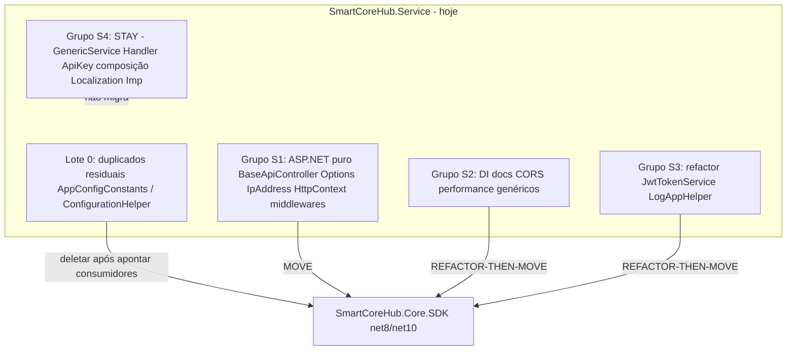
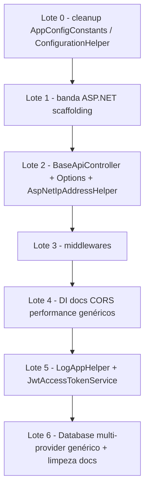

# SmartCoreHub.Core.SDK — Extração de genéricos de `SmartCoreHub.Service`

**Versão:** 1.1  
**Data:** 2026-07-16  
**Status:** Concluído — lotes 0–6 implementados (banda ASP.NET net8/net10; hosts usam extensions do SDK direto + `SmartCoreHubDocumentationOptions` de marca; GenericService permanece no host)  
**Escopo exclusivo:** `backend/Implementations/SmartCoreHub.Service` → tipos genéricos/reutilizáveis para `SmartCoreHub.Core.SDK`

**Documentos base (histórico já concluído):**
- [SmartCoreHub.Core.SDK-Especificacao.md](./SmartCoreHub.Core.SDK-Especificacao.md)
- [SmartCoreHub.Core.SDK-MigracaoGenericos.md](./SmartCoreHub.Core.SDK-MigracaoGenericos.md) (genéricos pesados: EF/Dapper/cache/Azure)
- [SmartCoreHub.Core.SDK-Extracao-Pendencias.md](./SmartCoreHub.Core.SDK-Extracao-Pendencias.md) (lotes 1–6 concluídos; **Grupo F** = banda ASP.NET — origem deste plano)
- [SmartCoreHub.Core.SDK-Remocao-Shims.md](./SmartCoreHub.Core.SDK-Remocao-Shims.md)
- README do pacote: [`backend/Core/SmartCoreHub.Core.SDK/README.md`](../../../../backend/Core/SmartCoreHub.Core.SDK/README.md)

---

## 1. Objetivo

As iniciativas anteriores centralizaram no `SmartCoreHub.Core.SDK` os genéricos de Domain/Infrastructure e vários tipos leves de Service (`TokenHelper`, `IpAddressHelper` sem HttpContext, `UserContextServiceBase`, `IGenericService`, `CacheService`, `ApiKeyAuthenticationSettings`, etc.).

Este documento cobre **apenas** o que ainda permanece em `SmartCoreHub.Service` e é **genérico o bastante** para reuso por outras APIs/SDKs — com foco explícito nos itens abaixo:

| Item citado | Situação pós-implementação (2026-07-16) |
| ----------- | --------------------------- |
| `ApiKeyAuthenticationOptions` | **Movido** para `Core.SDK.Service.API.Authentication` |
| Extensions `SmartCoreHub.Service.API.DI` | Núcleo genérico no SDK; Service só guarda branding (`SmartCoreHubDocumentationOptions`) e composição de host |
| `BaseApiController` | **Movido** para `Core.SDK.Service.API.Generic` |
| `LogAppHelper` | **Movido** para `Core.SDK.Service.API.Helpers` (`IAppLogger` + overload Serilog) |
| `IpAddressHelper` (HttpContext) | **Movido** para `AspNetIpAddressHelper` no SDK |
| `JwtTokenService` / `IJwtTokenService` | Wrapper `User` no Service; `IJwtAccessTokenService` claims-based no SDK |
| `GenericService<TEntity>` | **Permanece** em Service (FluentValidation) — contrato `IGenericService` já no SDK |

> **Fora de escopo:** Domain, Infrastructure, Localization.SDK, entidades de produto, validators FluentValidation, `SmartCoreHubDbContext`, repositórios de domínio.

---

## 2. Decisões de escopo (especificação)

| # | Tema | Decisão |
| - | ---- | ------- |
| 1 | **Banda ASP.NET no Core.SDK** | **Aprovada neste plano** (eleva o antigo Grupo F de Extracao-Pendencias). Tipos genéricos com `Microsoft.AspNetCore.*` entram no NuGet único, **somente** em TFMs `net8.0`/`net10.0` (`Compile Remove` + `FrameworkReference`/`PackageReference` condicionais). |
| 2 | **FluentValidation** | **Não entra** no Core.SDK (reconfirmado). Consequência: implementação `GenericService<T>` **fica** em Service. |
| 3 | **Um NuGet** | Sem pacote satélite `.AspNetCore`. Mesmo padrão de EF/Dapper/Redis. |
| 4 | **Parametrização de marca** | Antes de mover Swagger/OpenAPI/CORS/Scalar/ReDoc/RapiDoc: extrair títulos, contact, nomes de política CORS para opções (`OpenApiDocumentationOptions`, `CorsPolicyOptions`, etc.). Zero string hardcoded “SmartCoreHub” no SDK. |
| 5 | **Serilog** | Preferir `IAppLogger` no SDK. Onde `LogContext`/`ILogger` Serilog for inevitável (ex.: CorrelationId), dep Serilog **condicional** net8/net10 — mesmo padrão de `SerilogAdapter`. |
| 6 | **Sem shims Obsolete** | Substituição direta: migrar consumidores → deletar original. Monorepo é o único consumidor. |
| 7 | **Identificador `long`** | Inalterado. Esta iniciativa **não** toca entidades EF → gate EF **não** é obrigatório (exceto se algum lote futuro tocar model). |
| 8 | **`GenericService`** | **STAY definitivo** nesta iniciativa. Avaliar base agnóstica só se FluentValidation for substituído por Guard/strategy (fora deste plano). |

### Visão geral



---

## 3. O que JÁ está no Core.SDK (não reextrair)

| Tipo | Caminho no Core.SDK | Relação com Service |
| ---- | ------------------- | ------------------- |
| `IpAddressHelper` (Normalize / IsTrusted / IsAllowed / CIDR) | `Service/Common/IpAddressHelper.cs` | Service ainda tem overload HttpContext |
| `ApiKeyAuthenticationSettings` | `Service/Authentication/ApiKeyAuthenticationSettings.cs` | Shape = Options ASP.NET, sem herança |
| `TokenHelper` | `Service/Services/ApiKey/TokenHelper.cs` | Crypto; `ApiKeyTokenHelper` Service só mapeia DTO |
| `ApiKeyCacheKeys` + DTOs de token | `Service/Services/ApiKey/` + `Domain/DTOs/Security/` | Já canônicos |
| `IGenericService<T>` | `Domain/Interfaces/Services/Generic/` | Impl fica em Service |
| `UserContextServiceBase` | `Service/Services/Generic/` | Já migrado |
| `UserContext` / `UserClaimsHelper` | `Domain/Security/` | Usados por `BaseApiController` |
| `JwtTokenAdapter` + `SecurityTokenAdapterFactory` | `Infrastructure/Security/` | `JwtTokenService` só monta claims |
| `CacheService` / `AddSdkCaching` | `Service/Caching/` + DI Infrastructure | Pasta `Caching/` removida de Service |
| `SerilogAdapter` | `Infrastructure/Logging/` | Host só registra |
| `ValidationErrorMapperHelper` | `Service/Validation/` | Host: ponte FluentValidation |
| `AppConfigConstants` / `ConfigurationHelper` | `Service/Configuration/` | **Duplicados residuais ainda em Service** (`AuthenticationExtensions`) |
| `HttpHeaderNamesHelper` | `Service/API/Headers/` | Middleware de cultura |
| `SharedDependeciesCollection` | `Service/DependenciesCollection/` | Já no SDK |
| `ServiceResponse<T>` (envelope unificado) | `Domain/DTOs/Common/` | Já no SDK; `ServiceResult*` removido |

---

## 4. Levantamento — candidatos (MOVE / SPLIT / REFACTOR)

### 4.1 Prioridade explícita (itens solicitados)

#### A) `ApiKeyAuthenticationOptions`

| Campo | Valor |
| ----- | ----- |
| **Arquivo** | `Service/API/Authentication/ApiKeyAuthenticationOptions.cs` |
| **Tipo** | `ApiKeyAuthenticationOptions : AuthenticationSchemeOptions` |
| **Deps** | `Microsoft.AspNetCore.Authentication` |
| **Classificação** | **MOVE** |
| **Justificativa** | Três propriedades (`HeaderName`, `TrustedProxies`, `ValidateIpAddress`) — idênticas a `ApiKeyAuthenticationSettings`. Genérico para qualquer host ASP.NET com API key. |
| **Destino** | `Core.SDK/Service/API/Authentication/ApiKeyAuthenticationOptions.cs` |
| **Ação** | Mover Options; manter `ApiKeyAuthenticationSettings` como DTO sem ASP.NET (TFMs leves). Opcional: factory/mapper Settings ↔ Options. |
| **Bloqueio** | Banda ASP.NET (§2.1). Handler (`ApiKeyAuthenticationHandler`) **fica** em Service (feature: `ITokenValidationService`, métricas, Application). |

#### B) Extensions `SmartCoreHub.Service.API.DI`

| Arquivo | Classificação | Destino / nota |
| ------- | ------------- | -------------- |
| `CorsExtensions.cs` | **REFACTOR-THEN-MOVE** | Parametrizar policy name (`AllowAngularApp`) e regras Private/Dev |
| `SwaggerExtensions.cs` | **REFACTOR-THEN-MOVE** | `OpenApiDocumentationOptions` (Title, Description, Contact) |
| `OpenApiExtensions.cs` | **REFACTOR-THEN-MOVE** | Idem títulos/rotas |
| `ScalarExtensions.cs` | **REFACTOR-THEN-MOVE** | Dep Scalar condicional |
| `RedocExtensions.cs` | **REFACTOR-THEN-MOVE** | Dep ReDoc condicional |
| `RapiDocExtensions.cs` | **REFACTOR-THEN-MOVE** | Dep RapiDoc condicional |
| `ApiPerformanceExtensions.cs` | **SPLIT** | MOVE: compressão, Kestrel, ThreadPool, JSON, rate limit base. STAY/injetável: `ExtractTokenPrefix` (formato `_` de 4 partes = ApiKey produto); `ApplyMySqlPoolingDefaults` já delega a helper SDK |
| `ServiceCollectionLogExtensions.cs` | **STAY** (wiring) | Só registra `SerilogAdapter` + `AddSdkCaching` — composição do host |
| `DatabaseExtensions.cs` | **SPLIT** | Extrair `AddMultiProviderDbContext<TContext>(…)` genérico; host fecha `TContext = SmartCoreHubDbContext` + migrations assembly |
| `AuthenticationExtensions.cs` | **SPLIT** | Ver §4.2 (duplicados) + STAY do `AddJwtAuthentication` completo |
| `ServiceCollectionExtensions.cs` | **STAY** | Scan Domain/Infrastructure; services de produto |
| `ServiceCollectionExtensionsComplex.cs` | **STAY** | Factories User/Tenant/Application + FluentValidation |
| `LocalizationServiceCollectionExtensions.cs` | **STAY** | Feature Localization |
| `AutoMapperServiceCollectionExtensions.cs` | **STAY** | Carrega `AutoMapperProfile` Domain; adapter já é SDK |
| `WebApplicationBuilderServicesConfigure.cs` | **STAY** | Orquestração do produto |
| `WebApplicationExtensions.cs` | **STAY** | Pipeline + migrate + routines de feature |

#### C) `BaseApiController`

| Campo | Valor |
| ----- | ----- |
| **Arquivo** | `Service/API/Generic/BaseApiController.cs` |
| **Deps** | ASP.NET (`ControllerBase`, `[Authorize]`); `UserClaimsHelper` / `UserContext` / `IUserContext` / `IAppLogger` (todos SDK) |
| **Classificação** | **MOVE** |
| **Justificativa** | Zero referência a Domain/entidades. Helpers de claims, IP remoto, roles, `ErrorResponse`, `LogError` — reutilizável por qualquer API do monorepo (e futuras). |
| **Destino** | `Core.SDK/Service/API/Generic/BaseApiController.cs` |
| **Consumidores** | Controllers em `SmartCoreHub.API`, `SmartCoreHub.Localization.API`, MCP, testes |

#### D) `LogAppHelper` + `AppInformationVersionProductDto`

| Campo | Valor |
| ----- | ----- |
| **Arquivo** | `Service/API/Helpers/LogAppHelper.cs` |
| **Deps** | `Serilog.ILogger` (concreto), Reflection, `ASPNETCORE_ENVIRONMENT` |
| **Classificação** | **REFACTOR-THEN-MOVE** |
| **Justificativa** | Banner de versão de produto no startup — genérico. |
| **Destino** | `Core.SDK/Service/API/Helpers/` (ou `Infrastructure/Logging/`) |
| **Refactor** | Preferir overload `IAppLogger`; overload Serilog opcional na banda net8/net10. |

#### E) `IpAddressHelper` (parte HttpContext)

| Campo | Valor |
| ----- | ----- |
| **Arquivo** | `Service/Common/IpAddressHelper.cs` |
| **Métodos** | `ResolveClientIp(HttpContext?, …)`, `ResolveAuditIp(…, HttpContext?)` |
| **Deps** | `Microsoft.AspNetCore.Http`; delega Normalize/IsTrusted ao SDK |
| **Classificação** | **MOVE** (completar split) |
| **Destino** | Estender `Core.SDK.Service.Common.IpAddressHelper` **ou** tipo irmão `AspNetIpAddressHelper` na pasta ASP.NET do SDK (evitar misturar TFMs leves) |
| **Nota** | Preferir tipo separado `AspNetIpAddressHelper` se Compile Remove for mais limpo. |

#### F) `JwtTokenService` / `IJwtTokenService`

| Campo | Valor |
| ----- | ----- |
| **Arquivo** | `Service/Security/JwtTokenService.cs` |
| **Deps** | `ISecurityTokenAdapterFactory` (SDK) + entidade **`User`** (Domain) + `Email` VO |
| **Classificação** | **REFACTOR-THEN-MOVE** (parcial) |
| **Justificativa** | Lógica real de JWT já está no adapter SDK. Este serviço só monta claims a partir de `User`. |
| **Proposta** | SDK ganha `IJwtAccessTokenService` / `JwtAccessTokenService` com `GenerateAccessToken(IEnumerable<Claim>)`, `GenerateRefreshToken()`, `TryGetUserId(string, out long?)`. Host mantém thin wrapper `JwtTokenService : IJwtTokenService` que mapeia `User` → claims. |
| **Bloqueio** | Remover acoplamento a `User` antes do MOVE da parte genérica. |

#### G) `GenericService<TEntity>`

| Campo | Valor |
| ----- | ----- |
| **Arquivo** | `Service/Services/Generic/GenericService.cs` |
| **Deps** | `IGenericRepository`, `IAppLogger`, mapper (SDK) + **FluentValidation** (`Generic*ValidationDtoValidator` no Domain) |
| **Classificação** | **STAY** (definitivo neste plano) |
| **Justificativa** | Decisão §2.2 / §2.8 e Extracao-Pendencias §2.5. Contrato `IGenericService` já está no SDK. |
| **Futuro (fora deste plano)** | Base agnóstica com `IValidationStrategy` / Guard — só se FluentValidation sair do caminho crítico. |

---

### 4.2 Cleanup residual (sem banda ASP.NET nova) — Lote 0

| Item em Service | Equivalente SDK | Ação |
| --------------- | --------------- | ---- |
| `AppConfigConstants` em `AuthenticationExtensions.cs` | `Core.SDK.Service.Configuration.AppConfigConstants` | Migrar usings; deletar duplicata (cuidado: typo `ApplicationContentJon` vs `ApplicationContentJson` — unificar no SDK e atualizar consumidores) |
| `#region GENERIC` `GetSectionApp` / `GetConnectionStringApp` / `GetValueStringConfiguration` | `ConfigurationHelper` no SDK | Apontar consumidores; deletar região |

Risco baixo; pode ser PR isolado antes da banda ASP.NET.

---

### 4.3 Middlewares ASP.NET (complemento natural de S1)

| Arquivo | Classificação | Nota |
| ------- | ------------- | ---- |
| `CorrelationIdMiddleware.cs` | **REFACTOR-THEN-MOVE** | `Serilog.Context.LogContext` — abstrair ou dep Serilog condicional |
| `SecurityHeadersMiddleware.cs` | **MOVE** | Headers padrão; zero Domain |
| `RequestLoggingMiddleware.cs` | **MOVE** | Genérico |
| `RequestSizeLimitMiddleware.cs` | **MOVE** | Genérico (413) |
| `LocalizationHeaderCultureMiddleware.cs` | **MOVE** | Só `Accept-Language` + `HttpHeaderNamesHelper` SDK — nome “Localization” ≠ feature i18n DB |

---

### 4.4 O que permanece em Service (STAY)

| Item | Justificativa |
| ---- | ------------- |
| `GenericService<TEntity>` | FluentValidation (§2.8) |
| `ApiKeyAuthenticationHandler` | Feature: validação ApplicationToken, métricas diárias, claims de produto |
| `ApiKeyTokenService` / `TokenValidationService` / `ApiKeyTokenHelper` (mapeamento) | Entidades/repos Domain |
| `JwtTokenService` (wrapper `User` → claims) após refactor | Thin adapter de domínio no host |
| `AuditService` / `LocalizationAuditService` | Engine + entidades de feature |
| `Services/Imp/*`, `Services/Cloud/*`, `Metrics/*` | Produto |
| `Localization/**` (parsers, export, façades) | Feature / futuro pacote i18n formats |
| DI de composição (`AddCustomServices`, Localization, Complex, WebApplication*) | Orquestração do host |
| `FluentValidationErrorMappingHelper` / `GetErrorLocalizationService` | Ponte FluentValidation + Localization |
| `CloudConfigurationResolver` | Resolve config por Application Domain |

---

## 5. Destinos sugeridos no Core.SDK (layout)

```text
backend/Core/SmartCoreHub.Core.SDK/
├── Service/
│   ├── API/
│   │   ├── Authentication/     # ApiKeyAuthenticationOptions (+ Settings já existe)
│   │   ├── Generic/            # BaseApiController
│   │   ├── Helpers/            # LogAppHelper (+ DTO)
│   │   ├── Middleware/         # CorrelationId*, SecurityHeaders, RequestLogging, RequestSizeLimit, CultureHeader
│   │   ├── DI/                 # Cors, Swagger, OpenApi, Scalar, Redoc, RapiDoc, ApiPerformance (núcleo), MultiProviderDbContext
│   │   └── Headers/            # (já existe HttpHeaderNamesHelper)
│   ├── Common/                 # IpAddressHelper (leve) + AspNetIpAddressHelper (net8/net10)
│   ├── Configuration/          # (já existe — cleanup de dups)
│   ├── Security/               # JwtAccessTokenService (claims-based)
│   └── Services/...
```

**Empacotamento:** pastas ASP.NET com `Compile Remove` fora de `net8.0`/`net10.0`. TFMs `netstandard`/`net6` continuam sem FrameworkReference ASP.NET.

---

## 6. Plano de implementação (lotes)

> **Este documento não executa os lotes.** Cada lote = PR pequeno; build Release verde ao fim.



### Lote 0 — Cleanup residual (sem ASP.NET novo)

- [x] Unificar `AppConfigConstants` (resolver typo Jon/Json); consumidores → SDK; deletar cópia em Service.
- [x] Substituir `#region GENERIC` por `ConfigurationHelper` do SDK; deletar métodos duplicados.
- [x] **Aceite:** `rg` sem `SmartCoreHub.Service.API.DI.AppConfigConstants`; build + testes verdes.

### Lote 1 — Scaffolding banda ASP.NET no Core.SDK

- [x] `FrameworkReference` / PackageReferences condicionais (net8/net10): ASP.NET Core Auth/Http/Mvc.Core conforme necessidade.
- [x] Pastas `Service/API/**` com `Compile Remove` fora de net8/net10.
- [x] Pack multi-TFM + smoke NuGet/console.
- [x] **Aceite:** TFMs leves inalterados; net8/net10 compilam tipos ASP.NET.

### Lote 2 — Controllers / Options / IP HttpContext

- [x] Mover `BaseApiController`; atualizar APIs + testes.
- [x] Mover `ApiKeyAuthenticationOptions`; Handler Service referencia Options do SDK.
- [x] Mover `ResolveClientIp` / `ResolveAuditIp` → `AspNetIpAddressHelper` (ou extensão); deletar arquivo Service.
- [x] Replicar testes em `Core.SDK.Tests`.
- [x] **Aceite:** greps sem namespaces antigos; handlers/API key intactos funcionalmente.

### Lote 3 — Middlewares

- [x] Mover os 5 middlewares (§4.3); parametrizar CorrelationId se necessário.
- [x] Host (`WebApplicationExtensions`) registra middlewares do SDK.
- [x] **Aceite:** pipeline das APIs idêntico; testes de middleware verdes.

### Lote 4 — DI genérico (docs / CORS / performance)

- [x] Extrair options (`OpenApiDocumentationOptions`, `CorsHostingOptions`, `ApiPerformanceOptions`).
- [x] Mover Cors, Swagger, OpenApi, Scalar, Redoc, RapiDoc (deps condicionais).
- [x] Split `ApiPerformanceExtensions`: núcleo no SDK; partição de rate limit / token prefix injetável pelo host.
- [x] Host passa options com marca SmartCoreHub.
- [x] **Aceite:** `/swagger`, Scalar/ReDoc/RapiDoc, CORS e rate limit com comportamento observável idêntico.

### Lote 5 — LogAppHelper + JWT claims

- [x] Refactor `LogAppHelper` → `IAppLogger` (+ overload Serilog opcional); mover.
- [x] Criar `JwtAccessTokenService` (claims) no SDK; `JwtTokenService` Service vira wrapper `User` → claims.
- [x] Testes: `JwtTokenServiceTests` + novos no Core.SDK.Tests.
- [x] **Aceite:** login/refresh/validate inalterados; banners de versão no startup OK.

### Lote 6 — Database genérico + fechamento

- [x] Extrair `AddConfiguredDbContext<TContext>` (provider-neutral) para o SDK; `AddDatabase` Service fecha `SmartCoreHubDbContext`.
- [x] Greps de aceite (§7.2); atualizar README do Core.SDK e banner nos docs FEITOS.
- [x] Validação completa (§7.1).
- [x] Status deste documento → Concluído.

**Notas de execução:**
- `RequestSizeLimitMiddleware` permanece disponível no SDK, mas **não** foi adicionado ao pipeline (comportamento pré-existente preservado).
- `LocalizationHeaderCultureMiddleware` agora delega parse/cultura a `AcceptLanguageHelper`.
- `Microsoft.AspNetCore.OpenApi` permanece só em net10; net8 usa Swagger UI sobre o documento Swashbuckle.

---

## 7. Portões de qualidade

### 7.1 Por lote

- [ ] `dotnet build SmartCoreHub.sln -c Release -m:1` — 0 erros
- [ ] `dotnet test SmartCoreHub.sln -c Release --no-build -m:1` — 0 falhas; contagem ≥ baseline
- [ ] `Core.SDK.Tests` Coverlet linhas ≥ 90% nos módulos tocados
- [ ] Console + smoke NuGet verdes
- [ ] APIs locais `/health` 200; startup sem erro de DI
- [ ] `docker compose build` + health (quando aplicável)
- [ ] Zero regressão: contratos HTTP, claims JWT, header API key, CORS, docs OpenAPI

### 7.2 Greps de aceite (Lote 6)

```powershell
cd C:\git\repos\SmartCoreHub\backend

# Tipos movidos nao devem existir mais em Service (ajuste namespaces apos implementacao)
rg "namespace SmartCoreHub.Service.API.Generic" -g "BaseApiController.cs"
rg "class ApiKeyAuthenticationOptions" Implementations/SmartCoreHub.Service -g "*.cs"
rg "class LogAppHelper" Implementations/SmartCoreHub.Service -g "*.cs"
rg "ResolveClientIp|ResolveAuditIp" Implementations/SmartCoreHub.Service -g "*.cs"

# Duplicados Lote 0
rg "class AppConfigConstants" Implementations/SmartCoreHub.Service -g "*.cs"
rg "GetSectionApp|GetConnectionStringApp|GetValueStringConfiguration" Implementations/SmartCoreHub.Service -g "*.cs"

# GenericService permanece (esperado)
rg "abstract class GenericService" Implementations/SmartCoreHub.Service -g "*.cs"
```

---

## 8. Riscos e mitigações

| Risco | Mitigação |
| ----- | --------- |
| NuGet Core.SDK puxar ASP.NET em consumidores netstandard | `Compile Remove` + refs só net8/net10 |
| Títulos Swagger/CORS “SmartCoreHub” vazarem no SDK | Options obrigatórias no Lote 4; host injeta marca |
| CorrelationId acoplado a Serilog | Dep condicional ou abstração; preferir não forçar Serilog em todos os hosts |
| `JwtTokenService` quebrar auth ao refactorar claims | Wrapper thin no Service; testes de AuthenticationService existentes |
| Rate limit mudar partição (token prefix) | Manter callback injetável no host; defaults documentados |
| Controllers quebrarem após MOVE de `BaseApiController` | Swap mecânico de namespace; build TreatWarningsAsErrors |

---

## 9. Critério final de conclusão

| # | Critério |
| - | -------- |
| 1 | Lote 0: zero duplicação `AppConfigConstants` / getters de config em Service |
| 2 | `BaseApiController`, `ApiKeyAuthenticationOptions`, AspNet IP helpers, middlewares genéricos e DI docs/CORS/perf (núcleo) com fonte única no Core.SDK |
| 3 | `LogAppHelper` no SDK (via `IAppLogger`); JWT claims-based no SDK; wrapper `User` no Service |
| 4 | `GenericService` permanece em Service; `IGenericService` continua no SDK |
| 5 | Handler ApiKey, Token services, Localization, Imp, DI de composição permanecem em Service |
| 6 | TFMs leves do Core.SDK sem ASP.NET; pack multi-TFM OK |
| 7 | Build/testes/cobertura/APIs/Docker verdes; README atualizado |

---

## 10. Relação com Extracao-Pendencias (Grupo F)

O **Grupo F** de [Extracao-Pendencias.md](./SmartCoreHub.Core.SDK-Extracao-Pendencias.md) §7 listava estes itens como “fase futura/opcional”. Este documento **substitui aquele registro** como plano executável focado em Service:

| Grupo F (antigo) | Aqui |
| ---------------- | ---- |
| `BaseApiController`, middlewares, DI docs/CORS/perf, `IpAddressHelper` HttpContext, `ApiKeyAuthenticationOptions`, `LogAppHelper` | Lotes 1–5 |
| `JwtTokenService` (padrões flagados) | Lote 5 (refactor claims) |
| `GenericService` | Explicitamente **fora** (STAY) |
| Pacote i18n formats / Cloud alto nível / Audit engine | Continua fora — outras iniciativas |

---

## 11. Resumo executivo

1. **Mover** (banda ASP.NET net8/net10): `BaseApiController`, `ApiKeyAuthenticationOptions`, IP HttpContext, middlewares genéricos, núcleo de DI docs/CORS/performance, `AddMultiProviderDbContext<T>`.
2. **Refactor depois mover:** `LogAppHelper` (IAppLogger), `JwtTokenService` (claims no SDK + wrapper `User` no host), DI com options de marca.
3. **Cleanup imediato (Lote 0):** duplicatas `AppConfigConstants` / `ConfigurationHelper`.
4. **Não mover:** `GenericService`, `ApiKeyAuthenticationHandler`, Token/ApiKey de feature, Localization, Imp, composição DI do host.
5. **Não implementar neste passo** — apenas este plano; execução por lotes em PRs subsequentes.
`)
