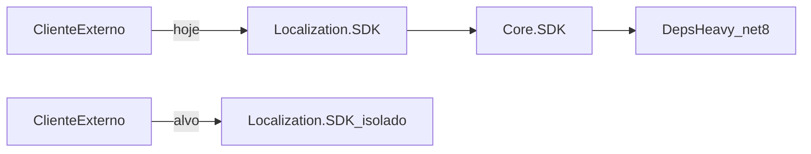

# SmartCoreHub.Localization.SDK — Isolamento sem SmartCoreHub.Core.SDK

**Versão:** 1.1  
**Data:** 2026-07-13  
**Status:** Implementado — fases A–D executadas; Localization.SDK sem referência a Core.SDK  
**Estratégia travada:** vendor/copy do subset leve para dentro do Localization.SDK (pacote **auto-isolado**, zero dependência NuGet de Core.SDK)

**Documentos relacionados:**
- [README do Localization.SDK](../../../../backend/SDKs/SmartCoreHub.Localization.SDK/README.md) (auto-isolado — sem Core)
- [README NuGet do Core.SDK](../../../../backend/Core/SmartCoreHub.Core.SDK/README.md)
- [Remoção de shims (Lote 7)](../SmartCoreHub.Core.SDK/SmartCoreHub.Core.SDK-Remocao-Shims.md) — origem do acoplamento histórico
- [README do Core.SDK](../../../../backend/Core/SmartCoreHub.Core.SDK/README.md) (tipos antes em `Others/` agora em Domain/Infrastructure/Service)

---

## 0. Objetivo e critério de aceite

Tornar o pacote **`SmartCoreHub.Localization.SDK`** independente de **`SmartCoreHub.Core.SDK`**, para que clientes externos consumam **um único** packageId de produto (além das dependências Microsoft.Extensions já declaradas pelo Localization).

### Critérios de aceite (não negociáveis)

| # | Critério |
|---|----------|
| 1 | [`SmartCoreHub.Localization.SDK.csproj`](../../../../backend/SDKs/SmartCoreHub.Localization.SDK/SmartCoreHub.Localization.SDK.csproj) **sem** `ProjectReference` e **sem** `PackageReference` a `SmartCoreHub.Core.SDK` |
| 2 | `dotnet pack` do Localization: metadados NuGet / `.nuspec` **sem** dependência `SmartCoreHub.Core.SDK` em qualquer TFM |
| 3 | Cliente: `dotnet add package SmartCoreHub.Localization.SDK` não puxa Core.SDK nem o grafo heavy (EF/Dapper/Redis/Mongo/Cosmos/Azure) |
| 4 | Código-fonte e superfície pública do Localization **não** exportam nem referenciam tipos `SmartCoreHub.Core.SDK.*` |
| 5 | Build Release + testes `SmartCoreHub.Localization.SDK.Tests` verdes; smoke `ConsoleTest` / `ConsoleTest.Nuget` OK |

### Fora de escopo

- Criar pacote `SmartCoreHub.Core.SDK.Light` (ainda seria **dois** pacotes para o cliente Localization).
- ILRepack / ILMerge.
- Alterar o Core.SDK usado pelo monólito (`Domain` / `Infrastructure` / `Service` / APIs).
- Residual Export (`ExportFileType` / `FileType`).

---

## 1. Levantamento — estado atual (2026-07)

### 1.1 Como o acoplamento surgiu

No **Lote 7** da remoção de shims ([Remocao-Shims](../SmartCoreHub.Core.SDK/SmartCoreHub.Core.SDK-Remocao-Shims.md)), o Localization.SDK deixou de ter tipos locais (`IApiErrorMapper`, `IAuthHeaderProvider`, `ICacheProvider`, `MemoryCacheProvider`) e passou a consumir os equivalentes canônicos do Core. Isso unificou fonte no monorepo, mas **publicou** Core.SDK como dependência transitiva do pacote Localization.

### 1.2 Referência de projeto

```xml
<!-- backend/SDKs/SmartCoreHub.Localization.SDK/SmartCoreHub.Localization.SDK.csproj -->
<ProjectReference Include="..\..\Core\SmartCoreHub.Core.SDK\SmartCoreHub.Core.SDK.csproj" />
```

- Sem `PrivateAssets` / sem filtro light.
- Em **net8.0 / net10.0**, o restore resolve o TFM **heavy** do Core → grafo transitivo (Redis, Cosmos, Azure, etc.) mesmo sem uso no Localization.

### 1.3 TFMs

| Projeto | TargetFrameworks |
|---------|------------------|
| Localization.SDK | `netstandard2.0;netstandard2.1;net6.0;net8.0;net10.0` |
| Core.SDK | mesmos TFMs (ordem design-time: net8 primeiro) |

O Localization só precisa da superfície **light** (`Others.*`). O problema não é a API usada — é o **empacotamento / ProjectReference multi-TFM**.

### 1.4 Arquivos Localization que referenciam Core

| Arquivo | Papel |
|---------|--------|
| `Authentication/ApiKeyAuthHeaderProvider.cs` | Wrapper; usa Core `ApiKeyAuthHeaderProvider`, `ApiKeyAuthOptions`, `Headers`, `UnauthorizedException`, `IAuthHeaderProvider` |
| `Clients/LocalizationApiClient.cs` | Aliases `Sdk*` para auth/error/cache |
| `Configuration/LocalizationSdkOptions.cs` | `CacheOptions.Provider` tipado como Core `ILightweightCacheProvider` |
| `Extensions/ServiceCollectionExtensionsSDK.cs` | DI registra interfaces/providers Core |
| `Http/LocalizationApiErrorMapper.cs` | Implementa Core `IApiErrorMapper` |
| `Http/LocalizationRequestExecutor.cs` | `Headers`, auth, error mapper |
| `Http/LocalizationSdkHttpHeaderMapperHelper.cs` | `Headers.AcceptLanguage` |

**Testes:**

| Arquivo | Uso |
|---------|-----|
| `Helpers/FakeCacheProvider.cs` | implementa `ILightweightCacheProvider` (Core) |
| `Helpers/FixedAuthHeaderProvider.cs` | implementa `IAuthHeaderProvider` (Core) |
| `Extensions/ServiceCollectionExtensionsTests.cs` | resolve provider Core do DI |

ConsoleTest / ConsoleTest.Nuget: **não** referenciam Core diretamente (só Localization).

### 1.5 Inventário tipo a tipo (origem → destino proposto)

| # | Tipo atual (Core.SDK) | Namespace Core | Destino proposto (Localization.SDK) | Notas |
|---|----------------------|----------------|-------------------------------------|-------|
| 1 | `IAuthHeaderProvider` | `Others.Service.Http.Abstractions` | `SmartCoreHub.Localization.SDK.Abstractions.IAuthHeaderProvider` | Assinatura: `ValueTask ApplyAsync(HttpRequestMessage, CancellationToken)` |
| 2 | `IApiErrorMapper` | `Others.Service.Http.Abstractions` | `…Abstractions.IApiErrorMapper` | `Exception Map(HttpStatusCode, string?)` |
| 3 | `ApiKeyAuthOptions` | `Others.Service.Http.Authentication` | Fundir em `Authentication/` ou `Http/Authentication/` local | Propriedades ApiKey / HeaderName |
| 4 | `ApiKeyAuthHeaderProvider` (Core) | idem | **Absorver** no `Authentication.ApiKeyAuthHeaderProvider` Localization (hoje é wrapper fino) | Evitar dual-type; throw → `LocalizationAuthenticationException` direto |
| 5 | `Headers` | `Others.Service.API.Headers` | `SmartCoreHub.Localization.SDK.Http.Headers` (ou `…API.Headers`) | No mínimo `AuthToken`, `AcceptLanguage` (demais constantes opcionais) |
| 6 | `UnauthorizedException` | `Others.Exceptions` | **Eliminar** no Localization: mapear falta de ApiKey direto para `LocalizationAuthenticationException` | Evita trazer `SmartCoreHubSdkException` |
| 7 | `ILightweightCacheProvider` | `Others.Infrastructure.Caching` | `SmartCoreHub.Localization.SDK.Caching.ILightweightCacheProvider` | Mesma API Get/Set/Delete/Clear |
| 8 | `LightweightMemoryCacheProvider` | `…Caching.Providers` | `…Caching.LightweightMemoryCacheProvider` (ou `MemoryCacheProvider`) | Depende de `Microsoft.Extensions.Caching.Memory` (já no csproj Localization) |

Tipos Core **não** usados pelo Localization (Domain, EF, Dapper, Redis, Mongo, Cosmos, Azure, Result/Guard completo, etc.) **não** entram no vendor.

### 1.6 Dor NuGet (resumo)



---

## 2. Decisão de arquitetura

| Tema | Decisão |
|------|--------|
| Estratégia | **Vendor/copy** do subset #1–#8 (adaptado) **dentro** do Localization.SDK |
| Namespaces | `SmartCoreHub.Localization.SDK.*` — nunca `SmartCoreHub.Core.SDK.*` |
| Core.SDK no monorepo | Continua canônico para host/APIs/outros consumidores |
| Shims Obsolete | **Não** recriar cascas Obsolete apontando para Core; tipos Localization são de primeira classe |
| Pacote Light | **Rejeitado** (dois packageIds para o cliente) |
| ILRepack | **Rejeitado** (multi-TFM frágil) |

---

## 3. Plano de implementação

### Fase A — Vendor do subset (fonte única no Localization)

**Objetivo:** código Localization compila contra tipos **próprios**.

Checklist de arquivos a criar/adaptar:

- [x] `Abstractions/IAuthHeaderProvider.cs`
- [x] `Abstractions/IApiErrorMapper.cs`
- [x] `Caching/ILightweightCacheProvider.cs`
- [x] `Caching/LightweightMemoryCacheProvider.cs` (copiar lógica Core; namespace Localization)
- [x] `Http/Headers.cs` (constantes usadas)
- [x] Refatorar `Authentication/ApiKeyAuthHeaderProvider.cs`: implementação **direta** (sem `_inner` Core); em ApiKey ausente → `LocalizationAuthenticationException`
- [x] Remover necessidade de `UnauthorizedException` / `SmartCoreHubSdkException` / `ApiKeyAuthOptions` Core (options locais se ainda úteis)

Sugestão de layout final:

```text
SmartCoreHub.Localization.SDK/
├── Abstractions/          # ILocalization* + IAuthHeaderProvider + IApiErrorMapper
├── Authentication/   # ApiKeyAuthHeaderProvider (+ options locais se preciso)
├── Caching/          # ILightweightCacheProvider + LightweightMemoryCacheProvider
├── Http/             # Headers, LocalizationRequestExecutor, mappers…
├── Clients/
├── Configuration/
└── Extensions/
```

Remover todos os `using SdkX = SmartCoreHub.Core.SDK…`.

### Fase B — Remover acoplamento de build/pack

- [x] Remover `ProjectReference` a Core.SDK do `.csproj`
- [x] Atualizar produção + testes (usings / `implements`)
- [x] `rg "SmartCoreHub\.Core\.SDK" -g "*.cs" backend/SDKs/SmartCoreHub.Localization.SDK*` → **0** hits
- [x] Confirmar Tests / ConsoleTest ainda restauram sem Core

### Fase C — Breaking change e documentação

**Breaking (major do contrato público Localization):**

| Antes (pós Lote 7) | Depois (isolamento) |
|--------------------|---------------------|
| Tipos públicos / DI tipados em `SmartCoreHub.Core.SDK.*` | Tipos em `SmartCoreHub.Localization.SDK.Abstractions` / `.Caching` |
| Dependência NuGet transitiva Core.SDK | Removida |

Atualizar:

- [x] [`backend/SDKs/SmartCoreHub.Localization.SDK/README.md`](../../../../backend/SDKs/SmartCoreHub.Localization.SDK/README.md) — remover “Dependência Core”; exemplos com usings Localization; nova tabela breaking
- [x] Nota em [Remocao-Shims § Lote 7](../SmartCoreHub.Core.SDK/SmartCoreHub.Core.SDK-Remocao-Shims.md): Lote 7 unificou no Core; **este documento** re-isola o pacote público Localization (intencional para NuGet)
- [x] Linha no [README Core.SDK](../../../../backend/Core/SmartCoreHub.Core.SDK/README.md) — Localization.SDK **não** é consumidor NuGet obrigatório do Core

### Fase D — Validação

```powershell
cd backend

rg "SmartCoreHub\.Core\.SDK" -g "*.cs" SDKs\SmartCoreHub.Localization.SDK SDKs\SmartCoreHub.Localization.SDK.Tests

dotnet build SDKs\SmartCoreHub.Localization.SDK\SmartCoreHub.Localization.SDK.csproj -c Release
dotnet test SDKs\SmartCoreHub.Localization.SDK.Tests\SmartCoreHub.Localization.SDK.Tests.csproj -c Release
dotnet pack SDKs\SmartCoreHub.Localization.SDK\SmartCoreHub.Localization.SDK.csproj -c Release -o artifacts\nuget

# Inspecionar o .nupkg (nuspec / dependencies): zero SmartCoreHub.Core.SDK
```

Smoke:

```powershell
dotnet run --project SDKs\SmartCoreHub.Localization.SDK.ConsoleTest\SmartCoreHub.Localization.SDK.ConsoleTest.csproj -c Release
# ConsoleTest.Nuget: atualizar PackageVersion se necessário e rodar com feed local
```

Aceite Fase D: 0 erros build; 0 falhas testes Localization; pack sem Core; rg vazio. **Validado 2026-07-13/14:** build Release OK; 37 testes OK; nuspec sem `SmartCoreHub.Core.SDK`; ConsoleTest requer API remota (timeout de rede ≠ regressão de isolamento).

### Fase E — Controle de drift

| Regra | Descrição |
|-------|-----------|
| Host canônico | Tipos HTTP/cache leves no **Core.SDK** continuam fonte para monólito / outros SDKs internos que **optarem** por Core |
| Pacote público Localization | Cópia owned; mudanças de comportamento só com release Notes Localization |
| PR checklist | Alterou `Others` HTTP/cache no Core? Avaliar espelho Localization (mesma API Get/Set… / headers) |
| Comentário XML sugerido | Em tipos Localization vendorados: `<!-- Isolado do Core.SDK de propósito; ver Isolamento-Core.md -->` |

---

## 4. Riscos e mitigações

| Risco | Mitigação |
|-------|-----------|
| Drift semântico Core ↔ Localization | Fase E + revisão de PR conjunta |
| Breaking para quem adotou tipos Core após Lote 7 | README tabela + major semântica do contract; período curto pós-Lote 7 |
| Wrapper auth com comportamento diferente | Unificar implementação única; testes de ApiKey ausente / header `X-Auth-Token` |
| Esquecer limpar nuspec | Script de inspeção no pack (Fase D) |
| Reintroduzir Core “só em netstandard” | Proibido — zero TFMs com referência Core |

---

## 5. Ordem de execução sugerida (PRs)

1. **PR-A:** Fase A + testes verdes com ProjectReference Core ainda presente (compila contra tipos locais; Core unused → depois remove).
2. **PR-B:** Fase B (drop ProjectReference) + Fase D.
3. **PR-C:** Fase C docs + apontadores Remocao/README.

Alternativa (PR único): A→B→C→D se o diff permanecer pequeno (~8 tipos + usings).

---

## 6. Resumo de decisão

- **Problema:** Localization.SDK depende de Core.SDK → cliente recebe 2 pacotes (+ grafo heavy em net8/10).
- **Solução:** vendor do subset leve no Localization; remover referência.
- **Core:** permanece no monorepo; **não** é dependência do pacote NuGet Localization.
- **Estado:** fases A–C feitas no código; Fase D validada na sessão de implementação (2026-07-13).

---

## Changelog deste documento

| Data | Versão | Nota |
|------|--------|------|
| 2026-07-13 | 1.1 | Implementação vendor/copy; ProjectReference removido; README atualizado |
| 2026-07-13 | 1.0 | Levantamento + plano vendor/copy; aceites e fases A–E |
