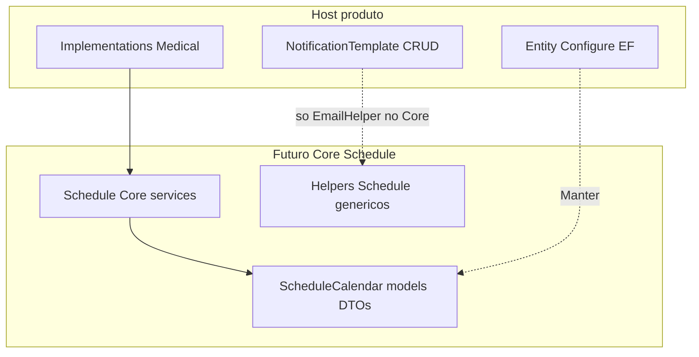

# Levantamento — Schedule Core + NotificationTemplate (fatia futura)

**Versão:** 1.0  
**Data:** 2026-08-04  
**Status:** Inventário — **não** entra nas Fases 1–7 do [PlanoDeAcao.md](./PlanoDeAcao.md) até priorização  
**Estratégia (quando priorizado):** mesma do [Levantamento.md](./Levantamento.md) v1.2 — Core canônico + host `[Obsolete]` (consulta); não apagar originais  
**Documento pai:** [Levantamento.md](./Levantamento.md) (infra genérica: repos, cache, Azure, factories)

Paths relativos à raiz `SmartDigitalPsicoAPI/`.

---

## 0. Objetivo

Documentar o que pode ir para `SmartDigitalPsico.Core.SDK` a partir de:

1. Motor genérico de agendamento em `SmartDigitalPsico.Service/Bussines/Schedule/Core/`
2. Peças reutilizáveis vs produto em torno de **NotificationTemplate** / **ScheduleCalendar**

**Fora deste Core (sempre Manter):** configs EF em `SmartDigitalPsico.Data/Context/Configure/Entity/*` (ex.: `ScheduleCalendarConfiguration`, `NotificationTemplateConfiguration`) — implementação do projeto.

---

## 1. Diagrama — Core Schedule vs host Medical

---

## 2. Schedule — motor genérico (`Bussines/Schedule/Core`)

### 2.1 Portar+Obsoletar (candidatos)

#### Services Core (7)

| Arquivo | Classe | Namespace |
| ------- | ------ | --------- |
| `Service/Bussines/Schedule/Core/Conflict/ScheduleConflictService.cs` | `ScheduleConflictService` | `…Core.Conflict` |
| `Service/Bussines/Schedule/Core/Commands/ScheduleCreateService.cs` | `ScheduleCreateService` | `…Core.Commands` |
| `Service/Bussines/Schedule/Core/Commands/ScheduleUpdateService.cs` | `ScheduleUpdateService` | `…Core.Commands` |
| `Service/Bussines/Schedule/Core/Commands/ScheduleDeleteService.cs` | `ScheduleDeleteService` | `…Core.Commands` |
| `Service/Bussines/Schedule/Core/Queries/ScheduleAvailabilityService.cs` | `ScheduleAvailabilityService` | `…Core.Queries` |
| `Service/Bussines/Schedule/Core/Queries/ScheduleQueryService.cs` | `ScheduleQueryService` | `…Core.Queries` |
| `Service/Bussines/Schedule/Core/Queries/ScheduleAppointmentQueryService.cs` | `ScheduleAppointmentQueryService` | `…Core.Queries` |

Deps típicas: `IScheduleCalendarRepository`, helpers Schedule, DTOs Schedule, `ServiceResponse`, Serilog. Usam chaves **TenantKey / OwnerKey / SubjectKey** — sem FK Medical/Patient no Core.

#### Interfaces Core

| Interface | Situação |
| --------- | -------- |
| `IScheduleConflictService`, `IScheduleCreateService`, `IScheduleUpdateService`, `IScheduleDeleteService` | Portar+Obsoletar |
| `IScheduleQueryService`, `IScheduleAvailabilityService`, `IScheduleAppointmentQueryService` | Portar+Obsoletar |
| `IScheduleKeyPolicy` (contrato) | Portar+Obsoletar |
| `IScheduleCalendarRepository` (contrato genérico) | Portar+Obsoletar; **impl** `ScheduleCalendarRepository` = Manter |

#### Models / enums / DTOs de engine

| Item | Situação |
| ---- | -------- |
| `ScheduleCalendar`, `ScheduleCalendarItem` | Portar+Obsoletar |
| Enums `EScheduleCalendarType`, `EStatusCalendar`, `ERecurrenceCalendarType`, `ETimeUnitCalendarType` | Portar+Obsoletar |
| DTOs: `ScheduleCalendarWriteRequest`, booking/grade/constraints/recurrence/counts | Portar+Obsoletar |

#### Helpers `Domain/Helpers/Schedule/`

| Helper | Situação |
| ------ | -------- |
| `ScheduleKeyHelper`, `ScheduleOverlapHelper`, `SchedulePeriodHelper` | Portar+Obsoletar |
| `TimeSlotGenerator`, `RecurrenceMaterializer`, `ScheduleParallel` | Portar+Obsoletar |
| `ScheduleConflictDetailHelper` | **Manter** (acoplado a Medical keys / wording) |

#### Validators

| Validator | Situação |
| --------- | -------- |
| `ScheduleCalendarConflictValidator`, `ScheduleCalendarWriteRequestValidator`, `ScheduleCalendarItemValidator` | Portar+Obsoletar |
| `ScheduleItemValidator`, `ScheduleItemValidationContextValidator` (modelo legado) | Parcial / Manter lean |

### 2.2 Manter (host Medical / persistência / EF)

| Área | Itens |
| ---- | ----- |
| `Service/Bussines/Schedule/Implementations/Medical/**` | Facade, actions, mapper, keys, constraints, `MedicalScheduleNotificationAdapter` |
| Interfaces facade/actions | `IScheduleCalendarFacade`, `IScheduleCalendarActionServices` |
| Data | `ScheduleCalendarRepository`, migrations |
| EF | `Data/Context/Configure/Entity/ScheduleCalendarConfiguration.cs` |
| Helpers Medical | `Domain/Helpers/Medical/MedicalScheduleKeyHelper.cs` |
| Enums/DTOs Medical | `EMedicalCalendarActionType`, DTOs `DTO.Medical.Calendar` |
| Controllers / DI Medical | WebAPI + registration de actions Medical |

`ScheduleCalendarConfiguration` (resumo): tabela `ScheduleCalendar`; keys Tenant/Owner/Subject/UniqueToken; `ScheduleData` JSON↔`ScheduleCalendarItem[]`; índices unique token e Tenant+Owner+Period.

---

## 3. NotificationTemplate

### 3.1 Manter (CRUD / produto)

| Camada | Path / tipo |
| ------ | ----------- |
| Entity | `Domain/ModelEntity/NotificationTemplate.cs` |
| EF | `Data/Context/Configure/Entity/NotificationTemplateConfiguration.cs` (+ seed mock) |
| Repo / Service / Validator | `INotificationTemplateRepository`, `NotificationTemplateRepository`, `INotificationTemplateService`, `NotificationTemplateService`, `NotificationTemplateValidator` |
| DTOs | `NotificationTemplateBaseDto`, Add/Get/Update |
| Controller | `WebAPI/.../NotificationTemplateController.cs` |
| VO / constants | `DataNotificationTemplateVO`, `EmailTemplateTagConstants`, `EmailTemplateBodyConstants` |
| Canais | Email/Sms/WhatsApp services, `NotificationPlatformServiceFactory`, orquestração Medical calendar notification |

`NotificationTemplateConfiguration` (resumo): tabela `NotificationTemplate`; Language/`TemplateKey`/Subject/Body; tipo byte; índices e unique (Language, TemplateKey); HasData seed.

### 3.2 Portar+Obsoletar (único “core” de template)

| Peça | Motivo |
| ---- | ------ |
| `EmailHelper.ReplaceTokens` | Já inventariado no Levantamento geral §6.1 — substituição `[{Key}]`; não há engine de template separada |

Não portar o stack NotificationTemplate inteiro para o Core.

---

## 4. Testes relacionados (quando a fatia for priorizada)

### Service.Test — Schedule Core

| Arquivo | Cobre |
| ------- | ----- |
| `Service.Test/Bussines/Schedule/Core/ScheduleConflictServiceTests.cs` | Conflict |
| `Service.Test/Bussines/Schedule/Core/ScheduleCommandServiceTests.cs` | Commands |
| `Service.Test/Bussines/Schedule/Core/Commands/ScheduleUpdateServiceTests.cs` | Update |
| `Service.Test/Bussines/Schedule/Core/ScheduleQueryServiceTests.cs` | Query |
| `Service.Test/Bussines/Schedule/Core/ScheduleAppointmentQueryServiceTests.cs` | Appointment query |
| `Service.Test/Bussines/Schedule/Core/ScheduleAvailabilityServiceTests.cs` | Availability |
| `Service.Test/Bussines/Schedule/Core/ScheduleAvailabilityServiceFilterTests.cs` | Availability filters |

Suíte canônica futura: portar/copiar para `Core.SDK.Tests`; host **não apagar** de imediato; usings → Core.

Testes Medical / NotificationTemplate CRUD / EF configs: **permanecem no host**.

---

## 5. Relação com Adapters / Factories (doc pai)

Já no [Levantamento.md §2.4](./Levantamento.md): Azure adapters, Storage/Crypto/Report/SMTP factories = **Portar+Obsoletar**.

Nesta fatia Schedule/Notification:

| Tipo | Situação |
| ---- | -------- |
| `MedicalScheduleNotificationAdapter` | Manter |
| `NotificationPlatformServiceFactory` | Manter |
| `EmailStrategyFactory` / SMTP | Portar+Obsoletar (doc pai) — usado por canais, não pelo CRUD de template |

---

## 6. Resumo de decisão

| Fatia | Portar+Obsoletar | Manter |
| ----- | ---------------- | ------ |
| Schedule Core (7 services + contratos + models/DTOs/enums engine + helpers genéricos + validators Calendar*) | Sim | — |
| Medical Implementations + facade/actions + repo EF + Entity config Schedule | — | Sim |
| NotificationTemplate CRUD/EF/VO/constants/canais | — | Sim |
| `EmailHelper` (tokens) | Sim (já no doc pai) | — |
| `Context/Configure/Entity/*` | — | Sim (todo o projeto) |

---

## 7. Próximos passos (quando priorizar)

1. Incluir fases dedicadas no PlanoDeAcao (ou plano satélite) sem misturar com Fases 1–7 de infra.
2. Portar canônico Schedule Core → Core.SDK; Obsoletar shims no host; Medical passa a referenciar Core.
3. Manter Entity configs e NotificationTemplate no host.
4. Atualizar [Progresso.md](./Progresso.md) com checklist desta fatia.
