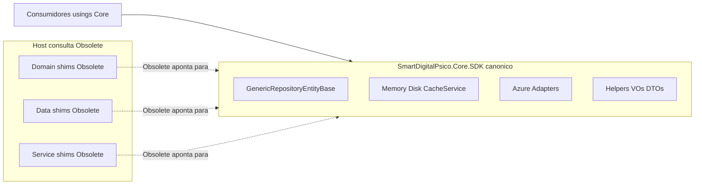

# Levantamento — SmartDigitalPsico.Core.SDK

**Versão:** 2.1.0  
**Data:** 2026-08-08  
**Status:** Inventário histórico + execução — ver [Progresso.md](./Progresso.md) v2.5 (fonte de verdade do que já foi portado)  
**PackageId alvo:** `SmartDigitalPsico.Core.SDK` (único NuGet)  
**TFM do host:** `net10.0`  
**Escopo analisado:** `SmartDigitalPsico.Domain`, `SmartDigitalPsico.Data`, `SmartDigitalPsico.Service`, `SmartDigitalPsico.WebAPI` (+ projetos de teste)

> **Atualização v2.4/v2.5:** o contrato genérico `IEntityDataContext`, Fluent helpers (`EntityBaseConfiguration`, `ModelBuilderExtensions`, `HelperCharSet`, …), Token/SecurityHelperApi e constantes hypermedia **já estão no Core** com shims Obsolete no host. Trechos abaixo que ainda dizem “Manter/Não portar” para esses itens estão **supersedidos** pelo Progresso. DbContext tipado, migrations e `Context/Configure/Entity/*` de produto continuam **Manter**.

**Fatia futura (Schedule / Notification):** [Levantamento-ScheduleNotificationCore.md](./Levantamento-ScheduleNotificationCore.md) — motor `Bussines/Schedule/Core` + o que de NotificationTemplate é genérico vs produto. **Não** entra nas Fases 1–7 do PlanoDeAcao genérico até priorização.

**Execução por projeto:** [PlanoExecucao-PorProjeto.md](./PlanoExecucao-PorProjeto.md) · [Analise-Domain.md](./Analise-Domain.md) · [Analise-Data.md](./Analise-Data.md) · [Analise-Service.md](./Analise-Service.md) · [Analise-WebAPI.md](./Analise-WebAPI.md)

Paths relativos à raiz `SmartDigitalPsicoAPI/`.

---

## 0. Objetivo e regras

Centralizar **implementações genéricas e reutilizáveis** no pacote `SmartDigitalPsico.Core.SDK` (fonte **canônica**). Os arquivos atuais em Domain/Data/Service/WebAPI **não são apagados**: permanecem no path como **consulta**, marcados `[Obsolete]` com comentário de relocação. Quem consome o tipo atualiza `using`/referências para o Core.

| Situação | Significado |
| -------- | ----------- |
| **Portar → Core** | Código canônico no Core.SDK (mesmo tipo existente; sem inventar tipos novos) |
| **Obsoletar no host** | Arquivo permanece; `[Obsolete]` + comentário (consulta / shim fino) |
| **Portar+Obsoletar** | Portar → Core **e** Obsoletar no host (padrão desta iniciativa) |
| **Manter** | Tipo específico do produto → permanece ativo no host (sem Obsolete) |
| **Não portar** | Ausente neste repo — **não criar** equivalente |

### Padrão obrigatório no host (por tipo portado)

```csharp
// Movido para SmartDigitalPsico.Core.SDK — implementação canônica no pacote Core.
[Obsolete("Movido para SmartDigitalPsico.Core.SDK. Use o tipo correspondente no pacote SmartDigitalPsico.Core.SDK.", error: false, DiagnosticId = "SDP_CORE_SDK_GENERIC")]
public class ExemploHelper // preferir shim fino que herda/delega ao tipo do Core
```

- DiagnosticId: família `SDP_CORE_SDK_*` (documentada no PlanoDeAcao)
- Preferir **shim fino** (herança/delegação ao Core) no host — path + Obsolete servem de consulta, sem duas lógicas
- Consumidores: atualizar `using` para o namespace do Core

### Regras não negociáveis

- **Não apagar** implementações atuais no host; marcar Obsolete + comentário
- **Não inventar** tipos novos (`Guard`, `Result`, Dapper, UoW, interfaces de contexto novas, Redis/Mongo providers novos)
- **Único criar além do shell:** cópia canônica no Core dos tipos já inventariados + shell `SmartDigitalPsico.Core.SDK(.Tests).csproj`
- Ajustes permitidos: namespaces no Core, `ProjectReference`, usings/DI dos consumidores; retarget `GenericRepositoryEntityBase` → `DbContext` **só no canônico do Core**
- Um único NuGet; manter específico no host; zero regressão funcional
- **Testes:** suíte canônica em `Core.SDK.Tests` (portados/copiados); testes no host **não apagar** de imediato — atualizar usings para o Core

### Referência histórica

Docs em `DOCUMENTACAO/SmartCoreHub.Core.SDK/` (padrão Obsolete+shim). Tipos inexistentes aqui **não** são criados.

### Dependência EF — `GenericRepositoryEntityBase`

- **Não** criar interface mínima nova no SDK
- No **canônico do Core:** retarget do parâmetro para `Microsoft.EntityFrameworkCore.DbContext` (tipo EF já existente)
- No **host:** arquivo permanece com `[Obsolete]` apontando ao tipo do Core (shim fino)
- `IEntityDataContext` + DbContext concreto + migrations = **Manter** no Data

---

## 1. Mapa de equivalência (SmartCoreHub → SmartDigitalPsico)

| Nome no prompt / SmartCoreHub | Equivalente neste repo | Situação |
| ----------------------------- | ---------------------- | -------- |
| `GenericRepository<T>` | `GenericRepositoryEntityBase<T>` | Portar+Obsoletar |
| `IGenericRepository<T>` | `IEntityBaseRepository<T>` | Portar+Obsoletar |
| `DapperGenericRepository` / `DapperAdpterGenericRepository` | *(inexistente)* | Não portar |
| `RepositoryImplementationFactory` | *(inexistente)* | Não portar |
| `IUnitOfWork` / `UnitOfWork` | *(inexistente)* | Não portar |
| `MemoryCacheProvider` | `MemoryCacheRepository` | Portar+Obsoletar |
| `DiskCacheProvider` | `DiskCacheRepository` | Portar+Obsoletar |
| `RedisCacheProvider` | Stub dentro de `CacheService` | Não portar tipo à parte |
| `MongoPersistenceAdapter` / cache Mongo | Stub dentro de `CacheService` | Não portar tipo à parte |
| `AzureBlobStorageAdapter` | `AzureStorageBlobAdapter` | Portar+Obsoletar |
| `AzureTableStorageAdapter` | `AzureStorageTableAdapter<T>` | Portar+Obsoletar |
| `AzureQueueStorageAdapter` | `AzureStorageQueueAdapter` | Portar+Obsoletar |
| `Guard` | *(inexistente)* | Não portar |
| `Result<T>` | `ServiceResponse<T>` | Portar+Obsoletar |
| `ErrorCodes` | `ValidationErrorCodes` | Portar+Obsoletar |
| `DateTimeHelper` | `DateHelper` / `CultureDateTimeHelper` | Portar+Obsoletar |
| `StringHelper` | *(inexistente)* | Não portar |
| `GenericService<T>` | `EntityBaseService` / `ReportBaseService` | Manter no host |

---

## 2. Repositórios genéricos

### 2.1 Portar+Obsoletar

| Nome | Namespace | Arquivo | Dependências | Situação | Testes relacionados |
| ---- | --------- | ------- | ------------ | -------- | ------------------- |
| `IEntityBaseRepository<T>` | `SmartDigitalPsico.Domain.Interfaces.Repository` | `SmartDigitalPsico.Domain/Interfaces/Repository/IEntityBaseRepository.cs` | `IEntityBase`, `System.Linq.Expressions` | Portar+Obsoletar | Mocks em Domain.Test / Service.Test |
| `GenericRepositoryEntityBase<T>` | `SmartDigitalPsico.Data.Repository.Generic` | `SmartDigitalPsico.Data/Repository/Generic/GenericRepositoryEntityBase.cs` | EF `DbContext`/`DbSet<T>`, `DateHelper`, `EntityBase` | Portar+Obsoletar | `ScheduleAndGenericRepositoryCoverageTests`, `GenderAndGenericRepositoryTests`, `RemainingDataCoverageTests` |
| `IStorageTableContract<T>` | `SmartDigitalPsico.Domain.Interfaces.TableEntity` | `SmartDigitalPsico.Domain/Interfaces/TableEntity/IStorageTableContract.cs` | `BaseEntityTable` | Portar+Obsoletar | `GenericTableEntityRepositoryTests` |
| `GenericTableEntityRepository<T>` | `SmartDigitalPsico.Data.TableEntityRepository` | `SmartDigitalPsico.Data/TableEntityRepository/GenericTableEntityRepository.cs` | `IStorageTableContract<T>` | Portar+Obsoletar | `GenericTableEntityRepositoryTests` |
| `IStorageTableRepositoryFactory` | `SmartDigitalPsico.Domain.Interfaces.Infrastructure` | `SmartDigitalPsico.Domain/Interfaces/Infrastructure/IStorageTableRepositoryFactory.cs` | `EStorageAdapterType` | Portar+Obsoletar | `InfrastructureFactoryTests` |
| `StorageTableRepositoryFactory` | `SmartDigitalPsico.Service.Infrastructure` | `SmartDigitalPsico.Service/Infrastructure/StorageTableRepositoryFactory.cs` | `IConfiguration`, Azure adapters | Portar+Obsoletar | `InfrastructureFactoryTests`, `StorageTableEntityServiceTests` |
| `StorageTableEntityService<T>` | `SmartDigitalPsico.Service.Infrastructure` | `SmartDigitalPsico.Service/Infrastructure/StorageTableEntityService.cs` | Factory | Portar+Obsoletar | `StorageTableEntityServiceTests` |
| `IStorageQueueContract` | `SmartDigitalPsico.Domain.Interfaces.Infrastructure` | `SmartDigitalPsico.Domain/Interfaces/Infrastructure/IStorageQueueAdapter.cs` | — | Portar+Obsoletar | `RemainingDataCoverageTests` |
| `GenericStorageQueueRepository` | `SmartDigitalPsico.Data.Repository.Infrastructure` | `SmartDigitalPsico.Data/Repository/Infrastructure/GenericStorageQueueRepository.cs` | `IStorageQueueContract` | Portar+Obsoletar | `RemainingDataCoverageTests` |
| `IStorageQueueRepositoryFactory` | `SmartDigitalPsico.Domain.Interfaces.Infrastructure` | `SmartDigitalPsico.Domain/Interfaces/Infrastructure/IStorageQueueRepositoryFactory.cs` | `EStorageAdapterType` | Portar+Obsoletar | `InfrastructureFactoryTests` |
| `StorageQueueRepositoryFactory` | `SmartDigitalPsico.Domain.Interfaces.Infrastructure` *(ns ≠ pasta)* | `SmartDigitalPsico.Service/Infrastructure/StorageQueueRepositoryFactory.cs` | Azure queue | Portar+Obsoletar | `InfrastructureFactoryTests` |
| `StorageQueueService` | `SmartDigitalPsico.Service.Infrastructure` | `SmartDigitalPsico.Service/Infrastructure/StorageQueueService.cs` | Factory | Portar+Obsoletar | `InfrastructureMethodCoverageGapTests` |
| `EStorageAdapterType` | `SmartDigitalPsico.Domain.Enuns` | `SmartDigitalPsico.Domain/Enuns/EStorageAdapterType.cs` | — | Portar+Obsoletar | — |
| `BaseEntityTable` | `SmartDigitalPsico.Domain.TableEntityNoSQL` | `SmartDigitalPsico.Domain/TableEntityNoSQL/BaseEntityTable.cs` | `Azure.Data.Tables` | Portar+Obsoletar | — |
| `IFileDiskRepository` | `SmartDigitalPsico.Domain.Interfaces.Repository` | `SmartDigitalPsico.Domain/Interfaces/Repository/IFileDiskRepository.cs` | `FileData` | Portar+Obsoletar | `FileAndDiskCacheRepositoryTests` |
| `FileDiskRepository` | `SmartDigitalPsico.Data.Repository.FileManager` | `SmartDigitalPsico.Data/Repository/FileManager/FileDiskRepository.cs` | filesystem | Portar+Obsoletar | `FileAndDiskCacheRepositoryTests`, `FileDiskRepositoryIncompleteReadTests` |

### 2.2 Manter (repositórios de domínio)

Herdam a base genérica (canônica no Core após port) — **não** vão para o SDK como tipos próprios. Arquivos de domínio **não** recebem Obsolete por esta iniciativa.

**Principals / SystemDomains / Schedule:** lista inalterada (User, Patient, Medical, Gender, Office, …, `ScheduleCalendarRepository`).

**Contexto EF (manter):** `IEntityDataContext`, DbContext concreto, migrations.

### 2.3 EF Fluent — `Context/Configure/Entity/*` = Manter

Toda a pasta [`SmartDigitalPsico.Data/Context/Configure/Entity/`](../../SmartDigitalPsico.Data/Context/Configure/Entity/) (configs Fluent API por tabela: `ScheduleCalendarConfiguration`, `NotificationTemplateConfiguration`, Patient/Medical/User, etc.) é **implementação do projeto**.

| Situação | Regra |
| -------- | ----- |
| **Manter** | Zero Portar+Obsoletar nesta iniciativa |
| Exemplos | `ScheduleCalendarConfiguration.cs`, `NotificationTemplateConfiguration.cs`, e demais `*Configuration.cs` da pasta |

---

## 2.4 Factories e Adapters — resumo explícito

### Portar+Obsoletar (já mapeados neste levantamento)

| Grupo | Tipos |
| ----- | ----- |
| Azure adapters | `IStorageBlobAdapter`, `AzureStorageBlobAdapter`, `AzureStorageTableAdapter<T>`, `AzureStorageQueueAdapter` |
| Storage factories | `IStorageTableRepositoryFactory`, `StorageTableRepositoryFactory`, `IStorageQueueRepositoryFactory`, `StorageQueueRepositoryFactory` (+ `StorageTableEntityService` / `StorageQueueService`) |
| Crypto | `ICryptoAdapterFactory`, `CryptoAdapterFactory`, `AesCryptoAdpter`, `RsaCryptoAdpter`, `ICryptoAdpter` |
| Report | `ExcelGeneratorFactory`, `PdfReportAdapterFactory`, `ExcelGeneratorOpenXmlAdapter`, `PDFsharpMigraDocReportAdapter`, `QuestPdfReportAdapter` |
| SMTP | `EmailStrategyFactory`, `SmtpEmailStrategy`, `ThirdPartyEmailStrategy`, `EmailContext` |

### Manter (produto — não Core)

| Grupo | Tipos |
| ----- | ----- |
| Token session | `TableStorageTokenSessionAdapter`, `DatabaseTokenSessionAdapter`, `TokenSessionPersistenceFactory` |
| Schedule Medical | `MedicalScheduleNotificationAdapter` |
| Notification channels | `NotificationPlatformServiceFactory` (e serviços Email/Sms/WhatsApp de domínio) |
| EF Entity configs | pasta `Data/Context/Configure/Entity/*` (§2.3) |

---

## 3. Providers / repositórios de cache

### 3.1 Portar+Obsoletar

| Nome | Namespace | Arquivo | Situação | Testes relacionados |
| ---- | --------- | ------- | -------- | ------------------- |
| `ICacheRepository`, `IMemoryCacheRepository`, `IDiskCacheRepository` | Domain Interfaces | `Interfaces/Repository/` | Portar+Obsoletar | Cache / Memory / Disk tests |
| `ICacheService`, `IDataCacheDto<T>`, `ETypeLocationCache` | Domain | Interfaces / Enuns | Portar+Obsoletar | `CacheServiceTests` |
| `CacheConfigurationDto`, `ServiceResponseCacheVO<T>` | Domain DTO/VO | Domains / VO | Portar+Obsoletar | — |
| `MemoryCacheRepository`, `DiskCacheRepository` | Data CacheManager | `Repository/CacheManager/` | Portar+Obsoletar | Memory / FileAndDisk tests |
| `CacheService` (arquivo inteiro, stubs inclusos) | Service CacheManager | `Infrastructure/CacheManager/CacheService.cs` | Portar+Obsoletar | `CacheServiceTests` |

### 3.2 Manter

| Nome | Situação | Motivo |
| ---- | -------- | ------ |
| `ApplicationCacheLog*` / `IApplicationCacheLogRepository` | Manter | Auditoria de produto; `CacheService` canônico no Core mantém a dependência tipada existente |

Não criar providers Redis/Mongo/Cosmos separados.

---

## 4. Adapters (cloud / NoSQL / arquivo)

### 4.1 Portar+Obsoletar

`IStorageBlobAdapter`, `AzureStorageBlobAdapter`, `AzureStorageTableAdapter<T>`, `AzureStorageQueueAdapter`, `BlobFileDto`, `LocationSaveFileConfigurationDto`.

### 4.2 Manter

`PatientRecordTableEntity`, `UserTokenSessionTableEntity`, `TableStorageTokenSessionAdapter`, `DatabaseTokenSessionAdapter`, `FileManager`/`IFileManager`, `MedicalScheduleNotificationAdapter`.

### 4.3 Não portar

`MongoPersistenceAdapter`, adapters AWS/Google (inexistentes / não implementados) — **não criar**.

---

## 5. Crypto e report engines

### 5.1 Portar+Obsoletar

`ICryptoAdpter`, `ICryptoAdapterFactory`, `ICryptoService`, `AesCryptoAdpter`, `RsaCryptoAdpter`, `CryptoAdapterFactory`, `TokenConfigurationDto`/`ITokenConfigurationDto`, `RsaCryptoDto`, `ExcelGeneratorOpenXmlAdapter`, `ExcelGeneratorFactory`, `PdfReportAdapterFactory`, `PDFsharpMigraDocReportAdapter`, `QuestPdfReportAdapter`.

### 5.2 Manter

`TokenService`, `ExcelGeneratorService`/`PdfReportService`, contratos de report clínicos.

---

## 6. Helpers e utilitários

### 6.1 Portar+Obsoletar

`DateHelper`, `CultureDateTimeHelper`, `DirectoryHelper`, `EmailHelper`, `ReflectionHelpers`, `OrderAttribute`, `EnumDescriptionConverter<T>`, `IgnorableSerializerContractResolver`, `HtmlSanitizerHelper`, `AesKeyGeneratorHelper`, `RsaCryptoServiceHelper`, `SecurityHelper`, `ServiceCollectionHelper`, `ExceptionHandler`, `AppWarningException`, `ValidationErrorCodes` (como está), `FileHelper`, `BlobFileHelper`, `HelperValidation`, `RequestCultureMiddleware`, `ApiBaseController`.

### 6.2 Manter

`LogAppHelper`, `AuditLogHelper`, `ConfigurationAppSettingsHelper`, `SecurityHelperApi`, `LanguageActionFilterAttribute`, `ApplicationLanguageHelper`, Medical/*, helpers EF de Data, validators FluentValidation de negócio.

> **Schedule helpers / motor Core:** inventário e reclassificação em [Levantamento-ScheduleNotificationCore.md](./Levantamento-ScheduleNotificationCore.md) (fatia futura; neste doc geral permanecem fora das Fases 1–7).

---

## 7. VOs, DTOs base e contratos

### 7.1 Portar+Obsoletar

`ServiceResponse<T>`, `IServiceResponse<T>`, `ErrorResponse`, `ServiceResponseCacheVO<T>`, `PagedSearchVO<T>`, `EntityBase`, `EntityBaseWithNameEmail`, `Record<T>`, `RecordsList<T>`, `EntityDtoBase*`, `FileBase`/`FileData`/`FileDetailDto`, `SmtpSettingsDto`/`EmailMessageDto`.

### 7.2 Manter

`TokenVO`, configs de produto, DTOs Add/Get/Update de Domains, Patient/Medical/User/Schedule, `DataNotificationTemplateVO`, bases DTO de negócio.

---

## 8. Hypermedia

### 8.1 Portar+Obsoletar (framework)

`ContentResponseEnricher<T>`, `IResponseEnricher`, `ISupportsHyperMedia`, `HyperMediaLink`, `HyperMediaConfigure`, filtros, constants.

### 8.2 Manter (enrichers de domínio)

Todos os `GetPatient*Enricher`, `GetUserEnricher`, `GetMedical*Enricher`, enrichers de Domains.

---

## 9. SMTP

### Portar+Obsoletar

`SmtpEmailStrategy`, `EmailStrategyFactory`, `EmailContext`, `ThirdPartyEmailStrategy`.

### Manter

Sms/WhatsApp notification services de domínio.

---

## 10. Services genéricos e API

| Nome | Situação |
| ---- | -------- |
| `EntityBaseService`, `ReportBaseService`, `IEntityBaseService` | **Manter** |
| `ApiBaseController` | **Portar+Obsoletar** |
| Controllers WebAPI | **Manter** |

---

## 11. Extensões

`ModelBuilderExtensions` e helpers EF de Data = **Manter**. Não criar `*Extensions` novas. Pasta `Domain/Extensions/` vazia = N/A.

---

## 12. Tipos inexistentes (Não portar — não criar)

`GenericRepository` (nome exato), Dapper, UoW, `Guard`, `Result<T>`, `StringHelper`, `DateTimeHelper`, `ErrorCodes`, `MemoryCacheProvider`/`RedisCacheProvider`/`DiskCacheProvider` (nomes), `MongoPersistenceAdapter`, interface mínima nova de contexto EF.

---

## 13. Testes → `SmartDigitalPsico.Core.SDK.Tests`

- **Portar/copiar** testes dos tipos Portar+Obsoletar para `Core.SDK.Tests` (suíte canônica).
- Testes no host (**Data.Test / Service.Test / Domain.Test**) **não apagar** de imediato; atualizar `using` para o Core (ou `#pragma` ao cobrir shim Obsolete).
- Remoção física de testes/host shims = **fora de escopo** desta iniciativa.

### Data.Test (portar suíte canônica)

`ScheduleAndGenericRepositoryCoverageTests`, `RemainingDataCoverageTests` (partes), `GenericTableEntityRepositoryTests`, `MemoryCacheRepositoryTests`, `FileAndDiskCacheRepositoryTests`, `FileDiskRepositoryIncompleteReadTests`.

Manter no Data.Test (domínio): `GenderAndGenericRepositoryTests`, `FileManagerCoverageTests`.

### Service.Test

`InfrastructureFactoryTests`, `StorageTableEntityServiceTests`, `AzureStorageAdaptersCoverageTests`, `CacheServiceTests`, `InfrastructureMethodCoverageGapTests`, Smtp tests.

### Domain.Test

`GeneralHelpersTests`, `DirectoryHelperTests`, `FileHelperTests`, `ServiceCollectionHelperTests`, `RequestCultureMiddlewareTests`, `SerializationHelpersTests`, `SecurityHelpersTests`, `CryptoAndTokenTests`, Report adapter tests, `ValidationHelperTests`, `AppExceptionTests`, `ApiBaseControllerTests`.

**Não portar testes de:** validators Patient/Medical/Schedule, enrichers, repos de domínio, `EntityBaseService`/`ReportBaseService`, `LogAppHelperTests`.

---

## 14. Resumo quantitativo

| Categoria | Portar+Obsoletar (aprox.) | Manter / Não portar |
| --------- | ------------------------:| -------------------:|
| Repos genéricos + factories + file disk | ~16 | ~25 repos domínio + DbContext |
| Cache | ~11 | ApplicationCacheLog* |
| Adapters Azure | ~6 | Table entities / token adapters |
| Crypto + report engines | ~13 | TokenService / report services host |
| Helpers + API base | ~22 | Schedule/Medical/i18n/EF/config |
| VOs / DTOs base | ~18 | DTOs de domínio |
| Hypermedia framework | ~10 | enrichers domínio |
| SMTP | ~4 | Sms/WhatsApp domínio |
| Services negócio | 0 | EntityBaseService, controllers |

---

## 15. Diagrama alvo



---

## 16. Documentos relacionados

- Plano operacional (infra genérica): [PlanoDeAcao.md](./PlanoDeAcao.md)  
- Acompanhamento: [Progresso.md](./Progresso.md)  
- Fatia futura Schedule + NotificationTemplate: [Levantamento-ScheduleNotificationCore.md](./Levantamento-ScheduleNotificationCore.md)  
- Execução por projeto: [PlanoExecucao-PorProjeto.md](./PlanoExecucao-PorProjeto.md)  
- Análises: [Analise-Domain.md](./Analise-Domain.md) · [Analise-Data.md](./Analise-Data.md) · [Analise-Service.md](./Analise-Service.md) · [Analise-WebAPI.md](./Analise-WebAPI.md)
