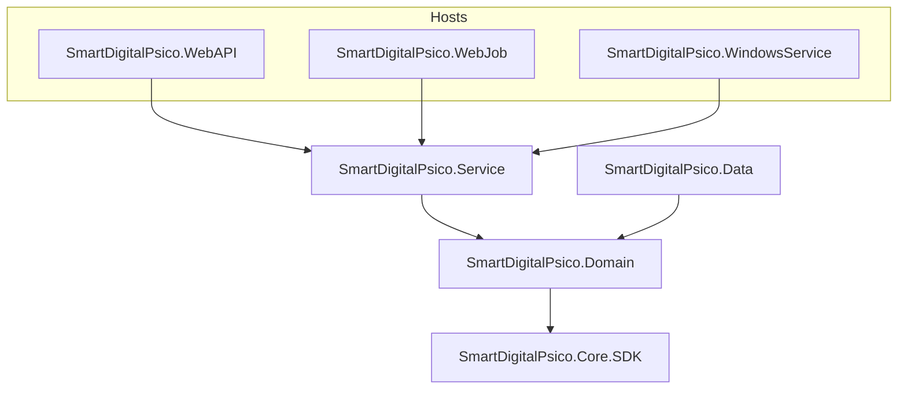

# SmartDigitalPsico.Core.SDK — Documentação

Índice da documentação do pacote **`SmartDigitalPsico.Core.SDK`**.

> **Nota (2026-08):** estes documentos foram adaptados do ecossistema SmartCoreHub para o projeto SmartDigitalPsico. Nomes, paths e namespaces foram atualizados. Documentos históricos de migração preservam o registro das decisões tomadas durante a extração do SDK.

## Fonte de verdade

| Recurso | Caminho |
| ------- | ------- |
| Projeto | [`SmartDigitalPsico.Core.SDK/`](../../SmartDigitalPsico.Core.SDK/) |
| README do pacote | [`SmartDigitalPsico.Core.SDK/README.md`](../../SmartDigitalPsico.Core.SDK/README.md) |
| Testes | [`SmartDigitalPsico.Core.SDK.Tests/`](../../SmartDigitalPsico.Core.SDK.Tests/) |
| Solução | [`SmartDigitalPsicoAPI.sln`](../../SmartDigitalPsicoAPI.sln) |
| Diretrizes de cobertura | [`Diretrizes-Coverage-Backend-SmartDigitalPsico.md`](../COVERAGE%20AND%20TEST/Diretrizes-Coverage-Backend-SmartDigitalPsico.md) |

## Documentos

| Documento | Descrição | Status |
| --------- | --------- | ------ |
| [Especificacao.md](./SmartDigitalPsico.Core.SDK-Especificacao.md) | Especificação técnica do pacote (estrutura, API, premissas) | ✅ Atualizado |
| [RASCUNHO.md](./SmartDigitalPsico.Core.SDK-RASCUNHO.md) | Draft inicial (obsoleto — referência histórica) | 📁 Arquivo |
| [PlanoImplementacao.md](./SmartDigitalPsico.Core.SDK-PlanoImplementacao.md) | Plano operacional de criação do SDK | ✅ Concluído |
| [Substituicao.md](./SmartDigitalPsico.Core.SDK-Substituicao.md) | Levantamento e substituição de tipos genéricos | ✅ Concluído |
| [Substituicao-Prompt.md](./SmartDigitalPsico.Core.SDK-Substituicao-Prompt.md) | Prompt de migração multi-agente (supersedido) | 📁 Arquivo |
| [MigracaoGenericos.md](./SmartDigitalPsico.Core.SDK-MigracaoGenericos.md) | Consolidação de genéricos pesados no NuGet único | ✅ Concluído |
| [Remocao-Shims.md](./SmartDigitalPsico.Core.SDK-Remocao-Shims.md) | Remoção de shims `[Obsolete]` SCH_MIG_GEN_* | ✅ Concluído |
| [Extracao-Pendencias.md](./SmartDigitalPsico.Core.SDK-Extracao-Pendencias.md) | Extrações pendentes pós-migração (lotes 1–6) | ✅ Concluído |
| [Service-Extracao.md](./SmartDigitalPsico.Core.SDK-Service-Extracao.md) | Extração de genéricos ASP.NET de Service | ✅ Concluído |
| [Localization.SDK-Isolamento-Core.md](./SmartDigitalPsico.Localization.SDK-Isolamento-Core.md) | Isolamento Localization.SDK *(N/A no SmartDigitalPsico)* | ⚠️ Referência histórica |

## Arquitetura SmartDigitalPsico

## Diferenças em relação ao template SmartCoreHub

| Aspecto | SmartCoreHub (origem) | SmartDigitalPsico (atual) |
| ------- | --------------------- | ------------------------- |
| Localização | `backend/Core/` | Raiz da solução `SmartDigitalPsicoAPI/` |
| TFM | Multi-target (`netstandard`…`net10`) | `net10.0` único |
| Camada de dados | `SmartCoreHub.Infrastructure` | `SmartDigitalPsico.Data` |
| API | `SmartCoreHub.API` | `SmartDigitalPsico.WebAPI` |
| Localization.SDK | Pacote separado | Localização integrada em `Service/Configure/Localization` |
| Entidade base | `LongEntityBase` / `Guid` (spec) | `EntityBase` com `long Id` |
| Mapper | `ISmartCoreHubMapper` | `IAppMapper` |
