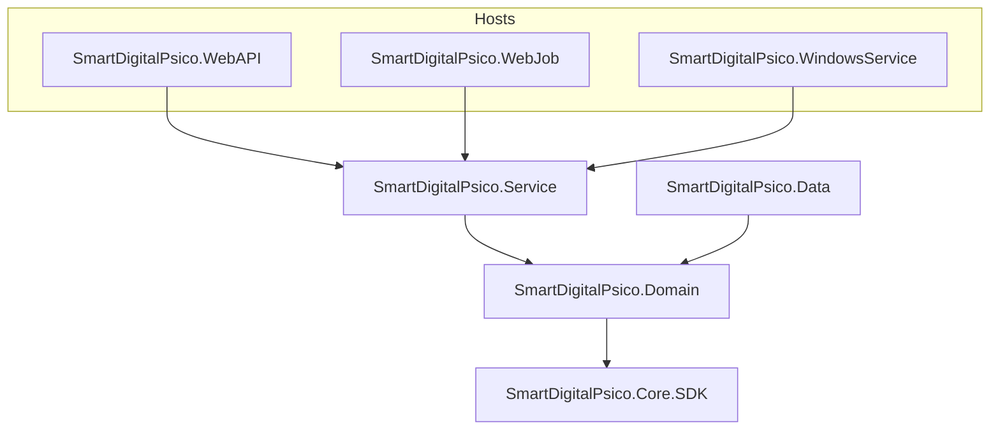

# SmartDigitalPsico.Core.SDK — Especificação Técnica

> **Atualização (2026-08-29):** documento revisado para refletir o estado atual do projeto SmartDigitalPsico. Documentos de migração histórica: [Substituicao.md](./SmartDigitalPsico.Core.SDK-Substituicao.md), [MigracaoGenericos.md](./SmartDigitalPsico.Core.SDK-MigracaoGenericos.md), [Extracao-Pendencias.md](./SmartDigitalPsico.Core.SDK-Extracao-Pendencias.md).

**Versão:** 2.0  
**Data:** 2026-08-29  
**Status:** Implementado  
**Documento base:** [SmartDigitalPsico.Core.SDK-RASCUNHO.md](./SmartDigitalPsico.Core.SDK-RASCUNHO.md)  
**README do pacote:** [SmartDigitalPsico.Core.SDK/README.md](../../SmartDigitalPsico.Core.SDK/README.md)

---

## 1. Resumo executivo

O **SmartDigitalPsico.Core.SDK** é uma Class Library .NET (`net10.0`) empacotável via NuGet, alojada em `SmartDigitalPsicoAPI/SmartDigitalPsico.Core.SDK/`, destinada a centralizar primitivas de domínio, helpers, contratos de infraestrutura, padrões reutilizáveis e implementações genéricas (repositórios EF, cache, Azure Storage, SMTP, relatórios PDF/Excel, segurança JWT/crypto).

### Objetivos

- Reduzir duplicação entre `Domain`, `Data`, `Service` e hosts (`WebAPI`, `WebJob`, `WindowsService`).
- Oferecer contratos estáveis e versionados semanticamente.
- Concentrar extensões de DI ASP.NET genéricas (Swagger, JWT, CORS, cache, SMTP).

### Premissas

| Regra | Descrição |
| ----- | --------- |
| Projeto na raiz da solução | `SmartDigitalPsico.Core.SDK/` — referenciado por `SmartDigitalPsico.Domain` |
| Um pacote | `PackageId=SmartDigitalPsico.Core.SDK` |
| TFM único | `net10.0` — dependências pesadas (EF, Azure, QuestPDF, etc.) no mesmo pacote |
| Sem referência ao domínio de produto | O SDK **não** referencia entidades específicas (Patient, Medical, etc.) |
| Identificador `long` | `EntityBase.Id` é `long` (identity EF) |

---

## 2. Arquitetura



### Direção de dependências

- `SmartDigitalPsico.Core.SDK` depende de pacotes NuGet (`Microsoft.Extensions.*`, `Microsoft.AspNetCore.*`, Azure SDKs, AutoMapper, Serilog, Polly, QuestPDF, etc.).
- `SmartDigitalPsico.Domain` referencia o Core.SDK.
- `SmartDigitalPsico.Data`, `Service` e hosts referenciam Domain (e indiretamente o SDK).
- O SDK **nunca** referencia Domain, Data ou Service.

---

## 3. Estrutura de pastas e namespaces

```text
SmartDigitalPsicoAPI/
├── SmartDigitalPsicoAPI.sln
├── Directory.Packages.props
├── SmartDigitalPsico.Core.SDK/
│   ├── SmartDigitalPsico.Core.SDK.csproj
│   ├── README.md
│   ├── API/                          → SmartDigitalPsico.Core.SDK.API
│   ├── Data/
│   │   ├── Context/                  → SmartDigitalPsico.Core.SDK.Data.Context
│   │   ├── Repository/               → SmartDigitalPsico.Core.SDK.Data.Repository
│   │   └── TableEntityRepository/    → SmartDigitalPsico.Core.SDK.Data.TableEntityRepository
│   ├── Domain/
│   │   ├── Contracts/                → SmartDigitalPsico.Core.SDK.Domain.Contracts
│   │   ├── DTO/                      → SmartDigitalPsico.Core.SDK.Domain.DTO
│   │   ├── Enuns/                    → SmartDigitalPsico.Core.SDK.Domain.Enuns
│   │   ├── Helpers/                  → SmartDigitalPsico.Core.SDK.Domain.Helpers
│   │   ├── Hypermedia/               → SmartDigitalPsico.Core.SDK.Domain.Hypermedia
│   │   ├── Interfaces/               → SmartDigitalPsico.Core.SDK.Domain.Interfaces
│   │   ├── Report/                   → SmartDigitalPsico.Core.SDK.Domain.Report
│   │   ├── Resiliency/               → SmartDigitalPsico.Core.SDK.Domain.Resiliency
│   │   ├── Security/                 → SmartDigitalPsico.Core.SDK.Domain.Security
│   │   ├── TableEntityNoSQL/         → SmartDigitalPsico.Core.SDK.Domain.TableEntityNoSQL
│   │   ├── Validation/               → SmartDigitalPsico.Core.SDK.Domain.Validation
│   │   └── VO/                       → SmartDigitalPsico.Core.SDK.Domain.VO
│   ├── Infrastructure/
│   │   ├── Logging/                  → SmartDigitalPsico.Core.SDK.Infrastructure.Logging
│   │   └── Mapping/                  → SmartDigitalPsico.Core.SDK.Infrastructure.Mapping
│   └── Service/
│       ├── Configure/                → SmartDigitalPsico.Core.SDK.Service.Configure
│       ├── DataEntity/Generic/       → SmartDigitalPsico.Core.SDK.Service.DataEntity.Generic
│       └── Infrastructure/           → SmartDigitalPsico.Core.SDK.Service.Infrastructure
└── SmartDigitalPsico.Core.SDK.Tests/
```

---

## 4. API pública por módulo

### 4.1 Domain — Entidade base

```csharp
namespace SmartDigitalPsico.Core.SDK.Domain.Contracts;

public abstract class EntityBase : IEntityBase, IEntityBaseLog
{
    public long Id { get; set; }
    public bool Enable { get; set; }
    public DateTime CreatedDate { get; set; }
    public DateTime ModifyDate { get; set; }
    public DateTime LastAccessDate { get; set; }
}
```

### 4.2 Domain — ServiceResponse

Padrão de resposta usado pelos serviços (equivalente funcional ao `Result<T>` da spec original):

```csharp
namespace SmartDigitalPsico.Core.SDK.Domain.VO;

public class ServiceResponse<T> : IServiceResponse<T>
{
    public T? Data { get; set; }
    public bool Success { get; set; }
    public string Message { get; set; }
    public List<ErrorResponse> Errors { get; set; }
    public bool Unauthorized { get; set; }
}
```

### 4.3 Domain — Validação

```csharp
namespace SmartDigitalPsico.Core.SDK.Domain.Validation.Helper;

public static class HelperValidation { /* guard clauses genéricas */ }
```

Validators FluentValidation de regra de negócio permanecem em `SmartDigitalPsico.Domain`.

### 4.4 Data — Repositório genérico

- `IEntityBaseRepository<T>` — contrato CRUD assíncrono
- `GenericRepository<T>` — implementação EF Core sobre `EntityBase`
- `MemoryCacheRepository`, `DiskCacheRepository`, `FileDiskRepository`

### 4.5 Infrastructure — Abstrações transversais

| Interface | Implementação | Responsabilidade |
| --------- | ------------- | ---------------- |
| `IAppLogger` | `SerilogAppLoggerAdapter` | Logging desacoplado |
| `IAppMapper` | `AutoMapperAppMapperAdapter` | Mapeamento genérico |
| `ICacheService` | `CacheService` | Orquestração de cache |
| `ITokenService` | `TokenService` | Geração/validação JWT |
| `ICryptoService` | `CryptoService` | Criptografia AES/RSA |

### 4.6 Service — Serviço genérico e DI

- `IEntityBaseService<TEntity, TResult>` / `EntityBaseService<,>` — CRUD genérico com mapeamento
- `ApiBaseController` — base para controllers REST (JWT, cultura)
- Extensions DI em `Service/Configure/` (Swagger, JWT, CORS, cache, SMTP, Azure queues, relatórios)

### 4.7 Service — Infraestrutura

| Área | Componentes |
| ---- | ----------- |
| Azure Storage | `AzureStorageBlobAdapter`, `AzureStorageQueueAdapter`, `AzureStorageTableAdapter` |
| SMTP | `SmtpEmailStrategy`, `ThirdPartyEmailStrategy`, `EmailService` |
| Relatórios | `QuestPDFReportAdapter`, `PDFsharpMigraDocReportAdapter`, `ExcelGeneratorOpenXmlAdapter` |
| Resiliência | `ResiliencePolicies` (Polly) |

---

## 5. NuGet e empacotamento

| Propriedade | Valor |
| ----------- | ----- |
| `PackageId` | `SmartDigitalPsico.Core.SDK` |
| `AssemblyName` | `SmartDigitalPsico.Core.SDK` |
| `RootNamespace` | `SmartDigitalPsico.Core.SDK` |
| `TargetFramework` | `net10.0` |

Principais dependências: AutoMapper, Azure.Storage.*, EF Core, FluentValidation (indireto via host), HtmlSanitizer, JWT, Polly, QuestPDF, PDFsharp, Serilog, Swashbuckle.

---

## 6. Testes

| Aspecto | Padrão |
| ------- | ------ |
| Projeto | `SmartDigitalPsico.Core.SDK.Tests` |
| Framework | NUnit 4 |
| Isolamento | Moq |
| Meta de cobertura | ≥ 90% (ver [Diretrizes-Coverage-Backend-SmartDigitalPsico.md](../COVERAGE%20AND%20TEST/Diretrizes-Coverage-Backend-SmartDigitalPsico.md)) |

```powershell
dotnet test SmartDigitalPsico.Core.SDK.Tests\SmartDigitalPsico.Core.SDK.Tests.csproj -c Release
```

---

## 7. Compatibilidade e versionamento

- Interfaces públicas só podem ter breaking changes em releases **major**.
- `InternalsVisibleTo` para `SmartDigitalPsico.Core.SDK.Tests` e `SmartDigitalPsico.Domain.Test`.

---

## 8. Requisitos arquiteturais

- SOLID, Clean Architecture, DDD-friendly
- Async-first onde aplicável
- Nullable enabled, implicit usings enabled
- XML documentation em APIs públicas
- Sonar-friendly (sem secrets em logs)

---

## 9. Status de implementação

| Módulo | Status |
| ------ | ------ |
| Projeto `SmartDigitalPsico.Core.SDK` | ✅ Implementado |
| Domain (EntityBase, ServiceResponse, DTOs, interfaces) | ✅ |
| Data (GenericRepository, cache, TableEntity) | ✅ |
| Infrastructure (Logging, Mapping) | ✅ |
| Service (EntityBaseService, Configure DI, Azure, SMTP, Report) | ✅ |
| API (ApiBaseController, filtros) | ✅ |
| Testes (`SmartDigitalPsico.Core.SDK.Tests`) | ✅ |

---

## 10. Documentos relacionados

| Documento | Conteúdo |
| --------- | -------- |
| [README.md](./README.md) | Índice desta pasta |
| [Substituicao.md](./SmartDigitalPsico.Core.SDK-Substituicao.md) | Histórico de substituição de tipos |
| [MigracaoGenericos.md](./SmartDigitalPsico.Core.SDK-MigracaoGenericos.md) | Consolidação de genéricos pesados |
| [Remocao-Shims.md](./SmartDigitalPsico.Core.SDK-Remocao-Shims.md) | Remoção de shims Obsolete |
| [Service-Extracao.md](./SmartDigitalPsico.Core.SDK-Service-Extracao.md) | Extração ASP.NET de Service |
