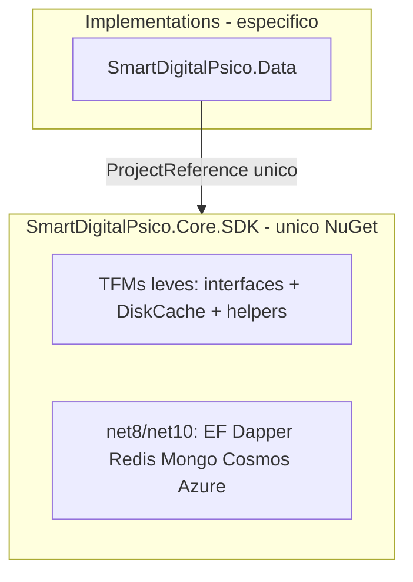

# SmartDigitalPsico.Core.SDK — Implementação de Genéricos, Adapters e Providers no Core

> **Complemento (2026-07-15):** as extrações pendentes identificadas após esta iniciativa (duplicados remanescentes, genéricos não catalogados e lacunas de implementação) foram executadas — ver [Extracao-Pendencias.md](./SmartDigitalPsico.Core.SDK-Extracao-Pendencias.md).

**Versão:** 1.6
**Data:** 2026-07-13
**Status:** 🟢 Consolidado — **um único NuGet** `SmartDigitalPsico.Core.SDK`; shims `SCH_MIG_GEN_*` removidos (ver [Remocao-Shims](./SmartDigitalPsico.Core.SDK-Remocao-Shims.md)); pacotes companheiros descontinuados
**Documentos base:**
- [SmartDigitalPsico.Core.SDK-Substituicao.md](./SmartDigitalPsico.Core.SDK-Substituicao.md) (v1.4 — substituição de tipos genéricos **concluída**)
- [SmartDigitalPsico.Core.SDK-Remocao-Shims.md](./SmartDigitalPsico.Core.SDK-Remocao-Shims.md) (lotes 1–7 **concluídos**)
- [SmartDigitalPsico.Core.SDK-Substituicao-Prompt.md](./SmartDigitalPsico.Core.SDK-Substituicao-Prompt.md)
- [SmartDigitalPsico.Core.SDK-Especificacao.md](./SmartDigitalPsico.Core.SDK-Especificacao.md)
- [SmartDigitalPsico.Core.SDK-PlanoImplementacao.md](./SmartDigitalPsico.Core.SDK-PlanoImplementacao.md)

### Decisões de implementação (v1.6)

| Tema | Decisão |
| ---- | -------- |
| Empacotamento | **Um** `PackageId=SmartDigitalPsico.Core.SDK`. Pacotes satélites (`.Dapper`, `.EntityFrameworkCore`, `.Caching.*`, etc.) **removidos**. |
| TFMs | Multi-target mantido; ordem **`net8.0;net10.0;net6.0;netstandard2.1;netstandard2.0`** (net8 primeiro para design-time no VS). Impls pesadas compilam só em **net8.0/net10.0** (`Compile Remove` + `PackageReference` condicionais). |
| Layout Dapper | `Infrastructure/Dapper/Generic` + `Persistence` (pasta `Companion` removida). Paths canônicos no Core, não em Implementations. |
| FluentValidation | Core.SDK **não** referencia FluentValidation; guards leves/`Guard`. |
| Connection factory | Contrato e consumidores usam `ISmartDigitalPsicoDataBaseConnectionFactory` do Core; shim Domain **removido**. |
| Nome tipográfico | Mantém-se `DapperAdpterGenericRepository`. |
| DiagnosticIds / shims | Lotes 1–7 concluídos — 0 shims `SCH_MIG_GEN_*` ativos. Residual: Export `FileType`. |
| `GenericService<T>` | **N/A** — permanece em Service. |
| Especificação “Core puro” | **Flexibilizada** em v1.4: deps pesadas entram no mesmo NuGet, restritas a net8/net10. |

---

## 0. Objetivo

**Implementar no ecossistema `SmartDigitalPsico.Core.SDK` o `GenericRepository` e os demais tipos genéricos, adapters e providers**, centralizando implementações reutilizáveis em uma fonte única, para que qualquer projeto (backend, SDKs de feature e futuros consumidores) reaproveite a mesma implementação em vez de duplicá-la.

Em concreto, este documento define como levar para o Core:

- **Repositórios genéricos:** `GenericRepository<T>` (EF Core) e `DapperAdpterGenericRepository<T>` + `RepositoryImplementationFactory`.
- **Providers de cache:** `RedisCacheProvider`, `MongoDbCacheProvider`, `AzureCosmosDbCacheProvider`, `DiskCacheProvider` (o `MemoryCacheProvider` já está no Core).
- **Adapters NoSql:** `MongoPersistenceAdapter` (+ factory) e `NoSqlPersistenceAdapterProviderFactory`.
- **Adapters de nuvem:** `AzureBlobStorageAdapter`, `AzureQueueStorageAdapter`, `AzureTableStorageAdapter` e suas factories.
- **Serviço genérico:** avaliar a base agnóstica de `GenericService<T>`.

**Princípio de centralização:** toda implementação **genérica e reutilizável** (não específica de domínio) tem **fonte única** no pacote packable [`SmartDigitalPsico.Core.SDK`](../../../../SmartDigitalPsico.Core.SDK/SmartDigitalPsico.Core.SDK.csproj) — **um NuGet**.

> **v1.4 — Correção:** a abordagem de “pacotes companheiros” (satélites por dependência pesada) foi **desistida**. Interfaces **e** implementações (EF, Dapper, Redis, Mongo, Cosmos, Azure) ficam no mesmo `.csproj`. Dependências pesadas só entram nos TFMs `net8.0`/`net10.0`; TFMs antigos (`netstandard`/`net6`) continuam com tipos leves.

---

## 1. Contexto e motivação

A iniciativa anterior ([Substituicao.md](./SmartDigitalPsico.Core.SDK-Substituicao.md) v1.4) centralizou no `Core.SDK` os tipos **genéricos leves**: entidades base (`EntityBase`), interfaces (`IGenericRepository<T>`, `IClock`, `IAppLogger`, contratos de cache/NoSql/cloud), value objects, DTOs comuns, helpers e o `Result`/`Guard`/exceptions.

A especificação original falava em *"Core puro"* sem EF/Dapper. Em **v1.4/v1.5** essa regra foi **flexibilizada**: interfaces **e** implementações pesadas (EF, Dapper, Redis, Mongo, Cosmos, Azure) vivem no **mesmo** NuGet `SmartDigitalPsico.Core.SDK`, com deps condicionais só em `net8.0`/`net10.0`. A ideia de **pacotes companheiros** (satélites) foi **desistida** — ver §3-ALT (histórico).

**Estado pós-shims (v1.6):** consumidores (`Infrastructure`, DI, testes) usam tipos Core diretamente; cascas `SCH_MIG_GEN_*` removidas ([Remocao-Shims](./SmartDigitalPsico.Core.SDK-Remocao-Shims.md)).

### 1.1 Regra de identificador (mantida)

Todas as entidades EF continuam usando **`long Id` / `EntityBase`**. Esta migração **não** altera tipo de chave, **não** troca `long` por `Guid`, e **não** gera migration de schema por efeito colateral. A única migration prevista é a **migration de validação** descrita na §7 (seed mínimo + `add` + `database update`).

---

## 2. Regras não negociáveis (herdadas)

| Regra | Descrição |
| ----- | --------- |
| **Não apagar prematuramente** | (histórico) Durante a transição, originais ficavam como shim; **hoje** as cascas `SCH_MIG_GEN_*` já foram removidas — ver Remocao-Shims. |
| **Centralizar o genérico** | Toda implementação genérica vive no **único** pacote `SmartDigitalPsico.Core.SDK`. |
| **Manter o específico** | Repositórios de domínio, `SmartDigitalPsicoDataContext`, EF configs, seed, middlewares ASP.NET e validators de negócio **permanecem** em `Implementations`. |
| **Um NuGet** | `PackageId=SmartDigitalPsico.Core.SDK`. Deps pesadas (EF, Dapper, Redis, Mongo, Cosmos, Azure) só em TFMs `net8.0`/`net10.0`. |
| **Sem pacotes satélite** | Não criar `.Dapper` / `.EntityFrameworkCore` / `.Caching.*` / `.Cloud.Azure` / `.NoSql.Mongo` como projetos NuGet separados. |
| **Build obrigatório** | Após **cada lote**, executar build da solução e corrigir todos os erros antes de continuar. |
| **Testes preservados e replicados** | Todo teste do tipo migrado continua no projeto original e é replicado/adaptado em `SmartDigitalPsico.Core.SDK.Tests`. |
| **Cobertura mínima 90%** | Módulos migrados alcançam cobertura de linhas ≥ 90% (Coverlet). |
| **Validação de integração** | Build .NET + Docker, testes unitários, console/NuGet smoke tests, APIs e health checks. |
| **Validação EF Core** | Seed mínimo + `dotnet ef migrations add` + `dotnet ef database update`, provando que o EF não quebrou (§7). |
| **Zero regressão funcional** | Comportamento observável (endpoints, contratos, schema, chaves de cache, logs) idêntico antes/depois. |

---

## 3. Decisão de arquitetura — um NuGet (`v1.5`)



### 3.1 Estrutura de projetos (`Core/`)

```text
Core/
├── SmartDigitalPsico.Core.SDK/              # UNICO pacote NuGet — interfaces + impls
│   ├── Infrastructure/Dapper/Generic/       # DapperAdpterGenericRepository + Internal/
│   ├── Infrastructure/Dapper/Persistence/  # RepositoryImplementationFactory
│   ├── Infrastructure/EntityFrameworkCore/
│   ├── Infrastructure/Caching/Providers/{Redis,Mongo,Cosmos,Disk...}
│   ├── Infrastructure/NoSql/Mongo/
│   └── Infrastructure/Cloud/Azure/
├── SmartDigitalPsico.Core.SDK.Tests/
├── SmartDigitalPsico.Core.SDK.ConsoleTest/
└── SmartDigitalPsico.Core.SDK.ConsoleTest.Nuget/
```

> Dockerfiles devem copiar **somente** `SmartDigitalPsico.Core.SDK/SmartDigitalPsico.Core.SDK.csproj` antes do restore.

> **IDE (Visual Studio):** se o dropdown de framework do projeto estiver em `netstandard`/`net6`, as impls pesadas ficam com `Compile Remove` e aparecem excluídas no Solution Explorer. Com **net8.0** (primeiro em `TargetFrameworks`) elas aparecem vinculadas.

### 3.2 Convenção de consumo por `Implementations`

1. Infrastructure/Service referenciam **apenas** `SmartDigitalPsico.Core.SDK`.
2. Cascas `[Obsolete]` `SCH_MIG_GEN_*` em Domain/Infrastructure foram **removidas** — usar tipos Core diretamente (namespaces públicos do pacote).
3. Repositórios de domínio herdam `GenericRepository<T>` do Core (namespace `SmartDigitalPsico.Core.SDK.EntityFrameworkCore.Repositories`).

---

## 3-ALT. Histórico — pacotes companheiros (obsoleto, v1.1–1.3; **não é o estado atual**)

> Removido em v1.4. Não recriar satélites.

## 4. Gap analysis — o que falta implementar no ecossistema Core.SDK

**Legenda:** ✅ já no Core.SDK · 🟡 interface no Core, implementação ainda em Implementations · ❌ ausente do Core.SDK

### 4.1 Repositórios genéricos

| Tipo | Hoje | Alvo | Situação |
| ---- | ---- | ---- | -------- |
| `IGenericRepository<T>` (interface) | `Core.SDK/Infrastructure/Repositories/Generic` | Core.SDK (puro) | ✅ |
| `GenericRepository<T>` (EF) | `.EntityFrameworkCore` | **`.EntityFrameworkCore`** | ✅ movido |
| `DapperAdpterGenericRepository<T>` | `.Dapper` | **`.Dapper`** | ✅ movido |
| `RepositoryImplementationFactory` | `.Dapper` | **`.Dapper`** | ✅ movido |
| `SqlIdentifierRegexHelper` (internal) | Core.SDK/Infrastructure/Dapper/Generic/Internal | Core.SDK (puro) | ✅ |
| `IUnitOfWork` (interface) | Core.SDK/Others/Infrastructure | Core.SDK (puro) | ✅ |
| `EfUnitOfWork` | `.EntityFrameworkCore` | **`.EntityFrameworkCore`** | ✅ |
| `IReadRepository<T>` / `IRepository<T>` | Core.SDK/Others/Infrastructure/Repositories | Core.SDK (puro) | ✅ (contratos; sem impl. pesada) |

### 4.2 Providers de cache

| Provider | Hoje | Alvo | Situação | Dependência |
| -------- | ---- | ---- | -------- | ----------- |
| `MemoryCacheProvider` | Core.SDK/Infrastructure/Caching/Providers | Core.SDK (puro) | ✅ | Extensions.Caching.Memory |
| `LightweightMemoryCacheProvider` | Core.SDK/Others/Infrastructure/Caching/Providers | Core.SDK (puro) | ✅ | — |
| `DiskCacheProvider` | `Infrastructure/Caching/Providers/DiskCacheProvider.cs` | **Core.SDK (puro)** | ✅ (shim em Infrastructure) | I/O + System.Text.Json (leve) |
| `RedisCacheProvider` | `.Caching.Redis` (+ shim Infrastructure) | **`.Caching.Redis`** | ✅ | StackExchange.Redis |
| `MongoDbCacheProvider` | `.Caching.Mongo` (+ shim Infrastructure) | **`.Caching.Mongo`** | ✅ | MongoDB.Driver |
| `AzureCosmosDbCacheProvider` | `.Caching.Cosmos` (+ shim Infrastructure) | **`.Caching.Cosmos`** | ✅ | Microsoft.Azure.Cosmos |
| `SystemTextJsonCacheSerializer` | Core.SDK/Infrastructure/Caching/Serialization | Core.SDK (puro) | ✅ | — |
| `CacheMetrics` / `CacheProviderHelper` / `CacheStoredEntry` | Core.SDK/Infrastructure/Caching/* | Core.SDK (puro) | ✅ | — |

### 4.3 Adapters NoSql

| Tipo | Hoje | Alvo | Situação | Dependência |
| ---- | ---- | ---- | -------- | ----------- |
| `INoSqlCrudRepository<,>` / `INoSqlPersistenceAdapter<>` / `INoSqlCrudRepositoryFactory` / `ENoSqlProvider` | Core.SDK/Infrastructure/NoSql/Abstractions | Core.SDK (puro) | ✅ | — |
| `NoSqlCrudRepository<,>` / `NoSqlCrudRepositoryFactory` | Core.SDK/Infrastructure/NoSql/Repositories | Core.SDK (puro) | ✅ | — |
| `MongoPersistenceAdapter` | `.NoSql.Mongo` | **`.NoSql.Mongo`** | ✅ | MongoDB.Driver |
| `MongoPersistenceAdapterFactory` / `IMongoPersistenceAdapterFactory` | `.NoSql.Mongo` | **`.NoSql.Mongo`** | ✅ | MongoDB.Driver |
| `NoSqlPersistenceAdapterProviderFactory` | `.NoSql.Mongo` | **`.NoSql.Mongo`** | ✅ | orquestra Mongo |

### 4.4 Adapters de nuvem (cloud)

| Tipo | Hoje | Alvo | Situação | Dependência |
| ---- | ---- | ---- | -------- | ----------- |
| `IBlobStorageAdapter` / `IQueueStorageAdapter` / `ITableStorageAdapter` / `ICloudServiceFactory` | Core.SDK/Domain/Interfaces/Cloud | Core.SDK (puro) | ✅ | — |
| `AzureBlobStorageAdapter` | `.Cloud.Azure` | **`.Cloud.Azure`** | ✅ | Azure.Storage.Blobs |
| `AzureQueueStorageAdapter` | `.Cloud.Azure` | **`.Cloud.Azure`** | ✅ | Azure.Storage.Queues |
| `AzureTableStorageAdapter` (+ `AzureDataTablesClient`, `IAzureTableClient`) | `.Cloud.Azure` | **`.Cloud.Azure`** | ✅ | Azure.Data.Tables |
| `BlobStorageAdapterFactory` / `QueueStorageAdapterFactory` / `TableStorageAdapterFactory` | `.Cloud.Azure` | **`.Cloud.Azure`** | ✅ | Azure SDKs |

### 4.5 Serviço genérico

| Tipo | Hoje | Alvo | Situação |
| ---- | ---- | ---- | -------- |
| `GenericService<TEntity>` (abstract) | `Service/Services/Generic` | Service (não migrado — FluentValidation/Domain) | ⚪ N/A Fase 8 |
| `BaseApiController` | `Service/API/Generic` | **Manter** (ASP.NET) | N/A |

---

## 5. Itens que **permanecem** em `Implementations` (não migram)

- `SmartDigitalPsicoDataContext`, `SmartDigitalPsicoDataContextFactory`, EF configs (`Data/Configurations/**`), seed (`DataSeed/**`), migrations.
- Repositórios de domínio: `UserRepository`, `ApplicationRepository`, `TenantRepository`, `PlanRepository`, `BillingEventRepository`, `CloudConfigurationRepository`, `ApplicationTokenRepository`, `ApplicationConfigurationRepository`, `ApplicationPlanSubscriptionRepository`, `DailyUsageMetricRepository`, `TokenAuditRepository`, `FileExportHistoryRepository`, `AuditLogRepository` (passam a herdar a base genérica do companheiro).
- Repositórios Dapper específicos: `ApplicationDapperRepository`, `ApplicationTokenDapperRepository`, `DailyUsageMetricDapperRepository`, `TokenAuditDapperRepository`.
- `SmartDigitalPsicoDataBaseConnectionFactory` (implementa contrato do SDK), `SerilogAdapter`, `AutoMapperAdapter`.
- DI: `InfrastructureCachingServiceCollectionExtensions`, composição da aplicação.
- Validators FluentValidation de regra de negócio; `BaseApiController` e middlewares ASP.NET.

---

## 6. Plano de ação por fases (com progresso)

> Cada fase é um **lote pequeno e revisável**. Ao fim de cada fase: build da solução, testes, cobertura ≥ 90% do pacote, smoke/console/NuGet, APIs + health, Docker e — nas fases que tocam repositório/EF — o **gate EF da §7**.

### Fase 0 — Documentação e scaffolding
- [x] Este documento revisado (v1.2/1.3 — decisões FluentValidation→Guard, connection factory Core, destino NoSql.Mongo, paths corrigidos).
- [x] Criar os projetos companheiros vazios (`.csproj`) em `Core/` com multi-targeting adequado (net8.0/net10.0; netstandard onde a dependência permitir).
- [x] Adicionar `ProjectReference` ao `SmartDigitalPsico.Core.SDK` em cada companheiro.
- [x] Registrar os novos projetos em `SmartDigitalPsicoAPI.sln` (pasta virtual **Core**).
- [x] Adicionar versões dos pacotes pesados em `Directory.Packages.props` (se ainda não centralizadas) — já centralizadas.
- [x] Build da solução verde.

### Fase 1 — `SmartDigitalPsico.Core.SDK.Dapper` *(histórico — pacote satélite consolidado no NuGet único)*
- [x] Mover `DapperAdpterGenericRepository<T>` para o pacote (implementa `IGenericRepository<T>` do Core).
- [x] Mover `RepositoryImplementationFactory` (implementa `IRepositoryImplementationFactory` do Core).
- [x] Ajustar dependências: `ISmartDigitalPsicoDataBaseConnectionFactory` (contrato do Core), `DatabaseDialectResolver`/`SqlIdentifierRegexHelper` (Core).
- [x] Substituir os validators FluentValidation internos por guardas leves — sem acoplar FluentValidation ao pacote.
- [x] Shim `[Obsolete]` no `Infrastructure` apontando ao pacote; consumidores atualizados.
- [x] `SmartDigitalPsico.Core.SDK.Dapper.Tests` com testes replicados.
- [x] Portões de build/testes do lote.

### Fase 2 — `SmartDigitalPsico.Core.SDK.EntityFrameworkCore`
- [x] Mover `GenericRepository<T>` (EF) para o pacote (`where TEntity : EntityBase`, recebe `DbContext` + `IAppLogger`).
- [x] Implementar `EfUnitOfWork` concreto sobre `DbContext`.
- [x] Repositórios de domínio em `Infrastructure` passam a herdar `GenericRepository<T>` do pacote.
- [x] Shim `[Obsolete]` (`SCH_MIG_GEN_EF`).
- [x] `...EntityFrameworkCore.Tests` com EF InMemory; cobertura ≥ 90%.
- [x] Portões de build/testes do lote.

### Fase 3 — `SmartDigitalPsico.Core.SDK.Caching.Redis`
- [x] Mover `RedisCacheProvider` (implementa `ICacheProvider` do Core).
- [x] DI de Infrastructure passa a resolver o provider do pacote.
- [x] Testes unitários (construção/validação) em `.Caching.Redis.Tests`; integração Docker opcional.
- [x] Shim `SCH_MIG_GEN_REDIS` + `NoWarn` em Infrastructure.

### Fase 4 — `SmartDigitalPsico.Core.SDK.Caching.Mongo` + `.NoSql.Mongo`
- [x] Mover `MongoDbCacheProvider` (+ `MongoCacheDocument`) para `.Caching.Mongo`.
- [x] Mover `MongoPersistenceAdapter`, `MongoPersistenceAdapterFactory`, `IMongoPersistenceAdapterFactory`, `NoSqlPersistenceAdapterProviderFactory` (+ interface provider) para `.NoSql.Mongo`.
- [x] Shim `SCH_MIG_GEN_MONGOCACHE` / `SCH_MIG_GEN_NOSQLMONGO` / DI atualizados; testes unitários.
- [x] Portões de build/testes do lote.

### Fase 5 — `SmartDigitalPsico.Core.SDK.Caching.Cosmos`
- [x] Mover `AzureCosmosDbCacheProvider` (implementa `ICacheProvider` do Core).
- [x] DI atualizado; testes unitários; shim `SCH_MIG_GEN_COSMOS`.
- [x] Build do pacote companheiro OK.

### Fase 6 — `DiskCacheProvider` → Core.SDK (puro)
- [x] Mover `DiskCacheProvider` para `Core.SDK/Infrastructure/Caching/Providers` (sem dependência pesada; polyfills multi-TFM).
- [x] Shim/DI; testes em `Core.SDK.Tests`.
- [x] Portões de build.

### Fase 7 — `SmartDigitalPsico.Core.SDK.Cloud.Azure`
- [x] Mover `AzureBlobStorageAdapter`, `AzureQueueStorageAdapter`, `AzureTableStorageAdapter` + `AzureDataTablesClient`/`IAzureTableClient`.
- [x] Mover `BlobStorageAdapterFactory`, `QueueStorageAdapterFactory`, `TableStorageAdapterFactory`.
- [x] Shims/DI; `...Cloud.Azure.Tests`.
- [x] Portões de build/testes.

### Fase 8 — `GenericService<TEntity>` base agnóstica (opcional)
- [x] Avaliado: **não migrar** — classe depende de FluentValidation + validators Domain + `IGenericService` em Domain (não é agnóstica o bastante para Core puro sem acoplamento).
- [x] Documentado como N/A; permanece em `SmartDigitalPsico.Service`.

### Fase 9 — Corte e consolidação
- [x] Shims de transição removidos nos lotes 1–7 ([Remocao-Shims](./SmartDigitalPsico.Core.SDK-Remocao-Shims.md)); residual Export `FileType` intencional.
- [x] Dockerfiles atualizados com `COPY` dos `.csproj` companheiros **antes** do `dotnet restore` (API, Localization.API, `Dockerfile`).
- [x] `dotnet build SmartDigitalPsicoAPI.sln -c Release` verde após consolidação.
- [x] §9 (rastreamento) e status do documento atualizados (v1.3).

---

## 7. Gate obrigatório de validação EF Core (seed + migration + update)

> **Objetivo:** provar que nenhuma alteração de repositório/entidade/pacote quebrou o EF Core, e que o ciclo de migration continua íntegro. Executar ao menos ao fim das **Fases 1, 2 e 9** (e sempre que uma fase tocar entidade, repositório EF/Dapper ou `DbContext`).

### 7.1 Passos

1. **Alterar um seed mínimo** (não destrutivo) em `SmartDigitalPsico.Data/DataSeed/**` — por exemplo, adicionar/ajustar um registro mock idempotente (ou uma coluna de exemplo já mapeada), sem mudar tipo de chave.
2. **Gerar a migration de validação:**

```powershell
cd c:\git\SMARTDIGITALPSICO\SmartDigitalPsicoAPI

dotnet ef migrations add ValidacaoMigracaoGenericos `
  --project Implementations\SmartDigitalPsico.Data\SmartDigitalPsico.Data.csproj `
  --startup-project SmartDigitalPsico.WebAPI\SmartDigitalPsico.WebAPI.csproj
```

3. **Inspecionar o arquivo gerado**: deve conter **apenas** o seed/alteração intencional. Se aparecer diff inesperado de schema (ex.: troca de `long`→`Guid`, drop/recreate de índice, alteração de FK), é **regressão** — abortar e corrigir.
4. **Aplicar a migration ao banco:**

```powershell
dotnet ef database update `
  --project Implementations\SmartDigitalPsico.Data\SmartDigitalPsico.Data.csproj `
  --startup-project SmartDigitalPsico.WebAPI\SmartDigitalPsico.WebAPI.csproj
```

5. **Confirmar consistência**: `dotnet ef migrations list` mostra a nova migration como aplicada; a API sobe e `/health` responde 200; nenhuma exceção de EF/DI no startup.
6. **Reverter/limpar a migration de validação** quando o objetivo for apenas provar integridade (não versionar o teste):

```powershell
# reverter o banco para a migration anterior
dotnet ef database update <MigrationAnterior> `
  --project Implementations\SmartDigitalPsico.Data\SmartDigitalPsico.Data.csproj `
  --startup-project SmartDigitalPsico.WebAPI\SmartDigitalPsico.WebAPI.csproj

# remover a migration de validação do código
dotnet ef migrations remove `
  --project Implementations\SmartDigitalPsico.Data\SmartDigitalPsico.Data.csproj `
  --startup-project SmartDigitalPsico.WebAPI\SmartDigitalPsico.WebAPI.csproj
```

> Existe o utilitário `Implementations/SmartDigitalPsico.Data/manage-migrations.ps1` (`add`/`update`/`remove`/`list`/`script`) que encapsula esses comandos.

### 7.2 Critérios de aceite do gate EF

- [x] `migrations add ValidacaoMigracaoGenericos` gerou **Up/Down vazios** (modelo alinhado; sem schema acidental). Migration removida em seguida (`ef migrations remove`).
- [x] Nenhuma entidade trocou `long Id` → `Guid` (Designer ainda usa `long` identity).
- [ ] `database update` / API `/health` — requer banco de ambiente local; não executado nesta sessão (modelo design-time validado).
- [x] Migration de validação revertida/removida (prova de integridade apenas).

---

## 8. Portões de qualidade por fase

**Por lote (mínimo) — histórico; lotes concluídos:**
- [x] Projeto/pacote alterado compila.
- [x] Testes diretamente relacionados passam.
- [x] Testes replicados/adaptados em `SmartDigitalPsico.Core.SDK.Tests` (companheiros deprecados).
- [x] Nenhum warning novo sem análise.

**Por fase (conclusão) — consolidado no NuGet único + remoção de shims:**
- [x] `dotnet build SmartDigitalPsicoAPI.sln -c Release` verde.
- [x] `dotnet test` / APIs / Docker `/health` validados pós-migração e pós-shims.
- [x] Cobertura de linhas ≥ 90% (Coverlet) do Core.SDK.
- [x] Console test `ProjectReference` + smoke NuGet `PackageReference`.
- [x] Dockerfiles com **um** `COPY` do Core.SDK.csproj (sem companions).
- [x] **Gate EF §7** executado nas fases que tocaram repositório/EF/Dapper.
- [x] Nenhuma entidade EF trocou `long Id` → `Guid`.
- [x] Zero regressão funcional confirmada.
- [x] Tabela de progresso (§9) e changelog atualizados.

---

## 9. Rastreamento de progresso

### 9.1 Pacote único

| Item | Status |
| ---- | ------ |
| Impls genéricas no `SmartDigitalPsico.Core.SDK` (net8/net10) | ✅ |
| Pacotes satélite removidos da solution/disco | ✅ |
| Infrastructure/Service só referenciam Core.SDK | ✅ |
| Dockerfiles com 1 COPY do Core.SDK.csproj | ✅ |
| Testes fundidos em Core.SDK.Tests | ✅ |
| Shims Obsolete `SCH_MIG_GEN_*` removidos | ✅ (residual Export `FileType`) |

### 9.2 Fases (histórico)

Fases 0–9 da v1.3 foram executadas via satélites e depois **consolidadas no NuGet único** (v1.4). Fase 8 (`GenericService`) permanece N/A. Remoção de shims: lotes 1–7 (v1.6 / Remocao-Shims).

### 9.3 Changelog v1.6

- Encoding do documento recuperado; narrativa alinhada ao estado pós-shims.
- Connection factory / DiagnosticIds: shims removidos; canônico = Core.SDK.
- Checklists e §3.2 atualizados (sem companions como alvo atual).

### 9.3b Changelog v1.5

- Layout Dapper: removida pasta `Companion`; arquivos em `Infrastructure/Dapper/Generic` e `Infrastructure/Dapper/Persistence`.
- `TargetFrameworks` reordenado com **net8.0 primeiro** para o design-time do Visual Studio incluir impls pesadas.
- Nota IDE: dropdown netstandard/net6 continua a excluir pesados via `Compile Remove`.

### 9.3c Changelog v1.4

- **Correção de arquitetura:** um único NuGet `SmartDigitalPsico.Core.SDK`; satélites deletados.
- Código Dapper/EF/cache/NoSql/Azure movido para pastas sob `Core.SDK/Infrastructure/*` com `Compile Remove` fora de net8/net10.
- Dockerfiles: removidos COPYs dos companions.
- Consumidores atualizados para `ProjectReference` único ao Core.SDK.

### 9.3d Changelog v1.3 (histórico)

- Pacotes companheiros criados (revertido em v1.4).
- Gate EF: Up/Down vazios na migration de validação.

---

## 10. Riscos e mitigações

| Risco | Mitigação |
| ----- | --------- |
| NuGet pesado em consumidores netstandard | Deps/código pesados só em net8/net10; TFMs antigos sem essas refs. |
| FluentValidation no Core | Não; usar Guard/throws leves. |
| Docker restore quebrado | Um único COPY do Core.SDK.csproj. |
| Troca acidental `long`↔`Guid` | Gate EF / revisão de PR. |
| Regressão funcional | Build + testes + Docker `/health`. |

---

## 11. Resumo de decisão

- **Alvo:** implementações genéricas centralizadas no **único** pacote NuGet `SmartDigitalPsico.Core.SDK`.
- **Como:** multi-TFM com deps pesadas condicionais (`net8.0`/`net10.0`); sem satélites.
- **Específico permanece:** `DbContext`, repos de domínio, seed, EF configs, middlewares, validators de negócio.
- **Identificador:** `long Id`/`EntityBase` inalterado.
- **Pós-shims:** tipos canônicos nos namespaces `SmartDigitalPsico.Core.SDK.*`; ver [README do pacote](../../../../SmartDigitalPsico.Core.SDK/README.md).