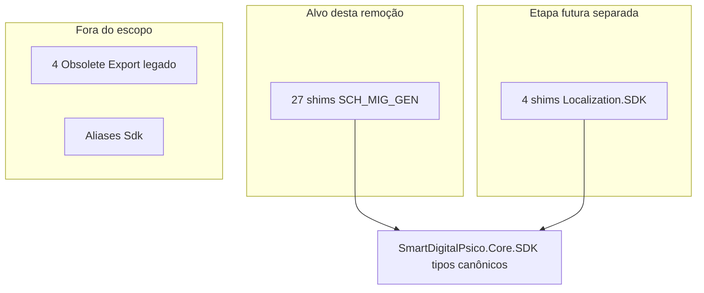
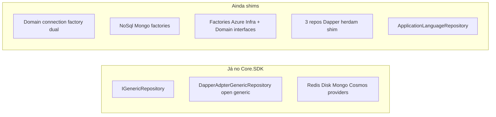
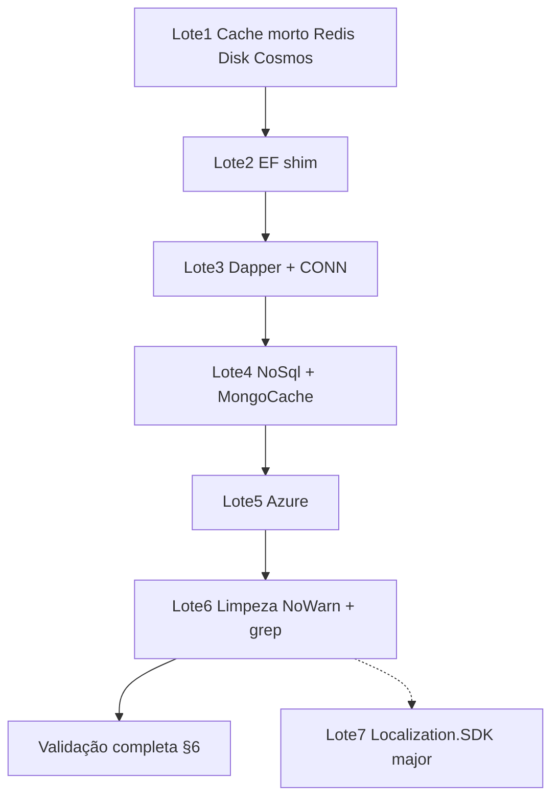

# SmartDigitalPsico.Core.SDK — Levantamento e plano de remoção dos shims Obsolete

> **Complemento (2026-07-15):** as extrações pendentes identificadas após esta iniciativa (duplicados remanescentes, genéricos não catalogados e lacunas de implementação) foram executadas — ver [Extracao-Pendencias.md](./SmartDigitalPsico.Core.SDK-Extracao-Pendencias.md).

**Versão:** 1.2  
**Data:** 2026-07-13  
**Status:** Concluído — Lotes 1–7 implementados; residual: shim de serialização Export (`ExportFileType` / `ExportCriteriaDto.FileType`)  
**Documentos relacionados:**
- [SmartDigitalPsico.Core.SDK-MigracaoGenericos.md](./SmartDigitalPsico.Core.SDK-MigracaoGenericos.md) (v1.5 — consolidação NuGet único)
- [SmartDigitalPsico.Core.SDK-Substituicao.md](./SmartDigitalPsico.Core.SDK-Substituicao.md) (v1.4 — shims `SCH_MIGR_*` leves já removidos)
- [Localization.SDK — Isolamento sem Core.SDK](./SmartDigitalPsico.Localization.SDK-Isolamento-Core.md) (plano: pacote Localization auto-isolado; reverte acoplamento NuGet do Lote 7)

---

## 0. Objetivo desta etapa

> **Estado atual (2026-07):** documento **histórico executado**. Lotes 1–7 estão feitos; o código canônico é `SmartDigitalPsico.Core.SDK`. Residual intencional: apenas serialização Export (`ExportFileType` / `ExportCriteriaDto.FileType`). As seções abaixo preservam o levantamento e o plano usados na execução.

Produzir o **levantamento rastreável** e o **plano executável** para:

1. Remover as **cascas/shims** `[Obsolete]` com `DiagnosticId = SCH_MIG_GEN_*` em `Domain`/`Infrastructure`.
2. Substituir **todas as referências** (produção, DI, testes) pelos tipos canônicos em `SmartDigitalPsico.Core.SDK`.
3. Remover `NoWarn SCH_MIG_GEN_*` dos `.csproj`.
4. Validar com build da solução, testes, APIs locais (sem Docker) e `docker compose`.

> **Limite original deste documento (etapa de planejamento):** apenas documentação. A execução e a remoção dos shims já ocorreram nos lotes 1–7; este arquivo permanece como registro.

---

## 1. Escopo e critérios

### 1.1 Alvo principal — 27 shims migratórios `SCH_MIG_GEN_*`

Critérios cumulativos para entrar no alvo:

- Comentário XML: `Shim de compatibilidade. Use …`
- Atributo: `[Obsolete(..., false, DiagnosticId = "SCH_MIG_GEN_…")]`
- Localização: `SmartDigitalPsico.Domain` ou `…/SmartDigitalPsico.Data`
- Substituto explícito em `SmartDigitalPsico.Core.SDK.*`

| DiagnosticId | Qtde | Área |
|--------------|------|------|
| `SCH_MIG_GEN_CONN` | 1 | Connection factory |
| `SCH_MIG_GEN_DAPPER` | 2 | Dapper genérico + factory |
| `SCH_MIG_GEN_EF` | 1 | `GenericRepository` EF |
| `SCH_MIG_GEN_AZURE` | 14 | Cloud interfaces + adapters + factories |
| `SCH_MIG_GEN_REDIS` | 1 | Cache Redis |
| `SCH_MIG_GEN_DISK` | 1 | Cache Disk |
| `SCH_MIG_GEN_MONGOCACHE` | 1 | Cache Mongo |
| `SCH_MIG_GEN_COSMOS` | 1 | Cache Cosmos |
| `SCH_MIG_GEN_NOSQLMONGO` | 5 | NoSql Mongo |
| **Total** | **27** | |

### 1.2 Fora do escopo imediato (mas inventariado)

| Grupo | Qtde | Motivo |
|-------|------|--------|
| Localization.SDK → Core.SDK (sem `SCH_MIG_GEN_*`) | 4 | Breaking change público de NuGet — major version |
| Localization/Export legado (`ExportFileType`, etc.) | 4 | Não ligado à migração Core.SDK genéricos |
| Aliases `using SdkX = SmartDigitalPsico.Core.SDK.…` | ~40+ arquivos | Convenção de convivência; **não são shims** |

### 1.3 O que NÃO é shim

- Tipos canônicos em `SmartDigitalPsico.Core.SDK` (fonte única; **0** `[Obsolete]` migratórios).
- `MemoryCacheProvider` em Infrastructure (implementação host-specific que implementa SDK `ICacheProvider` diretamente).
- Repositórios de domínio EF que **já** herdam `SmartDigitalPsico.Core.SDK.EntityFrameworkCore.Repositories.GenericRepository<T>` (maioria).
- Aliases `Sdk*` em DI/testes.



---

## 2. Inventário rastreável dos 27 shims

Padrões de casca:

- **interface-ponte:** interface vazia `: SdkInterface { }`
- **herança:** classe herdando SDK + ctor forwarding
- **herança + Domain:** adapter implementa interface Domain obsoleta
- **herança + override:** factory sobrescreve `CreateAdapter` para instanciar shim Infrastructure

### 2.1 `SCH_MIG_GEN_CONN` (1)

| # | Arquivo | Símbolo | Tipo | Substituto Core.SDK | Risco |
|---|---------|---------|------|---------------------|-------|
| 1 | [`Domain/Data/ISmartDigitalPsicoDataBaseConnectionFactory.cs`](../../../../SmartDigitalPsico.Domain/Data/ISmartDigitalPsicoDataBaseConnectionFactory.cs) | `ISmartDigitalPsicoDataBaseConnectionFactory` | interface-ponte | `SmartDigitalPsico.Core.SDK.Domain.Data.ISmartDigitalPsicoDataBaseConnectionFactory` | Alto |

### 2.2 `SCH_MIG_GEN_DAPPER` (2)

| # | Arquivo | Símbolo | Tipo | Substituto Core.SDK | Risco |
|---|---------|---------|------|---------------------|-------|
| 2 | [`Infrastructure/Dapper/Generic/DapperAdpterGenericRepository.cs`](../../../../SmartDigitalPsico.Data/Dapper/Generic/DapperAdpterGenericRepository.cs) | `DapperAdpterGenericRepository<TEntity>` | herança | `SmartDigitalPsico.Core.SDK.Dapper.Generic.DapperAdpterGenericRepository<TEntity>` | Alto |
| 3 | [`Infrastructure/Dapper/Persistence/RepositoryImplementationFactory.cs`](../../../../SmartDigitalPsico.Data/Dapper/Persistence/RepositoryImplementationFactory.cs) | `RepositoryImplementationFactory` | herança | `SmartDigitalPsico.Core.SDK.Dapper.Persistence.RepositoryImplementationFactory` | Alto |

### 2.3 `SCH_MIG_GEN_EF` (1)

| # | Arquivo | Símbolo | Tipo | Substituto Core.SDK | Risco |
|---|---------|---------|------|---------------------|-------|
| 4 | [`Infrastructure/Repositories/GenericRepository.cs`](../../../../SmartDigitalPsico.Data/Repositories/GenericRepository.cs) | `GenericRepository<TEntity>` | herança | `SmartDigitalPsico.Core.SDK.EntityFrameworkCore.Repositories.GenericRepository<TEntity>` | Médio-Alto |

### 2.4 `SCH_MIG_GEN_AZURE` (14)

#### Interfaces-ponte Domain (6)

| # | Arquivo | Símbolo | Substituto |
|---|---------|---------|------------|
| 5 | `Domain/Interfaces/Cloud/IBlobStorageAdapter.cs` | `IBlobStorageAdapter` | `Core.SDK.Domain.Interfaces.Cloud.IBlobStorageAdapter` |
| 6 | `Domain/Interfaces/Cloud/IBlobStorageAdapterFactory.cs` | `IBlobStorageAdapterFactory` | `…IBlobStorageAdapterFactory` |
| 7 | `Domain/Interfaces/Cloud/ITableStorageAdapter.cs` | `ITableStorageAdapter` | `…ITableStorageAdapter` |
| 8 | `Domain/Interfaces/Cloud/ITableStorageAdapterFactory.cs` | `ITableStorageAdapterFactory` | `…ITableStorageAdapterFactory` |
| 9 | `Domain/Interfaces/Cloud/IQueueStorageAdapter.cs` | `IQueueStorageAdapter` | `…IQueueStorageAdapter` |
| 10 | `Domain/Interfaces/Cloud/IQueueStorageAdapterFactory.cs` | `IQueueStorageAdapterFactory` | `…IQueueStorageAdapterFactory` |

> `ICloudServiceFactory` (Domain) **não** é `[Obsolete]`, mas referencia as 6 interfaces acima — ponte indireta a atualizar no lote Azure.

#### Factories / adapters Infrastructure (8)

| # | Arquivo | Símbolo | Substituto |
|---|---------|---------|------------|
| 11 | `Infrastructure/Cloud/BlobStorageAdapterFactory.cs` | `BlobStorageAdapterFactory` | `Core.SDK.Cloud.Azure.BlobStorageAdapterFactory` |
| 12 | `Infrastructure/Cloud/TableStorageAdapterFactory.cs` | `TableStorageAdapterFactory` | `…TableStorageAdapterFactory` |
| 13 | `Infrastructure/Cloud/QueueStorageAdapterFactory.cs` | `QueueStorageAdapterFactory` | `…QueueStorageAdapterFactory` |
| 14 | `Infrastructure/Cloud/Azure/AzureBlobStorageAdapter.cs` | `AzureBlobStorageAdapter` | `…AzureBlobStorageAdapter` |
| 15 | `Infrastructure/Cloud/Azure/AzureTableStorageAdapter.cs` | `AzureTableStorageAdapter` | `…AzureTableStorageAdapter` |
| 16 | `Infrastructure/Cloud/Azure/AzureQueueStorageAdapter.cs` | `AzureQueueStorageAdapter` | `…AzureQueueStorageAdapter` |
| 17 | `Infrastructure/Cloud/Azure/AzureDataTablesClient.cs` | `AzureDataTablesClient` | `…AzureDataTablesClient` |
| 18 | `Infrastructure/Cloud/Azure/IAzureTableClient.cs` | `IAzureTableClient` | `…IAzureTableClient` |

### 2.5 Cache providers (4)

| # | Arquivo | Símbolo | DiagnosticId | Substituto | Consumidores externos |
|---|---------|---------|--------------|------------|------------------------|
| 19 | `Infrastructure/Caching/Providers/RedisCacheProvider.cs` | `RedisCacheProvider` | `SCH_MIG_GEN_REDIS` | `Core.SDK.Caching.Redis.RedisCacheProvider` | **Nenhum** (DI já usa SDK) |
| 20 | `Infrastructure/Caching/Providers/DiskCacheProvider.cs` | `DiskCacheProvider` | `SCH_MIG_GEN_DISK` | `Core.SDK.Infrastructure.Caching.Providers.DiskCacheProvider` | **Nenhum** |
| 21 | `Infrastructure/Caching/Providers/MongoDbCacheProvider.cs` | `MongoDbCacheProvider` | `SCH_MIG_GEN_MONGOCACHE` | `Core.SDK.Caching.Mongo.MongoDbCacheProvider` | Testes Infrastructure |
| 22 | `Infrastructure/Caching/Providers/AzureCosmosDbCacheProvider.cs` | `AzureCosmosDbCacheProvider` | `SCH_MIG_GEN_COSMOS` | `Core.SDK.Caching.Cosmos.AzureCosmosDbCacheProvider` | **Nenhum** |

### 2.6 `SCH_MIG_GEN_NOSQLMONGO` (5)

| # | Arquivo | Símbolo | Tipo | Substituto |
|---|---------|---------|------|------------|
| 23 | `Infrastructure/NoSql/Abstractions/INoSqlPersistenceAdapterProviderFactory.cs` | `INoSqlPersistenceAdapterProviderFactory` | interface-ponte | `Core.SDK.NoSql.Mongo.Abstractions.INoSqlPersistenceAdapterProviderFactory` |
| 24 | `Infrastructure/NoSql/Adapters/Mongo/IMongoPersistenceAdapterFactory.cs` | `IMongoPersistenceAdapterFactory` | interface-ponte | `Core.SDK.NoSql.Mongo.Adapters.Mongo.IMongoPersistenceAdapterFactory` |
| 25 | `Infrastructure/NoSql/Adapters/NoSqlPersistenceAdapterProviderFactory.cs` | `NoSqlPersistenceAdapterProviderFactory` | herança | `Core.SDK.NoSql.Mongo.Adapters.NoSqlPersistenceAdapterProviderFactory` |
| 26 | `Infrastructure/NoSql/Adapters/Mongo/MongoPersistenceAdapterFactory.cs` | `MongoPersistenceAdapterFactory` | herança | `…MongoPersistenceAdapterFactory` |
| 27 | `Infrastructure/NoSql/Adapters/Mongo/MongoPersistenceAdapter.cs` | `MongoPersistenceAdapter<TEntity,TKey>` | herança | `…MongoPersistenceAdapter<TEntity,TKey>` |

### 2.7 Supressões `NoWarn SCH_MIG_GEN_*`

| Projeto | Arquivo | IDs |
|---------|---------|-----|
| Domain | [`SmartDigitalPsico.Domain.csproj`](../../../../SmartDigitalPsico.Domain/SmartDigitalPsico.Domain.csproj) | `CONN`, `AZURE` |
| Infrastructure | [`SmartDigitalPsico.Data.csproj`](../../../../SmartDigitalPsico.Data/SmartDigitalPsico.Data.csproj) | todos os 9 |
| Service | [`SmartDigitalPsico.Service.csproj`](../../../../SmartDigitalPsico.Service/SmartDigitalPsico.Service.csproj) | todos os 9 |
| Infrastructure.Tests | [`SmartDigitalPsico.Data.Tests.csproj`](../../../../SmartDigitalPsico.Data.Tests/SmartDigitalPsico.Data.Tests.csproj) | todos os 9 |

- **Não há** `#pragma warning disable SCH_MIG_*` no código.
- **Não há** `SCH_MIG_*` global em [`Directory.Build.props`](../../../../Directory.Build.props).

---

## 3. Mapa de referências a substituir (~80 usos ativos)

### 3.1 Resumo por área

| Área | Consumo direto de shims |
|------|-------------------------|
| APIs | Nenhum `using`/tipo shim direto |
| Service (produção) | Cloud services + DI dual connection factory |
| Infrastructure (produção) | Heranças Dapper/EF, factories Azure, NoSql DI, 1 repo EF |
| Testes | Maior volume (cloud, Dapper, EF, NoSql, cache Mongo) |
| SDKs | Localization.SDK: shims públicos sem consumidores internos ativos |
| ProjectReferences | **Não mudam** — apenas usings/tipos internos |

### 3.2 Connection + Dapper (`CONN` / `DAPPER`)

**DI / produção**

| Arquivo | Situação atual | Ação futura |
|---------|----------------|-------------|
| [`ServiceCollectionExtensions.cs`](../../../../SmartDigitalPsico.Service/API/DI/ServiceCollectionExtensions.cs) | L66 registra **SDK** `DapperAdpterGenericRepository<>`; L84–85 registra **Domain + SDK** connection factory; L86 usa factory SDK | Remover registro Domain; manter só SDK |
| `SmartDigitalPsicoDataBaseConnectionFactory.cs` | Implementa Domain + SDK | Implementar só SDK |
| `ApplicationTokenDapperRepository.cs` | Herda shim Infra Dapper | Herdar SDK |
| `TokenAuditDapperRepository.cs` | idem | Herdar SDK |
| `DailyUsageMetricDapperRepository.cs` | idem | Herdar SDK |
| `ApplicationDapperRepository.cs` | Usa Domain connection factory | Trocar para SDK |
| `ApplicationLanguageMaintenanceRepository.cs` | Usa Domain connection factory | Trocar para SDK |

**Testes**

- `ApplicationTokenDapperRepositoryTests.cs`
- `ApplicationDapperRepositoryTests.cs`
- `TokenAuditRepositoryTests.cs`
- `DapperAdpterGenericRepositoryTests.cs`
- `RepositoryImplementationFactoryTests.cs`
- `ApplicationLanguageMaintenanceRepositoryTests.cs`

### 3.3 EF (`EF`)

| Arquivo | Situação | Ação |
|---------|----------|------|
| `ApplicationLanguageRepository.cs` | Herda shim Infra `GenericRepository<T>` | Herdar SDK EF |
| `GenericRepositoryTests.cs` / `GenericRepositorySqliteTests.cs` / `GenericRepositoryIncludesSqliteTests.cs` | Instanciam shim | SDK |

> Demais repos EF (`UserRepository`, `ApplicationRepository`, etc.) e DI `IGenericRepository<>` **já** usam SDK.

### 3.4 NoSql + Mongo cache (`NOSQLMONGO` / `MONGOCACHE`)

| Arquivo | Situação | Ação |
|---------|----------|------|
| [`InfrastructureCachingServiceCollectionExtensions.cs`](../../../../SmartDigitalPsico.Data/Caching/DependencyInjection/InfrastructureCachingServiceCollectionExtensions.cs) | Cache providers Redis/Disk/Mongo/Cosmos já são SDK; **NoSql factories ainda registram shims** (L76–77) | Registrar factories SDK |
| `MongoDbCacheProvider.cs` (shim) | Ctor usa interface NoSql shim | Deletar após migrar testes |
| Testes `MongoPersistenceAdapter*`, `NoSqlPersistenceAdapterProviderFactoryTests`, `MongoDbCacheProviderTests`, `InfrastructureCachingServiceCollectionExtensionsTests` | Referenciam namespaces Infra | SDK |

### 3.5 Azure (`AZURE`)

**Produção**

| Arquivo | Ação |
|---------|------|
| `CloudBlobService.cs` / `CloudQueueService.cs` / `CloudTableService.cs` | Trocar `Domain.Interfaces.Cloud.*` → SDK |
| `ICloudServiceFactory.cs` | Tipos de retorno → SDK |
| Factories Infra (`Blob/Queue/TableStorageAdapterFactory`) | Deletar ou parar de override; DI deve resolver factories SDK |
| Adapters Infra Azure | Deletar após migrar testes/override |

**Testes (alto volume)**

- Service: `CloudBlobServiceTests`, `CloudQueueServiceTests`, `CloudTableServiceTests`, `SimplifiedApiUsageExampleTests`
- Infrastructure: `*StorageAdapterFactoryTests`, `StorageAdapterFactoryTests`, `Azure*StorageAdapterTests`, `AzureDataTablesClientTests`, `AzureAdaptersParameterValidationTests`

### 3.6 Cache morto (`REDIS` / `DISK` / `COSMOS`)

Cascas **sem consumidores externos**. DI e testes relevantes já apontam para SDK. Remoção imediata segura no Lote 1.

### 3.7 Estado híbrido atual (DI)



---

## 4. Plano futuro de implementação (lotes)

Cada lote: migrar referências → deletar cascas → reduzir `NoWarn` → `dotnet build` dos projetos afetados.

### Lote 1 — Cache morto (risco baixo)

**Deletar:**
- `Infrastructure/Caching/Providers/RedisCacheProvider.cs`
- `Infrastructure/Caching/Providers/DiskCacheProvider.cs`
- `Infrastructure/Caching/Providers/AzureCosmosDbCacheProvider.cs`

**Ajustar `NoWarn`:** remover `SCH_MIG_GEN_REDIS`, `SCH_MIG_GEN_DISK`, `SCH_MIG_GEN_COSMOS` dos csproj de Infra/Service/Infra.Tests.

**Aceite:**
- `rg SCH_MIG_GEN_REDIS|SCH_MIG_GEN_DISK|SCH_MIG_GEN_COSMOS` → vazio
- Build Domain + Infrastructure + Service + Tests OK

### Lote 2 — EF shim

**Migrar:**
- `ApplicationLanguageRepository.cs` → herdar SDK `GenericRepository<T>`
- 3 suites `GenericRepository*Tests`

**Deletar:** `Infrastructure/Repositories/GenericRepository.cs`  
**NoWarn:** remover `SCH_MIG_GEN_EF`

**Aceite:** zero `SmartDigitalPsico.Data.Repositories.GenericRepository` (exceto namespaces de repos concretos de domínio).

### Lote 3 — Dapper + connection factory

**Migrar:**
- 3 repos Dapper (+ `ApplicationDapperRepository`, `ApplicationLanguageMaintenanceRepository`)
- Mocks/testes listados em §3.2
- DI: remover `AddScoped<ISmartDigitalPsicoDataBaseConnectionFactory>` Domain; manter só SDK
- `SmartDigitalPsicoDataBaseConnectionFactory`: implementar só interface SDK

**Deletar:**
- Shim Dapper `DapperAdpterGenericRepository`
- Shim `RepositoryImplementationFactory`
- Shim Domain `ISmartDigitalPsicoDataBaseConnectionFactory`

**NoWarn:** remover `SCH_MIG_GEN_DAPPER`, `SCH_MIG_GEN_CONN`

**Aceite:** zero `using SmartDigitalPsico.Domain.Data` apontando à factory obsoleta; zero herança do shim Dapper Infra.

### Lote 4 — NoSql Mongo + Mongo cache

**Migrar:**
- `InfrastructureCachingServiceCollectionExtensions` → factories SDK
- Testes NoSql/cache Mongo

**Deletar:** 5 shims `NOSQLMONGO` + shim `MongoDbCacheProvider`  
**NoWarn:** remover `SCH_MIG_GEN_NOSQLMONGO`, `SCH_MIG_GEN_MONGOCACHE`

**Aceite:** DI e testes resolvem apenas `SmartDigitalPsico.Core.SDK.NoSql.Mongo.*` e `Caching.Mongo.MongoDbCacheProvider`.

### Lote 5 — Azure (maior superfície)

**Migrar:**
- `CloudBlobService` / `CloudQueueService` / `CloudTableService` + testes Service
- `ICloudServiceFactory` → retornos SDK
- DI: garantir registro das factories **Core.SDK** (não depender do auto-scan nas cascas Infra)
- Testes Infrastructure cloud/Azure (volume alto)

**Deletar:** 6 interfaces Domain + 8 factories/adapters Infra  
**NoWarn:** remover `SCH_MIG_GEN_AZURE`

**Aceite:**
- Zero `using SmartDigitalPsico.Domain.Interfaces.Cloud` para adapters/factories obsoletos
- Zero tipos em `Infrastructure.Cloud` / `Infrastructure.Cloud.Azure` que sejam shims
- Cloud services resolvem via DI com interfaces SDK (smoke startup)

**Atenção DI:** `RegisterBySuffix` registra todas as interfaces `I{ClassName}` (Domain + Core). Após remover Domain shims, validar que **apenas** interfaces Core.SDK permanecem registradas e que `Cloud*Service` injeta Core.

### Lote 6 — Limpeza final `NoWarn` + grep

1. Remover **qualquer** `SCH_MIG_GEN_*` restante nos 4 csproj.
2. Buscas obrigatórias:

```powershell
cd c:\git\SMARTDIGITALPSICO\SmartDigitalPsicoAPI
rg "SCH_MIG_GEN_" -g "*.{cs,csproj,props,targets}"
rg "Shim de compatibilidade" -g "*.cs"
rg "\[Obsolete\(\"Use SmartDigitalPsico\.Core\.SDK" -g "*.cs"
```

**Aceite:** zero matches nos critérios acima (exceto documentação histórica).

### Lote 7 — Localization.SDK (major version — **concluído**)

Removidos do pacote `SmartDigitalPsico.Localization.SDK` (breaking change público):

| Shim removido | Substituto Core.SDK |
|---------------|---------------------|
| `Abstractions.ICacheProvider` | `Others.Infrastructure.Caching.ILightweightCacheProvider` |
| `Caching.MemoryCacheProvider` | `…Providers.LightweightMemoryCacheProvider` |
| `Abstractions.IAuthHeaderProvider` | `Others.Service.Http.Abstractions.IAuthHeaderProvider` |
| `Abstractions.IApiErrorMapper` | `…IApiErrorMapper` |

Host interno já usava aliases `Sdk*`; README do pacote documenta o breaking change.

> **Follow-up (não reabre Lote 7):** o pacote NuGet público do Localization **não** deve forçar `SmartDigitalPsico.Core.SDK` nos clientes. Ver plano de re-isolamento por vendor/copy: [SmartDigitalPsico.Localization.SDK-Isolamento-Core.md](./SmartDigitalPsico.Localization.SDK-Isolamento-Core.md).

**Também removido (apêndice Export — item morto):** `IExportFormatter` em Domain (`ILocalizationExportContracts.cs`). Continua residual: `ExportFileType` + `ExportCriteriaDto.FileType` (bind JSON legado).

Host já usa Core via aliases. Zero usings a trocar no monorepo para Lote 7.

**Não misturar** futuros bumps de serialização Export com este lote.


---

## 5. Apêndices — Obsolete fora do escopo

### A. Localization/Export

| Arquivo | Símbolo | Substituto | Estado |
|---------|---------|------------|--------|
| `Domain/Localization/Export/ExportEnums.cs` | `ExportFileType` | `LocalizationExportFileFormat` | **Residual** (shim serialização) |
| `Domain/Localization/Export/ExportDtos.cs` | `ExportCriteriaDto.FileType` | `Format` | **Residual** (shim serialização) |
| `Domain/Localization/Interfaces/ILocalizationExportContracts.cs` | `IExportFormatter` | `ILocalizationExportFormatter` | **Removido** (v1.2) |

### B. Histórico `SCH_MIGR_*`

Removido do código nos lotes PR-1…PR-8 da substituição de tipos leves. Registro em [SmartDigitalPsico.Core.SDK-Substituicao.md](./SmartDigitalPsico.Core.SDK-Substituicao.md). **Não reintroduzir.**

---

## 6. Plano completo de validação (futura execução)

Workdir base: `c:\git\SMARTDIGITALPSICO\SmartDigitalPsicoAPI`.

### 6.1 Pré-condições conhecidas

| Risco | Mitigação |
|-------|-----------|
| `Core.SDK.ConsoleTest.Nuget` dispara `dotnet pack` paralelo e trava `sourcelink.json`/nupkg | Pre-pack + build serial `-m:1` |
| Multi-TFM Core.SDK / Localization.SDK | Build/pack individual confirma todos os TFMs |
| `TreatWarningsAsErrors` em Domain/Infrastructure | Qualquer referência quebrada a shim falha o build imediatamente (desejável) |
| `/ready` sem MySQL = **503** | Não confundir com regressão de DI; `/health` deve ser **200** |

### 6.2 Build de todos os projetos

```powershell
cd c:\git\SMARTDIGITALPSICO\SmartDigitalPsicoAPI

# Pre-pack (evita race ConsoleTest.Nuget)
dotnet pack SmartDigitalPsico.Core.SDK\SmartDigitalPsico.Core.SDK.csproj -c Release `
  -o SmartDigitalPsico.Core.SDK\bin\packages /p:PackageVersion=0.0.0-local

dotnet restore SmartDigitalPsicoAPI.sln
dotnet build SmartDigitalPsicoAPI.sln -c Release -m:1
```

**Critério:** **0 erros** (avisos CS1591/xUnit pré-existentes OK).

### 6.3 Testes de todos os projetos

```powershell
dotnet test SmartDigitalPsicoAPI.sln -c Release --no-build -m:1 --logger "console;verbosity=minimal"
```

Projetos de teste (10): Core.SDK.Tests, Domain.Tests, Infrastructure.Tests, Service.Tests, API.Tests, Localization.API.Tests, Mcp.Tests, Localization.API.Mcp.Tests, Localization.SDK.Tests, CloudClientSDK.Tests.

**Critério:** **0 falhas**; contagem ≥ baseline recente (~3231+).

Opcional Coverlet Core.SDK (≥90% linhas):

```powershell
dotnet test SmartDigitalPsico.Core.SDK.Tests\SmartDigitalPsico.Core.SDK.Tests.csproj -c Release --no-build `
  /p:CollectCoverage=true /p:Threshold=90 /p:ThresholdType=line /p:ThresholdStat=total
```

### 6.4 Pack / smoke SDK

```powershell
dotnet pack SmartDigitalPsico.Core.SDK\SmartDigitalPsico.Core.SDK.csproj -c Release --no-build -o artifacts\nuget
dotnet pack SDKs\SmartDigitalPsico.Localization.SDK\SmartDigitalPsico.Localization.SDK.csproj -c Release -o artifacts\nuget
dotnet pack SDKs\SmartDigitalPsico.ClientSDK\SmartDigitalPsico.CloudClientSDK.csproj -c Release -o artifacts\nuget

dotnet run --project SmartDigitalPsico.Core.SDK.ConsoleTest\SmartDigitalPsico.Core.SDK.ConsoleTest.csproj -c Release
dotnet run --project SmartDigitalPsico.Core.SDK.ConsoleTest.Nuget\SmartDigitalPsico.Core.SDK.ConsoleTest.Nuget.csproj -c Release `
  /p:SkipEnsureCoreSdkNuGetPackage=true
```

### 6.5 APIs locais sem Docker + DI + health

```powershell
# Opcional para /ready = 200
cd C:\git\repos\SmartDigitalPsico
docker compose up -d mysql

cd c:\git\SMARTDIGITALPSICO\SmartDigitalPsicoAPI
$env:ConnectionStrings__DefaultConnection = "Server=localhost;Port=3306;Database=SmartDigitalPsico;Uid=smartcloud;Pwd=smartcloud123;"
$env:DatabaseProvider = "MySQL"
$env:TokenConfigurations__Secret = "ThisIsATemporarySecretKeyForLocalDockerTestingOnly1234567890"

# Terminais separados
dotnet run --project SmartDigitalPsico.WebAPI\SmartDigitalPsico.WebAPI.csproj -c Release
dotnet run --project SmartDigitalPsico.WebAPI\SmartDigitalPsico.WebAPI.csproj -c Release
```

| API | HTTP | HTTPS |
|-----|------|-------|
| SmartDigitalPsico.WebAPI | `http://localhost:53815` | `https://localhost:53814` |
| Localization.API | `http://localhost:61116` | `https://localhost:61115` |

```powershell
Invoke-WebRequest http://localhost:53815/health   # 200 always
Invoke-WebRequest http://localhost:53815/ready     # 200 com MySQL; 503 sem DB
Invoke-WebRequest http://localhost:61116/health
Invoke-WebRequest http://localhost:61116/health/ready
```

**Critérios DI / migrations:**
- Log de startup sem `Unable to resolve service` / `InvalidOperationException` de DI.
- `Applying database migrations…` + `Database initialization completed successfully` (com connection string).
- `dotnet ef migrations list` OK; sem pending model changes.

```powershell
dotnet ef migrations list `
  --project Implementations\SmartDigitalPsico.Data\SmartDigitalPsico.Data.csproj `
  --startup-project SmartDigitalPsico.WebAPI\SmartDigitalPsico.WebAPI.csproj
```

### 6.6 Docker Compose — build e run

```powershell
cd c:\git\SMARTDIGITALPSICO\SmartDigitalPsicoAPI
docker compose build
docker compose up -d

Invoke-WebRequest http://localhost/health        # API :80
Invoke-WebRequest http://localhost:8081/health   # Localization :8081
```

| Serviço | Porta host | Nota |
|---------|------------|------|
| `smartcorehubapi.webapi` | **80** | Sem healthcheck no compose; probe manual |
| `smartcorehublocalizationapi.webapi` | **8081** | Sem healthcheck no compose backend; probe manual |

**Critério:** `docker compose build` exit 0; containers Up; `/health` **200** em ambas.  
`/ready` pode ser **503** se MySQL não estiver no compose backend — esperado e documentado.

Para readiness 200 em cenário “full”:

```powershell
cd C:\git\repos\SmartDigitalPsico
docker compose up -d mysql
# garantir ConnectionStrings apontando ao host/rede MySQL do compose usado pelas APIs
```

### 6.7 Checklist global de sucesso

| Área | Critério |
|------|----------|
| Compilação | `dotnet build SmartDigitalPsicoAPI.sln -c Release -m:1` → 0 erros |
| Testes | `dotnet test SmartDigitalPsicoAPI.sln` → 0 falhas |
| Shims | 0 `SCH_MIG_GEN_*` em `.cs`/`.csproj`; 0 “Shim de compatibilidade” em código |
| DI | APIs sobem; sem falha de resolução; cloud/cache/Dapper paths OK |
| Health | `/health` 200 local e Docker |
| Ready | 200 com MySQL; 503 sem DB (não regressão) |
| Migrations | Boot aplica; `ef migrations list` OK |
| Pack/smoke | nupkgs TFMs OK; ConsoleTest OK |
| Docker | build + up + probes 200 |

---

## 7. Ordem recomendada de execução (resumo)



---

## 8. Próximo passo

Lotes 1–7 concluídos. Residual intencional: remover `ExportFileType` / `ExportCriteriaDto.FileType` quando não houver mais clientes enviando `fileType` no JSON de export (breaking de API — planejar janela de deprecação).

**Esta versão 1.2 marca Lotes 1–7 como implementados.**
