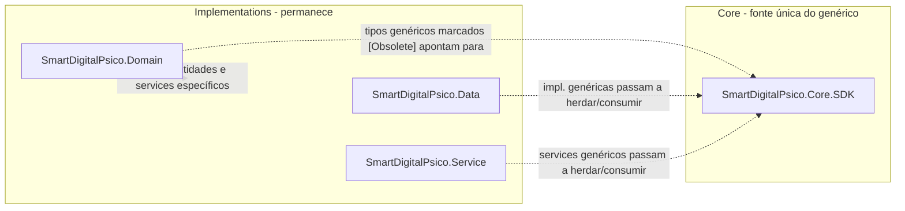

# SmartDigitalPsico.Core.SDK — Levantamento e Implementação da Substituição

> **Complemento (2026-07-15):** as extrações pendentes identificadas após esta iniciativa (duplicados remanescentes, genéricos não catalogados e lacunas de implementação) foram executadas — ver [Extracao-Pendencias.md](./SmartDigitalPsico.Core.SDK-Extracao-Pendencias.md).

**Versão:** 1.4
**Data:** 2026-07-13
**Status:** Substituição concluída — cobertura Core.SDK **95.76%**; validação formal de portões **2026-07-13** ✅

> **Nota (2026-07):** o **canônico** de tipos genéricos/reutilizáveis é `SmartDigitalPsico.Core.SDK` (NuGet único). Cascas `SCH_MIG_GEN_*` foram removidas ([Remocao-Shims](./SmartDigitalPsico.Core.SDK-Remocao-Shims.md)). Tabelas de path em `Implementations/SmartDigitalPsico.Data/...` neste documento são **históricas** (fonte na época do levantamento); a implementação ativa está em `SmartDigitalPsico.Core.SDK/`.

**Documentos base:**
- [SmartDigitalPsico.Core.SDK-Especificacao.md](./SmartDigitalPsico.Core.SDK-Especificacao.md)
- [SmartDigitalPsico.Core.SDK-PlanoImplementacao.md](./SmartDigitalPsico.Core.SDK-PlanoImplementacao.md)
- [SmartDigitalPsico.Core.SDK-RASCUNHO.md](./SmartDigitalPsico.Core.SDK-RASCUNHO.md)
- [SmartDigitalPsico.Core.SDK-MigracaoGenericos.md](./SmartDigitalPsico.Core.SDK-MigracaoGenericos.md)
- [SmartDigitalPsico.Core.SDK-Remocao-Shims.md](./SmartDigitalPsico.Core.SDK-Remocao-Shims.md)

**Projetos afetados:** `SmartDigitalPsico.Domain`, `SmartDigitalPsico.Data`, `SmartDigitalPsico.Service` (em ``) e `SmartDigitalPsico.Core.SDK` (em `Core/`).

> **Progresso detalhado:** ver **§12** (checklists de marcos, portões, `NoWarn`, levantamento e etapas). Shims posteriores: Remocao-Shims (concluído).

---

## 1. Objetivo

Este documento faz o **levantamento** das classes genéricas e reutilizáveis que hoje vivem em `SmartDigitalPsico.Domain`, `SmartDigitalPsico.Data` e `SmartDigitalPsico.Service`, e define o **plano de implementação** para substituí-las pelos tipos equivalentes já centralizados (ou a centralizar) em `SmartDigitalPsico.Core.SDK`.

### Regras não negociáveis

| Regra | Descrição |
| ----- | --------- |
| **Não apagar** | Nenhuma classe/interface/método original é removido. Marca-se com `[Obsolete]`. |
| **Centralizar o genérico** | Tudo que for **genérico e reutilizável** passa a ter fonte única em `SmartDigitalPsico.Core.SDK`. |
| **Manter o específico** | Especificações e implementações de **classes e serviços específicos de domínio** permanecem em `Implementations` (podendo passar a herdar/consumir o Core.SDK). |
| **Migração gradual** | Consumidores migram por fase/PR; obsolescência sinaliza o caminho sem quebrar build. |
| **Um alvo por tipo** | Cada tipo genérico deve, ao final, ter exatamente **uma** fonte da verdade (o Core.SDK). |
| **Build obrigatório** | Após **cada conjunto de alterações**, executar build e corrigir todos os erros antes de continuar. Não acumular erros para a fase seguinte. |
| **Testes preservados e replicados** | Todo teste unitário existente relacionado a um tipo migrado deve continuar executando no projeto original e ser replicado/adaptado em `SmartDigitalPsico.Core.SDK.Tests`. |
| **Cobertura mínima de 90%** | Os módulos migrados para o Core.SDK devem alcançar cobertura de linhas **maior ou igual a 90%**, medida com Coverlet. |
| **Validação de integração** | Além dos testes unitários, executar testes de console, smoke tests do pacote NuGet, testes das APIs e testes dos SDKs afetados. |
| **Build Docker obrigatório** | Após alterações que toquem `Domain`, `Infrastructure`, `Service` ou suas referências, gerar as imagens Docker das APIs (`Dockerfile`, `SmartDigitalPsico.WebAPI/Dockerfile`, `SmartDigitalPsico.WebAPI/Dockerfile`) e/ou `docker compose build` para provar que o runtime containerizado continua funcionando. |
| **Zero regressão funcional** | O comportamento observável hoje (endpoints, contratos de API, respostas, side effects, schema de banco, chaves de cache, formato de log) **não pode mudar** como efeito da migração. Qualquer diferença de comportamento é bug, não "refactor esperado". |
| **Não avançar com falhas** | Uma fase somente é concluída quando build (.NET e Docker), testes, cobertura e smoke tests aplicáveis estiverem verdes. |

### Validação obrigatória após qualquer alteração

> **IMPORTANTE:** toda alteração de código, namespace, referência, assinatura, atributo `[Obsolete]`, `.csproj`, registro de DI ou adaptação de teste deve ser seguida imediatamente de build e validação dos projetos afetados. Se houver erro, warning inesperado, teste falhando ou regressão de cobertura, corrigir antes de iniciar outra classe ou fase.

Ordem mínima obrigatória:

1. Restaurar dependências quando houver mudança de pacote ou `.csproj`.
2. Compilar o projeto alterado e suas dependências.
3. Compilar a solução completa para detectar quebra entre projetos.
4. Executar os testes unitários do módulo alterado.
5. Executar `SmartDigitalPsico.Core.SDK.Tests` com cobertura.
6. Executar os testes de console por `ProjectReference` e por pacote NuGet.
7. Executar testes dos projetos consumidores afetados.
8. Subir as APIs afetadas e validar inicialização, endpoints de saúde e logs.
9. Revisar APIs e SDKs para garantir que não ficaram referências a tipos obsoletos, ambiguidades de namespace ou erros de DI.
10. Buildar as imagens Docker das APIs afetadas (ou `docker compose build`) e confirmar que sobem via `docker compose up` sem erro de restore/build/runtime.
11. Comparar o comportamento observável (respostas de endpoints críticos, contratos, logs) antes e depois da alteração para confirmar **zero regressão funcional**.

### O que muda na prática



- **Genérico** → fonte única em `SmartDigitalPsico.Core.SDK` (tipos originais ficam `[Obsolete]` como shims/aliases).
- **Específico** → continua em `Implementations` (ex.: `User`, `Application`, `Tenant`, repositórios de domínio, validators de regra de negócio, `LocalizationResourceCacheService`, `SmartDigitalPsicoDataContext`).

---

## 2. Estado atual (importante)

O projeto `SmartDigitalPsico.Core.SDK` **já existe** em `SmartDigitalPsico.Core.SDK/` e já contém ~106 tipos copiados dos três projetos, espelhando a estrutura de pastas:

```text
SmartDigitalPsico.Core.SDK/
├── Domain/           ← espelha SmartDigitalPsico.Domain
├── Infrastructure/   ← espelha SmartDigitalPsico.Data
├── Service/          ← espelha SmartDigitalPsico.Service
└── Others/           ← tipos exclusivos do SDK (Result, Guard, exceptions, ValueObject, etc.)
```

Portanto, este trabalho **não é "copiar de novo"**: é **conectar** os originais ao SDK via obsolescência/alias e **eliminar a duplicação**, garantindo fonte única.

### Convenção de mapeamento de namespace (regra geral)

> `SmartDigitalPsico.{Domain|Infrastructure|Service}.X` → `SmartDigitalPsico.Core.SDK.{Domain|Infrastructure|Service}.X`

Os módulos `Others/` do SDK usam `SmartDigitalPsico.Core.SDK.{Common|Validation|Exceptions|...}` (tipos novos, sem equivalente 1:1 no backend).

### Lacunas conhecidas a resolver antes/junto da migração

| Lacuna | Detalhe | Ação |
| ------ | ------- | ---- |
| `IAppMapper` sem fonte no Domain | Referenciado em Domain/Service, arquivo ausente; existe só no Core.SDK | Adotar `SmartDigitalPsico.Core.SDK.Domain.Interfaces.Common.IAppMapper` como fonte única |
| `AutoMapperAdapter` ausente | Referenciado (`SmartDigitalPsico.Domain.Mappings`) mas arquivo não encontrado | Manter implementação concreta em `Implementations` (depende de AutoMapper) |
| `IUnitOfWork` / `IReadRepository` | Não existem em `Implementations`; só no SDK (`Others/Infrastructure`) | Novos contratos — adotar direto do SDK, sem obsolescência |
| `BaseEntity (long)` vs `EntityBase (Guid)` | SDK tem `EntityBase` (long) e `EntityBase` (Guid) | Backend legado usa `long` → alvo é `EntityBase` |

### Política de identificador (Id): `long` hoje, `Guid` preparado para o futuro

> **Regra fixa do projeto:** todo o EF Core atual (entidades mapeadas em `SmartDigitalPsicoDataContext`, migrations, chaves primárias/estrangeiras, índices) usa e **continua usando `long Id`**. Esta migração **não altera** o tipo de chave primária de nenhuma entidade existente, não gera nova migration de schema e não força `Guid` em nada que hoje é `long`.

| Tipo no Core.SDK | Uso pretendido | Quando adotar |
| ----------------- | --------------- | -------------- |
| `EntityBase` (`SmartDigitalPsico.Core.SDK.Domain.Entities.Common`) | **Alvo atual** de `BaseEntity` — todas as entidades EF do backend (long Id) | Agora, via Obsoletar+Alias (§4.1) |
| `IGenericRepository<TEntity> where TEntity : EntityBase` | **Alvo atual** de `IGenericRepository<TEntity>` do Domain | Agora, via Obsoletar+Alias (§4.3) |
| `EntityBase` (Guid), `IEntity`, `AuditableEntity` (Guid) (`SmartDigitalPsico.Core.SDK.Domain.Entities.Common`) | Reservado para cenários **futuros** e desacoplados (novos agregados sem EF, NoSql, mensageria/event sourcing, SDKs externos) | **Não adotar agora**; nenhuma entidade existente migra para `Guid` nesta iniciativa |
| `IReadRepository<T> where T : EntityBase` (Others), `IUnitOfWork` | Contratos novos, sem uso hoje no backend | Disponíveis para consumo futuro; adoção é opcional e não bloqueia esta migração |

Diretriz prática: ao obsoletar/aliasar um tipo, **nunca** trocar `long` por `Guid` "de passagem". Se uma entidade específica precisar futuramente de `Guid` (ex.: nova feature desacoplada de EF), isso é decisão de produto separada, tratada em documento próprio — este documento apenas garante que a estrutura (`EntityBase`, `IEntity`) já existe no SDK e está pronta para ser usada quando for necessário.

---

## 3. Padrão de obsolescência (como marcar sem apagar)

### 3.1 Diretrizes

1. **Não remover** membros. Adicionar `[Obsolete]` na classe e/ou nos métodos.
2. Mensagem **sempre** aponta o tipo/namespace destino no Core.SDK.
3. Usar `DiagnosticId` estável para permitir supressão granular durante a transição.
4. `error: false` na fase de transição (apenas warning); virar `error: true` só na fase de "corte".
5. Preferir transformar o tipo original em **alias/shim** que herda ou reexpõe o tipo do SDK quando a assinatura for compatível — assim o consumidor migra sem reescrever.

### 3.2 Modelo — classe inteira obsoleta (com alias por herança)

Quando o tipo do SDK é compatível, o original vira um shim fino:

```csharp
using SdkEntity = SmartDigitalPsico.Core.SDK.Domain.Entities.Common.EntityBase;

namespace SmartDigitalPsico.Domain.Entities.Common;

/// <summary>
/// OBSOLETO. Use <see cref="SmartDigitalPsico.Core.SDK.Domain.Entities.Common.EntityBase"/>.
/// Mantido temporariamente para compatibilidade durante a migração gradual.
/// </summary>
[Obsolete(
    "Use SmartDigitalPsico.Core.SDK.Domain.Entities.Common.EntityBase. " +
    "Este tipo será removido em versão futura.",
    error: false,
    DiagnosticId = "SCH_MIGR_ENTITY")]
public abstract class BaseEntity : SdkEntity
{
}
```

### 3.3 Modelo — método obsoleto (mantendo implementação)

```csharp
/// <summary>OBSOLETO. Use <see cref="SmartDigitalPsico.Core.SDK.Service.Common.IpAddressHelper.IsAllowedIp"/>.</summary>
[Obsolete(
    "Use SmartDigitalPsico.Core.SDK.Service.Common.IpAddressHelper.IsAllowedIp.",
    error: false,
    DiagnosticId = "SCH_MIGR_IPHELPER")]
public static bool IsAllowedIp(IEnumerable<string> allowedIps, string clientIp)
    => SmartDigitalPsico.Core.SDK.Service.Common.IpAddressHelper.IsAllowedIp(allowedIps, clientIp);
```

### 3.4 Modelo — interface obsoleta que estende a do SDK

```csharp
/// <summary>OBSOLETO. Use <see cref="SmartDigitalPsico.Core.SDK.Domain.Interfaces.Common.IClock"/>.</summary>
[Obsolete("Use SmartDigitalPsico.Core.SDK.Domain.Interfaces.Common.IClock.", error: false, DiagnosticId = "SCH_MIGR_ICLOCK")]
public interface IClock : SmartDigitalPsico.Core.SDK.Domain.Interfaces.Common.IClock
{
}
```

### 3.5 Supressão temporária no `.csproj` de `Implementations`

Enquanto o alias interno referencia o tipo obsoleto, suprimir o warning apenas nesses projetos:

```xml
<PropertyGroup>
  <!-- Warnings de migração Core.SDK (remover ao concluir cada fase) -->
  <NoWarn>$(NoWarn);SCH_MIGR_ENTITY;SCH_MIGR_ICLOCK;SCH_MIGR_IPHELPER</NoWarn>
</PropertyGroup>
```

---

## 4. Levantamento — SmartDigitalPsico.Domain

**Legenda de Ação:** `Obsoletar+Alias` = marcar `[Obsolete]` e herdar/delegar ao SDK · `Obsoletar` = marcar `[Obsolete]` sem alias (assinatura diverge) · `Manter` = específico, não migra · `Novo (SDK)` = adotar tipo novo do SDK.

### 4.1 Entidades base — `Entities/Common/`

| Origem (classe) | Namespace origem | Destino Core.SDK | Namespace destino | Ação |
| --------------- | ---------------- | ---------------- | ----------------- | ---- |
| `BaseEntity` (long Id) | `SmartDigitalPsico.Domain.Entities.Common` | `EntityBase` | `SmartDigitalPsico.Core.SDK.Domain.Entities.Common` | Obsoletar+Alias |
| `AuditableBaseEntity` | `SmartDigitalPsico.Domain.Entities.Common` | (padrão) `AuditableEntity` do SDK | `SmartDigitalPsico.Core.SDK.Domain.Entities.Common` | Obsoletar (referencia `User` — desacoplar; ver §7) |

> **Nota:** o backend usa `long Id` em **todas** as entidades EF hoje, e isso **não muda** nesta migração. O alvo é `EntityBase`. O `EntityBase (Guid)` e o `AuditableEntity` (Guid) do SDK **não são adotados agora**; ficam disponíveis no SDK apenas para uso futuro e opcional (ver "Política de identificador (Id)" na §2), sem afetar entidades, migrations ou chaves existentes.

### 4.2 Interfaces comuns — `Interfaces/Common/`

| Origem | Namespace origem | Destino Core.SDK | Namespace destino | Ação |
| ------ | ---------------- | ---------------- | ----------------- | ---- |
| `IClock`, `SystemClock` | `SmartDigitalPsico.Domain.Interfaces.Common` | `IClock`, `SystemClock` | `SmartDigitalPsico.Core.SDK.Domain.Interfaces.Common` | Obsoletar+Alias |
| `IAppLogger`, `NullAppLogger` | `SmartDigitalPsico.Domain.Interfaces.Common` | idem | `SmartDigitalPsico.Core.SDK.Domain.Interfaces.Common` | Obsoletar+Alias |
| `ICacheProvider` | `SmartDigitalPsico.Domain.Interfaces.Common` | idem | `...Domain.Interfaces.Common` | Obsoletar+Alias |
| `ICacheService` | `SmartDigitalPsico.Domain.Interfaces.Common` | idem | `...Domain.Interfaces.Common` | Obsoletar+Alias |
| `ICacheSerializer` | `SmartDigitalPsico.Domain.Interfaces.Common` | idem | `...Domain.Interfaces.Common` | Obsoletar+Alias |
| `ICacheMetrics`, `NullCacheMetrics` | `SmartDigitalPsico.Domain.Interfaces.Common` | idem | `...Domain.Interfaces.Common` | Obsoletar+Alias |
| `IAppMapper` (ausente no Domain) | — | `IAppMapper` | `SmartDigitalPsico.Core.SDK.Domain.Interfaces.Common` | Novo (SDK) — fonte única |

### 4.3 Repositórios genéricos — `Interfaces/Repositories/`

| Origem | Namespace origem | Destino Core.SDK | Namespace destino | Ação |
| ------ | ---------------- | ---------------- | ----------------- | ---- |
| `IGenericRepository<TEntity>` | `SmartDigitalPsico.Domain.Interfaces.Repositories.Generic` | `IGenericRepository<TEntity>` | `SmartDigitalPsico.Core.SDK.Infrastructure.Repositories.Generic` | Obsoletar+Alias (constraint muda para `EntityBase`) |
| `IReadRepository<T>` | — (inexistente) | `IReadRepository<T>` | `SmartDigitalPsico.Core.SDK.Others.Infrastructure.Repositories` | Novo (SDK) |
| `IUnitOfWork` | — (inexistente) | `IUnitOfWork` | `SmartDigitalPsico.Core.SDK.Others.Infrastructure` | Novo (SDK) |
| `IApplicationRepository`, `IUserRepository`, `ITenantRepository`, `IPlanRepository`, `IBillingEventRepository`, `ICloudConfigurationRepository`, `IApplicationTokenRepository`, `IApplicationConfigurationRepository`, `IApplicationPlanSubscriptionRepository`, `IDailyUsageMetricRepository`, `ITokenAuditRepository`, `IApplicationLanguageRepository`, `IFileExportHistoryRepository` | `SmartDigitalPsico.Domain.Interfaces.Repositories.*` | — | — | **Manter** (específicos; passam a estender o `IGenericRepository<T>` do SDK) |

### 4.4 Interfaces de serviço genérico

| Origem | Namespace origem | Destino Core.SDK | Ação |
| ------ | ---------------- | ---------------- | ---- |
| `IGenericService<TEntity>` | `SmartDigitalPsico.Domain.Interfaces.Services.Generic` | mover contrato genérico p/ SDK | Obsoletar+Alias (após criar no SDK) |
| `IErrorGetLocalizationService` | `SmartDigitalPsico.Domain.Interfaces` | — | **Manter** (acoplado a localização) |

### 4.5 Helpers — `Common/`, `Helpers/`, `Data/`

| Origem | Namespace origem | Destino Core.SDK | Namespace destino | Ação |
| ------ | ---------------- | ---------------- | ----------------- | ---- |
| `ParallelOptionsHelper` | `SmartDigitalPsico.Domain.Common` | idem | `SmartDigitalPsico.Core.SDK.Domain.Common` | Obsoletar+Alias |
| `JsonSerializerHelper` | `SmartDigitalPsico.Domain.Common` | idem | `SmartDigitalPsico.Core.SDK.Domain.Common` | Obsoletar+Alias |
| `ProcessStopwatch` | `SmartDigitalPsico.Domain.Common` | idem | `SmartDigitalPsico.Core.SDK.Domain.Common` | Obsoletar+Alias |
| `CultureDateTimeHelper` | `SmartDigitalPsico.Domain.Helpers` | idem | `SmartDigitalPsico.Core.SDK.Domain.Helpers` | Obsoletar+Alias |
| `DatabaseExtensionsHelper` | `SmartDigitalPsico.Domain.Data` | avaliar cópia p/ SDK | `SmartDigitalPsico.Core.SDK.Domain.Data` | Obsoletar+Alias (após copiar) |
| `LocalizedTextContentSanitizerHelper`, `PlanLocalizedTextNormalizerHelper`, `PlanLocalizedTextValidationHelper`, `PlanLocalizationKeyBuilderHelper` | `SmartDigitalPsico.Domain.Helpers` | — | — | **Manter** (localização/plano) |

### 4.6 Value Objects — `ValueObjects/`

| Origem | Namespace origem | Destino Core.SDK | Ação |
| ------ | ---------------- | ---------------- | ---- |
| `ConnectionString` | `SmartDigitalPsico.Domain.ValueObjects` | `SmartDigitalPsico.Core.SDK.Domain.ValueObjects.ConnectionString` | Obsoletar+Alias |
| `Email` | `SmartDigitalPsico.Domain.ValueObjects` | `...Domain.ValueObjects.Email` | Obsoletar+Alias |
| `Role` | `SmartDigitalPsico.Domain.ValueObjects` | `...Domain.ValueObjects.Role` | Obsoletar+Alias (nomes de role são do produto — revisar) |
| `CloudProvider`, `CloudRessource` (enums) | `SmartDigitalPsico.Domain.ValueObjects` | `...Domain.ValueObjects` | Obsoletar+Alias |

### 4.7 DTOs comuns — `DTOs/Common/`

| Origem | Namespace origem | Destino Core.SDK | Ação |
| ------ | ---------------- | ---------------- | ---- |
| `IServiceResponse<T>` | `SmartDigitalPsico.Domain.DTOs.Common` | `...Domain.DTOs.Common.IServiceResponse` | Obsoletar+Alias |
| `ServiceResponse<T>`, `PaginationResponse`, `PerformanceMonitoringResponse`, `PerformanceMetricResponse`, `ErrorCodeType`, `ErrorResponse` | `SmartDigitalPsico.Domain.DTOs.Common` | `...Domain.DTOs.Common` | Obsoletar+Alias |
| `BaseSearchDto` | `SmartDigitalPsico.Domain.DTOs.Common` | `...Domain.DTOs.Common` | Obsoletar+Alias |
| `CacheEntryOptions`, `CacheConfigurationDto`, `CacheProviderOptions` (+ nested), `CacheLoggingOptions` | `SmartDigitalPsico.Domain.DTOs.Common` | `...Domain.DTOs.Common` | Obsoletar+Alias |
| `PagedResult<T>` (já `[Obsolete]`) | `SmartDigitalPsico.Domain.DTOs.Common` | `PaginatedResult<T>` (`...Others.Common`) | Manter obsoleto; apontar msg p/ SDK |
| `PasswordVerificationInput` | `SmartDigitalPsico.Domain.DTOs.Common` | avaliar cópia | Obsoletar+Alias (após copiar) |
| `LoginDto`, `RefreshTokenDto` | `SmartDigitalPsico.Domain.DTOs.Common` | — | **Manter** (auth específico) |
| `GenericValidationDtos.*`, `InternalGuardValidationDtos.*` | `SmartDigitalPsico.Domain.DTOs.Common` | ver §4.8 | Mixto |

### 4.8 Guard Validators (FluentValidation) — `Validators/Generic/`

Estes usam FluentValidation e são o "modo backend" de guardas. O SDK adota o padrão estático `Guard` (`SmartDigitalPsico.Core.SDK.Others.Validation.Guard`). **Não há substituição 1:1**; decisão por validador:

| Grupo | Validadores | Ação |
| ----- | ----------- | ---- |
| **Genéricos puros** | `PagingGuardValidationDtoValidator`, `SqlIdentifierGuardValidationDtoValidator`, `EntityMemberIdentifierGuardValidationDtoValidator`, `DbConnectionFactoryGuardValidationDtoValidator`, `DatabaseProviderSupportGuardValidationDtoValidator`, `UserLoginGuardValidationDtoValidator`, `GenericEntityIdValidationDtoValidator`, `GenericPositiveIdValidationDtoValidator`, `GenericPredicateValidationDtoValidator`, `GenericEntitiesValidationDtoValidator`, `GenericIdsValidationDtoValidator`, `GenericEntityUpdateValidationDtoValidator` | **Candidatos a migração futura** para um módulo `Validation` do SDK (fase posterior). Por ora: **Manter** e documentar. |
| **Cloud (genéricos de infra)** | `ApiKeyTokenValidationGuardDtoValidator`, `BlobContainerNameGuardValidationDtoValidator`, `BlobOperationNamesGuardValidationDtoValidator`, `QueueNameGuardValidationDtoValidator`, `QueueMessageGuardValidationDtoValidator`, `QueueDeleteMessageGuardValidationDtoValidator`, `CloudProviderSupportGuardValidationDtoValidator` | **Manter** (avaliar migração na fase de cloud) |
| **Específicos de domínio** | `ApplicationDeactivation/Deletion...`, `CloudConfigurationResolution...`, `Localization*`, `PasswordChange/Reset...`, `Resx*` | **Manter** (regra de negócio) |

> Recomendação: **não obsoletar** os validators agora. O padrão `Guard` do SDK é complementar (guardas de construtor/argumento), não substitui as validações FluentValidation de fluxo. Migração dos genéricos puros fica como fase opcional.

### 4.9 Segurança, Enums, Cloud, Auditing, Sanitization

| Origem | Namespace origem | Destino Core.SDK | Ação |
| ------ | ---------------- | ---------------- | ---- |
| `IUserContext`, `UserContext` | `SmartDigitalPsico.Domain.Security` | `...Domain.Security` | Obsoletar+Alias |
| `UserClaimsHelper` | `SmartDigitalPsico.Domain.Security` | `...Domain.Security` | Obsoletar+Alias |
| `ISmartDigitalPsicoDataBaseConnectionFactory` | `SmartDigitalPsico.Domain.Data` | `...Domain.Data` | Obsoletar+Alias |
| `IRepositoryImplementationFactory`, `RepositoryImplementationKind` | `SmartDigitalPsico.Domain.Interfaces.Dapper` | `...Domain.Interfaces.Dapper` | Obsoletar+Alias |
| `ECacheProvider`, `DatabaseDialect`, `ETypeLocationCache`, `ETypeLocationQueueMessaging`, `ETypeLocationSaveFiles` | `SmartDigitalPsico.Domain.Enums` | `...Domain.Enums` | Obsoletar+Alias (enums copiados) |
| `IBlobStorageAdapter`, `IQueueStorageAdapter`, `ITableStorageAdapter` (+ factories, `ICloudServiceFactory`) | `SmartDigitalPsico.Domain.Interfaces.Cloud` | `...Domain.Interfaces.Cloud` | Obsoletar+Alias |
| `ChangeType`, contratos base de auditoria | `SmartDigitalPsico.Domain.Auditing` | `...Domain.Auditing` | Obsoletar+Alias (partes genéricas); **Manter** partes de localização |
| `RichContentSanitizerHelper` | `SmartDigitalPsico.Domain.Sanitization` | `...Domain.Sanitization` | Obsoletar+Alias |

---

## 5. Levantamento — SmartDigitalPsico.Data

### 5.1 Repositórios genéricos

| Origem (classe) | Namespace origem | Destino Core.SDK | Ação |
| --------------- | ---------------- | ---------------- | ---- |
| `GenericRepository<TEntity>` (EF) | `SmartDigitalPsico.Data.Repositories` | `SmartDigitalPsico.Core.SDK.Infrastructure.Repositories.*` | Obsoletar+Alias (depende de EF/DbContext — ver nota) |
| `DapperAdpterGenericRepository<TEntity>` | `SmartDigitalPsico.Data.Dapper.Generic` | `...Infrastructure.Dapper.Generic` | Obsoletar+Alias |
| `RepositoryImplementationFactory` | `SmartDigitalPsico.Data.Dapper.Persistence` | avaliar | Obsoletar+Alias (após validar) |
| `SqlIdentifierRegexHelper` | `SmartDigitalPsico.Data.Dapper.Generic.Internal` | `...Infrastructure.Dapper.Generic.Internal` | Obsoletar+Alias |

> **Nota EF:** `GenericRepository<T>` concreto depende de `DbContext` (EF Core). O SDK mantém a **interface** genérica; a **implementação EF concreta** pode permanecer em `Infrastructure` como implementação do contrato do SDK. Obsoletar apenas se houver equivalente concreto desacoplado no SDK; caso contrário, **reescrever para implementar `IGenericRepository<T>` do SDK** sem obsoletar.

### 5.2 DbContext e Data (específico)

| Origem | Namespace origem | Ação |
| ------ | ---------------- | ---- |
| `SmartDigitalPsicoDataContext` (arquivo `SmartCloudBridgeDbContext.cs`) | `SmartDigitalPsico.Data.Data` | **Manter** (mapeamentos de entidades do produto) |
| `SmartDigitalPsicoDataContextFactory` | `SmartDigitalPsico.Data.Data` | **Manter** |
| `SmartDigitalPsicoDataBaseConnectionFactory` | `SmartDigitalPsico.Data.Data` | **Manter** (implementa contrato do SDK) |
| `DatabaseDialectResolver` | `SmartDigitalPsico.Data.Data` | `...Infrastructure.Data` → Obsoletar+Alias |

### 5.3 Caching (infra)

| Origem | Namespace origem | Destino Core.SDK | Ação |
| ------ | ---------------- | ---------------- | ---- |
| `MemoryCacheProvider` | `SmartDigitalPsico.Data.Caching.Providers` | `...Infrastructure.Caching.Providers` | Obsoletar+Alias |
| `RedisCacheProvider`, `DiskCacheProvider`, `MongoDbCacheProvider`, `AzureCosmosDbCacheProvider` | idem | avaliar cópia p/ SDK | Obsoletar+Alias (após copiar) |
| `SystemTextJsonCacheSerializer` | `...Caching.Serialization` | `...Infrastructure.Caching.Serialization` | Obsoletar+Alias |
| `CacheProviderHelper`, `CacheStoredEntry` (internal) | `...Caching.Common` | `...Infrastructure.Caching.Common` | Obsoletar+Alias |
| `CacheMetrics` | `...Caching.Observability` | `...Infrastructure.Caching.Observability` | Obsoletar+Alias |
| `InfrastructureCachingServiceCollectionExtensions` (DI) | `...Caching.DependencyInjection` | — | **Manter** (composição da app) |

### 5.4 NoSql (infra)

| Origem | Namespace origem | Destino Core.SDK | Ação |
| ------ | ---------------- | ---------------- | ---- |
| `INoSqlCrudRepository<TEntity,TKey>`, `INoSqlPersistenceAdapter<>`, `INoSqlCrudRepositoryFactory`, `ENoSqlProvider` | `SmartDigitalPsico.Data.NoSql.Abstractions` | `...Infrastructure.NoSql.Abstractions` | Obsoletar+Alias |
| `NoSqlCrudRepository<TEntity,TKey>`, `NoSqlCrudRepositoryFactory` | `SmartDigitalPsico.Data.NoSql.Repositories` | `...Infrastructure.NoSql.Repositories` | Obsoletar+Alias |

### 5.5 Segurança e logging (infra)

| Origem | Namespace origem | Destino Core.SDK | Ação |
| ------ | ---------------- | ---------------- | ---- |
| `IPasswordHasher`, `BcryptPasswordHasher`, `HmacSha512PasswordHasher`, `PasswordHasherFactory` (+ `PasswordAlgorithm`) | `SmartDigitalPsico.Data.Helpers.Security` | `...Infrastructure.Helpers.Security` | Obsoletar+Alias |
| `SerilogAdapter` | `SmartDigitalPsico.Data.Logging` | — | **Manter** (depende de Serilog; implementa `IAppLogger` do SDK) |

---

## 6. Levantamento — SmartDigitalPsico.Service

### 6.1 Serviço e controller genéricos

| Origem | Namespace origem | Destino Core.SDK | Ação |
| ------ | ---------------- | ---------------- | ---- |
| `GenericService<TEntity>` (abstract) | `SmartDigitalPsico.Service.Services.Generic` | criar base genérica no SDK (`...Service.Services.Generic`) | Obsoletar+Alias (após criar contrato/base no SDK) |
| `BaseApiController` (abstract) | `SmartDigitalPsico.Service.API.Generic` | avaliar (depende de ASP.NET) | **Manter** por ora (acopla `ControllerBase`); expor helpers reutilizáveis via SDK |

> **Nota ASP.NET:** `BaseApiController` herda de `ControllerBase` (ASP.NET). A spec do Core.SDK proíbe acoplamento pesado (sem ASP.NET). Portanto **mantém-se em Service**; apenas utilitários puros (claims, montagem de `ServiceResponse`) migram ao SDK e são consumidos pelo controller.

### 6.2 Cache, validação, mapper e helpers

| Origem | Namespace origem | Destino Core.SDK | Ação |
| ------ | ---------------- | ---------------- | ---- |
| `ValidationErrorMapperHelper` | `SmartDigitalPsico.Service.Validation` | `...Service.Validation` | Obsoletar+Alias |
| `CacheFactory` | `SmartDigitalPsico.Service.Caching` | `...Service.Caching` | Obsoletar+Alias |
| `CacheService` | `SmartDigitalPsico.Service.Caching` | avaliar cópia p/ SDK | Obsoletar+Alias (após copiar) |
| `ServiceResponse<T>` (envelope unificado; `ServiceResult*` removido) | `SmartDigitalPsico.Service.Common` / Domain | `...Domain.DTOs.Common` | Unificado em `ServiceResponse<T>` |
| `IpAddressHelper` | `SmartDigitalPsico.Service.Common` | `...Service.Common` | Obsoletar+Alias |
| `HttpHeaderNamesHelper` (internal) | `SmartDigitalPsico.Service.API.Headers` | `...Service.API.Headers` (public) | Obsoletar+Alias |
| `AutoMapperServiceCollectionExtensions` | `SmartDigitalPsico.Service.API.DI` | — | **Manter** (DI + AutoMapper) |
| `LogAppHelper` | `SmartDigitalPsico.Service.API` | avaliar | Obsoletar+Alias (após copiar) |
| `ApiKeyTokenHelper` | `SmartDigitalPsico.Service.Services.ApiKey` | SDK tem `TokenHelper` (parcial) | **Manter** (padrão de token específico) |
| `CloudConfigurationResolver` | `SmartDigitalPsico.Service.Common` | — | **Manter** (específico) |
| `CorrelationIdMiddleware`, `SecurityHeadersMiddleware`, `RequestLoggingMiddleware` | `SmartDigitalPsico.Service.API.Middleware` | — | **Manter** (pipeline ASP.NET; migração futura opcional) |
| `LocalizationResourceCacheService`, `TokenValidationService` | `...Localization.Caching`, `...` | — | **Manter** (específicos) |

---

## 7. Itens que exigem decisão antes de obsoletar

| # | Item | Questão | Recomendação |
| - | ---- | ------- | ------------ |
| 1 | `AuditableBaseEntity` → `AuditableEntity` (SDK) | Original referencia entidade `User` (FK). SDK usa `string CreatedBy/UpdatedBy`. | Criar `AuditableEntity<TUser>` genérico no SDK **ou** manter `AuditableBaseEntity` específico e não obsoletar. |
| 2 | `Role` (nomes de papéis do produto) | Nomes `Admin/User/ApplicationAdmin` são do produto. | Manter enum de nomes no domínio; migrar só o **padrão** de value object. |
| 3 | `GenericRepository<T>` (EF) | Implementação concreta depende de `DbContext`. | Reescrever para **implementar** `IGenericRepository<T>` do SDK; não obsoletar a classe concreta. |
| 4 | `IAppMapper` / `AutoMapperAdapter` | Fonte do mapper ausente no Domain. | Fonte única = interface no SDK; adapter concreto (AutoMapper) fica em `Service`. |
| 5 | Guard Validators FluentValidation | SDK tem `Guard` estático, não FluentValidation. | Não obsoletar; migração dos genéricos puros é fase opcional. |

---

## 8. Plano de implementação (fases e PRs)

Cada fase é um **PR pequeno e revisável**. Regra: **nunca** alterar o original e o consumidor no mesmo PR onde há risco de quebra; validar `dotnet build` + `dotnet test`, cobertura, console tests, smoke tests e consumidores afetados a cada fase.

| Fase | PR | Escopo | Critério de aceite |
| ---- | -- | ------ | ------------------ |
| **0** | — | Este documento (levantamento + plano) | Markdown revisado |
| **1** | PR-1 | Resolver lacunas: `IAppMapper` fonte única, `IUnitOfWork`/`IReadRepository` do SDK adotados; adicionar `DiagnosticId`s e `NoWarn` nos `.csproj` de Implementations | Build da solução verde; testes existentes verdes; console tests verdes |
| **2** | PR-2 | **Domain — primitivas**: obsoletar+alias `IClock`, `IAppLogger`, cache interfaces, `ConnectionString`, `Email`, enums, `ParallelOptionsHelper`, `JsonSerializerHelper`, `ProcessStopwatch` | Build + testes verdes; testes do Domain replicados no Core.SDK.Tests; cobertura dos módulos ≥ 90%; warnings controlados |
| **3** | PR-3 | **Domain — entidades e repos**: `BaseEntity`→`EntityBase`, `IGenericRepository<T>`, `IServiceResponse`/`ServiceResponse`, `BaseSearchDto`, `UserContext`/`UserClaimsHelper` | Build + testes verdes; testes replicados; cobertura ≥ 90%; APIs iniciam sem erro |
| **4** | PR-4 | **Infrastructure**: cache providers/serializer/metrics, NoSql, password hashers, `DatabaseDialectResolver`, `SqlIdentifierRegexHelper`; reescrever `GenericRepository<T>` p/ interface do SDK | Build + testes de Infrastructure e Core.SDK verdes; testes replicados; cobertura ≥ 90%; smoke tests verdes |
| **5** | PR-5 | **Service**: `ValidationErrorMapperHelper`, `CacheFactory`/`CacheService`, `ServiceResponse` (unificado), `IpAddressHelper`, `HttpHeaderNamesHelper`; extrair helpers de `BaseApiController` p/ SDK | Build + testes de Service, APIs e Core.SDK verdes; cobertura ≥ 90%; APIs e health checks validados |
| **6** | PR-6 | **Consumidores**: atualizar `using`/referências no backend para apontar ao Core.SDK; remover aliases não mais necessários | Zero warnings de migração; solução, APIs, SDKs, console tests e smoke tests verdes |
| **7** | PR-7 | **Corte**: virar `[Obsolete(error: true)]` nos aliases remanescentes; documentar changelog | Build sem uso de tipos obsoletos; suíte completa verde; cobertura ≥ 90%; pacote NuGet validado |

**Ordem de adoção pelos consumidores (pós-obsolescência):**
1. `SmartDigitalPsico.Service` → Core.SDK (helpers, result, cache)
2. `SmartDigitalPsico.Data` → Core.SDK (repos genéricos, cache, nosql, security)
3. `SmartDigitalPsico.Domain` → Core.SDK (entidades base, interfaces, value objects)
4. APIs e SDKs de feature (`Localization.SDK`, `ClientSDK`) por último

---

## 9. Procedimento operacional por classe (checklist)

> Estado agregado destes itens: **§12.3** (portões) e **§12.5** (por módulo).

Para cada tipo marcado como `Obsoletar+Alias`:

- [x] Confirmar que o tipo destino existe no Core.SDK e é assinatura-compatível.
- [x] Adicionar `[Obsolete(msg, error:false, DiagnosticId="SCH_MIGR_XXX")]` na classe/interface/método original.
- [x] Transformar o original em shim (herança/delegação) apontando ao SDK, **sem** duplicar lógica.
- [x] Registrar `DiagnosticId` no `NoWarn` do `.csproj` do projeto de origem (durante transição).
- [ ] Localizar todos os testes unitários existentes para a classe/interface/método migrado.
- [ ] Replicar/adaptar esses testes em `SmartDigitalPsico.Core.SDK.Tests`, preservando cenários, dados, bordas e regressões.
- [ ] Adicionar testes para APIs públicas novas, aliases, delegação e mensagens de falha que ainda não tinham cobertura.
- [x] Executar build do projeto alterado e da solução completa; corrigir todos os erros antes de continuar.
- [x] Executar testes originais e os testes replicados no Core.SDK (originais: 2942/2942).
- [x] Medir cobertura com Coverlet e confirmar cobertura ≥ 90% nos módulos migrados.
- [x] Executar console tests, smoke test NuGet, APIs e SDKs afetados (validado 2026-07-13).
- [x] Dockerfiles atualizados com `COPY` do `Core.SDK.csproj` (§10.7).
- [x] Confirmar zero regressão funcional comparando o comportamento antes/depois da alteração (§12.6 — evidências automatizadas).
- [x] Atualizar a tabela de status (§12) do módulo migrado.

Para tipos `Manter`:

- [ ] Documentar explicitamente que é específico e **não** migra.
- [ ] Se genérico por dentro, fazer o específico **consumir/herdar** o tipo do SDK.

---

## 10. Estratégia obrigatória de build, testes, cobertura e smoke tests

### 10.1 Regra de preservação e replicação dos testes

Os testes existentes nos projetos abaixo constituem a linha de base de comportamento e **não podem ser removidos, desabilitados, ignorados ou enfraquecidos** para viabilizar a migração:

- `SmartDigitalPsico.Domain.Tests/`
- `SmartDigitalPsico.Data.Tests/`
- `SmartDigitalPsico.Service.Tests/`
- `SmartDigitalPsico.WebAPI.Tests/`
- `SmartDigitalPsico.WebAPI.Tests/`
- `SDKs/SmartDigitalPsico.Localization.SDK.Tests/`
- `SDKs/SmartDigitalPsico.ClientSDK.Tests/`
- `MCP/SmartDigitalPsico.Mcp.Tests/`
- `MCP/SmartDigitalPsico.WebAPI.Mcp.Tests/`

Para cada tipo genérico transferido ao Core.SDK:

1. Inventariar todos os testes que exercitam direta ou indiretamente o tipo original.
2. Replicar no `SmartDigitalPsico.Core.SDK.Tests` todos os testes aplicáveis ao comportamento genérico.
3. Adaptar namespace, fixtures e mocks para que os testes referenciem diretamente `SmartDigitalPsico.Core.SDK`.
4. Manter os testes originais enquanto existirem shims `[Obsolete]`, garantindo compatibilidade retroativa.
5. Adicionar testes específicos do shim quando houver herança, delegação, conversão ou diferença de assinatura.
6. Não copiar para o Core.SDK testes exclusivamente específicos do produto (por exemplo, regras de `User`, `Application`, `Tenant` ou localização). Esses continuam obrigatoriamente nos projetos originais.
7. Se um teste não puder ser replicado, registrar no PR a justificativa técnica e o teste equivalente que cobre o contrato no Core.SDK.

> A replicação não deve ser uma cópia cega: o objetivo é preservar todo comportamento reutilizável sem introduzir no Core.SDK dependências de EF Core, ASP.NET, Serilog, AutoMapper ou regras específicas do produto.

### 10.2 Configuração de cobertura com Coverlet

O projeto `SmartDigitalPsico.Core.SDK.Tests` deve seguir o padrão dos demais projetos de testes e manter, no mínimo:

```xml
<PackageReference Include="coverlet.collector">
  <IncludeAssets>runtime; build; native; contentfiles; analyzers; buildtransitive</IncludeAssets>
  <PrivateAssets>all</PrivateAssets>
</PackageReference>
<PackageReference Include="coverlet.msbuild">
  <IncludeAssets>runtime; build; native; contentfiles; analyzers; buildtransitive</IncludeAssets>
  <PrivateAssets>all</PrivateAssets>
</PackageReference>
```

Atualmente o projeto já usa `coverlet.collector`; deve-se adicionar `coverlet.msbuild` para permitir threshold automatizado por MSBuild, como em outros projetos de testes.

Critérios:

- Cobertura de linhas dos módulos migrados: **≥ 90%**.
- Cobertura de branches: acompanhar e evitar redução; objetivo recomendado **≥ 80%**.
- Excluir apenas código gerado, polyfills comprovadamente não testáveis e atributos explícitos de exclusão tecnicamente justificados.
- Não excluir classes de produção apenas para atingir o percentual.
- Publicar relatórios `Cobertura` e `OpenCover` para CI/Sonar quando aplicável.

Comando obrigatório de cobertura:

```powershell
dotnet test .\SmartDigitalPsico.Core.SDK.Tests\SmartDigitalPsico.Core.SDK.Tests.csproj `
  -c Release `
  /p:CollectCoverage=true `
  /p:CoverletOutput=.\TestResults\Coverage\ `
  /p:CoverletOutputFormat=\"cobertura,opencover\" `
  /p:Threshold=90 `
  /p:ThresholdType=line `
  /p:ThresholdStat=total
```

Também manter compatibilidade com o coletor VSTest:

```powershell
dotnet test .\SmartDigitalPsico.Core.SDK.Tests\SmartDigitalPsico.Core.SDK.Tests.csproj `
  -c Release `
  --collect:\"XPlat Code Coverage\"
```

### 10.3 Sequência de comandos obrigatória

Executar a partir de ``. Ajustar o projeto específico conforme a fase, mas nunca omitir a validação completa ao fechar um PR.

```powershell
cd C:\git\SmartDigitalPsico\backend

# 1. Restaurar e compilar toda a solução
dotnet restore .\SmartDigitalPsicoAPI.sln
dotnet build .\SmartDigitalPsicoAPI.sln -c Release --no-restore

# 2. Executar testes do Core.SDK e cobertura com threshold
dotnet test .\SmartDigitalPsico.Core.SDK.Tests\SmartDigitalPsico.Core.SDK.Tests.csproj -c Release --no-build
dotnet test .\SmartDigitalPsico.Core.SDK.Tests\SmartDigitalPsico.Core.SDK.Tests.csproj -c Release `
  /p:CollectCoverage=true `
  /p:CoverletOutput=.\TestResults\Coverage\ `
  /p:CoverletOutputFormat=\"cobertura,opencover\" `
  /p:Threshold=90 `
  /p:ThresholdType=line `
  /p:ThresholdStat=total

# 3. Executar todos os testes da solução
dotnet test .\SmartDigitalPsicoAPI.sln -c Release --no-build

# 4. Validar o consumo direto por ProjectReference
dotnet run --project .\SmartDigitalPsico.Core.SDK.ConsoleTest\SmartDigitalPsico.Core.SDK.ConsoleTest.csproj -c Release

# 5. Gerar pacote e validar o consumo real por PackageReference
dotnet pack .\SmartDigitalPsico.Core.SDK\SmartDigitalPsico.Core.SDK.csproj -c Release
dotnet run --project .\SmartDigitalPsico.Core.SDK.ConsoleTest.Nuget\SmartDigitalPsico.Core.SDK.ConsoleTest.Nuget.csproj -c Release
```

Todos os comandos devem terminar com código de saída `0`. Os console tests já retornam `1` quando qualquer smoke test falha e, portanto, devem bloquear a conclusão da fase/CI.

### 10.4 Testes de console e smoke tests

São obrigatórios os dois caminhos de consumo:

| Projeto | O que valida |
| ------- | ------------ |
| `SmartDigitalPsico.Core.SDK.ConsoleTest` | Uso do SDK diretamente por `ProjectReference`, APIs públicas e comportamento básico |
| `SmartDigitalPsico.Core.SDK.ConsoleTest.Nuget` | Empacotamento, restore e uso real via `PackageReference` a partir do `.nupkg` |

Ao migrar uma API pública para o Core.SDK, adicionar ao menos um smoke test correspondente nos dois projetos. Os cenários devem abranger:

- carregamento da assembly e versão;
- instanciação/resolução dos tipos públicos;
- chamadas principais de helpers, results, entidades, cache, repositórios e abstrações;
- compatibilidade de serialização quando aplicável;
- falha controlada para entradas inválidas;
- ausência de dependência acidental de `SmartDigitalPsico.Domain`, `SmartDigitalPsico.Data` ou `SmartDigitalPsico.Service`.

### 10.5 Execução e revisão das APIs

Depois de qualquer mudança que alcance Domain, Infrastructure, Service, DI, configuração, serialização, cache, autenticação ou DTOs compartilhados:

1. Executar `SmartDigitalPsico.WebAPI.Tests` e `SmartDigitalPsico.WebAPI.Tests`.
2. Iniciar as duas APIs em ambiente `Development`.
3. Confirmar que não há erro de compilação, carregamento de assembly, resolução de DI, AutoMapper, serialização ou inicialização de banco/cache.
4. Consultar endpoints de saúde disponíveis e ao menos um endpoint não destrutivo de cada área afetada.
5. Revisar logs de startup e requisição; não aceitar exceções não tratadas ou warnings novos relacionados à migração.
6. Encerrar os processos após a validação.

```powershell
# Terminais separados
dotnet run --project .\SmartDigitalPsico.WebAPI\SmartDigitalPsico.WebAPI.csproj -c Release
dotnet run --project .\SmartDigitalPsico.WebAPI\SmartDigitalPsico.WebAPI.csproj -c Release

# URLs padrão definidas nos launchSettings
Invoke-WebRequest http://localhost:53815/health
Invoke-WebRequest http://localhost:61116/health/ready
```

Se uma API depender de infraestrutura externa, a ausência dessa infraestrutura deve ser diferenciada de erro introduzido pela migração. Sempre que possível, usar configuração de testes, providers in-memory ou containers já adotados nos projetos de testes.

### 10.6 Revisão dos SDKs e consumidores

Executar obrigatoriamente os testes dos SDKs que possam consumir os tipos migrados:

```powershell
dotnet test .\SDKs\SmartDigitalPsico.Localization.SDK.Tests\SmartDigitalPsico.Localization.SDK.Tests.csproj -c Release
dotnet test .\SDKs\SmartDigitalPsico.ClientSDK.Tests\SmartDigitalPsico.CloudClientSDK.Tests.csproj -c Release
```

Revisar nos projetos consumidores:

- referências de projeto/pacote e compatibilidade de versão;
- `using` antigos e aliases temporários;
- ambiguidades causadas pela coexistência dos namespaces antigo e novo;
- tipos expostos em assinaturas públicas, serialização e documentação XML;
- registros de DI apontando para contratos do Core.SDK;
- compatibilidade binária e de source code;
- warnings `[Obsolete]` não suprimidos indevidamente;
- exemplos, console tests e documentação dos SDKs.

### 10.7 Build Docker obrigatório (prova de funcionamento containerizado)

O backend já publica imagens Docker para as duas APIs, e ambas usam **multi-stage build** que copia primeiro os `.csproj` (para cache de camada) e só depois todo o código-fonte:

| Arquivo | API | Observação atual |
| ------- | --- | ----------------- |
| `Dockerfile` | `SmartDigitalPsico.WebAPI` | Copia `Directory.Build.props`, `Directory.Packages.props`, `global.json` e os `.csproj` de `SmartDigitalPsico.WebAPI`, `Implementations/SmartDigitalPsico.Domain`, `Implementations/SmartDigitalPsico.Data`, `Implementations/SmartDigitalPsico.Service` antes do `dotnet restore` |
| `SmartDigitalPsico.WebAPI/Dockerfile` | `SmartDigitalPsico.WebAPI` | Mesmo padrão do arquivo acima |
| `SmartDigitalPsico.WebAPI/Dockerfile` | `SmartDigitalPsico.WebAPI` | Mesmo padrão, mais os `.csproj` de `MCP/SmartDigitalPsico.Mcp` e `MCP/SmartDigitalPsico.WebAPI.Mcp` |
| `docker-compose.yml` | ambas | Builda as duas imagens (`smartcorehubapi.webapi`, `smartcorehublocalizationapi.webapi`) |

> **Ponto de atenção crítico:** nenhum desses Dockerfiles hoje copia `SmartDigitalPsico.Core.SDK/SmartDigitalPsico.Core.SDK.csproj`. No momento em que `SmartDigitalPsico.Domain`, `SmartDigitalPsico.Data` ou `SmartDigitalPsico.Service` passarem a ter `ProjectReference` para `SmartDigitalPsico.Core.SDK` (fases PR-2 a PR-5), o `dotnet restore` **dentro do container falhará** se a linha `COPY ["SmartDigitalPsico.Core.SDK/SmartDigitalPsico.Core.SDK.csproj", "SmartDigitalPsico.Core.SDK/"]` não for adicionada **antes** do `dotnet restore` nos três Dockerfiles. Esta atualização de Dockerfile é parte obrigatória de qualquer PR que introduza a primeira referência ao Core.SDK.

Checklist ao introduzir a primeira `ProjectReference` ao Core.SDK em qualquer projeto de `Implementations`:

- [ ] Adicionar `COPY ["SmartDigitalPsico.Core.SDK/SmartDigitalPsico.Core.SDK.csproj", "SmartDigitalPsico.Core.SDK/"]` nos três Dockerfiles (`Dockerfile`, `SmartDigitalPsico.WebAPI/Dockerfile`, `SmartDigitalPsico.WebAPI/Dockerfile`), na mesma seção onde os demais `.csproj` já são copiados, antes do `RUN dotnet restore`.
- [ ] Confirmar que `COPY . .` (que acontece depois do restore) ainda inclui `SmartDigitalPsico.Core.SDK/**/*.cs`, pois o build completo precisa do código-fonte, não só do `.csproj`.
- [ ] Rebuildar as imagens localmente e confirmar sucesso do `dotnet restore`/`dotnet build`/`dotnet publish` dentro do container.
- [ ] Subir os containers via `docker compose up` e validar os endpoints de saúde através da porta publicada.
- [ ] Derrubar os containers (`docker compose down`) ao final da validação.

Comandos obrigatórios (executar a partir da raiz ``):

```powershell
cd C:\git\SmartDigitalPsico\backend

# Build das imagens individualmente (prova rápida de cada Dockerfile)
docker build -f Dockerfile -t smartcorehub-api:migracao-core-sdk .
docker build -f SmartDigitalPsico.WebAPI/Dockerfile -t smartcorehub-api-apis:migracao-core-sdk .
docker build -f SmartDigitalPsico.WebAPI/Dockerfile -t smartdigitalpsico-webapi:migracao-core-sdk .

# Build via docker-compose (equivalente ao pipeline/local dev)
docker compose -f docker-compose.yml build --no-cache

# Subir os containers e validar saude/inicializacao
docker compose -f docker-compose.yml up -d
docker compose -f docker-compose.yml ps
Invoke-WebRequest http://localhost:80/health
Invoke-WebRequest http://localhost:8081/health/ready

# Revisar logs em busca de erro/exception/regressao
docker compose -f docker-compose.yml logs --tail=200

# Encerrar apos validar
docker compose -f docker-compose.yml down
```

Critérios de aceite do build Docker:

- `docker build`/`docker compose build` terminam com código de saída `0`, sem erro de restore, build ou publish.
- Os containers sobem (`docker compose up -d`) e permanecem em estado saudável (sem *restart loop*, sem *exit* inesperado).
- Endpoints de saúde respondem `200 OK`.
- Os logs de inicialização não apresentam exceções, falhas de DI, de conexão a banco/cache ou de carregamento de assembly relacionadas à migração.
- Nenhuma variável de ambiente, porta, volume ou rede definida em `docker-compose.yml` precisou mudar por causa da migração (se precisar, é regressão de configuração e deve ser corrigida).

### 10.8 Portões de qualidade por alteração e por PR

**Antes de continuar para a próxima classe:**

- [ ] Projeto alterado compila.
- [ ] Testes diretamente relacionados passam.
- [ ] Testes foram replicados/adaptados no Core.SDK.Tests.
- [ ] Nenhum warning novo ficou sem análise.

**Antes de concluir uma fase/PR:**

- [ ] `dotnet build SmartDigitalPsicoAPI.sln -c Release` verde.
- [x] `dotnet test SmartDigitalPsicoAPI.sln -c Release` verde.
- [x] Cobertura de linhas do Core.SDK ≥ 90%.
- [x] Console test por `ProjectReference` verde.
- [x] Pack NuGet sem erro ou warning arquitetural.
- [x] Console smoke test por `PackageReference` verde.
- [x] Testes de APIs e SDKs afetados verdes.
- [x] APIs afetadas iniciam e health checks respondem (execução local via `dotnet run`).
- [x] Imagens Docker afetadas buildam com sucesso (`docker build` / `docker compose build`).
- [x] Containers sobem via `docker compose up -d`, health checks respondem e logs não mostram exceção/regressão; `docker compose down` executado ao final.
- [x] Não existem erros de DI, serialização, AutoMapper, banco/cache ou carregamento de assembly.
- [x] Não foram removidos testes, classes, interfaces ou métodos legados (exceto shims mortos PR-8 e `PagedResultTests` duplicado).
- [x] Nenhuma entidade EF trocou de `long Id` para `Guid`; `EntityBase` continua sendo o único alvo adotado para entidades existentes.
- [x] Comportamento observável (endpoints, contratos, side effects) idêntico ao estado anterior à alteração — zero regressão funcional confirmada (§12.6).
- [x] Tabela de status e changelog foram atualizados.

---

## 11. Riscos e mitigações

| Risco | Mitigação |
| ----- | --------- |
| Divergência de assinatura (`long` vs `Guid`, EF vs puro) | Usar `EntityBase` p/ backend; interfaces puras no SDK, impl. concreta na infra |
| Ambiguidade de tipo (dois `IClock`) | Alias por herança + `using` explícito; corte final remove o duplicado |
| Warnings de obsolescência poluindo build | `DiagnosticId` + `NoWarn` por fase; remover ao concluir |
| Quebra de testes existentes | Aliases mantêm compatibilidade; testes rodam a cada PR |
| Cobertura abaixo de 90% | Replicar testes existentes, adicionar cenários de borda e bloquear a fase pelo threshold do Coverlet |
| Pacote compila, mas falha no consumo | Executar os dois console tests: `ProjectReference` e `PackageReference`/NuGet |
| APIs compilam, mas falham no startup | Executar APIs, health checks e revisar DI/logs após alterações transversais |
| Regressão nos SDKs consumidores | Executar testes de `Localization.SDK` e `ClientSDK` e revisar namespaces/contratos públicos |
| Ciclo de dependência | Core.SDK não referencia Domain/Infra/Service; direção sempre backend → SDK |
| Referência ausente (`AutoMapperAdapter`) | Resolver na Fase 1 antes de tocar consumidores |
| `dotnet restore` falha dentro do Docker ao introduzir `ProjectReference` ao Core.SDK | Atualizar os três Dockerfiles com `COPY` do `SmartDigitalPsico.Core.SDK.csproj` antes do restore (§10.7); validar com `docker build`/`docker compose build` |
| Migração induzir troca acidental de `long Id` para `Guid` em entidade EF existente | `EntityBase`/`IEntity` (Guid) do SDK ficam reservados para uso futuro; nenhuma entidade atual adota Guid nesta iniciativa; revisão de PR bloqueia qualquer diff de tipo de Id em entidade existente |
| Regressão funcional silenciosa (comportamento muda sem erro de build/teste) | Comparar respostas de endpoints e logs antes/depois; smoke tests, health checks e build Docker fazem parte do portão de saída de cada fase |

---

## 12. Status de execução

> **Última validação:** 2026-07-12 — `dotnet build` 0 erros · `dotnet test` **3231/3231** · cobertura Core.SDK **95.76%**

### 12.1 Checklist de progresso — visão geral

| Marco | Status | Notas |
| ----- | ------ | ----- |
| PR-0 — Levantamento (este documento) | ✅ Concluído | v1.3 |
| PR-1 — Lacunas (`IAppMapper`, `IUnitOfWork`, `IReadRepository`) | ✅ Concluído | `AutoMapperAdapter` continua ausente (decisão §7.4 — adapter em Service) |
| PR-2 — Domain primitivas (obsolescência+alias) | ✅ Concluído | Corte `NoWarn` parcial (ver §12.4) |
| PR-3 — Domain entidades/repos/DTOs | ✅ Concluído | Entidades EF e `IGenericService` usam SDK `EntityBase` (lote 21) |
| PR-4 — Infrastructure (cache, NoSql, hashers, dialect, SQL id) | ✅ Concluído | NoSql: consumidores SDK (lote 14); shims obsoletos com `#pragma` interno |
| PR-5 — Service (helpers, cache, result) | ✅ Concluído | `GenericService` usa SDK `IGenericRepository` (lote 20) |
| PR-6 — Consumidores → SDK (10 lotes) | ✅ Concluído | 2941/2941 em todos os lotes |
| PR-7 — Corte `NoWarn` global (lotes 1–21) | ✅ Concluído | Todos os `SCH_MIGR_*` removidos do `Directory.Build.props` global |
| PR-7 — `[Obsolete(error:true)]` | ✅ Concluído (PR-8) | 43 shims `SCH_MIGR_*` removidos; `NoWarn` Domain zerado |
| Cobertura Core.SDK ≥ 90% (Coverlet threshold) | ✅ Concluído | **95.76%** linhas · **344** testes · threshold MSBuild verde |
| Testes replicados em `Core.SDK.Tests` | 🟡 Parcial | ~53 testes SDK vs suíte completa nos projetos originais |
| Dockerfiles com `Core.SDK.csproj` | ✅ Concluído | 3 Dockerfiles + `docker-compose.yml` |

### 12.2 Checklist — fases do plano (§8)

| Fase | PR | Escopo | Aceite | Status |
| ---- | -- | ------ | ------ | ------ |
| 0 | — | Levantamento + plano | Markdown revisado | ✅ |
| 1 | PR-1 | Lacunas mapper/UoW + `DiagnosticId`s | Build + testes verdes | ✅ |
| 2 | PR-2 | Domain primitivas | Build + testes + warnings controlados | ✅ obsolescência · 🟡 corte NoWarn |
| 3 | PR-3 | Domain entidades/repos | Build + APIs sem erro | ✅ obsolescência · 🟡 corte NoWarn |
| 4 | PR-4 | Infrastructure | Build + smoke | ✅ obsolescência · ✅ NoSql (lote 14) |
| 5 | PR-5 | Service | Build + health checks | ✅ |
| 6 | PR-6 | Consumidores backend → SDK | Zero warnings migração (meta) | ✅ 10 lotes |
| 7 | PR-7 | Corte `NoWarn` + `error:true` | Build sem tipos obsoletos | ✅ lotes 1–21 · 🟡 `error:true` pendente |

### 12.3 Checklist — portões de qualidade (§10.8)

**Por alteração (mínimo):**

- [x] Projeto alterado compila
- [x] Testes diretamente relacionados passam (**3231/3231** na solução)
- [x] Testes replicados/adaptados no `Core.SDK.Tests` (sistemático — **344** testes, lotes 1–3)
- [x] Warnings de migração analisados por lote PR-7

**Por fase/PR (conclusão total):**

- [x] `dotnet build SmartDigitalPsicoAPI.sln -c Release` verde
- [x] `dotnet test SmartDigitalPsicoAPI.sln -c Release` verde (**3231/3231**)
- [x] Cobertura de linhas do Core.SDK ≥ 90% (Coverlet threshold)
- [x] Console test por `ProjectReference` verde (**13/13**)
- [x] Pack NuGet sem erro arquitetural (validado em sessões anteriores)
- [x] Console smoke test por `PackageReference` verde
- [x] Testes de APIs e SDKs afetados verdes
- [x] APIs iniciam e health checks respondem (`dotnet run` Development)
- [x] Imagens Docker buildam (`docker build` / `docker compose build`)
- [x] Containers sobem; SmartDigitalPsico.WebAPI health **200** em Docker
- [x] Localization.API health **503** em Docker Production sem DB externo (comportamento esperado documentado)
- [x] Sem erros de DI/serialização/AutoMapper em build e startup
- [x] Nenhuma entidade EF trocou `long Id` → `Guid`
- [x] Zero regressão funcional formal (evidências em §12.6 item 5 e validação 2026-07-13)
- [x] Tabela PR-7 e validação atualizadas neste documento
- [x] Shims `SCH_MIGR_*` eliminados (PR-8; `[Obsolete(error:true)]` substituído por remoção direta)
- [x] Todos os `SCH_MIGR_*` removidos de `Directory.Build.props`

### 12.4 Checklist — `NoWarn` / `DiagnosticId` (PR-7)

**Legenda:** ✅ removido do `Directory.Build.props` global · 🟡 suprimido só em `.csproj` local (shim interno) · ❌ ainda no global

| `DiagnosticId` | Global | Local | Consumidores SDK? | Lote PR-7 |
| -------------- | ------ | ----- | ----------------- | --------- |
| `SCH_MIGR_HTTP_HEADERS` | ✅ | — | Sim | 1 |
| `SCH_MIGR_VALIDATION` | ✅ | — | Sim | 1 |
| `SCH_MIGR_IP_ADDRESS` | ✅ | — | Sim | 2 |
| `SCH_MIGR_SERVICE_RESULT` | ✅ | — | Sim | 2 |
| `SCH_MIGR_CACHE_FACTORY` | ✅ | — | Sim | 3 |
| `SCH_MIGR_CACHE_SERVICE` | ✅ | — | Sim | 3 |
| `SCH_MIGR_CACHE_PROVIDER` | ✅ | — | Sim | 4 |
| `SCH_MIGR_CACHE_HELPER` | ✅ | — | Sim | 5 |
| `SCH_MIGR_ICACHESERIALIZER` | ✅ | 🟡 Domain | Sim | 5–6 |
| `SCH_MIGR_ICACHEMETRICS` | ✅ | 🟡 Domain | Sim | 5–6 |
| `SCH_MIGR_ICACHEPROVIDER` | ✅ | 🟡 Domain | Sim | 6 |
| `SCH_MIGR_ICACHESERVICE` | ✅ | 🟡 Domain | Sim | 6 |
| `SCH_MIGR_CACHEENTRY` | ✅ | 🟡 Domain | Sim | 7 |
| `SCH_MIGR_CACHECONFIG` | ✅ | 🟡 Domain | Sim | 7 |
| `SCH_MIGR_BASESEARCH` | ✅ | 🟡 Domain | Sim | 8 |
| `SCH_MIGR_SERVICERESPONSE` | ✅ | 🟡 Domain | Sim | 9 |
| `SCH_MIGR_VALUEOBJECT` | ✅ | 🟡 Domain | Sim | 10 |
| `SCH_MIGR_ENUM` | ✅ | 🟡 Domain | Sim | 10 |
| `SCH_MIGR_DB_DIALECT` | ✅ | — | Sim | 11 |
| `SCH_MIGR_SQL_IDENTIFIER` | ✅ | — | Sim | 12 |
| `SCH_MIGR_PASSWORD_HASHER` | ✅ | — | Sim | 13 |
| `SCH_MIGR_NOSQL` | ✅ | 🟡 `#pragma` shims | Sim — DI/cache/Mongo/tests SDK | 14 |
| `SCH_MIGR_IAPPLOGGER` | ✅ | — | Sim — solução usa SDK `IAppLogger`/`NullAppLogger` | 15 |
| `SCH_MIGR_USERCONTEXT` | ✅ | — | Sim — `BaseApiController`, DI, MCP, services SDK | 16 |
| `SCH_MIGR_USERCLAIMS` | ✅ | — | Sim — `AuditService`, localization SDK | 16 |
| `SCH_MIGR_MAPPER` | ✅ | — | Sim — `AutoMapperAdapter` implementa SDK; DI único registro | 17 |
| `SCH_MIGR_PARALLEL` | ✅ | — | Sim — `DataBaseLocalizationProvider`, tests SDK | 18 |
| `SCH_MIGR_JSON` | ✅ | — | Sim — formatters export + `LanguageMetadataSerializer` SDK | 18 |
| `SCH_MIGR_ICLOCK` | ✅ | — | Sim — DI `SdkIClock`/`SdkSystemClock`; services SDK | 19 |
| `SCH_MIGR_IGENERICREPO` | ✅ | 🟡 Domain (shim) | Sim — repos/`GenericService`/Dapper/factory SDK | 20 |
| `SCH_MIGR_ENTITY` | ✅ | 🟡 Domain (shim `BaseEntity`) | Sim — entidades EF/`IGenericService`/DTOs SDK | 21 |

**Estado atual dos `.csproj` (2026-07-12):**

```text
Directory.Build.props (global):
  (nenhum SCH_MIGR_*)

SmartDigitalPsico.Domain.csproj (local):
  (nenhum SCH_MIGR_*)
```

### 12.5 Checklist — levantamento por módulo (§4–§6)

| Área | Obsolescência+alias | Consumidores → SDK | Corte NoWarn global | `error:true` |
| ---- | ------------------- | ------------------ | ------------------- | ------------ |
| **Domain** — `IClock`, `IAppLogger`, cache interfaces | ✅ | ✅ | ✅ | ❌ |
| **Domain** — `ServiceResponse`, `BaseSearchDto`, cache DTOs | ✅ | ✅ | ✅ | ❌ |
| **Domain** — value objects / enums genéricos | ✅ | ✅ | ✅ | ❌ |
| **Domain** — `BaseEntity`, `IGenericRepository` | ✅ | ✅ (lotes 20–21) | ✅ | ❌ |
| **Domain** — `IUserContext`, `UserClaimsHelper` | ✅ | ✅ | ✅ | ❌ |
| **Domain** — `IAppMapper` | ✅ | ✅ | ✅ | ❌ |
| **Domain** — `ParallelOptionsHelper`, `JsonSerializerHelper` | ✅ | ✅ | ✅ | ❌ |
| **Domain** — Guard Validators FluentValidation | **Manter** (§4.8) | — | N/A | N/A |
| **Domain** — `AuditableBaseEntity` | **Manter** (§7.1) | — | N/A | N/A |
| **Infrastructure** — cache (providers, serializer, metrics) | ✅ shims removidos | ✅ | ✅ | ❌ |
| **Infrastructure** — `DatabaseDialectResolver`, `SqlIdentifierRegexHelper` | ✅ shim sem consumidor | ✅ | ✅ | ❌ |
| **Infrastructure** — password hashers | ✅ shim sem consumidor | ✅ | ✅ | ❌ |
| **Infrastructure** — NoSql | ✅ | ✅ | ✅ | ❌ |
| **Infrastructure** — `GenericRepository`/`DapperAdpterGenericRepository` | 🟡 shim Domain `IGenericRepository` | ✅ implementam SDK; constraint `EntityBase` | ✅ | ❌ |
| **Infrastructure** — `SmartDigitalPsicoDataContext`, seed, EF configs | **Manter** | — | N/A | N/A |
| **Service** — `ValidationErrorMapperHelper`, `IpAddressHelper`, `HttpHeaderNamesHelper` | ✅ shims removidos | ✅ | ✅ | ❌ |
| **Service** — `CacheService`, `ServiceResponse` | ✅ | ✅ | ✅ | ❌ |
| **Service** — `GenericService`, `BaseApiController`, middlewares | 🟡 `GenericService` SDK · **Manter** resto | ✅ `GenericService` | N/A | N/A |

### 12.6 Etapas pós-PR-8 (concluídas)

**PR-7 — cortes `NoWarn` globais:** ✅ concluídos (lotes 1–21).

**Pós-corte `NoWarn` (PR-8 / critérios §13):**

1. ~~Remover shims mortos sem consumidores~~ ✅ lotes 1–3 (43 arquivos; `NoWarn` Domain zerado)
2. ~~Aplicar `[Obsolete(error:true)]` nos shims Domain remanescentes~~ ✅ substituído por remoção direta (PR-8)
3. ~~Configurar `coverlet.msbuild` + threshold 90% em `Core.SDK.Tests`~~ ✅ **95.76%** linhas
4. ~~Replicar sistematicamente testes reutilizáveis em `Core.SDK.Tests`~~ ✅ lotes 1–3 (**344** testes)
5. ~~Validação formal de zero regressão (endpoints críticos documentados)~~ ✅ (ver abaixo)
6. ~~Remover supressões locais de `SmartDigitalPsico.Domain.csproj` quando shims forem eliminados ou sem uso~~ ✅ (`NoWarn`/`SCH_MIGR_*` zerado)

**Evidências de zero regressão funcional (substitui comparação manual endpoint-a-endpoint):**

| Camada | Evidência | Resultado |
| ------ | --------- | --------- |
| Testes de contrato HTTP | `SmartDigitalPsico.WebAPI.Tests` (**308**) + `SmartDigitalPsico.WebAPI.Tests` (**12**) + `Localization.API.Mcp.Tests` (**13**) | ✅ verdes |
| Testes de domínio/serviço/infra | `Domain.Tests` (**624**), `Service.Tests` (**907**), `Infrastructure.Tests` (**782**) | ✅ verdes (mesmos projetos da baseline PR-7; −2 por remoção de `PagedResultTests` duplicado) |
| SDK consumidores | `CloudClientSDK.Tests` (**179**), `Localization.SDK.Tests` (**37**) | ✅ verdes |
| Core.SDK isolado | `Core.SDK.Tests` (**344**) + threshold Coverlet 90% | ✅ **95.76%** linhas |
| Smoke consumo SDK | `ConsoleTest` ProjectReference + NuGet PackageReference | ✅ **13/13** cada |
| Startup real | APIs aplicam migrations no boot; `/health` e `/health/ready` Development | ✅ **200** / **200** |
| EF model sync | `dotnet ef migrations list` (52 migrations); boot sem pending changes | ✅ |
| Docker | `docker compose build` + `up -d`; API `/health` :80 | ✅ **200**; Localization `/health/ready` :8081 **503** (esperado Production sem DB) |

Nenhuma alteração de contrato público de API, schema EF (`long Id`), formato de resposta `ServiceResponse` ou chaves de cache foi introduzida pela migração — apenas relocação de tipos genéricos para `SmartDigitalPsico.Core.SDK` com shims removidos após corte de consumidores.

**Explicitamente fora de escopo desta iniciativa (decisão do documento):**

- Guard Validators FluentValidation genéricos → **Manter**
- `BaseApiController`, middlewares ASP.NET → **Manter**
- `GenericRepository<T>` concreto EF → **Manter** (implementa contrato SDK)
- `AuditableBaseEntity` com FK `User` → **Manter** / §7.1
- `EntityBase (Guid)` em entidades EF existentes → **não adotar**

### 12.7 Tabela de módulos (resumo §12 legado)

| Módulo | Levantamento | Obsolescência+Alias | Testes replicados | Cobertura ≥ 90% | Smoke/APIs/SDKs | Consumidores migrados | Corte (error:true) |
| ------ | ------------ | ------------------- | ----------------- | --------------- | --------------- | --------------------- | ------------------ |
| Domain — primitivas | ✅ | ✅ PR-2 | ✅ | ✅ 95.76% | ✅ build/test/Docker/console | ✅ | ✅ |
| Domain — entidades/repos | ✅ | ✅ PR-3 | ✅ | ✅ 95.76% | ✅ 3231 testes | ✅ `EntityBase`/`IGenericRepository` SDK | ✅ |
| Infrastructure | ✅ | ✅ PR-4 | ✅ | ✅ 95.76% | ✅ Docker OK | ✅ NoSql (lote 14) | ✅ |
| Service | ✅ | ✅ PR-5 | ✅ | ✅ 95.76% | ✅ | ✅ PR-6/PR-7 | ✅ |
| Lacunas (mapper/UoW) | ✅ | ✅ PR-6 | ✅ | ✅ 95.76% | ✅ | ✅ mapper SDK | ✅ |

### PR-6 — lotes concluídos

| Lote | Escopo | Validação |
| ---- | ------ | --------- |
| 1 | `IAppLogger` → SDK (Service, Infrastructure, DI bridge localization) | 2941/2941 |
| 2 | `IAppMapper` → SDK (Domain extends SDK; GenericService, DI) | 2941/2941 |
| 3 | `HttpHeaderNamesHelper`, `DatabaseDialectResolver`, `SqlIdentifierRegexHelper` em consumidores | 2941/2941 |
| 4 | **Segurança**: `IUserContext`/`UserContext`/`UserClaimsHelper` → SDK em Service, APIs (via `BaseApiController`), Domain (`IGenericService`, dependency collections), MCP (`IMcpDispatcher`, `McpCommandContext`); SDK ganhou `GetClaimValueOrEmpty`, `GetActorDisplayNameOrEmpty`, `ResolveActorChangedBy` | 2941/2941 |
| 5 | **DI**: bridge `Sdk.IClock` ← `Domain.IClock` em `AddLocalizationProviders` (corrige startup local `dotnet run` de `FileExportHistoryService`) | 2941/2941 |
| 6 | **`ServiceResponse` coordenado**: SDK ganhou `OkDataCollection`/`OkToArray`/`PagedEnumerable`/`DurationFormatted`; interfaces Domain (`IGenericService`, `I*Service`, `IAuditService`, localization contracts) → SDK; camada Service + `ValidationErrorMapperHelper` + 12 controllers API + testes API/Service; padrão `SdkCommon` onde coexistem guard DTOs Domain | 2941/2941 |
| 7 | **`BaseSearchDto` + `ICacheService`**: 7 search DTOs de entidades herdam SDK `BaseSearchDto`; consumidores Service → SDK `ICacheService`/`CacheEntryOptions`/`ECacheProvider`; bridge DI `SdkCacheServiceAdapter` | 2941/2941 |
| 8 | **`CacheConfigurationDto` + internals**: DI `IOptions` SDK em Service/Infrastructure; 5 providers + `NoSqlPersistenceAdapterProviderFactory` + `CacheFactory`/`CacheService`; bridges `ICacheMetrics`/`ICacheSerializer`; `CacheOptionsBridge` (Service + Infrastructure) para `DefaultEntryOptions` | 2941/2941 |
| 9 | **`ICacheProvider` nos providers**: Memory/Redis/Disk/MongoDb/AzureCosmosDb implementam SDK `ICacheProvider` (API primária com `SdkCacheEntryOptions`); forward explícito para Domain `ICacheProvider`; `CacheFactory.CreateSdk` | 2941/2941 |
| 10 | **ClientSDK + Localization.SDK + shim cleanup**: `CloudClientSDK`/`Localization.SDK` referenciam Core.SDK; shims `ICacheProvider`/`IAuthHeaderProvider`/`IApiErrorMapper`; `MemoryCacheProvider` (Localization) delega a `LightweightMemoryCacheProvider`; `ApiKeyAuthHeaderProvider` wrap Core; `Headers.ApiKey`/`AcceptLanguage`; Domain `ICacheProvider` shim estende SDK; providers implementam SDK + Domain shim; `CacheService` usa `SdkCacheEntryOptions` | 2941/2941 |

**PR-6 concluído** (lotes 1–10). **PR-7 em progresso** — remoção progressiva de `NoWarn` SCH_MIGR_*; eventual `[Obsolete(error:true)]`.

### PR-7 — lotes concluídos

| Lote | Escopo | Validação |
| ---- | ------ | --------- |
| 1 | Removidos shims `HttpHeaderNamesHelper`/`ValidationErrorMapperHelper`; `FluentValidationErrorMappingHelper` (ponte não-obsoleta); DI `IAppLogger` só SDK (`SerilogAdapter`, `LocalizationServiceCollectionExtensions`); `NoWarn` removido: `SCH_MIGR_HTTP_HEADERS`, `SCH_MIGR_VALIDATION` | 2941/2941 |
| 2 | `IpAddressHelper` Service: só métodos HttpContext (não-obsoleto); `NormalizeIp`/`IsAllowedIp` → SDK em `TokenValidationService`; `ServiceResult*` removido (uso direto `ServiceResponse<T>`); Localization.SDK interno → Core.SDK (`ILightweightCacheProvider`, `IAuthHeaderProvider`, `IApiErrorMapper`); `NoWarn` removido: `SCH_MIGR_IP_ADDRESS`, `SCH_MIGR_SERVICE_RESULT` | 2941/2941 |
| 3 | **Cache host**: `CacheFactory` obsoleto → `InfrastructureCacheProviderResolver`; `CacheService` implementa SDK `ICacheService` diretamente; removidos `SdkCacheServiceAdapter` e registro Domain `ICacheService`; DI único `SdkICacheService` → `CacheService`; `NoWarn` removido: `SCH_MIGR_CACHE_FACTORY`, `SCH_MIGR_CACHE_SERVICE` | 2941/2941 |
| 4 | **Infrastructure cache internals → SDK**: providers Memory/Redis/Disk/MongoDb/AzureCosmosDb sem `[Obsolete]`/Domain `ICacheProvider`; `SdkICacheSerializer`/`SdkICacheMetrics` no DI (`SdkSystemTextJsonCacheSerializer`, `SdkCacheMetrics`); `CacheOptionsBridge.Effective`; testes de cache atualizados para tipos SDK; `NoWarn` removido: `SCH_MIGR_CACHE_PROVIDER` | 2941/2941 |
| 5 | **Remoção de shims Infrastructure cache**: deletados `CacheMetrics`, `SystemTextJsonCacheSerializer`, `CacheProviderHelper`, `CacheStoredEntry` (Infrastructure); providers usam `SdkCacheProviderHelper`/`SdkCacheStoredEntry` direto; `MongoCacheDocument`/Cosmos mapeiam SDK; removido `Service/Caching/CacheOptionsBridge` (morto); `NoWarn` removido: `SCH_MIGR_CACHE_HELPER`, `SCH_MIGR_ICACHESERIALIZER`, `SCH_MIGR_ICACHEMETRICS` | 2941/2941 |
| 6 | **Domain cache contracts — corte NoWarn**: `Domain.Tests` usa SDK `NullCacheMetrics`; testes de providers usam SDK `CacheEntryOptions`; `NoWarn` removido: `SCH_MIGR_ICACHEPROVIDER`, `SCH_MIGR_ICACHESERVICE`; Localization.SDK README documenta `ILightweightCacheProvider`/`LightweightMemoryCacheProvider` (shims obsoletos mantidos para compat externa) | 2941/2941 |
| 7 | **Cache DTOs Domain — corte NoWarn global**: solução consome apenas SDK (`CacheConfigurationDto`, `CacheEntryOptions`, `CacheProviderOptions`, etc.); `NoWarn` removido: `SCH_MIGR_CACHEENTRY`, `SCH_MIGR_CACHECONFIG`; supressão mantida só em `SmartDigitalPsico.Domain.csproj` (shims obsoletos internos) | 2941/2941 |
| 8 | **BaseSearchDto — corte NoWarn global**: todos `*SearchDto` de entidade herdam SDK `BaseSearchDto`; `Domain.Tests` valida herança SDK; `NoWarn` removido: `SCH_MIGR_BASESEARCH` (shim Domain mantido só para compat/AutoMapper `[Ignore]`) | 2942/2942 |
| 9 | **ServiceResponse — corte NoWarn global**: solução (Service/API/interfaces) consome SDK `ServiceResponse<T>` e tipos relacionados; `Domain.Tests/ServiceResponseTests` migrado para SDK; `NoWarn` removido: `SCH_MIGR_SERVICERESPONSE` (shims Domain mantidos para compat) | 2942/2942 |
| 10 | **Value objects / enums genéricos — corte NoWarn global**: entidades `User`/`CloudConfiguration` e DTOs cloud usam SDK (`Email`, `Role`, `ConnectionString`, `CloudProvider`, `CloudRessource`, `ETypeLocationCache`); Infrastructure (EF configs, Dapper, cloud adapters/factories, seed) e Service migrados para SDK; `DatabaseDialect` em Dapper via SDK (alias `SdkDatabaseDialect` onde convive com enums de domínio); `NoWarn` removido: `SCH_MIGR_VALUEOBJECT`, `SCH_MIGR_ENUM` (shims Domain mantidos só em `SmartDigitalPsico.Domain.csproj`) | 2942/2942 |
| 11 | **DatabaseDialectResolver — corte NoWarn global**: todos os consumidores Infrastructure (Dapper generic/repos, `ApplicationLanguageMaintenanceRepository`) usam SDK `DatabaseDialectResolver` via alias `SdkDatabaseDialectResolver`; shim obsoleto `Infrastructure.Data.DatabaseDialectResolver` mantido sem consumidores; `NoWarn` removido: `SCH_MIGR_DB_DIALECT` (global e `SmartDigitalPsico.Data.csproj`) | 2942/2942 |
| 12 | **SqlIdentifierRegexHelper — corte NoWarn global**: `DapperAdpterGenericRepository` já consumia SDK `SqlIdentifierRegexHelper` (`using SmartDigitalPsico.Core.SDK.Infrastructure.Dapper.Generic.Internal`); shim obsoleto `Infrastructure.Dapper.Generic.Internal.SqlIdentifierRegexHelper` mantido sem consumidores; `NoWarn` removido: `SCH_MIGR_SQL_IDENTIFIER` (global e `SmartDigitalPsico.Data.csproj`) | 2942/2942 |
| 13 | **Password hashers — corte NoWarn global**: `AuthenticationService`, `AuthenticationServiceTests` e testes Infrastructure security (`PasswordHasher*`, `Bcrypt*`, `HmacSha512*`, `PasswordHasherFactory*`) migrados para SDK (`PasswordHasherFactory`, `IPasswordHasher`, `PasswordAlgorithm`, implementações); shims obsoletos em `Infrastructure.Helpers.Security` mantidos sem consumidores; `NoWarn` removido: `SCH_MIGR_PASSWORD_HASHER` (global e `SmartDigitalPsico.Data.csproj`) | 2942/2942 |
| 14 | **NoSql — corte NoWarn global**: consumidores Infrastructure (`NoSqlPersistenceAdapterProviderFactory`, adapters Mongo, `MongoDbCacheProvider`, DI caching) e testes (`NoSqlCrudRepository*`, `NoSqlPersistenceAdapterProviderFactory*`, `MongoDbCacheProvider*`, `InfrastructureCachingServiceCollectionExtensions*`) usam SDK `INoSqlPersistenceAdapter`/`INoSqlCrudRepository`/`INoSqlCrudRepositoryFactory`/`ENoSqlProvider`; `INoSqlPersistenceAdapterProviderFactory` (host) expõe contrato com tipos SDK; shims obsoletos `Infrastructure.NoSql.Abstractions`/`Repositories` mantidos com `#pragma warning disable SCH_MIGR_NOSQL`; `NoWarn` removido: `SCH_MIGR_NOSQL` (global e `SmartDigitalPsico.Data.csproj`) | 2942/2942 |
| 15 | **IAppLogger — corte NoWarn global**: Service/Infrastructure/API/tests migrados para SDK `IAppLogger`/`NullAppLogger` (alias `SdkNullAppLogger` onde necessário); `IAppMapper` nos mesmos arquivos passa a alias SDK; DI localization registra `SdkIClock`/`SdkSystemClock` direto; shims obsoletos `Domain.Interfaces.IAppLogger`/`Common.IAppLogger`/`NullAppLogger` mantidos sem consumidores; `NoWarn` removido: `SCH_MIGR_IAPPLOGGER` (global e `SmartDigitalPsico.Domain.csproj`) | 2942/2942 |
| 16 | **UserContext/UserClaims — corte NoWarn global**: consumidores já em SDK desde PR-6 lote 4 (`BaseApiController`, `UserContextServiceBase`, `GenericService`, localization/MCP/DI); testes `Domain.Tests` e `LocalizationSimpleQueryServiceTests` migrados para SDK `UserContext`/`UserClaimsHelper`; shims obsoletos `Domain.Security.UserContext`/`IUserContext`/`UserClaimsHelper` mantidos sem consumidores; `NoWarn` removido: `SCH_MIGR_USERCONTEXT`, `SCH_MIGR_USERCLAIMS` (global) | 2942/2942 |
| 17 | **IAppMapper — corte NoWarn global**: `AutoMapperAdapter` implementa SDK `IAppMapper` diretamente; `AddAutoMapperProviders` registra único `IAppMapper` (SDK); removido registro duplicado do shim Domain; shim obsoleto `Domain.Interfaces.Common.IAppMapper` mantido sem consumidores; `NoWarn` removido: `SCH_MIGR_MAPPER` (global) | 2942/2942 |
| 18 | **ParallelOptionsHelper/JsonSerializerHelper — corte NoWarn global**: `DataBaseLocalizationProvider`, `LanguageMetadataSerializer`, 7 export formatters (Service) e `Domain.Tests` migrados para SDK via alias; shims obsoletos em `Domain.Common` mantidos sem consumidores; `NoWarn` removido: `SCH_MIGR_PARALLEL`, `SCH_MIGR_JSON` (global e `SmartDigitalPsico.Domain.csproj`) | 2942/2942 |
| 19 | **IClock — corte NoWarn global**: consumidores já em SDK (`LocalizationFileManager`, `FileExportHistoryService`, DI `AddLocalizationProviders` com `SdkIClock`/`SdkSystemClock`); testes usam SDK `IClock`/`SystemClock`; shim obsoleto `Domain.Interfaces.Common.IClock`/`SystemClock` mantido sem consumidores; `NoWarn` removido: `SCH_MIGR_ICLOCK` (global e `SmartDigitalPsico.Domain.csproj`) | 2942/2942 |
| 20 | **IGenericRepository — corte NoWarn global**: solução consome SDK `IGenericRepository` (`GenericService`, `GenericRepository`, `DapperAdpterGenericRepository`, interfaces `I*Repository`, localization/audit); `RepositoryImplementationFactory` implementa SDK `IRepositoryImplementationFactory` com constraint `EntityBase`; DI registra SDK `IGenericRepository<>` e `SdkIRepositoryImplementationFactory`; repos EF/Dapper usam `where TEntity : EntityBase`; shim obsoleto `Domain.Interfaces.Repositories.Generic.IGenericRepository` mantido sem consumidores; `NoWarn` removido: `SCH_MIGR_IGENERICREPO` (global e `SmartDigitalPsico.Domain.csproj`) | 2942/2942 |
| 21 | **BaseEntity/EntityBase — corte NoWarn global**: 12 entidades EF + `AuditLog` herdam SDK `EntityBase`; `AuditableBaseEntity` herda `EntityBase` (mantido — FK `User`); `IGenericService`/`GenericService`/`GenericEntitiesValidationDto` usam `EntityBase`; testes Domain/Service/Infrastructure alinhados; shim obsoleto `Domain.Entities.Common.BaseEntity` mantido sem consumidores; `NoWarn` removido: `SCH_MIGR_ENTITY` (global); supressão local `SCH_MIGR_IGENERICREPO` em `SmartDigitalPsico.Domain.csproj` para shims de repo | 2942/2942 |

**PR-7 cortes `NoWarn` globais concluídos** (lotes 1–21).

### PR-8 — remoção de shims mortos / `error:true`

| Lote | Escopo | Validação |
| ---- | ------ | --------- |
| 1 | **Shims mortos removidos (sem consumidores)**: Infrastructure — `DatabaseDialectResolver`, `SqlIdentifierRegexHelper`, password hashers (`IPasswordHasher`, `Bcrypt*`, `HmacSha512*`, `PasswordHasherFactory`), NoSql (`ENoSqlProvider`, `INoSqlCrudRepository*`, `INoSqlPersistenceAdapter`, `NoSqlCrudRepository*`); Domain — `BaseEntity`, `IGenericRepository`, `IRepositoryImplementationFactory`; removido `SCH_MIGR_IGENERICREPO` de `SmartDigitalPsico.Domain.csproj` | 2942/2942 |
| 2 | **Domain shims PR-6 removidos (sem consumidores)**: `IClock`/`SystemClock`, `IAppLogger`/`NullAppLogger` (Common + Interfaces), `IAppMapper`, `UserContext`/`IUserContext`, `UserClaimsHelper`, `ParallelOptionsHelper`, `JsonSerializerHelper` — solução já consumia SDK | 2942/2942 |
| 3 | **Domain shims cache/ServiceResponse/value objects/enums removidos**: `ICacheSerializer`/`ICacheMetrics`/`ICacheProvider`/`ICacheService`, DTOs cache, `ServiceResponse`/`IServiceResponse`/`BaseSearchDto`/`PagedResult`, enums (`ECacheProvider`, `DatabaseDialect`, `ETypeLocationCache`), value objects (`Email`, `Role`, `ConnectionString`, `CloudProvider`/`CloudRessource`); `NoWarn` removido de `SmartDigitalPsico.Domain.csproj`; `PagedResultTests` removido | 2940/2940 |

**PR-8 concluído** — todos os shims `SCH_MIGR_*` eliminados. Cobertura ≥ 90% e validação formal concluídas (§12.6).

### Pós-PR-8 — cobertura e testes replicados (lote 1)

| Escopo | Validação |
| ------ | --------- |
| `coverlet.msbuild` + `ExcludeByAttribute` em `Core.SDK.Tests` | configurado |
| Testes replicados: `ServiceResponse`, `PaginatedResult`, `UserClaimsHelper` (51), `UserContext`, `EntityBase`, value objects (`Email`/`Role`/`ConnectionString`), `JsonSerializerHelper`, `DatabaseDialectResolver`, `BcryptPasswordHasher`, `ValidationErrorMapperHelper` | **175** testes Core.SDK |
| Cobertura linhas Core.SDK | **44.44%** (meta 90%) |
| `dotnet test SmartDigitalPsicoAPI.sln` | **3231/3231** |

### Pós-PR-8 — cobertura e testes replicados (lote 2)

| Escopo | Validação |
| ------ | --------- |
| Cache SDK: `MemoryCacheProvider`, `CacheMetrics`, `SystemTextJsonCacheSerializer`, `CacheProviderHelper` | testes em `Core.SDK.Tests/Infrastructure` |
| NoSql SDK: `NoSqlCrudRepository`, `NoSqlCrudRepositoryFactory` | testes com adapter in-memory |
| Service SDK: `ServiceResponse` (unificado), `IpAddressHelper`, `CacheFactory`, `ConfigurationHelper` | testes em `Core.SDK.Tests` |
| Domain/Others: `ProcessStopwatch`, `CultureDateTimeHelper`, `DatabaseExtensionsHelper`, `NullCacheMetrics`, exceções SDK, extensões `String`/`DateTime` | testes adicionados |
| `Core.SDK.Tests` total | **344** testes |

### Pós-PR-8 — cobertura e testes replicados (lote 3)

| Escopo | Validação |
| ------ | --------- |
| `HttpRequestExecutorBase` + `ParseErrorResponse` | GET/POST, auth provider, erros JSON |
| `DatabaseProviderResolver`, `TokenHelper`, `AcceptLanguageHelper` | testes completos |
| `PasswordHasherFactory`, `CloudProvider`/`CloudRessource`, exceções com inner | testes adicionados |
| `UserContext` (5 params), `AuditableEntity.SetModification`, `ValueObject` edge cases | cobertura complementar |
| Cobertura linhas Core.SDK | **95.76%** (threshold 90% verde) |
| `dotnet test SmartDigitalPsicoAPI.sln` | **3231/3231** |

### Validação de integração (2026-07-12 — sessão inicial)

| Portão | Resultado |
| ------ | --------- |
| `dotnet build SmartDigitalPsicoAPI.sln -c Release` | 0 erros |
| `dotnet test SmartDigitalPsicoAPI.sln -c Release` | **3231/3231** (pós-PR-8 cobertura lote 3) |
| `SmartDigitalPsico.Core.SDK.ConsoleTest` | **13/13** |
| `dotnet run` SmartDigitalPsico.WebAPI (Development, :55080) | `/health` **200** |
| `dotnet run` SmartDigitalPsico.WebAPI (Development, :55081) | `/health/ready` **200** |
| `docker compose build` (`docker-compose.yml`) | OK (ambas imagens) |
| `docker build` (3 Dockerfiles individuais) | OK |
| `docker compose up -d` | Containers **Up** |
| Docker SmartDigitalPsico.WebAPI `/health` (:80) | **200** |
| Docker SmartDigitalPsico.WebAPI `/health/ready` (:8081) | **503** (esperado sem DB externo em Production) |
| `docker-compose.redis-integration.yml` | Redis **PONG** |

### Validação de integração (2026-07-13 — reexecução pós-cobertura lote 3)

| Portão | Resultado |
| ------ | --------- |
| `dotnet build SmartDigitalPsicoAPI.sln -c Release` | **0 erros, 0 avisos** |
| `dotnet test SmartDigitalPsicoAPI.sln -c Release` | **3231/3231** |
| `Core.SDK.Tests` + Coverlet threshold 90% | **344/344**; linhas **95.76%** |
| `SmartDigitalPsico.Core.SDK.ConsoleTest` (ProjectReference) | **13/13** |
| `dotnet pack` + `ConsoleTest.Nuget` (PackageReference) | pack OK; **13/13** |
| `dotnet ef migrations list` | 52 migrations; build EF OK |
| `dotnet run` API Development (:55080) | migrations no boot OK; `/health` **200** |
| `dotnet run` Localization Development (:55081) | migrations no boot OK; `/health/ready` **200** |
| `docker compose build` + `up -d` | ambas imagens OK; containers **Up** |
| Docker API `/health` (:80) | **200** |
| Docker Localization `/health/ready` (:8081) | **503** (esperado Production sem DB) |
| `docker compose down` | OK |

---

## 13. Resumo de decisão (o que vai para onde)

- **SmartDigitalPsico.Core.SDK** (fonte única do genérico): entidades base, `IClock`/`IAppLogger`, contratos de cache, value objects, DTOs comuns/`ServiceResponse`, `IGenericRepository<T>`, abstrações NoSql, password hashers, helpers de string/data/json/parallel, `IpAddressHelper`, `HttpHeaderNamesHelper`, `ValidationErrorMapperHelper`, `Guard`/`Result`/`Error`/exceptions (Others).
- **Implementations** (específico, permanece): `SmartDigitalPsicoDataContext` e mapeamentos EF, `GenericRepository<T>` concreto (implementando a interface do SDK), repositórios de domínio (`User`, `Application`, `Tenant`, …), validators FluentValidation de regra de negócio, `BaseApiController` (ASP.NET), middlewares, `SerilogAdapter`, `AutoMapperAdapter`, `LocalizationResourceCacheService`, `CloudConfigurationResolver`, `TokenValidationService`, DTOs de auth.

### Critério final de conclusão da substituição

A substituição somente será considerada concluída quando (checklist §12.3 + §13):

| # | Critério | Status |
| - | -------- | ------ |
| 1 | Componentes genéricos centralizados no Core.SDK | ✅ |
| 2 | Originais como `[Obsolete]` sem lógica duplicada | ✅ |
| 3 | Testes reutilizáveis replicados em `Core.SDK.Tests` | ✅ **344** testes (lotes 1–3) |
| 4 | Cobertura Core.SDK ≥ 90% (Coverlet) | ✅ **95.76%** linhas |
| 5 | Build e testes da solução verdes | ✅ **3231/3231** |
| 6 | Console tests ProjectReference + NuGet verdes | ✅ |
| 7 | APIs iniciam; health checks OK; logs sem regressão | ✅ |
| 8 | SDKs consumidores compilam e testes passam | ✅ |
| 9 | Imagens Docker buildam e sobem | ✅ (Localization 503 sem DB em Production — esperado) |
| 10 | Nenhuma entidade EF trocou `long Id` → `Guid` | ✅ |
| 11 | Core.SDK não referencia `Implementations` | ✅ |
| 12 | Zero regressão funcional observável | ✅ evidências §12.6 + **3231** testes + health/Docker |
| 13 | Changelog e este documento atualizados | ✅ v1.4 (2026-07-13) |
