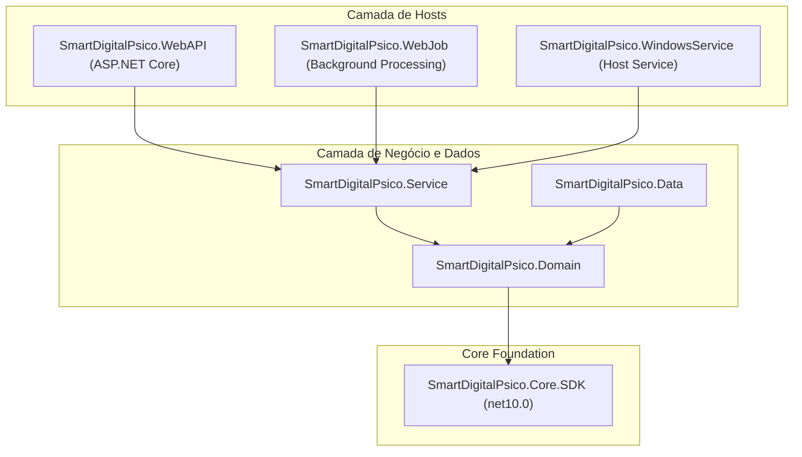

# SmartDigitalPsico.Core.SDK — Levantamento Técnico

Levantamento estrutural, arquitetural e inventário de componentes do projeto **`SmartDigitalPsico.Core.SDK`**.

---

## 1. Visão Geral e Contexto

O **SmartDigitalPsico.Core.SDK** é a biblioteca central e pacote NuGet reutilizável do ecossistema **SmartDigitalPsico**. Ele concentra primitivas de domínio, contratos de persistência, abstrações de infraestrutura, utilitários, serviços genéricos e extensões de injeção de dependência (DI).

### Informações do Pacote

| Propriedade | Valor |
| ----------- | ----- |
| **Identificador do Pacote (`PackageId`)** | `SmartDigitalPsico.Core.SDK` |
| **Assembly / Namespace Raiz** | `SmartDigitalPsico.Core.SDK` |
| **Target Framework** | `net10.0` |
| **Solução** | `SmartDigitalPsicoAPI.sln` |
| **Projeto de Testes** | `SmartDigitalPsico.Core.SDK.Tests` |

---

## 2. Diagrama de Dependências do Ecossistema

O `SmartDigitalPsico.Core.SDK` atua como a fundação de baixo nível para todas as camadas e hosts da solução:



### Regras Fundamentais de Dependência

1. **Isolamento de Negócio:** O `SmartDigitalPsico.Core.SDK` **não possui** qualquer dependência com entidades de negócio específicas (como `Patient`, `Medical`, `User`, etc.).
2. **Direção Unidirecional:** O SDK fornece contratos, interfaces e implementações genéricas. As camadas de negócio especializam e estendem esses tipos.

---

## 3. Inventário de Camadas do SDK

O projeto está modularizado internamente nas seguintes camadas lógicas:

```text
SmartDigitalPsico.Core.SDK/
├── API/                    # Base de controllers, filtros e extensões de pipeline HTTP
├── Data/                   # Adaptadores EF Core, repositórios genéricos e persistência em cache/arquivo
├── Domain/                 # Entidades base, DTOs, interfaces, helpers, hypermedia, relatórios e segurança
├── Infrastructure/         # Adaptadores de logging (Serilog) e mapeamento (AutoMapper)
└── Service/                # Serviço genérico CRUD, infraestrutura Azure/SMTP e extensões DI
```

### 3.1 Módulo API (`SmartDigitalPsico.Core.SDK.API`)

- **Objetivo:** Fornecer suporte e abstração padronizada para controllers REST.
- **Principais componentes:**
  - `ApiBaseController`: Controller base com suporte a cultura, headers, autorização e respostas padronizadas.
  - `LanguageActionFilterAttribute`: Filtro global para captura de `Accept-Language` e configuração de `CultureInfo`.

### 3.2 Módulo Data (`SmartDigitalPsico.Core.SDK.Data`)

- **Objetivo:** Fornecer suporte a persistência relacional (EF Core), NoSQL (Azure Table/Queue) e cache local.
- **Principais componentes:**
  - `GenericRepositoryEntityBase<T>`: Repositório genérico com operações CRUD e paginação assíncrona.
  - `DbContextEntityDataContextAdapter`: Adaptador unificado para o contexto do EF Core (`IEntityDataContext`).
  - `EntityBaseConfiguration`: Configuração padrão de mapeamento Fluent API para `EntityBase`.
  - `MemoryCacheRepository` e `DiskCacheRepository`: Estratégias de cache em memória e em disco.
  - `FileDiskRepository`: Manipulação física de arquivos no sistema de arquivos local.
  - `GenericTableEntityRepository` e `GenericStorageQueueRepository`: Abstrações para Azure Tables e Queues.

### 3.3 Módulo Domain (`SmartDigitalPsico.Core.SDK.Domain`)

- **Objetivo:** Centralizar contratos fundamentais, tipos de valor e utilitários compartilhados.
- **Principais componentes:**
  - `EntityBase`: Classe base para entidades com chave primária `long`, status `Enable` e auditoria de datas.
  - `ServiceResponse<T>` / `ErrorResponse`: Envelope padrão para transporte de resultados de operação.
  - **Hypermedia (HATEOAS):** `ContentResponseEnricher`, `HyperMediaLink`, `PagedSearchVO`, `HyperMediaFilterrAttribute`.
  - **Segurança & Criptografia:** `CryptoService`, `CryptoAdapterFactory`, `AesCryptoAdpter`, `RsaCryptoAdpter`, `TokenService`.
  - **Relatórios:** `QuestPDFReportAdapter`, `PDFsharpMigraDocReportAdapter`, `ExcelGeneratorOpenXmlAdapter`.
  - **Resiliência:** `ResiliencePolicies`, `ResiliencePolicyConfig`.
  - **Helpers:** `DateHelper`, `FileHelper`, `DirectoryHelper`, `CultureHelper`, `CharHelper`, `CriptoHelper`, `SanitizeHelper`, `TypeValidatorHelper`.

### 3.4 Módulo Infrastructure (`SmartDigitalPsico.Core.SDK.Infrastructure`)

- **Objetivo:** Adaptadores para bibliotecas externas de corte transversal.
- **Principais componentes:**
  - **Logging:** `IAppLogger`, `SerilogAppLoggerAdapter`, `AppLoggerServiceCollectionExtensions`.
  - **Mapping:** `IAppMapper`, `AutoMapperAppMapperAdapter`, `AppMapperServiceCollectionExtensions`.

### 3.5 Módulo Service (`SmartDigitalPsico.Core.SDK.Service`)

- **Objetivo:** Fornecer serviços genéricos de aplicação e métodos de extensão para DI no `Program.cs`.
- **Principais componentes:**
  - `EntityBaseService<TEntity, TResult>`: Implementação de serviço de aplicação CRUD desacoplada com AutoMapper.
  - `AzureStorageBlobAdapter`, `AzureStorageQueueAdapter`, `AzureStorageTableAdapter`: Adapters Azure Storage.
  - `EmailService`, `EmailContext`, `EmailStrategyFactory`, `SmtpEmailStrategy`: Gerenciamento de e-mails.
  - `CacheService`: Gerenciador centralizado de estratégias de cache (Memory, Disk).
  - **Configurações DI (`Service/Configure/`):** Swagger, JWT Bearer, CORS, Caching, Logging, Mapping, SMTP, MvcControllers, ReportInfrastructure, StorageQueue, etc.

---

## 4. Matriz de Tipos e Contratos

| Contrato | Implementação Padrão | Camada | Finalidade |
| -------- | -------------------- | ------ | ---------- |
| `IEntityBase` | `EntityBase` | Domain | Contrato de identidade e auditoria |
| `IServiceResponse<T>` | `ServiceResponse<T>` | Domain | Envelope padronizado de resposta de serviço |
| `IEntityBaseRepository<T>` | `GenericRepositoryEntityBase<T>` | Data | Operações genéricas de banco de dados |
| `IEntityDataContext` | `DbContextEntityDataContextAdapter` | Data | Abstração do DbContext do EF Core |
| `IEntityBaseService<TEntity, TResult>` | `EntityBaseService<TEntity, TResult>` | Service | Camada de serviço genérica com DTO mapping |
| `IAppLogger` | `SerilogAppLoggerAdapter` | Infrastructure | Abstração de logs estruturados |
| `IAppMapper` | `AutoMapperAppMapperAdapter` | Infrastructure | Abstração de mapeamento de objetos |
| `ICryptoService` | `CryptoService` | Domain | Criptografia simétrica e assimétrica |
| `ITokenService` | `TokenService` | Domain | Geração e validação de tokens JWT |
| `ICacheService` | `CacheService` | Service | Orquestrador de cache (Memory / Disk) |
| `IEmailService` | `EmailService` | Service | Orquestrador de envio de e-mails |
| `IExcelGenerator` | `ExcelGeneratorOpenXmlAdapter` | Domain | Geração de planilhas Excel via OpenXML |
| `IPdfReportAdapter` | `QuestPDFReportAdapter`, `PDFsharpMigraDocReportAdapter` | Domain | Geração de PDFs |
| `IStorageBlobAdapter` | `AzureStorageBlobAdapter` | Service | Integração com Azure Blob Storage |
| `IStorageQueueAdapter` | `AzureStorageQueueAdapter` | Service | Integração com Azure Queue Storage |

---

## 5. Relação com os Demais Documentos

- [Especificação - API](./SmartDigitalPsico.Core.SDK.Especificacao.API.md)
- [Especificação - Data](./SmartDigitalPsico.Core.SDK.Especificacao.Data.md)
- [Especificação - Domain](./SmartDigitalPsico.Core.SDK.Especificacao.Domain.md)
- [Especificação - Service](./SmartDigitalPsico.Core.SDK.Especificacao.Service.md)
- [Plano de Implementação Geral](./SmartDigitalPsico.Core.SDK.PlanoImplementacao.md)
- [Plano de Implementação - API](./SmartDigitalPsico.Core.SDK.PlanoImplementacao.API.md)
- [Plano de Implementação - Data](./SmartDigitalPsico.Core.SDK.PlanoImplementacao.Data.md)
- [Plano de Implementação - Domain](./SmartDigitalPsico.Core.SDK.PlanoImplementacao.Domain.md)
- [Plano de Implementação - Service](./SmartDigitalPsico.Core.SDK.PlanoImplementacao.Service.md)
- [Progresso e Status](./SmartDigitalPsico.Core.SDK.Progresso.md)
