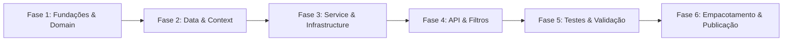

# SmartDigitalPsico.Core.SDK — Plano de Implementação Geral

Plano mestre de governança, ciclo de vida, arquitetura e empacotamento do **`SmartDigitalPsico.Core.SDK`**.

---

## 1. Visão Geral

O `SmartDigitalPsico.Core.SDK` consolida os módulos transversais do ecossistema SmartDigitalPsico em uma biblioteca unificada .NET 10.0 (`net10.0`). Este documento estabelece as diretrizes de versionamento, empacotamento NuGet, pipeline de testes e regras de evolução da base de código.

---

## 2. Metadados do Pacote e Empacotamento NuGet

O projeto `SmartDigitalPsico.Core.SDK.csproj` é configurado para geração de pacote NuGet:

```xml
<PropertyGroup>
  <TargetFramework>net10.0</TargetFramework>
  <ImplicitUsings>enable</ImplicitUsings>
  <Nullable>enable</Nullable>
  <PackageId>SmartDigitalPsico.Core.SDK</PackageId>
  <Authors>SmartDigitalPsico Team</Authors>
  <Company>SmartDigitalPsico</Company>
  <Description>Core SDK com primitivas, contratos, serviços genéricos e infraestrutura reutilizável para o ecossistema SmartDigitalPsico.</Description>
  <Version>1.0.0</Version>
</PropertyGroup>
```

### Diretrizes de Versionamento Semântico (SemVer)

- **MAJOR (X.0.0):** Alterações de breaking change em contratos públicos (`IEntityBase`, `GenericRepositoryEntityBase`, `ServiceResponse`, etc.).
- **MINOR (1.X.0):** Adição de novos métodos de extensão, novos adaptadores de infraestrutura ou novos helpers sem quebrar compatibilidade retroativa.
- **PATCH (1.0.X):** Correções de bugs internos, melhorias de performance e refatorações que não alterem a assinatura pública.

---

## 3. Fases do Ciclo de Implementação e Consolidação



| Fase | Escopo | Entregáveis | Status |
| ---- | ------ | ----------- | ------ |
| **Fase 1** | Fundações & Domain | `EntityBase`, `ServiceResponse<T>`, Helpers, Hypermedia, Cripto/Tokens | ✅ Concluído |
| **Fase 2** | Data & Context | `GenericRepositoryEntityBase<T>`, Context Adapters, Cache Repositories | ✅ Concluído |
| **Fase 3** | Service & Infra | `EntityBaseService<,>`, Extensions DI, Azure Storage, SMTP, Relatórios | ✅ Concluído |
| **Fase 4** | API & Pipeline | `ApiBaseController`, `LanguageActionFilterAttribute` | ✅ Concluído |
| **Fase 5** | Testes Unitários | 141 testes cobrindo todas as camadas (NUnit 4 / Moq) | ✅ Concluído |
| **Fase 6** | Empacotamento | Build limpo em .NET 10 e empacotamento NuGet | ✅ Concluído |

---

## 4. Estratégia de Testes e Qualidade

- **Framework:** NUnit 4 com `Microsoft.NET.Test.Sdk`.
- **Mocks:** Moq para isolamento de chamadas de infraestrutura externa (Azure, SMTP, EF Core).
- **Meta de Cobertura:** Manter cobertura rigorosa das classes fundamentais (`GenericRepositoryEntityBase`, `EntityBaseService`, `CryptoService`, `TokenService`, `Helpers`).
- **Garantia de Compilação:** 0 warnings e 0 erros com `<Nullable>enable</Nullable>`.

---

## 5. Planos de Implementação Específicos por Camada

- [Plano de Implementação - API](./SmartDigitalPsico.Core.SDK.PlanoImplementacao.API.md)
- [Plano de Implementação - Data](./SmartDigitalPsico.Core.SDK.PlanoImplementacao.Data.md)
- [Plano de Implementação - Domain](./SmartDigitalPsico.Core.SDK.PlanoImplementacao.Domain.md)
- [Plano de Implementação - Service](./SmartDigitalPsico.Core.SDK.PlanoImplementacao.Service.md)
- [Progresso e Status](./SmartDigitalPsico.Core.SDK.Progresso.md)
