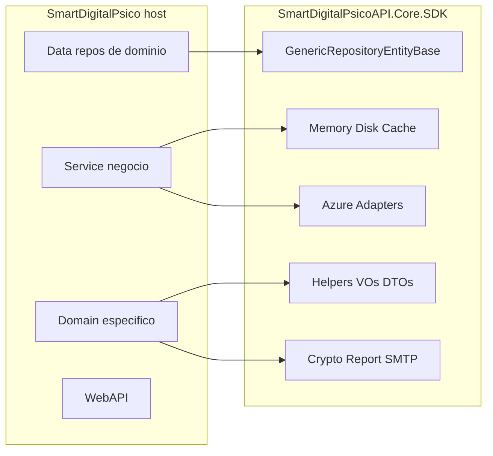

# Levantamento — SmartDigitalPsicoAPI.Core.SDK

**Versão:** 1.0  
**Data:** 2026-08-04  
**Status:** Inventário completo — migração de código não iniciada  
**PackageId alvo:** `SmartDigitalPsicoAPI.Core.SDK` (único NuGet)  
**TFM do host:** `net10.0`  
**Escopo analisado:** `SmartDigitalPsico.Domain`, `SmartDigitalPsico.Data`, `SmartDigitalPsico.Service`, `SmartDigitalPsico.WebAPI` (+ projetos de teste)

Paths relativos à raiz `SmartDigitalPsicoAPI/`.

---

## 0. Objetivo e regras

Centralizar **implementações genéricas e reutilizáveis** no pacote `SmartDigitalPsicoAPI.Core.SDK`, mantendo no host tudo que for específico de domínio clínico/produto.

| Situação | Significado |
| -------- | ----------- |
| **Migrar** | Tipo genérico → mover/extrair para o Core.SDK |
| **Manter** | Tipo específico do produto → permanece no host |
| **Não migrar** | Ausente neste repo, stub vazio, ou acoplamento que impede extração segura |

### Regras não negociáveis

- Um único NuGet: `SmartDigitalPsicoAPI.Core.SDK`
- Centralizar o genérico; manter o específico (DbContext, entidades, migrations, middlewares ASP.NET, validators de negócio)
- Zero regressão funcional (APIs e contratos idênticos)
- Reaproveitar testes existentes, replicando-os em `SmartDigitalPsicoAPI.Core.SDK.Tests`

### Referência histórica

Docs de processo em `DOCUMENTACAO/SmartCoreHub.Core.SDK/` descrevem um produto irmão. Os **tipos reais** deste solution têm nomes diferentes (ver §1).

---

## 1. Mapa de equivalência (SmartCoreHub → SmartDigitalPsico)

| Nome no prompt / SmartCoreHub | Equivalente neste repo | Situação |
| ----------------------------- | ---------------------- | -------- |
| `GenericRepository<T>` | `GenericRepositoryEntityBase<T>` | Migrar |
| `IGenericRepository<T>` | `IEntityBaseRepository<T>` | Migrar |
| `DapperGenericRepository` / `DapperAdpterGenericRepository` | *(inexistente — sem Dapper)* | Não migrar |
| `RepositoryImplementationFactory` | *(inexistente)* | Não migrar |
| `IUnitOfWork` / `UnitOfWork` | *(inexistente)* | Não migrar |
| `MemoryCacheProvider` | `MemoryCacheRepository` | Migrar |
| `DiskCacheProvider` | `DiskCacheRepository` | Migrar |
| `RedisCacheProvider` | Stub vazio em `CacheService` | Não migrar (futuro) |
| `MongoPersistenceAdapter` / cache Mongo | Stub vazio em `CacheService` | Não migrar (futuro) |
| `AzureBlobStorageAdapter` | `AzureStorageBlobAdapter` | Migrar |
| `AzureTableStorageAdapter` | `AzureStorageTableAdapter<T>` | Migrar |
| `AzureQueueStorageAdapter` | `AzureStorageQueueAdapter` | Migrar |
| `Guard` | *(inexistente)* | Não migrar |
| `Result<T>` | `ServiceResponse<T>` | Migrar |
| `ErrorCodes` | `ValidationErrorCodes` | Migrar (generalizar prefixo) |
| `DateTimeHelper` | `DateHelper` / `CultureDateTimeHelper` | Migrar |
| `StringHelper` | *(inexistente)* | Não migrar |
| `GenericService<T>` | `EntityBaseService` / `ReportBaseService` | Manter no host |

---

## 2. Repositórios genéricos

### 2.1 Migrar

| Nome | Namespace | Arquivo | Dependências | Situação | Testes relacionados |
| ---- | --------- | ------- | ------------ | -------- | ------------------- |
| `IEntityBaseRepository<T>` | `SmartDigitalPsico.Domain.Interfaces.Repository` | `SmartDigitalPsico.Domain/Interfaces/Repository/IEntityBaseRepository.cs` | `IEntityBase`, `System.Linq.Expressions` | Migrar | Mocks em Domain.Test / Service.Test |
| `GenericRepositoryEntityBase<T>` | `SmartDigitalPsico.Data.Repository.Generic` | `SmartDigitalPsico.Data/Repository/Generic/GenericRepositoryEntityBase.cs` | `IEntityDataContext`, EF `DbSet<T>`, `DateHelper`, `EntityBase` | Migrar | `ScheduleAndGenericRepositoryCoverageTests`, `GenderAndGenericRepositoryTests`, `RemainingDataCoverageTests` |
| `IStorageTableContract<T>` | `SmartDigitalPsico.Domain.Interfaces.TableEntity` | `SmartDigitalPsico.Domain/Interfaces/TableEntity/IStorageTableContract.cs` | `BaseEntityTable` | Migrar | `GenericTableEntityRepositoryTests` |
| `GenericTableEntityRepository<T>` | `SmartDigitalPsico.Data.TableEntityRepository` | `SmartDigitalPsico.Data/TableEntityRepository/GenericTableEntityRepository.cs` | `IStorageTableContract<T>` | Migrar | `GenericTableEntityRepositoryTests` |
| `IStorageTableRepositoryFactory` | `SmartDigitalPsico.Domain.Interfaces.Infrastructure` | `SmartDigitalPsico.Domain/Interfaces/Infrastructure/IStorageTableRepositoryFactory.cs` | `EStorageAdapterType` | Migrar | `InfrastructureFactoryTests` |
| `StorageTableRepositoryFactory` | `SmartDigitalPsico.Service.Infrastructure` | `SmartDigitalPsico.Service/Infrastructure/StorageTableRepositoryFactory.cs` | `IConfiguration`, `AzureStorageTableAdapter<T>`, `GenericTableEntityRepository<T>` | Migrar | `InfrastructureFactoryTests`, `StorageTableEntityServiceTests` |
| `StorageTableEntityService<T>` | `SmartDigitalPsico.Service.Infrastructure` | `SmartDigitalPsico.Service/Infrastructure/StorageTableEntityService.cs` | `IStorageTableRepositoryFactory` | Migrar | `StorageTableEntityServiceTests` |
| `IStorageQueueContract` | `SmartDigitalPsico.Domain.Interfaces.Infrastructure` | `SmartDigitalPsico.Domain/Interfaces/Infrastructure/IStorageQueueAdapter.cs` | — | Migrar | `RemainingDataCoverageTests` |
| `GenericStorageQueueRepository` | `SmartDigitalPsico.Data.Repository.Infrastructure` | `SmartDigitalPsico.Data/Repository/Infrastructure/GenericStorageQueueRepository.cs` | `IStorageQueueContract` | Migrar | `RemainingDataCoverageTests` |
| `IStorageQueueRepositoryFactory` | `SmartDigitalPsico.Domain.Interfaces.Infrastructure` | `SmartDigitalPsico.Domain/Interfaces/Infrastructure/IStorageQueueRepositoryFactory.cs` | `EStorageAdapterType` | Migrar | `InfrastructureFactoryTests` |
| `StorageQueueRepositoryFactory` | `SmartDigitalPsico.Domain.Interfaces.Infrastructure` *(ns ≠ pasta)* | `SmartDigitalPsico.Service/Infrastructure/StorageQueueRepositoryFactory.cs` | `IConfiguration`, `AzureStorageQueueAdapter`, `GenericStorageQueueRepository` | Migrar | `InfrastructureFactoryTests` |
| `StorageQueueService` | `SmartDigitalPsico.Service.Infrastructure` | `SmartDigitalPsico.Service/Infrastructure/StorageQueueService.cs` | `IStorageQueueRepositoryFactory` | Migrar | `InfrastructureMethodCoverageGapTests` |
| `EStorageAdapterType` | `SmartDigitalPsico.Domain.Enuns` | `SmartDigitalPsico.Domain/Enuns/EStorageAdapterType.cs` | Azure/AWS/Google (AWS/Google não implementados) | Migrar | — |
| `BaseEntityTable` | `SmartDigitalPsico.Domain.TableEntityNoSQL` | `SmartDigitalPsico.Domain/TableEntityNoSQL/BaseEntityTable.cs` | `Azure.Data.Tables` (`ITableEntity`) | Migrar | — |
| `IFileDiskRepository` | `SmartDigitalPsico.Domain.Interfaces.Repository` | `SmartDigitalPsico.Domain/Interfaces/Repository/IFileDiskRepository.cs` | `FileData` | Migrar | `FileAndDiskCacheRepositoryTests` |
| `FileDiskRepository` | `SmartDigitalPsico.Data.Repository.FileManager` | `SmartDigitalPsico.Data/Repository/FileManager/FileDiskRepository.cs` | filesystem | Migrar | `FileAndDiskCacheRepositoryTests`, `FileDiskRepositoryIncompleteReadTests` |

### 2.2 Manter (repositórios de domínio)

Herdam `GenericRepositoryEntityBase<T>` — **não** vão para o SDK.

**Principals** (`SmartDigitalPsico.Data.Repository.Principals`):  
`UserRepository`, `PatientRepository`, `PatientRecordRepository`, `PatientNotificationMessageRepository`, `PatientMedicationInformationRepository`, `PatientHospitalizationInformationRepository`, `PatientFileRepository`, `PatientAdditionalInformationRepository`, `MedicalRepository`, `MedicalFileRepository`, `MedicalSettingsRepository`

**SystemDomains** (`SmartDigitalPsico.Data.Repository.SystemDomains`):  
`UserTokenSessionRepository`, `SpecialtyRepository`, `RoleGroupRepository`, `OfficeRepository`, `NotificationTemplateRepository`, `NotificationRulesRepository`, `NotificationRecordsRepository`, `LeavesRepository`, `GenderRepository`, `AuditDataSelectiveEntityLogRepository`, `ApplicationLanguageRepository`, `ApplicationConfigSettingRepository`, `ApplicationCacheLogRepository`

**Schedule:** `ScheduleCalendarRepository`

**Contexto EF (manter):** `IEntityDataContext`, DbContext concreto, migrations, configs EF de entidades.

---

## 3. Providers / repositórios de cache

### 3.1 Migrar

| Nome | Namespace | Arquivo | Dependências | Situação | Testes relacionados |
| ---- | --------- | ------- | ------------ | -------- | ------------------- |
| `ICacheRepository` | `SmartDigitalPsico.Domain.Interfaces.Repository` | `.../ICacheRepository.cs` | — | Migrar | `CacheServiceTests`, `MemoryCacheRepositoryTests` |
| `IMemoryCacheRepository` | idem | `.../IMemoryCacheRepository.cs` | `Microsoft.Extensions.Caching.Memory` | Migrar | `MemoryCacheRepositoryTests` |
| `IDiskCacheRepository` | idem | `.../IDiskCacheRepository.cs` | — | Migrar | `FileAndDiskCacheRepositoryTests` |
| `ICacheService` | `SmartDigitalPsico.Domain.Interfaces.Service` | `.../ICacheService.cs` | — | Migrar | `CacheServiceTests` |
| `IDataCacheDto<T>` | `SmartDigitalPsico.Domain.Interfaces` | `.../IDataCacheDto.cs` | — | Migrar | — |
| `ETypeLocationCache` | `SmartDigitalPsico.Domain.Enuns` | `.../ETypeLocationCache.cs` | Disk/Memory/MongoDB/AzureStorage/CosmoDB/AzureRedis | Migrar (enum) | — |
| `CacheConfigurationDto` | `SmartDigitalPsico.Domain.DTO.Domains` | `.../CacheConfigurationDto.cs` | `ETypeLocationCache` | Migrar | — |
| `MemoryCacheRepository` | `SmartDigitalPsico.Data.Repository.CacheManager` | `.../MemoryCacheRepository.cs` | `IMemoryCache`, `IOptions<CacheConfigurationDto>`, `DateHelper` | Migrar | `MemoryCacheRepositoryTests` |
| `DiskCacheRepository` | idem | `.../DiskCacheRepository.cs` | `IFileDiskRepository`, JSON, `DirectoryHelper`, `DateHelper` | Migrar | `FileAndDiskCacheRepositoryTests` |
| `ServiceResponseCacheVO<T>` | `SmartDigitalPsico.Domain.VO` | `.../ServiceResponseCacheVO.cs` | `ServiceResponse`, `IDataCacheDto` | Migrar | — |
| `CacheService` (fachada genérica) | `SmartDigitalPsico.Service.Infrastructure.CacheManager` | `.../CacheService.cs` | Memory/Disk repos, config | Migrar (parcial) | `CacheServiceTests`, `InfrastructureMethodCoverageGapTests` |

### 3.2 Manter / Não migrar

| Nome | Situação | Motivo |
| ---- | -------- | ------ |
| `ApplicationCacheLog` + `ApplicationCacheLogRepository` | Manter | Auditoria específica do produto |
| Ramos Redis / MongoDB / Azure Storage / Cosmos em `CacheService` | Não migrar | Stubs vazios — implementar no SDK só quando houver código real |
| Dependência de `IApplicationCacheLogRepository` dentro de `CacheService` | Manter no host ou injetar via callback | Acoplamento de domínio; extrair fachada genérica sem o log de app |

---

## 4. Adapters (cloud / NoSQL / arquivo)

### 4.1 Migrar

| Nome | Namespace | Arquivo | Dependências | Situação | Testes relacionados |
| ---- | --------- | ------- | ------------ | -------- | ------------------- |
| `IStorageBlobAdapter` | `SmartDigitalPsico.Domain.Interfaces.Infrastructure` | `.../IStorageBlobAdapter.cs` | `BlobFileDto` | Migrar | `AzureStorageAdaptersCoverageTests` |
| `AzureStorageBlobAdapter` | `SmartDigitalPsico.Service.Infrastructure.Azure.Storage` | `.../AzureStorageBlobAdapter.cs` | `Azure.Storage.Blobs`, `IConfiguration` | Migrar | `AzureStorageAdaptersCoverageTests` |
| `AzureStorageTableAdapter<T>` | idem | `.../AzureStorageTableAdapter.cs` | `Azure.Data.Tables` | Migrar | `AzureStorageAdaptersCoverageTests` |
| `AzureStorageQueueAdapter` | idem | `.../AzureStorageQueueAdapter.cs` | `Azure.Storage.Queues` | Migrar | `AzureStorageAdaptersCoverageTests` |
| `BlobFileDto` | `SmartDigitalPsico.Domain.Security` *(ns)* | `SmartDigitalPsico.Domain/DTO/BlobFileDto.cs` | Azure headers | Migrar (parcial) | — |
| `LocationSaveFileConfigurationDto` | `SmartDigitalPsico.Domain.DTO.Domains` | `.../LocationSaveFileConfigurationDto.cs` | — | Migrar | — |

### 4.2 Manter

| Nome | Situação | Motivo |
| ---- | -------- | ------ |
| `PatientRecordTableEntity` | Manter | Entidade NoSQL de domínio |
| `UserTokenSessionTableEntity` | Manter | Entidade NoSQL de domínio |
| `TableStorageTokenSessionAdapter` | Manter | Persistência de sessão do produto |
| `DatabaseTokenSessionAdapter` | Manter | Persistência de sessão do produto |
| `FileManager` / `IFileManager` | Manter (parcial) | Orquestra disk + blob + entidades de arquivo de domínio |
| `MedicalScheduleNotificationAdapter` | Manter | Negócio de agenda |

### 4.3 Não migrar

| Nome | Situação | Motivo |
| ---- | -------- | ------ |
| `MongoPersistenceAdapter` | Não migrar | Inexistente neste solution |
| Adapters AWS / Google Storage | Não migrar | `EStorageAdapterType` existe; factories lançam / não implementam |

---

## 5. Crypto e report engines

### 5.1 Migrar

| Nome | Namespace | Arquivo | Dependências | Situação | Testes relacionados |
| ---- | --------- | ------- | ------------ | -------- | ------------------- |
| `ICryptoAdpter` | `SmartDigitalPsico.Domain.Interfaces.Security` | `.../ICryptoAdpter.cs` | — | Migrar | `CryptoAndTokenTests` |
| `ICryptoAdapterFactory` | idem | `.../ICryptoAdapterFactory.cs` | — | Migrar | `CryptoAndTokenTests` |
| `ICryptoService` | idem | `.../ICryptoService.cs` | — | Migrar | `ConfigurationAndCryptoServiceTests` |
| `AesCryptoAdpter` | `SmartDigitalPsico.Domain.Security` | `.../AesCryptoAdpter.cs` | Cryptography | Migrar | `CryptoAndTokenTests` |
| `RsaCryptoAdpter` | idem | `.../RsaCryptoAdpter.cs` | Cryptography | Migrar | `CryptoAndTokenTests` |
| `CryptoAdapterFactory` | idem | `.../CryptoAdapterFactory.cs` | Adapters | Migrar | `CryptoAndTokenTests` |
| `TokenConfigurationDto` / `ITokenConfigurationDto` | Domain DTO/Interfaces | `DTO/Security/`, `Interfaces/Security/` | — | Migrar | — |
| `RsaCryptoDto` | `SmartDigitalPsico.Domain.DTO.Security` | `.../RsaCryptoDto.cs` | — | Migrar | — |
| `ExcelGeneratorOpenXmlAdapter` | `SmartDigitalPsico.Domain.Report` | `.../ExcelGeneratorOpenXmlAdapter.cs` | OpenXML | Migrar | Domain.Test Report adapters |
| `ExcelGeneratorFactory` | `SmartDigitalPsico.Service.Infrastructure.Report` | `.../ExcelGeneratorFactory.cs` | Adapter | Migrar | — |
| `PdfReportAdapterFactory` | idem | `.../PdfReportAdapterFactory.cs` | PDF adapters | Migrar | — |
| `PDFsharpMigraDocReportAdapter` | `SmartDigitalPsico.Domain.Report` | `.../PDFsharpMigraDocReportAdapter.cs` | PDFsharp/MigraDoc | Migrar (engine) | Domain.Test Report |
| `QuestPdfReportAdapter` | `SmartDigitalPsico.Domain.Report` | `.../QuestPDFReportAdapter.cs` | QuestPDF | Migrar (engine) | Domain.Test Report |

### 5.2 Manter / Parcial

| Nome | Situação | Motivo |
| ---- | -------- | ------ |
| `TokenService` | Manter / Parcial | Auth do produto (JWT claims específicas) |
| `ExcelGeneratorService` / `PdfReportService` | Parcial | Engines no SDK; conteúdo clínico no host |
| Contratos de report com dados clínicos | Manter | DTOs de domínio |

---

## 6. Helpers e utilitários

### 6.1 Migrar

| Nome | Namespace | Arquivo | Dependências | Situação | Testes relacionados |
| ---- | --------- | ------- | ------------ | -------- | ------------------- |
| `DateHelper` | `SmartDigitalPsico.Domain.Helpers` | `Helpers/DateHelper.cs` | BCL / Culture | Migrar | `GeneralHelpersTests` |
| `CultureDateTimeHelper` | idem | `Helpers/CultureDateTimeHelper.cs` | Cultures/timezones | Migrar | `GeneralHelpersTests` |
| `DirectoryHelper` | idem | `Helpers/DirectoryHelper.cs` | IO | Migrar | `DirectoryHelperTests` |
| `EmailHelper` | idem | `Helpers/EmailHelper.cs` | — | Migrar | `GeneralHelpersTests` |
| `ReflectionHelpers` | idem | `Helpers/ReflectionHelpers.cs` | Reflection | Migrar | `GeneralHelpersTests` |
| `OrderAttribute` | idem | `Helpers/OrderAttribute.cs` | — | Migrar | — |
| `EnumDescriptionConverter<T>` | idem | `Helpers/EnumDescriptionConverter.cs` | System.Text.Json | Migrar | `SerializationHelpersTests` |
| `IgnorableSerializerContractResolver` | idem | `Helpers/IgnorableSerializerContractResolver.cs` | Newtonsoft.Json | Migrar | `SerializationHelpersTests` |
| `HtmlSanitizerHelper` | idem | `Helpers/HtmlSanitizerHelper.cs` | `Ganss.Xss` | Migrar | `GeneralHelpersTests` |
| `AesKeyGeneratorHelper` | `SmartDigitalPsico.Domain.Helpers.Security` | `Helpers/Security/AesKeyGeneratorHelper.cs` | Cryptography | Migrar | `SecurityHelpersTests` |
| `RsaCryptoServiceHelper` | `SmartDigitalPsico.Domain.Helpers` | `Helpers/RsaCryptoServiceHelper.cs` | Cryptography, `RsaCryptoDto` | Migrar | `SecurityHelpersTests` |
| `SecurityHelper` | `SmartDigitalPsico.Domain.Helpers.Security` | `Helpers/Security/SecurityHelper.cs` | HMAC / JWT libs | Migrar | `SecurityHelpersTests` |
| `ServiceCollectionHelper` | `SmartDigitalPsico.Service.Helpers` *(arquivo em Domain/Helpers)* | `Helpers/ServiceCollectionHelper.cs` | DI + reflection | Migrar | `ServiceCollectionHelperTests` |
| `ExceptionHandler` | `SmartDigitalPsico.Domain.AppException` | `AppException/ExceptionHandler.cs` | `ErrorResponse` | Migrar | `AppExceptionTests` |
| `AppWarningException` | idem | `AppException/AppWarningException.cs` | — | Migrar | `AppExceptionTests` |
| `ValidationErrorCodes` | `SmartDigitalPsico.Domain.Validation` | `Validation/ValidationErrorCodes.cs` | Prefixo `"SmartDigitalPsico"` | Migrar (generalizar const) | `ValidationHelperTests` |

### 6.2 Parcial (avaliar na Fase 5)

| Nome | Namespace | Situação | Motivo |
| ---- | --------- | -------- | ------ |
| `FileHelper` | `SmartDigitalPsico.Domain.Helpers` | Parcial | Depende de ASP.NET Core Http/Mvc |
| `BlobFileHelper` | idem | Parcial | Azure + `FileBase` |
| `LogAppHelper` | idem | Parcial | Serilog + host |
| `AuditLogHelper` | idem | Parcial | Newtonsoft + DTOs de audit |
| `ConfigurationAppSettingsHelper` | idem | Parcial | Muitas chaves SDP-específicas |
| `SecurityHelperApi` | `...Helpers.Security` | Parcial | Claims/API do produto |
| `HelperValidation` | `...Validation.Helper` | Parcial | FluentValidation — padrão genérico; validators ficam no host |
| `RequestCultureMiddleware` | `SmartDigitalPsico.Domain.Helpers` | Parcial / fase tardia | Middleware ASP.NET |
| `ApiBaseController` | `SmartDigitalPsico.Domain.API` | Parcial / fase tardia | Base ASP.NET genérica |
| `LanguageActionFilterAttribute` | idem | Manter / Parcial | i18n do produto |

### 6.3 Manter (domínio)

| Nome | Namespace | Situação |
| ---- | --------- | -------- |
| `ApplicationLanguageHelper` | `SmartDigitalPsico.Domain.Helpers` | Manter |
| `MedicalScheduleKeyHelper` | `...Helpers.Medical` | Manter |
| `RecurrenceMaterializer`, `ScheduleConflictDetailHelper`, `ScheduleKeyHelper`, `ScheduleOverlapHelper`, `ScheduleParallel`, `SchedulePeriodHelper`, `TimeSlotGenerator` | `...Helpers.Schedule` | Manter |
| Helpers EF em Data (`ModelBuilderExtensions`, `CollectionValueComparerHelper`, `HelperCharSet`, `ConfigurationEntitiesHelper`) | `SmartDigitalPsico.Data.Context.Configure.Helper` | Manter |
| Validators FluentValidation de entidades/DTOs de negócio | `SmartDigitalPsico.Domain.Validation.*` | Manter |

---

## 7. VOs, DTOs base e contratos de entidade

### 7.1 Migrar

| Nome | Namespace | Arquivo | Dependências | Situação | Testes relacionados |
| ---- | --------- | ------- | ------------ | -------- | ------------------- |
| `ServiceResponse<T>` | `SmartDigitalPsico.Domain.VO` | `VO/ServiceResponse.cs` | — | Migrar | Usado amplamente nos testes de Service |
| `IServiceResponse<T>` | `SmartDigitalPsico.Domain.Interfaces.VO` | `Interfaces/VO/` | — | Migrar | — |
| `ErrorResponse` | `SmartDigitalPsico.Domain.VO` | `VO/ErrorResponse.cs` | — | Migrar | `AppExceptionTests` |
| `ServiceResponseCacheVO<T>` | `SmartDigitalPsico.Domain.VO` | `VO/ServiceResponseCacheVO.cs` | Cache VO | Migrar | — |
| `EntityBase` | `SmartDigitalPsico.Domain.Contracts` | `Contracts/EntityBase.cs` | — | Migrar | — |
| `EntityBaseWithNameEmail` | idem | `Contracts/EntityBaseWithNameEmail.cs` | `EntityBase` | Migrar | — |
| `Record<T>` / `RecordsList<T>` | idem | `Contracts/Record.cs`, `RecordsList.cs` | — | Migrar | — |
| `EntityDtoBase` | `SmartDigitalPsico.Domain.DTO.Contracts` | `DTO/Contracts/EntityDtoBase.cs` | — | Migrar | — |
| `EntityDtoBaseAdd` | idem | `EntityDtoBaseAdd.cs` | — | Migrar | — |
| `EntityDtoBaseDomain` | idem | `EntityDtoBaseDomain.cs` | — | Migrar | — |
| `EntityDtoBaseDomainAdd` | idem | `EntityDtoBaseDomainAdd.cs` | — | Migrar | — |
| `EntityDtoBaseName` | idem | `EntityDtoBaseName.cs` | — | Migrar | — |
| `FileBase` / `FileData` | `SmartDigitalPsico.Domain.ModelEntity.Contracts` | ModelEntity/Contracts | — | Migrar | — |
| `FileDetailDto` | `SmartDigitalPsico.Domain.DTO.Utils` | `DTO/Utils/FileDetailDto.cs` | — | Migrar | — |
| `SmtpSettingsDto` / `EmailMessageDto` | `SmartDigitalPsico.Domain.DTO.SMTP` | `DTO/SMTP/` | — | Migrar | Smtp tests |

### 7.2 Parcial

| Nome | Situação | Motivo |
| ---- | -------- | ------ |
| `PagedSearchVO<T>` | Parcial | Acoplado a Hypermedia |
| `TokenVO` | Parcial | Auth do produto |
| `AuthConfigurationDto` / `DataBaseConfigurationDto` / `AppConfigurationSettingDto` | Parcial | Formas de config — algumas chaves SDP |
| `FileBaseDto` / `FileBaseIdDto` | Migrar se desacoplados de MedicalFile | Verificar pasta de DTOs de arquivo |

### 7.3 Manter

| Nome | Situação |
| ---- | -------- |
| DTOs Add/Get/Update de Domains (Gender, Office, Specialty, Leaves, Notification*, Application*, Audit*) | Manter |
| DTOs de Patient / Medical / User / Schedule | Manter |
| `DataNotificationTemplateVO` | Manter |
| Bases DTO de notificação/leaves/audit com campos de negócio | Manter |

---

## 8. Hypermedia

### 8.1 Migrar (framework)

| Nome | Namespace | Arquivo | Situação | Testes |
| ---- | --------- | ------- | -------- | ------ |
| `ContentResponseEnricher<T>` | `SmartDigitalPsico.Domain.Hypermedia` | `Hypermedia/ContentResponseEnricher.cs` | Migrar | Domain.Test Hypermedia (se houver) |
| `IResponseEnricher` / `ISupportsHyperMedia` | `...Hypermedia.Abstract` | `Hypermedia/Abstract/` | Migrar | — |
| `HyperMediaLink` | `...Hypermedia` | `Hypermedia/HyperMediaLink.cs` | Migrar | — |
| `HyperMediaConfigure` | idem | `Hypermedia/HyperMediaConfigure.cs` | Migrar | — |
| `HyperMediaFilterrAttribute` / `HyperMediaFilterOptions` | `...Hypermedia.Filters` | `Hypermedia/Filters/` | Migrar | — |
| `RelationType`, `ResponseTypeFormat`, `HttpActionVerb` | `...Hypermedia.Constants` | `Hypermedia/Constants/` | Migrar | — |

### 8.2 Manter (enrichers de domínio)

Todos sob `Hypermedia/Enricher/Principals/` e `Hypermedia/Enricher/Domains/`:  
`GetPatientEnricher`, `GetPatientRecordEnricher`, `GetPatient*Enricher`, `GetUserEnricher`, `GetMedicalEnricher`, `GetMedicalFileEnricher`, `GetSpecialtyEnricher`, `GetRoleGroupEnricher`, `GetOfficeEnricher`, `GetGenderEnricher`, `GetApplicationLanguageEnricher`, `GetApplicationConfigSettingEnricher`.

---

## 9. SMTP / e-mail (infra genérica)

| Nome | Namespace | Arquivo | Situação | Testes |
| ---- | --------- | ------- | -------- | ------ |
| `SmtpEmailStrategy` | `SmartDigitalPsico.Service.Infrastructure.Smtp` | `.../SmtpEmailStrategy.cs` | Migrar | `SmtpEmailStrategyTests` |
| `EmailStrategyFactory` | idem | `.../EmailStrategyFactory.cs` | Migrar | — |
| `EmailContext` | idem | `.../EmailContext.cs` | Migrar | — |
| `ThirdPartyEmailStrategy` | idem | `.../ThirdPartyEmailStrategy.cs` | Parcial | Stub/terceiros — avaliar |

Sms/WhatsApp notification services: **Parcial / Manter** se acoplados a templates de domínio.

---

## 10. Services genéricos e API

| Nome | Namespace | Arquivo | Situação | Motivo |
| ---- | --------- | ------- | -------- | ------ |
| `EntityBaseService<...>` | `SmartDigitalPsico.Service.DataEntity.Generic` | `Service/DataEntity/Generic/EntityBaseService.cs` | **Manter** | Validators, localization, regras de negócio |
| `ReportBaseService<...>` | idem | `ReportBaseService.cs` | **Manter** | Conteúdo de report de domínio |
| `IEntityBaseService<T,TResult>` | Domain Interfaces | — | Migrar contrato se desacoplado; senão Manter | Avaliar na Fase 5 |
| `ApiBaseController` | `SmartDigitalPsico.Domain.API` | `API/ApiBaseController.cs` | Parcial (fase tardia) | Base ASP.NET reutilizável |
| Controllers WebAPI, middlewares de produto | WebAPI | — | Manter | Específico |

Testes: `EntityBaseServiceTests`, `ReportBaseServiceTests`, `ApiBaseControllerTests`.

---

## 11. Extensões

| Nome | Namespace | Arquivo | Situação |
| ---- | --------- | ------- | -------- |
| `ModelBuilderExtensions` | `SmartDigitalPsico.Data.Context.Configure.Helper` | Data Context Configure Helper | Manter (EF específico) |
| Pasta `Domain/Extensions/` | — | vazia (só subpasta Schedule sem `.cs`) | N/A |

Não há outras classes `*Extensions` com métodos `this` genéricos prontos para o SDK.

---

## 12. Tipos inexistentes neste solution (Não migrar)

| Tipo buscado | Status |
| ------------ | ------ |
| `GenericRepository` (nome exato) | Ausente |
| `DapperGenericRepository` / qualquer Dapper | Ausente (sem PackageReference) |
| `IUnitOfWork` / `UnitOfWork` | Ausente |
| `Guard`, `Result<T>`, `StringHelper`, `DateTimeHelper`, `ErrorCodes` | Ausentes (usar equivalentes §1) |
| `MemoryCacheProvider`, `RedisCacheProvider`, `DiskCacheProvider` | Ausentes (usar `*CacheRepository`) |
| `MongoPersistenceAdapter` | Ausente |

---

## 13. Testes a reaproveitar → `SmartDigitalPsicoAPI.Core.SDK.Tests`

Mapa origem → destino futuro. Replicar/adaptar (não apagar do host até consolidação).

### Data.Test

| Teste origem | Tipos cobertos |
| ------------ | -------------- |
| `Repository/Coverage/ScheduleAndGenericRepositoryCoverageTests.cs` | `GenericRepositoryEntityBase` |
| `Repository/SystemDomains/GenderAndGenericRepositoryTests.cs` | Generic base via `GenderRepository` |
| `Repository/Coverage/RemainingDataCoverageTests.cs` | Generic EF, queue, caches |
| `Repository/Coverage/GenericTableEntityRepositoryTests.cs` | `GenericTableEntityRepository<T>` |
| `Repository/CacheManager/MemoryCacheRepositoryTests.cs` | `MemoryCacheRepository` |
| `Repository/Coverage/FileAndDiskCacheRepositoryTests.cs` | `DiskCacheRepository`, `FileDiskRepository` |
| `Repository/Coverage/FileDiskRepositoryIncompleteReadTests.cs` | `FileDiskRepository` |
| `Repository/Coverage/FileManagerCoverageTests.cs` | `FileManager` (parcial — host) |

### Service.Test

| Teste origem | Tipos cobertos |
| ------------ | -------------- |
| `Infrastructure/InfrastructureFactoryTests.cs` | Factories Table/Queue |
| `Infrastructure/StorageTableEntityServiceTests.cs` | Table service + factory |
| `Infrastructure/Azure/AzureStorageAdaptersCoverageTests.cs` | Azure Blob/Table/Queue |
| `Infrastructure/CacheServiceTests.cs` | `CacheService` |
| `Infrastructure/InfrastructureMethodCoverageGapTests.cs` | Queue/cache gaps |
| `Configure/ConfigurationAndCryptoServiceTests.cs` | Crypto + DI factories |
| Smtp tests (`SmtpEmailStrategyTests` etc.) | SMTP strategies |

### Domain.Test

| Teste origem | Tipos cobertos |
| ------------ | -------------- |
| `Helper/GeneralHelpersTests.cs` | DateHelper, CultureDateTimeHelper, EmailHelper, etc. |
| `Helpers/DirectoryHelperTests.cs` | `DirectoryHelper` |
| `Helpers/FileHelperTests.cs` | `FileHelper` (parcial) |
| `Helpers/ServiceCollectionHelperTests.cs` | `ServiceCollectionHelper` |
| `Helpers/LogAppHelperTests.cs` | `LogAppHelper` (parcial) |
| `Helper/SerializationHelpersTests.cs` | Json converters/resolvers |
| `Helper/Security/SecurityHelpersTests.cs` | Security/crypto helpers |
| `Security/CryptoAndTokenTests.cs` | Crypto adapters |
| `Report/*AdapterTests.cs` | Excel/PDF adapters |
| `Validation/ValidationHelperTests.cs` | `HelperValidation` / error codes |
| `AppException/AppExceptionTests.cs` | ExceptionHandler |
| `API/ApiBaseControllerTests.cs` | `ApiBaseController` (fase tardia) |

**Não migrar testes de:** validators de Patient/Medical/Schedule, enrichers de domínio, repositórios de domínio, `EntityBaseService`/`ReportBaseService` (permanecem no host).

---

## 14. Resumo quantitativo (candidatos)

| Categoria | Migrar (aprox.) | Manter / Não migrar |
| --------- | ---------------:| -------------------:|
| Repositórios genéricos + factories + file disk | ~16 | ~25 repos de domínio + DbContext |
| Cache | ~11 | ApplicationCacheLog + stubs Redis/Mongo/Cosmos |
| Adapters Azure + contratos | ~8 | Table entities / token adapters de domínio |
| Crypto + report engines | ~12 | Conteúdo clínico / TokenService produto |
| Helpers | ~16 (+ ~8 parciais) | Schedule/Medical/i18n/EF (~12+) |
| VOs / DTOs base / contracts | ~18 | Dezenas de DTOs de domínio |
| Hypermedia framework | ~10 | ~15 enrichers de domínio |
| SMTP | ~3–4 | Canais notificação de domínio |
| Services/API base | 0–2 (fase tardia) | EntityBaseService, controllers |

---

## 15. Diagrama alvo

---

## 16. Próximo documento

- Plano operacional: [PlanoDeAcao.md](./PlanoDeAcao.md)  
- Acompanhamento: [Progresso.md](./Progresso.md)
