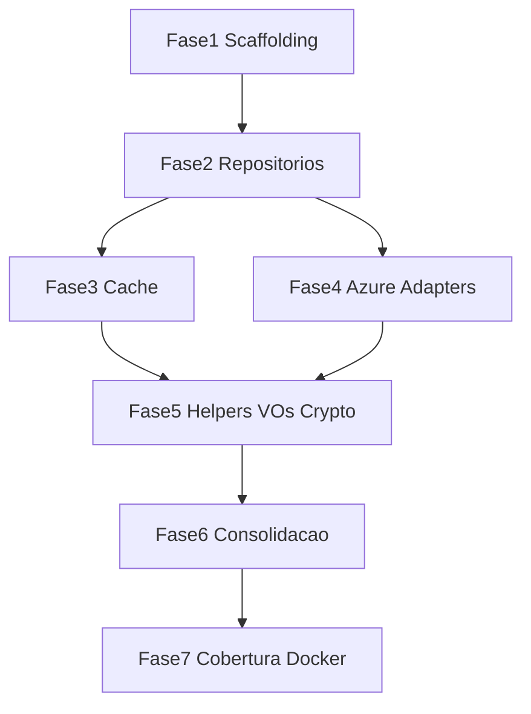

# Plano de Ação — Migração para SmartDigitalPsicoAPI.Core.SDK

**Versão:** 1.0  
**Data:** 2026-08-04  
**Status:** Planejado — execução de código não iniciada  
**Inventário base:** [Levantamento.md](./Levantamento.md)  
**Acompanhamento:** [Progresso.md](./Progresso.md)

---

## Regras não negociáveis

1. **Um único NuGet:** `PackageId=SmartDigitalPsicoAPI.Core.SDK` — sem pacotes satélite (`.Caching`, `.Azure`, etc.).
2. **Centralizar o genérico:** toda implementação reutilizável vive no Core.SDK.
3. **Manter o específico:** DbContext, entidades de domínio, migrations, middlewares ASP.NET de produto, validators FluentValidation de negócio, enrichers Hypermedia de domínio, `EntityBaseService` / `ReportBaseService`.
4. **Zero regressão funcional:** endpoints, contratos públicos, schema EF e chaves de cache idênticos antes/depois.
5. **Reaproveitar testes:** cada tipo migrado tem testes replicados/adaptados em `SmartDigitalPsicoAPI.Core.SDK.Tests`; testes do host só saem após consolidação.
6. **Build obrigatório após cada fase:** `dotnet build` da solution sem erros antes de avançar.
7. **Cobertura ≥ 90%** nos módulos migrados (Coverlet), medida no projeto de testes do SDK.
8. **Sem Dapper / UoW inventados:** não criar tipos inexistentes neste repo “para espelhar SmartCoreHub”.

---

## Arquitetura alvo

```text
SmartDigitalPsicoAPI/
├── SmartDigitalPsicoAPI.Core.SDK/          # ÚNICO pacote NuGet
│   ├── Repositories/                       # GenericRepositoryEntityBase, Table/Queue
│   ├── Caching/                            # Memory/Disk + contratos
│   ├── Cloud/Azure/                        # Blob/Table/Queue adapters
│   ├── Helpers/                            # Date, Security, Reflection, ...
│   ├── Contracts/                          # EntityBase, VOs, DTO bases
│   ├── Security/                           # Crypto adapters
│   ├── Report/                             # Excel/PDF engines
│   ├── Hypermedia/                         # Framework (sem enrichers de domínio)
│   └── Smtp/                               # Strategies genéricas
├── SmartDigitalPsicoAPI.Core.SDK.Tests/
├── SmartDigitalPsico.Domain/               # Domain específico + shims temporários se necessário
├── SmartDigitalPsico.Data/
├── SmartDigitalPsico.Service/
└── SmartDigitalPsico.WebAPI/
```

**TFM:** alinhar ao host (`net10.0`). Dependências pesadas (EF, Azure SDKs) no mesmo `.csproj`.

**Consumo:** Domain/Data/Service passam a referenciar o Core.SDK via `ProjectReference` (depois `PackageReference` se empacotar).

---

## Critérios de aceite globais (todas as fases)

- [ ] `dotnet build SmartDigitalPsicoAPI.sln` verde
- [ ] `dotnet test` nos projetos afetados verde
- [ ] Contratos públicos observáveis inalterados (APIs WebAPI)
- [ ] Atualizar [Progresso.md](./Progresso.md) ao concluir a fase

---

## Fase 1 — Scaffolding do projeto

### Escopo

- Criar `SmartDigitalPsicoAPI.Core.SDK.csproj` (`PackageId=SmartDigitalPsicoAPI.Core.SDK`, `net10.0`)
- Criar `SmartDigitalPsicoAPI.Core.SDK.Tests.csproj` (NUnit, Moq, Bogus, AwesomeAssertions, Coverlet — alinhado aos testes atuais)
- Incluir ambos na `SmartDigitalPsicoAPI.sln`
- Adicionar `ProjectReference` do Core.SDK em Domain (e propagar conforme necessidade Data/Service)
- Estrutura de pastas vazia conforme arquitetura alvo
- README mínimo do pacote (opcional, só se já houver padrão no repo)

### Checklist

- [ ] Projeto SDK criado e compila isolado
- [ ] Projeto Tests criado e compila
- [ ] Solution inclui os dois projetos
- [ ] Host referencia o SDK sem quebrar build

### Critérios de aceite

- [ ] Build verde da solution
- [ ] Teste smoke no SDK.Tests (ex.: `Assert.That(true)`) passando
- [ ] Nenhum tipo de domínio movido ainda

---

## Fase 2 — Migração de repositórios genéricos

### Escopo (mover/extrair)

| Tipo | Origem atual |
| ---- | ------------ |
| `IEntityBaseRepository<T>` | Domain Interfaces |
| `GenericRepositoryEntityBase<T>` | Data Repository Generic |
| `IStorageTableContract<T>`, `GenericTableEntityRepository<T>` | Domain / Data |
| `IStorageQueueContract`, `GenericStorageQueueRepository` | Domain / Data |
| `IStorageTableRepositoryFactory`, `StorageTableRepositoryFactory`, `StorageTableEntityService<T>` | Domain / Service |
| `IStorageQueueRepositoryFactory`, `StorageQueueRepositoryFactory`, `StorageQueueService` | Domain / Service |
| `EStorageAdapterType`, `BaseEntityTable` | Domain |
| `IFileDiskRepository`, `FileDiskRepository` | Domain / Data |

**Não mover:** repos Principals/SystemDomains/Schedule, `IEntityDataContext`, DbContext, migrations.

### Dependência de abstração EF

Extrair contrato mínimo de contexto (ex.: `DbSet<T>` + `SaveChangesAsync`) no SDK para `GenericRepositoryEntityBase` **não** depender de `IEntityDataContext` tipado com todas as entidades do produto. O DbContext do host implementa esse contrato.

### Checklist

- [ ] Tipos movidos para o SDK com namespaces públicos estáveis
- [ ] Repos de domínio passam a herdar a base do SDK
- [ ] Factories compilam e DI do Service registra tipos do SDK
- [ ] Testes Data.Test de generic/table/queue/file disk adaptados ou espelhados no SDK.Tests

### Critérios de aceite

- [ ] Build + testes Data.Test e SDK.Tests verdes
- [ ] Cobertura dos tipos desta fase ≥ 90% no SDK.Tests
- [ ] Smoke EF: app sobe / repositório de domínio continua CRUD básico (validação migration na Fase 7 se schema intacto)

### Testes a reaproveitar

`ScheduleAndGenericRepositoryCoverageTests`, `GenderAndGenericRepositoryTests`, `GenericTableEntityRepositoryTests`, `RemainingDataCoverageTests` (partes), `FileAndDiskCacheRepositoryTests` / `FileDiskRepositoryIncompleteReadTests`, `InfrastructureFactoryTests`, `StorageTableEntityServiceTests`

---

## Fase 3 — Migração de providers de cache

### Escopo

| Tipo | Origem |
| ---- | ------ |
| `ICacheRepository`, `IMemoryCacheRepository`, `IDiskCacheRepository` | Domain |
| `ICacheService`, `IDataCacheDto<T>`, `ETypeLocationCache` | Domain |
| `CacheConfigurationDto`, `ServiceResponseCacheVO<T>` | Domain |
| `MemoryCacheRepository`, `DiskCacheRepository` | Data |
| Fachada genérica de `CacheService` (Memory/Disk) | Service |

**Não mover:** `ApplicationCacheLog*`.  
**Não implementar agora:** Redis / Mongo / Cosmos / Azure Storage cache (stubs) — documentar como backlog no SDK.

### Checklist

- [ ] Contratos + Memory/Disk no SDK
- [ ] Host `CacheService` usa SDK ou é substituído pela fachada do SDK + hook opcional de audit no host
- [ ] DI atualizado
- [ ] Testes `MemoryCacheRepositoryTests`, `FileAndDiskCacheRepositoryTests`, `CacheServiceTests` replicados

### Critérios de aceite

- [ ] Build + testes verdes
- [ ] Comportamento de cache Memory/Disk idêntico (TTL/keys)
- [ ] Cobertura ≥ 90% dos tipos de cache migrados
- [ ] Stubs Redis/Mongo/Cosmos **não** fingem implementação

---

## Fase 4 — Migração de adapters cloud (Azure)

### Escopo

| Tipo | Origem |
| ---- | ------ |
| `IStorageBlobAdapter`, `AzureStorageBlobAdapter` | Domain / Service |
| `AzureStorageTableAdapter<T>`, `AzureStorageQueueAdapter` | Service |
| `BlobFileDto`, `LocationSaveFileConfigurationDto` (se genéricos) | Domain |

**Não mover:** `PatientRecordTableEntity`, `UserTokenSessionTableEntity`, `TableStorageTokenSessionAdapter`, `DatabaseTokenSessionAdapter`, `FileManager` de domínio.

### Checklist

- [ ] Adapters Azure no SDK
- [ ] Factories da Fase 2 resolvem adapters do SDK
- [ ] Testes `AzureStorageAdaptersCoverageTests` replicados
- [ ] AWS/Google continuam “não implementado” (sem código fantasma)

### Critérios de aceite

- [ ] Build + testes verdes
- [ ] Contratos de I/O Blob/Table/Queue inalterados
- [ ] Cobertura ≥ 90% dos adapters migrados

---

## Fase 5 — Helpers, VOs, DTOs base, crypto, hypermedia, report, SMTP

### Escopo — Migrar

**Helpers:** `DateHelper`, `CultureDateTimeHelper`, `DirectoryHelper`, `EmailHelper`, `ReflectionHelpers`, `OrderAttribute`, `EnumDescriptionConverter<T>`, `IgnorableSerializerContractResolver`, `HtmlSanitizerHelper`, `AesKeyGeneratorHelper`, `RsaCryptoServiceHelper`, `SecurityHelper`, `ServiceCollectionHelper`, `ExceptionHandler`, `AppWarningException`, `ValidationErrorCodes` (prefixo configurável).

**VOs / contracts / DTO bases:** `ServiceResponse<T>`, `IServiceResponse<T>`, `ErrorResponse`, `EntityBase`, `EntityBaseWithNameEmail`, `Record<T>`, `RecordsList<T>`, `EntityDtoBase*`, `FileBase`/`FileData`/`FileDetailDto`, `SmtpSettingsDto`, `EmailMessageDto`, DTOs de security genéricos.

**Crypto:** `ICryptoAdpter`, `ICryptoAdapterFactory`, `ICryptoService`, `AesCryptoAdpter`, `RsaCryptoAdpter`, `CryptoAdapterFactory`.

**Report engines:** `ExcelGeneratorOpenXmlAdapter`, `ExcelGeneratorFactory`, `PDFsharpMigraDocReportAdapter`, `QuestPdfReportAdapter`, `PdfReportAdapterFactory`.

**Hypermedia framework:** `ContentResponseEnricher<T>`, abstrações, filtros, links, constants — **sem** enrichers de Patient/Medical/etc.

**SMTP:** `SmtpEmailStrategy`, `EmailStrategyFactory`, `EmailContext` (+ avaliar `ThirdPartyEmailStrategy`).

### Escopo — Manter / diferir

- Schedule/*, Medical/*, `ApplicationLanguageHelper`
- Validators de negócio, enrichers de domínio
- `EntityBaseService`, `ReportBaseService`
- `ApiBaseController` / `RequestCultureMiddleware` → **lote opcional no fim da fase** se desacopláveis
- Helpers parciais (`FileHelper`, `LogAppHelper`, `AuditLogHelper`, `ConfigurationAppSettingsHelper`, `SecurityHelperApi`) — só migrar o que ficar sem deps de produto

### Checklist

- [ ] Tipos movidos; usings do host atualizados
- [ ] Prefixo de `ValidationErrorCodes` não quebra mensagens existentes (compat)
- [ ] Enrichers de domínio continuam no Domain e usam framework do SDK
- [ ] Testes Domain.Test de helpers/security/serialization/crypto/report/smtp replicados

### Critérios de aceite

- [ ] Build + Domain.Test + Service.Test + SDK.Tests verdes
- [ ] Cobertura ≥ 90% dos módulos desta fase no SDK
- [ ] Zero mudança de contrato JSON das APIs

### Testes a reaproveitar

`GeneralHelpersTests`, `DirectoryHelperTests`, `ServiceCollectionHelperTests`, `SerializationHelpersTests`, `SecurityHelpersTests`, `CryptoAndTokenTests`, Report adapter tests, `AppExceptionTests`, `ValidationHelperTests` (parte genérica), Smtp tests

---

## Fase 6 — Consolidação e remoção de duplicados

### Escopo

- Remover cópias dos tipos no host (Domain/Data/Service) após consumidores usarem só o SDK
- Preferir **sem shims longos**; se precisar de transição, alias/`using` temporário curto (máx. 1 PR de consolidação)
- Corrigir anomalias conhecidas se tocadas: namespace de `ServiceCollectionHelper`, casing `QuestPdfReportAdapter`
- Garantir que DI (`ServicesDomainRepository`, `ServicesDomainNoSql`, `ServicesDomainQueue`, cache registration) aponta 100% ao SDK
- Atualizar Dockerfiles/restore para incluir o `.csproj` do SDK no `dotnet restore` multi-stage

### Checklist

- [ ] Zero duplicata de tipos migrados no host
- [ ] Grep por namespaces antigos dos tipos movidos = 0 (exceto docs)
- [ ] Solution build limpa
- [ ] Documentação Levantamento marcada como “tipos já no SDK” onde aplicável

### Critérios de aceite

- [ ] Build + suite completa de testes verde
- [ ] Pacote packável: `dotnet pack SmartDigitalPsicoAPI.Core.SDK` gera nupkg
- [ ] Sem regressão funcional (smoke API / health)

---

## Fase 7 — Testes, cobertura, EF e Docker

### Escopo

- Completar replicação de testes listados no [Levantamento §13](./Levantamento.md)
- Medir cobertura Coverlet do **SDK** ≥ 90% (linhas dos tipos migrados)
- Validação EF: seed mínimo + `dotnet ef migrations add` (smoke) + `database update` em ambiente de teste — **sem** alterar schema de produção; apenas prova de que o repositório genérico do SDK não quebrou o pipeline EF
- `docker compose build` / testes em container conforme pipeline existente do repo
- Atualizar [Progresso.md](./Progresso.md) para 100% nas linhas concluídas

### Checklist

- [ ] SDK.Tests cobre todos os tipos Migrar das Fases 2–5
- [ ] Relatório Coverlet ≥ 90%
- [ ] Smoke EF executado e documentado no Progresso
- [ ] Docker build/test OK
- [ ] Suite host (Domain/Data/Service/WebAPI.Test) verde

### Critérios de aceite

- [ ] Cobertura ≥ 90% validada
- [ ] Docker build/test OK
- [ ] Zero regressão funcional confirmada
- [ ] Progresso.md atualizado com changelog final da migração de código

---

## Ordem de execução e dependências



Fases 3 e 4 podem ser paralelizadas após a Fase 2 (factories Table/Queue já no SDK facilitam a Fase 4).

---

## Fora de escopo (backlog explícito)

| Item | Motivo |
| ---- | ------ |
| Redis / Mongo / Cosmos cache providers | Stubs vazios hoje |
| Dapper / Unit of Work | Inexistentes neste solution |
| `Guard` / `Result<T>` novos | Já existe `ServiceResponse<T>` |
| Migrar `EntityBaseService` | Regra: fica no host |
| Pacotes NuGet satélite | Proibido |

---

## Comandos de verificação (por fase)

```bash
dotnet build SmartDigitalPsicoAPI.sln
dotnet test SmartDigitalPsicoAPI.sln --collect:"XPlat Code Coverage"
dotnet pack SmartDigitalPsicoAPI.Core.SDK/SmartDigitalPsicoAPI.Core.SDK.csproj -c Release
```

(Ajustar paths relativos após o scaffolding da Fase 1.)
