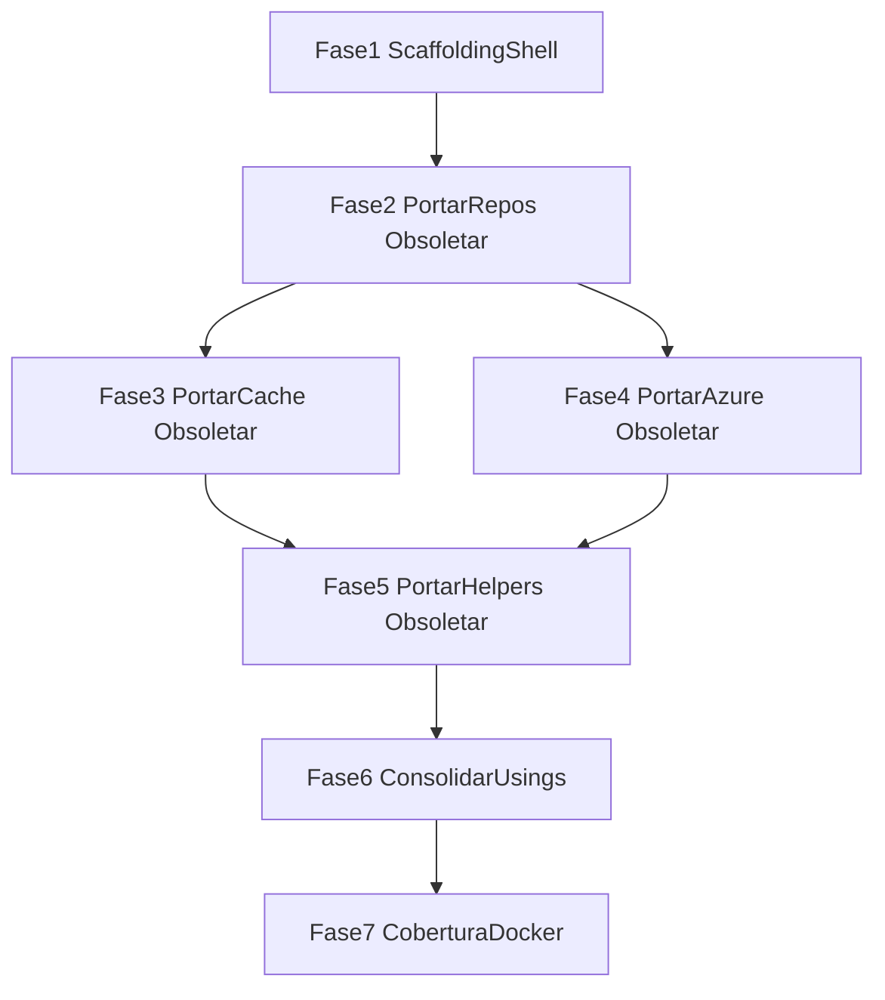

# Plano de Ação — Core canônico + host [Obsolete]

**Versão:** 1.2  
**Data:** 2026-08-04  
**Status:** Planejado — execução de código não iniciada  
**Inventário base:** [Levantamento.md](./Levantamento.md)  
**Fatia futura (Schedule / Notification):** [Levantamento-ScheduleNotificationCore.md](./Levantamento-ScheduleNotificationCore.md) — backlog; **não** altera as Fases 1–7 abaixo  
**Acompanhamento:** [Progresso.md](./Progresso.md)

---

## Regras não negociáveis

1. **Core = canônico:** portar para `SmartDigitalPsicoAPI.Core.SDK` o código dos tipos inventariados (mesmos tipos; sem inventar `Guard`/`Result`/Dapper/UoW/providers Redis novos).
2. **Host = consulta:** **não apagar** os arquivos atuais em Domain/Data/Service/WebAPI. Marcar `[Obsolete]` + comentário `// Movido para SmartDigitalPsicoAPI.Core.SDK`. Preferir shim fino (herda/delega ao Core).
3. **Consumidores:** atualizar `using`, referências de tipo e DI para o pacote Core.
4. **Único shell a criar:** `SmartDigitalPsicoAPI.Core.SDK.csproj` + `SmartDigitalPsicoAPI.Core.SDK.Tests.csproj` + entrada na solution. Além disso, só a **cópia canônica** dos tipos já inventariados.
5. **Um único NuGet:** `PackageId=SmartDigitalPsicoAPI.Core.SDK`.
6. **Manter o específico:** DbContext tipado, entidades, migrations, validators de negócio, enrichers de domínio, `EntityBaseService` / `ReportBaseService`.
7. **Zero regressão funcional.**
8. **Testes:** suíte canônica em `Core.SDK.Tests`; testes no host **não apagar** de imediato — atualizar usings para o Core.
9. **Build após cada fase**; cobertura ≥ 90% no SDK.Tests (tipos canônicos).
10. **Remoção física** dos shims Obsolete no host = **fora de escopo** desta iniciativa.

### Padrão Obsolete (host)

```csharp
// Movido para SmartDigitalPsicoAPI.Core.SDK — implementação canônica no pacote Core.
[Obsolete(
    "Movido para SmartDigitalPsicoAPI.Core.SDK. Use o tipo correspondente no pacote SmartDigitalPsicoAPI.Core.SDK.",
    error: false,
    DiagnosticId = "SDP_CORE_SDK_GENERIC")]
```

| DiagnosticId | Família |
| ------------ | ------- |
| `SDP_CORE_SDK_REPO` | Repositórios genéricos / Table / Queue / FileDisk |
| `SDP_CORE_SDK_CACHE` | Cache contratos + Memory/Disk + CacheService |
| `SDP_CORE_SDK_AZURE` | Adapters Azure |
| `SDP_CORE_SDK_HELPER` | Helpers, VOs, DTOs base, exceptions, ValidationErrorCodes |
| `SDP_CORE_SDK_CRYPTO` | Crypto adapters/factories |
| `SDP_CORE_SDK_REPORT` | Report engines/factories |
| `SDP_CORE_SDK_HYPER` | Hypermedia framework |
| `SDP_CORE_SDK_SMTP` | SMTP strategies |
| `SDP_CORE_SDK_API` | ApiBaseController, RequestCultureMiddleware |

---

## Arquitetura alvo

```text
SmartDigitalPsicoAPI/
├── SmartDigitalPsicoAPI.Core.SDK/          # CANÔNICO (código portado)
│   ├── Repositories/
│   ├── Caching/
│   ├── Cloud/Azure/
│   ├── Helpers/
│   ├── Contracts/
│   ├── Security/
│   ├── Report/
│   ├── Hypermedia/
│   └── Smtp/
├── SmartDigitalPsicoAPI.Core.SDK.Tests/    # Suíte canônica
├── SmartDigitalPsico.Domain/               # Específico + shims [Obsolete] (consulta)
├── SmartDigitalPsico.Data/                 # Específico + shims [Obsolete]
├── SmartDigitalPsico.Service/              # Específico + shims [Obsolete]
└── SmartDigitalPsico.WebAPI/               # Consumidores com usings → Core
```

**TFM:** `net10.0`. Host referencia Core via `ProjectReference`.

---

## Critérios de aceite globais

- [ ] `dotnet build SmartDigitalPsicoAPI.sln` verde
- [ ] `dotnet test` verde
- [ ] Arquivos originais no host **ainda existem** com `[Obsolete]` + comentário
- [ ] Consumidores dos tipos portados usam namespaces do Core
- [ ] Nenhum tipo inventado fora do inventário
- [ ] Atualizar [Progresso.md](./Progresso.md)

### Ritual por tipo (Fases 2–5)

1. Portar código canônico para o Core (ajuste mínimo: namespace; retarget `DbContext` só no Core quando aplicável)
2. No host: marcar `[Obsolete]` + comentário; preferir shim fino
3. Atualizar usings/DI dos consumidores para o Core
4. Portar/copiar testes canônicos para `Core.SDK.Tests`; ajustar usings nos testes do host
5. Build + test

---

## Fase 1 — Scaffolding do container

### Escopo

- Criar shell `SmartDigitalPsicoAPI.Core.SDK.csproj` + `SmartDigitalPsicoAPI.Core.SDK.Tests.csproj`
- Incluir na solution; `ProjectReference` onde necessário
- Pastas vazias; **zero** classes de negócio

### Checklist

- [ ] Shells compilam
- [ ] Solution inclui os projetos
- [ ] Host referencia SDK sem quebrar build

### Critérios de aceite

- [ ] Build verde; nenhum tipo de negócio no SDK ainda

---

## Fase 2 — Portar repositórios genéricos + Obsoletar no host

### Escopo (portar → Core; Obsoletar no host)

`IEntityBaseRepository<T>`, `GenericRepositoryEntityBase<T>`, Table/Queue contracts/repos/factories/services, `EStorageAdapterType`, `BaseEntityTable`, `IFileDiskRepository`, `FileDiskRepository`.

**Não portar:** repos Principals/SystemDomains/Schedule, `IEntityDataContext`, DbContext, migrations.

### Ajuste EF (só no canônico)

No Core, construtor de `GenericRepositoryEntityBase` usa `DbContext`. No host, shim Obsolete aponta ao tipo do Core.

### Checklist

- [ ] Tipos canônicos no Core
- [ ] Originais no host com Obsolete + comentário (não apagados)
- [ ] Usings/DI dos consumidores → Core
- [ ] Testes canônicos em SDK.Tests; host tests com usings atualizados

### Critérios de aceite

- [ ] Build + testes verdes; cobertura dos tipos desta fase ≥ 90% no SDK.Tests
- [ ] Smoke EF / CRUD básico intacto

---

## Fase 3 — Portar cache + Obsoletar no host

### Escopo

Contratos cache, `MemoryCacheRepository`, `DiskCacheRepository`, `CacheConfigurationDto`, `ServiceResponseCacheVO<T>`, `CacheService` (**arquivo inteiro**, stubs inclusos).

**Manter (sem Obsolete desta iniciativa):** `ApplicationCacheLog*`, `IApplicationCacheLogRepository`.

### Checklist

- [ ] Canônico no Core; host Obsolete
- [ ] Usings/DI → Core
- [ ] Testes canônicos + host usings

### Critérios de aceite

- [ ] Build + testes verdes; comportamento Memory/Disk idêntico; cobertura ≥ 90%; nenhum provider Redis/Mongo novo

---

## Fase 4 — Portar adapters Azure + Obsoletar no host

### Escopo

`IStorageBlobAdapter`, `AzureStorageBlobAdapter`, `AzureStorageTableAdapter<T>`, `AzureStorageQueueAdapter`, `BlobFileDto`, `LocationSaveFileConfigurationDto`.

**Manter:** table entities de domínio, token session adapters, `FileManager`.

### Checklist / aceite

- [ ] Core canônico + host Obsolete + usings Core
- [ ] Build/testes verdes; cobertura ≥ 90%; sem adapters AWS/Google/Mongo novos

---

## Fase 5 — Portar helpers, VOs, DTOs, crypto, hypermedia, report, SMTP, API base + Obsoletar

### Escopo — Portar+Obsoletar

Helpers listados no Levantamento §6.1; VOs/DTO bases §7.1; crypto §5.1; report engines; hypermedia framework; SMTP; `ApiBaseController`, `RequestCultureMiddleware`.

### Escopo — Manter

Schedule/Medical/i18n/config host helpers; validators; enrichers; `EntityBaseService`/`ReportBaseService`; controllers WebAPI.

### Checklist / aceite

- [ ] Core + host Obsolete + usings Core
- [ ] `ValidationErrorCodes` no Core como está (mesmo prefixo)
- [ ] Build + Domain/Service/SDK tests verdes; cobertura ≥ 90%; contratos JSON inalterados

---

## Fase 6 — Consolidação de referências (sem apagar host)

### Escopo

- Confirmar usings/DI **100%** nos tipos canônicos do Core para os itens Portar+Obsoletar
- Shims `[Obsolete]` **permanecem** no host como consulta
- Warnings Obsolete: consumidores não devem mais referenciar shims (corrigir usings restantes)
- `NoWarn` global dos `SDP_CORE_SDK_*` **não** deve mascarar uso indevido nos consumidores; shims internos podem usar `#pragma` pontual
- Dockerfiles/restore incluem o `.csproj` do SDK
- **Não** remover fisicamente os arquivos Obsolete nesta fase

### Checklist / aceite

- [ ] Grep de usings antigos nos consumidores dos tipos portados = 0 (exceto shims e docs)
- [ ] Build + suite verde; `dotnet pack` OK; smoke API

---

## Fase 7 — Cobertura, EF e Docker

### Escopo

- Coverlet SDK ≥ 90%
- Smoke EF (migration) sem mudar schema de produção
- Docker build/test conforme pipeline
- Atualizar Progresso.md

### Checklist / aceite

- [ ] Cobertura ≥ 90%; Docker OK; zero regressão; changelog final

---

## Ordem de execução



---

## Fora de escopo

| Item | Motivo |
| ---- | ------ |
| Apagar arquivos `[Obsolete]` do host | Consulta mantida; remoção = iniciativa futura |
| Providers Redis/Mongo/Cosmos novos | Stubs ficam no `CacheService` portado |
| Dapper / UoW / Guard / Result | Inexistentes — não criar |
| Interface mínima nova de contexto EF | Proibido — retarget `DbContext` no Core |
| Portar `EntityBaseService` | Fica no host |
| Pacotes NuGet satélite | Proibido |
| `Data/Context/Configure/Entity/*` | EF Fluent do projeto — **Manter** (ver Levantamento §2.3) |
| Schedule Core + NotificationTemplate stack | Fatia futura — [Levantamento-ScheduleNotificationCore.md](./Levantamento-ScheduleNotificationCore.md); fora das Fases 1–7 |

---

## Comandos de verificação

```bash
dotnet build SmartDigitalPsicoAPI.sln
dotnet test SmartDigitalPsicoAPI.sln --collect:"XPlat Code Coverage"
dotnet pack SmartDigitalPsicoAPI.Core.SDK/SmartDigitalPsicoAPI.Core.SDK.csproj -c Release
```
