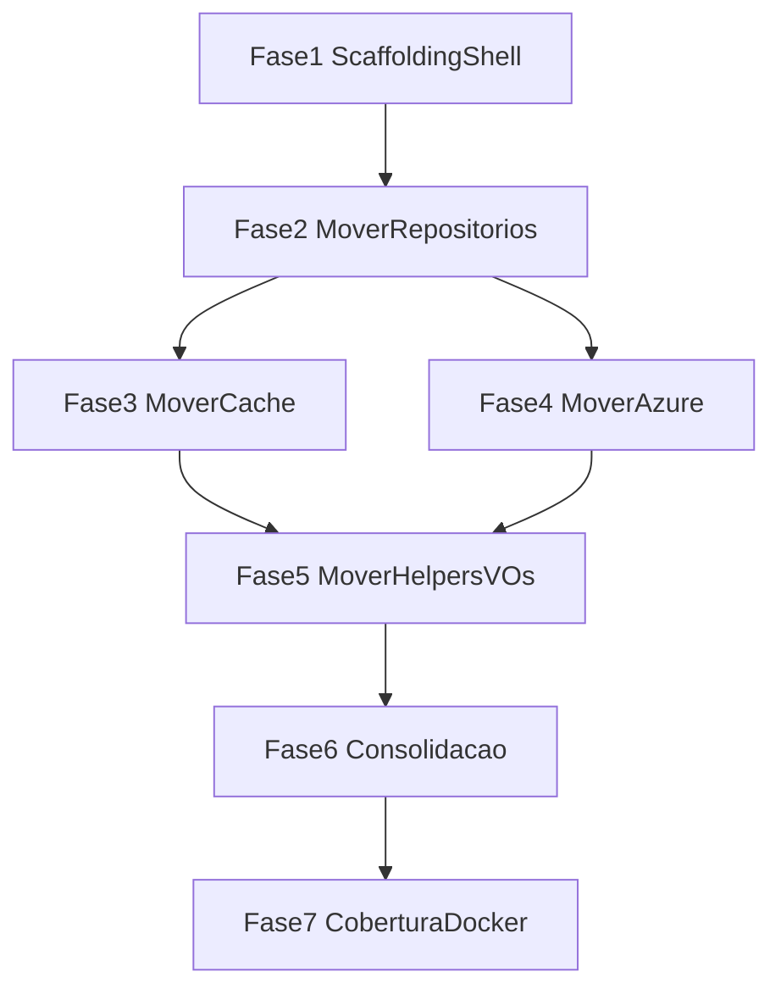

# Plano de Ação — Relocação para SmartDigitalPsicoAPI.Core.SDK

**Versão:** 1.1  
**Data:** 2026-08-04  
**Status:** Planejado — execução de código não iniciada  
**Inventário base:** [Levantamento.md](./Levantamento.md)  
**Acompanhamento:** [Progresso.md](./Progresso.md)

---

## Regras não negociáveis

1. **Só mover, não criar:** relocação física de `.cs` existentes em Domain, Data, Service e WebAPI. Proibido inventar tipos, interfaces, helpers, providers, hooks, fachadas ou “generalizar” constantes.
2. **Único criar permitido:** shell vazio `SmartDigitalPsicoAPI.Core.SDK.csproj` + `SmartDigitalPsicoAPI.Core.SDK.Tests.csproj` + entrada na solution (container do pacote). Zero classes de negócio no scaffolding.
3. **Ajustes permitidos ao mover:** namespaces, `ProjectReference`, usings, registro DI; retarget `GenericRepositoryEntityBase` → parâmetro `DbContext` (tipo EF já existente). Sem mudar comportamento observável.
4. **Um único NuGet:** `PackageId=SmartDigitalPsicoAPI.Core.SDK` — sem pacotes satélite.
5. **Centralizar o genérico / manter o específico:** DbContext tipado, entidades, migrations, validators de negócio, enrichers Hypermedia de domínio, `EntityBaseService` / `ReportBaseService` ficam no host.
6. **Zero regressão funcional:** endpoints, contratos públicos, schema EF e chaves de cache idênticos.
7. **Testes movidos:** cada tipo movido leva seus testes para `SmartDigitalPsicoAPI.Core.SDK.Tests` (sem duplicar a suíte no host).
8. **Build obrigatório após cada fase** e **cobertura ≥ 90%** nos módulos movidos (Coverlet no SDK.Tests).
9. **Sem Dapper / UoW / Guard / Result / Redis provider novos:** inexistentes permanecem inexistentes.

---

## Arquitetura alvo

```text
SmartDigitalPsicoAPI/
├── SmartDigitalPsicoAPI.Core.SDK/          # ÚNICO pacote — só código movido
│   ├── Repositories/                       # GenericRepositoryEntityBase, Table/Queue
│   ├── Caching/                            # Memory/Disk + CacheService (arquivo inteiro)
│   ├── Cloud/Azure/                        # Blob/Table/Queue adapters
│   ├── Helpers/                            # Date, Security, Reflection, API base, ...
│   ├── Contracts/                          # EntityBase, VOs, DTO bases
│   ├── Security/                           # Crypto adapters
│   ├── Report/                             # Excel/PDF engines
│   ├── Hypermedia/                         # Framework (sem enrichers de domínio)
│   └── Smtp/                               # Strategies existentes
├── SmartDigitalPsicoAPI.Core.SDK.Tests/    # Testes movidos dos tipos acima
├── SmartDigitalPsico.Domain/               # Só o específico remanescente
├── SmartDigitalPsico.Data/
├── SmartDigitalPsico.Service/
└── SmartDigitalPsico.WebAPI/
```

**TFM:** `net10.0`. Dependências pesadas (EF, Azure SDKs) no mesmo `.csproj`.

**Consumo:** Domain/Data/Service/WebAPI referenciam o Core.SDK via `ProjectReference`.

---

## Critérios de aceite globais (todas as fases)

- [ ] `dotnet build SmartDigitalPsicoAPI.sln` verde
- [ ] `dotnet test` nos projetos afetados verde
- [ ] Contratos públicos observáveis inalterados (APIs WebAPI)
- [ ] Nenhum tipo novo introduzido (diff = move + usings/refs)
- [ ] Atualizar [Progresso.md](./Progresso.md) ao concluir a fase

---

## Fase 1 — Scaffolding do container (único “criar”)

### Escopo

- Criar **apenas** `SmartDigitalPsicoAPI.Core.SDK.csproj` (`PackageId=SmartDigitalPsicoAPI.Core.SDK`, `net10.0`) — projeto vazio
- Criar **apenas** `SmartDigitalPsicoAPI.Core.SDK.Tests.csproj` (mesmas libs de teste do host: NUnit, Moq, Bogus, AwesomeAssertions, Coverlet)
- Incluir ambos na `SmartDigitalPsicoAPI.sln`
- Adicionar `ProjectReference` do Core.SDK onde necessário (Domain → SDK; Data/Service conforme moves)
- Pastas vazias espelhando a arquitetura alvo
- **Zero** classes, interfaces ou helpers de negócio nesta fase

### Checklist

- [ ] Projeto SDK criado (shell) e compila isolado
- [ ] Projeto Tests criado (shell) e compila
- [ ] Solution inclui os dois projetos
- [ ] Host referencia o SDK sem quebrar build
- [ ] Nenhum `.cs` de produção no SDK ainda

### Critérios de aceite

- [ ] Build verde da solution
- [ ] Nenhum tipo de domínio/código de negócio no SDK

---

## Fase 2 — Mover repositórios genéricos

### Escopo (mover)

| Tipo | Origem atual |
| ---- | ------------ |
| `IEntityBaseRepository<T>` | Domain Interfaces |
| `GenericRepositoryEntityBase<T>` | Data Repository Generic |
| `IStorageTableContract<T>`, `GenericTableEntityRepository<T>` | Domain / Data |
| `IStorageQueueContract`, `GenericStorageQueueRepository` | Domain / Data |
| `IStorageTableRepositoryFactory`, `StorageTableRepositoryFactory`, `StorageTableEntityService<T>` | Domain / Service |
| `IStorageQueueRepositoryFactory`, `StorageQueueRepositoryFactory`, `StorageQueueService` | Domain / Service |
| `EStorageAdapterType`, `BaseEntityTable` | Domain |
| `IFileDiskRepository`, `FileDiskRepository` | Domain / Data |

**Não mover:** repos Principals/SystemDomains/Schedule, `IEntityDataContext`, DbContext concreto, migrations.

### Ajuste de dependência EF (sem criar interface)

Ao mover `GenericRepositoryEntityBase`, alterar o parâmetro do construtor de `IEntityDataContext` para `Microsoft.EntityFrameworkCore.DbContext` (tipo já existente). A classe já usa só `Set<T>` / save. `IEntityDataContext` permanece no Data. Repos de domínio continuam passando a implementação existente do host.

### Checklist

- [ ] Arquivos movidos para o SDK; removidos da origem
- [ ] Usings / ProjectReferences atualizados
- [ ] Repos de domínio herdam a base do SDK
- [ ] Factories e DI registram tipos do SDK
- [ ] Testes listados no Levantamento §13 (Data/Service) **movidos** para SDK.Tests

### Critérios de aceite

- [ ] Build + testes Data.Test remanescentes + SDK.Tests verdes
- [ ] Cobertura dos tipos desta fase ≥ 90% no SDK.Tests
- [ ] Smoke EF: app sobe / CRUD básico via repo de domínio intacto

### Testes a mover

`ScheduleAndGenericRepositoryCoverageTests`, `GenericTableEntityRepositoryTests`, partes aplicáveis de `RemainingDataCoverageTests`, `FileAndDiskCacheRepositoryTests` / `FileDiskRepositoryIncompleteReadTests` (file disk), `InfrastructureFactoryTests`, `StorageTableEntityServiceTests`

---

## Fase 3 — Mover providers de cache

### Escopo (mover)

| Tipo | Origem |
| ---- | ------ |
| `ICacheRepository`, `IMemoryCacheRepository`, `IDiskCacheRepository` | Domain |
| `ICacheService`, `IDataCacheDto<T>`, `ETypeLocationCache` | Domain |
| `CacheConfigurationDto`, `ServiceResponseCacheVO<T>` | Domain |
| `MemoryCacheRepository`, `DiskCacheRepository` | Data |
| `CacheService` (**arquivo inteiro**, incluindo ramos stub Redis/Mongo/Cosmos/Azure como estão) | Service |

**Não mover:** `ApplicationCacheLog*`, `IApplicationCacheLogRepository` (permanecem no host; `CacheService` movido mantém a dependência tipada existente — sem hooks novos).

### Checklist

- [ ] Contratos + Memory/Disk + `CacheService` movidos
- [ ] DI atualizado
- [ ] Testes `MemoryCacheRepositoryTests`, `FileAndDiskCacheRepositoryTests` (cache), `CacheServiceTests` **movidos**

### Critérios de aceite

- [ ] Build + testes verdes
- [ ] Comportamento de cache Memory/Disk idêntico (TTL/keys)
- [ ] Cobertura ≥ 90% dos tipos de cache movidos
- [ ] Nenhum provider Redis/Mongo/Cosmos **novo** criado

---

## Fase 4 — Mover adapters cloud (Azure)

### Escopo (mover)

| Tipo | Origem |
| ---- | ------ |
| `IStorageBlobAdapter`, `AzureStorageBlobAdapter` | Domain / Service |
| `AzureStorageTableAdapter<T>`, `AzureStorageQueueAdapter` | Service |
| `BlobFileDto`, `LocationSaveFileConfigurationDto` | Domain |

**Não mover:** `PatientRecordTableEntity`, `UserTokenSessionTableEntity`, `TableStorageTokenSessionAdapter`, `DatabaseTokenSessionAdapter`, `FileManager`. Não criar adapters AWS/Google/Mongo.

### Checklist

- [ ] Adapters Azure movidos
- [ ] Factories da Fase 2 usam adapters do SDK
- [ ] Testes `AzureStorageAdaptersCoverageTests` **movidos**

### Critérios de aceite

- [ ] Build + testes verdes
- [ ] Contratos de I/O Blob/Table/Queue inalterados
- [ ] Cobertura ≥ 90% dos adapters movidos

---

## Fase 5 — Mover helpers, VOs, DTOs base, crypto, hypermedia, report, SMTP, API base

### Escopo — Mover

**Helpers:** `DateHelper`, `CultureDateTimeHelper`, `DirectoryHelper`, `EmailHelper`, `ReflectionHelpers`, `OrderAttribute`, `EnumDescriptionConverter<T>`, `IgnorableSerializerContractResolver`, `HtmlSanitizerHelper`, `AesKeyGeneratorHelper`, `RsaCryptoServiceHelper`, `SecurityHelper`, `ServiceCollectionHelper`, `ExceptionHandler`, `AppWarningException`, `ValidationErrorCodes` (como está), `FileHelper`, `BlobFileHelper`, `HelperValidation`, `RequestCultureMiddleware`, `ApiBaseController`.

**VOs / contracts / DTO bases:** `ServiceResponse<T>`, `IServiceResponse<T>`, `ErrorResponse`, `ServiceResponseCacheVO<T>`, `PagedSearchVO<T>`, `EntityBase`, `EntityBaseWithNameEmail`, `Record<T>`, `RecordsList<T>`, `EntityDtoBase*`, `FileBase`/`FileData`/`FileDetailDto`, `SmtpSettingsDto`, `EmailMessageDto`, DTOs de security genéricos listados no Levantamento.

**Crypto:** `ICryptoAdpter`, `ICryptoAdapterFactory`, `ICryptoService`, `AesCryptoAdpter`, `RsaCryptoAdpter`, `CryptoAdapterFactory`.

**Report engines:** `ExcelGeneratorOpenXmlAdapter`, `ExcelGeneratorFactory`, `PDFsharpMigraDocReportAdapter`, `QuestPdfReportAdapter`, `PdfReportAdapterFactory`.

**Hypermedia framework:** `ContentResponseEnricher<T>`, abstrações, filtros, links, constants — **sem** enrichers de Patient/Medical/etc. (esses ficam).

**SMTP:** `SmtpEmailStrategy`, `EmailStrategyFactory`, `EmailContext`, `ThirdPartyEmailStrategy` (arquivos existentes).

### Escopo — Manter

- Schedule/*, Medical/*, `ApplicationLanguageHelper`, `LogAppHelper`, `AuditLogHelper`, `ConfigurationAppSettingsHelper`, `SecurityHelperApi`, `LanguageActionFilterAttribute`
- Validators de negócio, enrichers de domínio
- `EntityBaseService`, `ReportBaseService`, `IEntityBaseService`
- Controllers WebAPI

### Checklist

- [ ] Arquivos movidos; removidos da origem; usings do host atualizados
- [ ] `ValidationErrorCodes` inalterado (mesmo prefixo)
- [ ] Enrichers de domínio no Domain usam framework do SDK
- [ ] Testes Domain.Test correspondentes **movidos** (incl. `ApiBaseControllerTests`, `RequestCultureMiddlewareTests`)

### Critérios de aceite

- [ ] Build + Domain.Test + Service.Test + SDK.Tests verdes
- [ ] Cobertura ≥ 90% dos módulos desta fase no SDK
- [ ] Zero mudança de contrato JSON das APIs

### Testes a mover

`GeneralHelpersTests`, `DirectoryHelperTests`, `FileHelperTests`, `ServiceCollectionHelperTests`, `RequestCultureMiddlewareTests`, `SerializationHelpersTests`, `SecurityHelpersTests`, `CryptoAndTokenTests`, Report adapter tests, `AppExceptionTests`, `ValidationHelperTests`, Smtp tests, `ApiBaseControllerTests`

---

## Fase 6 — Consolidação (sem duplicados)

### Escopo

- Confirmar que os arquivos já **saíram** do host (não há cópia residual)
- Preferir **sem shims**; se inevitável, `using`/alias temporário curto (máx. 1 PR)
- Não “corrigir” anomalias de namespace/casing salvo se o arquivo movido já exigir ajuste mínimo de compile
- DI (`ServicesDomainRepository`, `ServicesDomainNoSql`, `ServicesDomainQueue`, cache) aponta 100% ao SDK
- Dockerfiles/restore incluem o `.csproj` do SDK no `dotnet restore` multi-stage

### Checklist

- [ ] Zero duplicata de tipos movidos no host
- [ ] Grep pelos paths antigos dos arquivos movidos = 0 (exceto docs)
- [ ] Solution build limpa
- [ ] Levantamento/Progresso refletem tipos já no SDK

### Critérios de aceite

- [ ] Build + suite completa verde
- [ ] `dotnet pack SmartDigitalPsicoAPI.Core.SDK` gera nupkg
- [ ] Sem regressão funcional (smoke API / health)

---

## Fase 7 — Cobertura, EF e Docker

### Escopo

- Confirmar que todos os testes do [Levantamento §13](./Levantamento.md) dos tipos movidos estão no SDK.Tests
- Coverlet do **SDK** ≥ 90% (linhas dos tipos movidos)
- Validação EF: seed mínimo + `dotnet ef migrations add` (smoke) + `database update` em ambiente de teste — **sem** alterar schema de produção
- `docker compose build` / testes conforme pipeline existente
- Atualizar [Progresso.md](./Progresso.md)

### Checklist

- [ ] SDK.Tests cobre todos os tipos **Mover** das Fases 2–5
- [ ] Relatório Coverlet ≥ 90%
- [ ] Smoke EF documentado no Progresso
- [ ] Docker build/test OK
- [ ] Suite host remanescente verde

### Critérios de aceite

- [ ] Cobertura ≥ 90% validada
- [ ] Docker build/test OK
- [ ] Zero regressão funcional confirmada
- [ ] Progresso.md com changelog final da relocação

---

## Ordem de execução e dependências



Fases 3 e 4 podem rodar em paralelo após a Fase 2.

---

## Fora de escopo (não criar)

| Item | Motivo |
| ---- | ------ |
| Providers Redis / Mongo / Cosmos novos | Stubs já vão dentro do `CacheService` movido; não inventar classes |
| Dapper / Unit of Work | Inexistentes — não criar |
| `Guard` / `Result<T>` | Inexistentes — usar `ServiceResponse<T>` movido |
| Interface mínima nova de contexto EF | Proibido — retarget para `DbContext` existente |
| Mover `EntityBaseService` | Fica no host |
| Pacotes NuGet satélite | Proibido |

---

## Comandos de verificação (por fase)

```bash
dotnet build SmartDigitalPsicoAPI.sln
dotnet test SmartDigitalPsicoAPI.sln --collect:"XPlat Code Coverage"
dotnet pack SmartDigitalPsicoAPI.Core.SDK/SmartDigitalPsicoAPI.Core.SDK.csproj -c Release
```

(Ajustar paths relativos após o scaffolding da Fase 1.)
