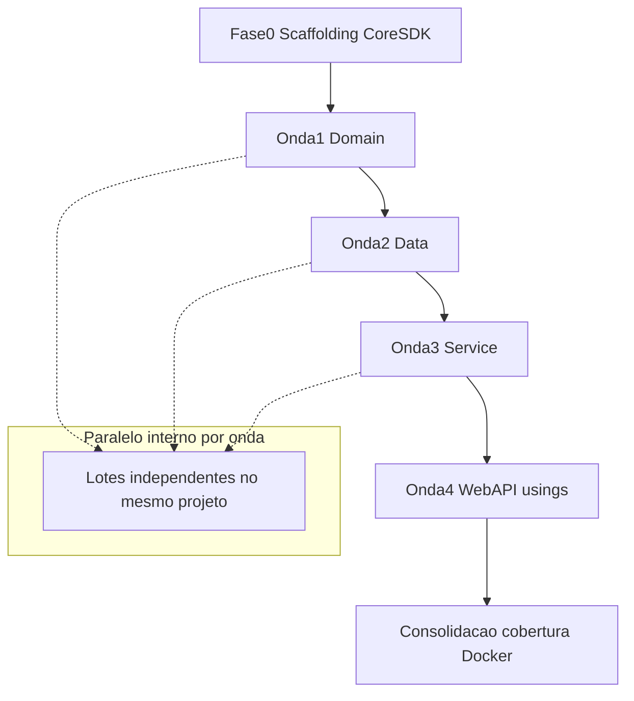

# Plano de Execução por Projeto — SmartDigitalPsicoAPI.Core.SDK

**Versão:** 1.0  
**Data:** 2026-08-04  
**Estratégia:** Core canônico + host `[Obsolete]` ([Levantamento.md](./Levantamento.md) / [PlanoDeAcao.md](./PlanoDeAcao.md))  
**Análises:** [Analise-Domain.md](./Analise-Domain.md) · [Analise-Data.md](./Analise-Data.md) · [Analise-Service.md](./Analise-Service.md) · [Analise-WebAPI.md](./Analise-WebAPI.md)

---

## 0. Decisão de orquestração

| Eixo | Modo | Motivo |
| ---- | ---- | ------ |
| **Entre projetos** | **Sequencial** por dependência | Domain → Data → Service → WebAPI (referências e usings em cascata) |
| **Dentro do projeto** | **Paralelo por lotes** independentes | Vários helpers/adapters sem dep mútua no mesmo lote |
| **Pré-requisito** | Fase 0 única | Shell `Core.SDK` + `Core.SDK.Tests` antes de qualquer onda |

**Não** iniciar Domain e Service em paralelo no começo: Service depende de contratos Domain já canônicos no Core.

Fatia Schedule/Notification ([Levantamento-ScheduleNotificationCore.md](./Levantamento-ScheduleNotificationCore.md)) = **backlog** — fora deste plano até priorização.

---

## 1. Fluxo global



---

## 2. Mapa Fases 1–7 (PlanoDeAcao) × projeto

| Fase PlanoDeAcao | Projetos tocados | Onda |
| ---------------- | ---------------- | ---- |
| 1 Scaffolding | Core.SDK (+ Tests) | **Fase 0** |
| 2 Repos genéricos | Domain (contratos) + Data (impl) + Service (factories) | Onda 1 parcial → Onda 2 → Onda 3 parcial |
| 3 Cache | Domain (contratos/DTOs) + Data (Memory/Disk) + Service (`CacheService`) | Onda 1 → 2 → 3 |
| 4 Azure adapters | Domain (contratos/DTOs) + Service (adapters) | Onda 1 → 3 |
| 5 Helpers/VOs/crypto/hypermedia/report/SMTP/API | Domain (maioria) + Service (SMTP/Report factories) | Onda 1 + Onda 3 |
| 6 Consolidar usings | Todos + WebAPI | Onda 4 + consolidação |
| 7 Cobertura / EF / Docker | Core.SDK.Tests + host | Consolidação |

---

## 3. Fase 0 — Scaffolding (sequencial, bloqueante)

- [ ] Criar shell `SmartDigitalPsicoAPI.Core.SDK` + `.Tests`
- [ ] Incluir na solution; `ProjectReference` Domain→Core (depois Data/Service/WebAPI conforme ondas)
- [ ] Build solution verde; **zero** classes de negócio ainda

**Aceite:** build OK; nenhum tipo inventariado no Core ainda.

---

## 4. Onda 1 — Domain (sequencial após F0; paralelo interno)

Ver [Analise-Domain.md](./Analise-Domain.md).

| Lote | Conteúdo | Paralelo? |
| ---- | -------- | --------- |
| D1 | Contratos base: `EntityBase*`, `ServiceResponse*`, `ErrorResponse`, `IEntityBaseRepository`, `Record*` | Sequencial primeiro (base) |
| D2 | Cache contracts + `CacheConfigurationDto` + enums cache/storage | Paralelo com D3/D4 após D1 |
| D3 | Helpers + exceptions + `ValidationErrorCodes` + `HelperValidation` | Paralelo |
| D4 | Crypto contracts/adapters Domain + security DTOs | Paralelo |
| D5 | Hypermedia framework (sem enrichers) | Paralelo |
| D6 | Report engines Domain + `ApiBaseController` + `RequestCultureMiddleware` | Paralelo |
| D7 | Storage/blob contracts + `BaseEntityTable` + factory interfaces | Paralelo |

**Ritual por tipo:** portar canônico → Obsolete shim no Domain → usings consumidores internos do Domain → testes Domain.Test usings → build.

**Aceite da onda:** Domain.Test verde; shims Obsolete presentes; Data/Service ainda podem compilar (shims ou usings mistos até ondas seguintes).

---

## 5. Onda 2 — Data (após Onda 1; paralelo interno)

Ver [Analise-Data.md](./Analise-Data.md).

| Lote | Conteúdo | Paralelo? |
| ---- | -------- | --------- |
| A1 | `GenericRepositoryEntityBase` (retarget `DbContext` no Core) | Sequencial primeiro |
| A2 | `MemoryCacheRepository` + `DiskCacheRepository` | Paralelo entre si após A1/contratos |
| A3 | `GenericTableEntityRepository` + `GenericStorageQueueRepository` | Paralelo |
| A4 | `FileDiskRepository` | Paralelo com A2/A3 |

**Manter intacto:** `Context/Configure/Entity/*`, repos Principals/SystemDomains/Schedule, `IEntityDataContext`, migrations.

**Aceite:** Data.Test verde (usings Core); repos de domínio herdam base do Core.

---

## 6. Onda 3 — Service (após Onda 2; paralelo interno)

Ver [Analise-Service.md](./Analise-Service.md).

| Lote | Conteúdo | Paralelo? |
| ---- | -------- | --------- |
| S1 | Azure Blob / Table / Queue adapters | Paralelo entre os 3 |
| S2 | `StorageTable*Factory/Service` + `StorageQueue*Factory/Service` | Após S1 |
| S3 | `CacheService` integral | Paralelo com S4/S5 após contratos |
| S4 | SMTP (`EmailStrategyFactory`, strategies) | Paralelo |
| S5 | Report factories Service | Paralelo |

**Manter:** `EntityBaseService`, `ReportBaseService`, Medical Schedule, token-session adapters, notification platform factory.

**Aceite:** Service.Test verde; DI aponta ao Core.

---

## 7. Onda 4 — WebAPI (sequencial ao final)

Ver [Analise-WebAPI.md](./Analise-WebAPI.md).

| Lote | Conteúdo |
| ---- | -------- |
| W1 | `ProjectReference` Core; usings nos controllers/Program/Startup |
| W2 | Smoke endpoints / health; build WebAPI.Test |

**Quase nenhum Portar** — WebAPI é consumidor. Controllers **Manter**.

**Aceite:** WebAPI build + smoke; zero referência direta a tipos Obsolete nos controllers (exceto se inevitável com `#pragma`).

---

## 8. Consolidação (Fases 6–7)

- [ ] Grep usings antigos nos consumidores dos tipos portados = 0 (exceto shims)
- [ ] Coverlet Core.SDK.Tests ≥ 90%
- [ ] Smoke EF + Docker
- [ ] Atualizar [Progresso.md](./Progresso.md)

---

## 9. Critérios de passagem entre ondas

| De → Para | Gate |
| --------- | ---- |
| F0 → Onda 1 | Shell compila; solution inclui Core |
| Onda 1 → 2 | Contratos Domain canônicos no Core; Domain.Test OK |
| Onda 2 → 3 | Generic repo + cache repos no Core; Data.Test OK |
| Onda 3 → 4 | Adapters/factories/CacheService no Core; Service.Test OK |
| Onda 4 → Consol | WebAPI usings Core; smoke OK |

---

## 10. O que NÃO fazer em paralelo

- Domain Onda 1 completa **antes** de portar impls Data que dependem de `EntityBase` / `IEntityBaseRepository`
- Service Azure **antes** de contratos `IStorage*` no Core (Onda 1)
- WebAPI usings em massa **antes** de Onda 3 (tipos ainda só no host geram drift)
- Schedule Core Medical **junto** com Fases 1–7 (backlog separado)

---

## 11. Comandos

```bash
dotnet build SmartDigitalPsicoAPI.sln
dotnet test SmartDigitalPsicoAPI.sln --collect:"XPlat Code Coverage"
dotnet pack SmartDigitalPsicoAPI.Core.SDK/SmartDigitalPsicoAPI.Core.SDK.csproj -c Release
```
