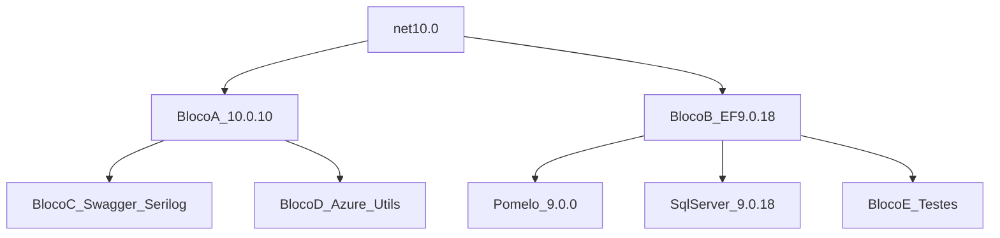
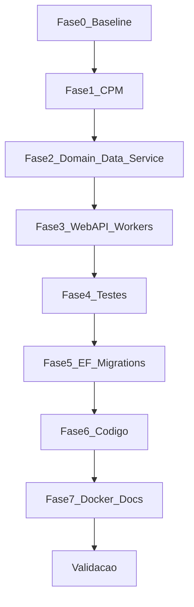

# Plano de Ação — Migração SmartDigitalPsicoAPI .NET 8 → .NET 10

**Documento:** Plano de execução operacional  
**Solução:** `SmartDigitalPsicoAPI/SmartDigitalPsicoAPI.sln`  
**Baseado em:** `RascunhoPlanoUpdateDotNet10.md`, `DOCUMENTACAO/GuiaGenericoAtualizacaoPacotes.md` e inventário em `DOCUMENTACAO/API/2026-07-LevantamentoConjuntoHomologado-SmartDigitalPsicoAPI.md`  
**Data:** 2026-07-31  
**Status:** Planejado (não executado)

---

## 1. Objetivo

Atualizar **todos os projetos .NET da solução `SmartDigitalPsicoAPI.sln`** de `net8.0` para `net10.0`, preservando:

- Integridade de migrations EF Core (MySQL/Pomelo e SqlServer), seeds e constraints
- Funcionamento da WebAPI, WindowsService, WebJob, DI, Serilog, Swagger e JwtBearer
- Suíte NUnit (`Domain.Test`, `Data.Test`)
- Build local, Docker (imagens 10.0), README, `global.json` e alinhamento do pipeline Azure DevOps externo
- Zero alteração de contratos públicos, regras de negócio ou schemas sem necessidade técnica

Detalhamento de versões: **Conjunto Homologado v1** em `DOCUMENTACAO/API/2026-07-LevantamentoConjuntoHomologado-SmartDigitalPsicoAPI.md`.  
Checklist fase a fase: `DOCUMENTACAO/API/PlanoImplementacaoMigracaoDotNet10-SmartDigitalPsicoAPI.md`.

---

## 2. Escopo e não escopo

### 2.1 Escopo

| Categoria | Ação |
| --------- | ---- |
| Bibliotecas (Domain, Data, Service) | `TargetFramework` → `net10.0` |
| WebAPI / WindowsService / WebJob | `TargetFramework` → `net10.0` |
| Domain.Test / Data.Test | `TargetFramework` → `net10.0` + Bloco E |
| Pacotes NuGet | Aplicar **Conjunto Homologado v1** |
| Central Package Management | Criar `SmartDigitalPsicoAPI/Directory.Packages.props` |
| Remoção | `MySql.EntityFrameworkCore` (dead reference) |
| Dockerfiles | `aspnet:10.0` / `sdk:10.0` |
| README / global.json | SDK 10.x |
| Pipeline Azure DevOps (externo) | Task `UseDotNet@2` → `10.x` |

### 2.2 Não escopo

- Frontend / npm
- Stack AI (Semantic Kernel) — não presente nos `.csproj`
- Pacote NuGet publicável multi-target
- Fork Pomelo comunitário / EF Core 10 (Conjunto v2)
- Refatoração arquitetural (ex.: limpar Swagger/JwtBearer do Domain)
- Alteração de regras de negócio ou contratos REST

---

## 3. Inventário atual (SmartDigitalPsicoAPI)

### 3.1 Solução

- **Arquivo:** `SmartDigitalPsicoAPI/SmartDigitalPsicoAPI.sln`
- **Projetos C# no .sln:** 8
- **Framework atual:** `net8.0` em 100% dos projetos C#
- **CPM:** ausente (versões inline nos `.csproj`)
- **Testes automatizados:** NUnit em `Domain.Test` e `Data.Test`

### 3.2 Tabela de projetos

| Projeto | Caminho | Tipo | TFM atual | TFM alvo |
| ------- | ------- | ---- | --------- | -------- |
| SmartDigitalPsico.Domain | `SmartDigitalPsico.Domain/` | Class Library | net8.0 | **net10.0** |
| SmartDigitalPsico.Data | `SmartDigitalPsico.Data/` | Class Library + EF | net8.0 | **net10.0** |
| SmartDigitalPsico.Service | `SmartDigitalPsico.Service/` | Class Library | net8.0 | **net10.0** |
| SmartDigitalPsico.WebAPI | `SmartDigitalPsico.WebAPI/` | Web API | net8.0 | **net10.0** |
| SmartDigitalPsico.WindowsService | `SmartDigitalPsico.WindowsService/` | Worker | net8.0 | **net10.0** |
| SmartDigitalPsico.WebJob | `SmartDigitalPsico.WebJob/` | Worker / WebJobs | net8.0 | **net10.0** |
| SmartDigitalPsico.Domain.Test | `SmartDigitalPsico.Domain.Test/` | Test NUnit | net8.0 | **net10.0** |
| SmartDigitalPsico.Data.Test | `SmartDigitalPsico.Data.Test/` | Test NUnit | net8.0 | **net10.0** |

**Cadeia:**

```text
WebAPI → Service → Data → Domain
WindowsService → Service, Data
WebJob → Service
Domain.Test → Domain
Data.Test → Data
```

### 3.3 Problemas já detectados (pré-migração)

| ID | Problema | Tratamento no Conjunto v1 |
| -- | -------- | ------------------------- |
| P1 | Extensions/`System.Text.Json` **9.0.5** com TFM 8 | TFM `net10.0` + Bloco A **10.0.10** |
| P2 | Pomelo **8.0.3** | Pomelo **9.0.0** + EF **9.0.18** |
| P3 | `MySql.EntityFrameworkCore` sem uso no DI | Remover |
| P4 | Swashbuckle **8.x** | **10.2.3** |
| P5 | AutoMapper **14.0.0** | **16.2.0** |
| P6 | Sem CPM / Docker 8.0 / README .NET 8 | CPM + imagens 10.0 + docs |

### 3.4 Princípio de seleção de versões

Cada pacote na **última versão estável** que seja **simultaneamente**:

1. Compatível com **`net10.0`**
2. Compatível com os demais pacotes do mesmo bloco
3. Sem preview em produção

**Regra de ouro:** AspNetCore/Extensions/`System.Text.Json` no mesmo patch **10.0.10**. EF + providers na mesma major, limitada por **Pomelo 9** → EF **9.0.18**. Moq.EF na linha **9.x** (não 10.x).

### 3.5 Conjunto Homologado v1 — resumo por blocos

Fonte completa: `DOCUMENTACAO/API/2026-07-LevantamentoConjuntoHomologado-SmartDigitalPsicoAPI.md`.

| Bloco | Conteúdo | Versões a aplicar |
| ----- | -------- | ----------------- |
| **A** | AspNetCore JwtBearer, Extensions, Hosting, System.* | **10.0.10** |
| **B** | EF Core + SqlServer + InMemory + Pomelo | EF **9.0.18**, Pomelo **9.0.0**; sem Oracle MySQL EF |
| **C** | Swashbuckle, Serilog, JsonWebTokens | Swashbuckle **10.2.3**, Serilog.AspNetCore / Extensions.Hosting **10.0.0** |
| **D** | Azure, AutoMapper, FluentValidation, WebJobs, etc. | Conforme levantamento (ex.: AutoMapper **16.2.0**, Graph **5.105.0**) |
| **E** | NUnit, Moq, coverlet, Moq.EF | Moq.EF **9.0.0.10**; InMemory **9.0.18** |



### 3.6 Conjunto Homologado v2 (futuro)

Quando Pomelo **10.0.x** oficial existir ([#2007](https://github.com/PomeloFoundation/Pomelo.EntityFrameworkCore.MySql/issues/2007)): subir Bloco B para EF 10; avaliar Moq.EF 10 e Graph 6. **Sem forks comunitários.**

### 3.7 O que **não** aplicar no v1

| Tentativa | Resultado | Correto |
| --------- | --------- | ------- |
| EF **10** + Pomelo **9** | `NU1107` | EF **9.0.18** |
| Moq.EF **10** + EF **9** | Incompatível | **9.0.0.10** |
| AspNetCore **8** + `net10.0` | `NU1202` | **10.0.10** |
| Graph **6** sem smoke | Breaking | Manter major 5 no v1 |

### 3.8 Centralização — `Directory.Packages.props`

Criar `SmartDigitalPsicoAPI/Directory.Packages.props` com o XML do levantamento (Seção 10). Remover `Version=` dos `.csproj`.

---

## 4. Plano de execução por fases

Branch: `chore/update-packages-smartdigitalpsicoapi-dotnet10`



| Fase | Ação | Critério de saída |
| ---- | ---- | ----------------- |
| 0 | Baseline build + test | 0 erros; testes OK no estado net8 |
| 1 | Criar CPM + remover Version= + remover Oracle MySQL EF | Restore sem conflito |
| 2 | Domain → Data → Service → `net10.0` | Build libs OK |
| 3 | WebAPI + WindowsService + WebJob → `net10.0` | Solução Release OK |
| 4 | Test projects → `net10.0` | `dotnet test` 100% |
| 5 | Migrations; migration temporária vazia | Sem schema acidental |
| 6 | Swagger 10 / OpenAPI 2; LINQ; AutoMapper 16 | Compile + testes |
| 7 | Docker 10.0, `global.json`, README SDK 10, nota CI | Docs + imagens alinhados |

Detalhe operacional: `DOCUMENTACAO/API/PlanoImplementacaoMigracaoDotNet10-SmartDigitalPsicoAPI.md`.

---

## 5. Checklist de validação

```powershell
cd SmartDigitalPsicoAPI
dotnet restore SmartDigitalPsicoAPI.sln
dotnet build SmartDigitalPsicoAPI.sln -c Release
dotnet test SmartDigitalPsicoAPI.sln -c Release
dotnet ef migrations list --project SmartDigitalPsico.Data --startup-project SmartDigitalPsico.WebAPI
dotnet run --project SmartDigitalPsico.WebAPI
```

- [ ] Restore sem `NU1107` / `NU1202`
- [ ] Build Release 0 erros
- [ ] Testes NUnit 100% passando
- [ ] Migration temporária vazia (ou investigação documentada)
- [ ] WebAPI sobe; DI OK; Swagger OK; smoke JWT
- [ ] WindowsService / WebJob smoke OK
- [ ] Dockerfiles 10.0; README + `global.json` SDK 10; CI externo anotado

---

## 6. Rollback

```powershell
git reset --hard <commit-baseline-fase-0>
cd SmartDigitalPsicoAPI
dotnet restore SmartDigitalPsicoAPI.sln
dotnet build SmartDigitalPsicoAPI.sln -c Release
dotnet test SmartDigitalPsicoAPI.sln -c Release
```

Restaurar em conjunto: `Directory.Packages.props`, `.csproj`, Dockerfiles, `global.json`, README.

---

## 7. Riscos residuais

| Risco | Mitigação |
| ----- | --------- |
| Pomelo 9 trava EF 9 | Conjunto v2 quando Pomelo 10 oficial |
| AutoMapper 16 / licença | Smoke mapeamentos + testes |
| Dual SqlServer/MySQL | Validar ambos se usados em homolog |
| Pipeline DevOps desalinhado | Fase 7 — UseDotNet 10.x |
| WebJobs + Hosting 10 | Validar restore/runtime na Fase 3 |

---

## 8. Evidências da entrega

Preencher `DOCUMENTACAO/UpdateDotNet10/RelatorioMigracaoDotNet10.md` após a execução.

```text
Projetos .NET atualizados: 8
Pacotes NuGet alinhados ao Conjunto v1: N
Testes automatizados: N/N
Build Release: OK/FAIL
Migrations: vazia / investigada
Smoke WebAPI / JWT / workers: OK/FAIL
Docker 10.0: OK/FAIL
```

---

## 9. Referências

- `DOCUMENTACAO/API/2026-07-LevantamentoConjuntoHomologado-SmartDigitalPsicoAPI.md`
- `DOCUMENTACAO/API/PlanoImplementacaoMigracaoDotNet10-SmartDigitalPsicoAPI.md`
- `DOCUMENTACAO/UpdateDotNet10/RascunhoPlanoUpdateDotNet10.md`
- `DOCUMENTACAO/UpdateDotNet10/RelatorioMigracaoDotNet10.md`
- `DOCUMENTACAO/GuiaGenericoAtualizacaoPacotes.md`
