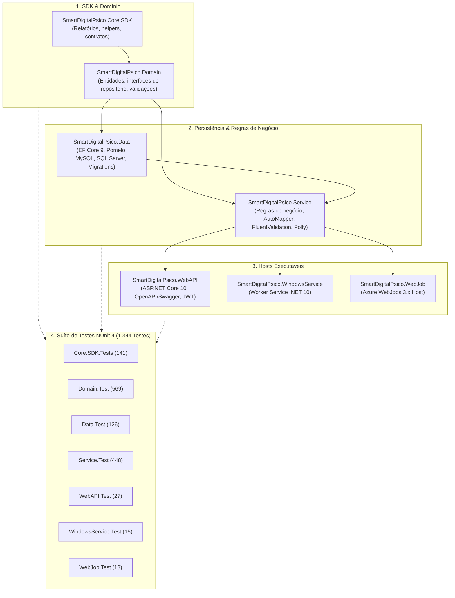

# Guia Específico — Atualização de Pacotes (SmartDigitalPsicoAPI)

**Projeto:** `SmartDigitalPsicoAPI`  
**Solução:** [SmartDigitalPsicoAPI.sln](file:///c:/git/SMARTDIGITALPSICO/SmartDigitalPsicoAPI/SmartDigitalPsicoAPI.sln)  
**Gerenciamento Central:** [Directory.Packages.props](file:///c:/git/SMARTDIGITALPSICO/SmartDigitalPsicoAPI/Directory.Packages.props)  
**Guia Base Genérico:** [GuiaGenericoAtualizacaoPacotesNet.md](file:///c:/git/SMARTDIGITALPSICO/SmartDigitalPsicoAPI/DOCUMENTACAO/UpdatePackages/GuiaGenericoAtualizacaoPacotesNet.md)  
**Análise de Testes:** [Analise-xUnit-v4-MicrosoftTestingPlatform.md](file:///c:/git/SMARTDIGITALPSICO/SmartDigitalPsicoAPI/DOCUMENTACAO/UpdatePackages/Analise-xUnit-v4-MicrosoftTestingPlatform.md)  
**Data:** 2026-08-22  

---

## 1. Contexto Arquitetural da Solução

O **SmartDigitalPsicoAPI** é a plataforma backend do ecossistema SmartDigitalPsico, implementada em **C# / .NET 10** (`net10.0`). A solução é composta por **14 projetos** organizados em camadas de arquitetura limpa e microsserviços/workers especializados, com versões de pacotes estritamente centralizadas via **Central Package Management (CPM)**.



---

## 2. Mapa dos 14 Projetos da Solução

| Projeto | Caminho | Tipo | Finalidade | Projeto de Teste Associado |
| ------- | ------- | ---- | ---------- | -------------------------- |
| [SmartDigitalPsico.Core.SDK](file:///c:/git/SMARTDIGITALPSICO/SmartDigitalPsicoAPI/SmartDigitalPsico.Core.SDK/SmartDigitalPsico.Core.SDK.csproj) | `SmartDigitalPsico.Core.SDK/` | Class Library | Geradores de relatórios (Excel OpenXML, PDF QuestPDF/PDFsharp), helpers e SDK | [SmartDigitalPsico.Core.SDK.Tests](file:///c:/git/SMARTDIGITALPSICO/SmartDigitalPsicoAPI/SmartDigitalPsico.Core.SDK.Tests/SmartDigitalPsico.Core.SDK.Tests.csproj) |
| [SmartDigitalPsico.Domain](file:///c:/git/SMARTDIGITALPSICO/SmartDigitalPsicoAPI/SmartDigitalPsico.Domain/SmartDigitalPsico.Domain.csproj) | `SmartDigitalPsico.Domain/` | Class Library | Entidades de domínio, enums, interfaces e modelos de autenticação | [SmartDigitalPsico.Domain.Test](file:///c:/git/SMARTDIGITALPSICO/SmartDigitalPsicoAPI/SmartDigitalPsico.Domain.Test/SmartDigitalPsico.Domain.Test.csproj) |
| [SmartDigitalPsico.Data](file:///c:/git/SMARTDIGITALPSICO/SmartDigitalPsicoAPI/SmartDigitalPsico.Data/SmartDigitalPsico.Data.csproj) | `SmartDigitalPsico.Data/` | Class Library | Contextos EF Core (`SmartDigitalPsicoDataContext`), mapeamentos, seeds e migrations | [SmartDigitalPsico.Data.Test](file:///c:/git/SMARTDIGITALPSICO/SmartDigitalPsicoAPI/SmartDigitalPsico.Data.Test/SmartDigitalPsico.Data.Test.csproj) |
| [SmartDigitalPsico.Service](file:///c:/git/SMARTDIGITALPSICO/SmartDigitalPsicoAPI/SmartDigitalPsico.Service/SmartDigitalPsico.Service.csproj) | `SmartDigitalPsico.Service/` | Class Library | Implementação dos serviços de aplicação, orquestração de domínio, segurança e regras de negócio | [SmartDigitalPsico.Service.Test](file:///c:/git/SMARTDIGITALPSICO/SmartDigitalPsicoAPI/SmartDigitalPsico.Service.Test/SmartDigitalPsico.Service.Test.csproj) |
| [SmartDigitalPsico.WebAPI](file:///c:/git/SMARTDIGITALPSICO/SmartDigitalPsicoAPI/SmartDigitalPsico.WebAPI/SmartDigitalPsico.WebAPI.csproj) | `SmartDigitalPsico.WebAPI/` | Web API | Endpoints RESTful, documentação Swagger/OpenAPI, autenticação JWT e middlewares | [SmartDigitalPsico.WebAPI.Test](file:///c:/git/SMARTDIGITALPSICO/SmartDigitalPsicoAPI/SmartDigitalPsico.WebAPI.Test/SmartDigitalPsico.WebAPI.Test.csproj) |
| [SmartDigitalPsico.WindowsService](file:///c:/git/SMARTDIGITALPSICO/SmartDigitalPsicoAPI/SmartDigitalPsico.WindowsService/SmartDigitalPsico.WindowsService.csproj) | `SmartDigitalPsico.WindowsService/` | Worker Service | Background service executável como serviço nativo do Windows | [SmartDigitalPsico.WindowsService.Test](file:///c:/git/SMARTDIGITALPSICO/SmartDigitalPsicoAPI/SmartDigitalPsico.WindowsService.Test/SmartDigitalPsico.WindowsService.Test.csproj) |
| [SmartDigitalPsico.WebJob](file:///c:/git/SMARTDIGITALPSICO/SmartDigitalPsicoAPI/SmartDigitalPsico.WebJob/SmartDigitalPsico.WebJob.csproj) | `SmartDigitalPsico.WebJob/` | Console / Job | Host Azure WebJobs 3.x para processamento de filas e rotinas agendadas | [SmartDigitalPsico.WebJob.Test](file:///c:/git/SMARTDIGITALPSICO/SmartDigitalPsicoAPI/SmartDigitalPsico.WebJob.Test/SmartDigitalPsico.WebJob.Test.csproj) |

---

## 3. Mapeamento de Dependências por Blocos ([Directory.Packages.props](file:///c:/git/SMARTDIGITALPSICO/SmartDigitalPsicoAPI/Directory.Packages.props))

### Bloco A — Plataforma .NET 10 (patch 10.0.11)
Pacotes centrais do ASP.NET Core e Microsoft.Extensions alinhados no patch **10.0.11**:
- `Microsoft.AspNetCore.Authentication.JwtBearer`
- `Microsoft.AspNetCore.Mvc.Testing`
- `Microsoft.Extensions.Caching.Memory`
- `Microsoft.Extensions.Configuration.FileExtensions`
- `Microsoft.Extensions.Configuration.Json`
- `Microsoft.Extensions.Hosting`
- `Microsoft.Extensions.Hosting.WindowsServices`
- `Microsoft.Extensions.Identity.Core`

---

### Bloco B — Persistência (EF Core 9 + Pomelo 9 — Trava Pomelo)
> [!IMPORTANT]
> **Trava Arquitetural Pomelo ↔ EF Core 10:** O provider `Pomelo.EntityFrameworkCore.MySql 9.0.0` é a versão oficial estável mais recente no NuGet.org e exige EF Core <= 9.x. Todos os pacotes `Microsoft.EntityFrameworkCore.*` permanecem fixados em **`9.0.18`** para garantir integridade total das operações MySQL e migrations.
- `Microsoft.EntityFrameworkCore` (`9.0.18`)
- `Microsoft.EntityFrameworkCore.Abstractions` (`9.0.18`)
- `Microsoft.EntityFrameworkCore.Design` (`9.0.18`)
- `Microsoft.EntityFrameworkCore.InMemory` (`9.0.18`)
- `Microsoft.EntityFrameworkCore.Sqlite` (`9.0.18`)
- `Microsoft.EntityFrameworkCore.SqlServer` (`9.0.18`)
- `Microsoft.EntityFrameworkCore.Tools` (`9.0.18`)
- `Pomelo.EntityFrameworkCore.MySql` (`9.0.0`)
- **Overrides de Segurança/Compatibilidade:** `Microsoft.Data.SqlClient` (`6.1.6`) e `SQLitePCLRaw.bundle_e_sqlite3` (`3.0.5`).

---

### Bloco C — OpenAPI, Logging e Tokens
- `Swashbuckle.AspNetCore` (`10.2.3`), `Swashbuckle.AspNetCore.Annotations` (`10.2.3`), `Swashbuckle.AspNetCore.Filters` (`10.0.1`)
- `Serilog` (`4.4.0`), `Serilog.AspNetCore` (`10.0.0`), `Serilog.Extensions.Hosting` (`10.0.0`), `Serilog.Sinks.Console` (`6.1.1`), `Serilog.Sinks.File` (`7.0.0`)
- `Microsoft.IdentityModel.JsonWebTokens` (`8.22.0`), `System.IdentityModel.Tokens.Jwt` (`8.22.0`)
- `Scrutor` (`7.0.0`)

---

### Bloco D — Utilitários, Relatórios e Integrações Cloud
- `AutoMapper` (`16.2.0`)
- `FluentValidation` (`12.1.1`), `FluentValidation.DependencyInjectionExtensions` (`12.1.1`)
- `Newtonsoft.Json` (`13.0.4`)
- `Polly` (`8.7.0`), `Polly.Core` (`8.7.0`)
- `Bogus` (`35.6.5`)
- `HtmlSanitizer` (`9.2.995`) + `AngleSharp` (`1.7.1`) + `AngleSharp.Css` (`1.0.1`)
- `DocumentFormat.OpenXml` (`3.5.1`), `DocumentFormat.OpenXml.Framework` (`3.5.1`)
- `PDFsharp` (`6.2.4`), `PDFsharp-MigraDoc` (`6.2.4`)
- `QuestPDF` (`2026.7.3`)
- `Microsoft.VisualStudio.Azure.Containers.Tools.Targets` (`1.23.0`)
- `Microsoft.Azure.WebJobs` (`3.0.47`), `Microsoft.Azure.WebJobs.Core` (`3.0.47`), `Microsoft.Azure.WebJobs.Extensions` (`5.2.1`)
- `Azure.Identity` (`1.21.0`), `Azure.Monitor.OpenTelemetry.AspNetCore` (`1.6.0`), `Azure.Storage.Blobs` (`12.29.1`), `Azure.Storage.Queues` (`12.27.1`), `Azure.Data.Tables` (`12.12.0`)

---

### Bloco E — Testes (NUnit 4 + Ecossistema)
> [!NOTE]
> A solução é 100% padronizada em NUnit 4 sob o VSTest engine. Para análise do MTP v2 / xUnit 4, consulte [Analise-xUnit-v4-MicrosoftTestingPlatform.md](file:///c:/git/SMARTDIGITALPSICO/SmartDigitalPsicoAPI/DOCUMENTACAO/UpdatePackages/Analise-xUnit-v4-MicrosoftTestingPlatform.md).
- `Microsoft.NET.Test.Sdk` (`18.9.0`)
- `NUnit` (`4.6.1`), `NUnit3TestAdapter` (`6.2.0`), `NUnit.Analyzers` (`4.14.0`)
- `Moq` (`4.20.72`)
- `Moq.EntityFrameworkCore` (`9.0.0.10`) — **Pin obrigatório** alinhado ao EF Core 9
- `AwesomeAssertions` (`9.6.0`)
- `coverlet.collector` (`10.0.1`), `coverlet.msbuild` (`10.0.1`)

---

## 4. Roteiro Operacional Passo a Passo

### Passo 1: Diagnóstico e Levantamento

```powershell
cd SmartDigitalPsicoAPI

# Verificar SDKs ativos
dotnet --list-sdks

# Diagnóstico de pacotes desatualizados
dotnet list SmartDigitalPsicoAPI.sln package --outdated

# Auditoria de vulnerabilidades
dotnet list SmartDigitalPsicoAPI.sln package --vulnerable --include-transitive
```

---

### Passo 2: Aplicação Centralizada no Directory.Packages.props

Editar [Directory.Packages.props](file:///c:/git/SMARTDIGITALPSICO/SmartDigitalPsicoAPI/Directory.Packages.props) atualizando os blocos coesos.

---

### Passo 3: Restauração e Compilação da Solução

```powershell
# Restaurar dependências centralizadas
dotnet restore SmartDigitalPsicoAPI.sln

# Compilar toda a solução em modo Release
dotnet build SmartDigitalPsicoAPI.sln -c Release
```
- **Critério de Aceite:** 0 erros de compilação.

---

### Passo 4: Execução da Suíte Completa de Testes NUnit

```powershell
# Executar todos os 1.344 testes
dotnet test SmartDigitalPsicoAPI.sln -c Release --no-build

# Executar análise de cobertura de código
dotnet test SmartDigitalPsicoAPI.sln -c Release /p:CollectCoverage=true /p:CoverletOutputFormat=opencover
```

**Mapeamento de Resultados Esperados:**
- `SmartDigitalPsico.Domain.Test`: 569 aprovados
- `SmartDigitalPsico.Service.Test`: 448 aprovados
- `SmartDigitalPsico.Core.SDK.Tests`: 141 aprovados
- `SmartDigitalPsico.Data.Test`: 126 aprovados
- `SmartDigitalPsico.WebAPI.Test`: 27 aprovados
- `SmartDigitalPsico.WebJob.Test`: 18 aprovados
- `SmartDigitalPsico.WindowsService.Test`: 15 aprovados
- **Total:** **1.344 testes aprovados (100% de sucesso / 0 falhas)**.

---

### Passo 5: Validação de EF Core e Migrations

```powershell
# Listar migrations aplicadas
dotnet ef migrations list `
  --project SmartDigitalPsico.Data/SmartDigitalPsico.Data.csproj `
  --startup-project SmartDigitalPsico.WebAPI/SmartDigitalPsico.WebAPI.csproj

# Técnica da migration temporária de validação
dotnet ef migrations add ValidacaoPosUpdateTemp `
  --project SmartDigitalPsico.Data/SmartDigitalPsico.Data.csproj `
  --startup-project SmartDigitalPsico.WebAPI/SmartDigitalPsico.WebAPI.csproj

# Remover a migration temporária após verificar que Up/Down estão sem DDL indesejado
dotnet ef migrations remove --force `
  --project SmartDigitalPsico.Data/SmartDigitalPsico.Data.csproj `
  --startup-project SmartDigitalPsico.WebAPI/SmartDigitalPsico.WebAPI.csproj
```

---

### Passo 6: Smoke Test dos Hosts e Docker

```powershell
# 1. Smoke WebAPI (verificar startup e Swagger em http://localhost:5000/swagger)
dotnet run --project SmartDigitalPsico.WebAPI/SmartDigitalPsico.WebAPI.csproj

# 2. Build dos Contêineres Docker
docker compose build --no-cache
```

---

## 5. Checklist de Entrega e Homologação

- [ ] `dotnet restore SmartDigitalPsicoAPI.sln` com 0 conflitos `NU1107`/`NU1202`.
- [ ] `dotnet build SmartDigitalPsicoAPI.sln -c Release` com 0 erros.
- [ ] `dotnet test SmartDigitalPsicoAPI.sln -c Release` com **1.344/1.344 testes aprovados**.
- [ ] Trava Pomelo 9 ↔ EF Core 9 mantida sem drift.
- [ ] `Directory.Packages.props` commitado com versões centralizadas.
- [ ] Documento `DOCUMENTACAO/UpdatePackages/<AAAA-MM>-ConjuntoHomologado.md` gerado.

---

## 6. Referências

- [Directory.Packages.props](file:///c:/git/SMARTDIGITALPSICO/SmartDigitalPsicoAPI/Directory.Packages.props)
- [GuiaGenericoAtualizacaoPacotesNet.md](file:///c:/git/SMARTDIGITALPSICO/SmartDigitalPsicoAPI/DOCUMENTACAO/UpdatePackages/GuiaGenericoAtualizacaoPacotesNet.md)
- [Analise-xUnit-v4-MicrosoftTestingPlatform.md](file:///c:/git/SMARTDIGITALPSICO/SmartDigitalPsicoAPI/DOCUMENTACAO/UpdatePackages/Analise-xUnit-v4-MicrosoftTestingPlatform.md)
- [2026-08-ConjuntoHomologado.md](file:///c:/git/SMARTDIGITALPSICO/SmartDigitalPsicoAPI/DOCUMENTACAO/UpdatePackages/2026-08-ConjuntoHomologado.md)
- [RelatorioMigracaoDotNet10.md](file:///c:/git/SMARTDIGITALPSICO/SmartDigitalPsicoAPI/DOCUMENTACAO/UpdateDotNet10/RelatorioMigracaoDotNet10.md)
