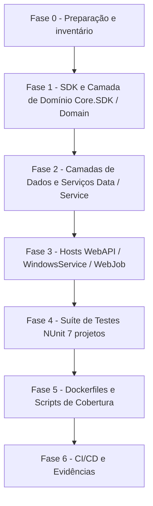

# Guia Genérico — Atualização de Pacotes (.NET NuGet e Central Package Management)

**Documento:** Guia operacional reutilizável  
**Baseado em:** `DOCUMENTACAO/UpdateDotNet10/RascunhoPlanoUpdateDotNet10.md`, `PlanoAcaoMigracaoDotNet10.md` e `RelatorioMigracaoDotNet10.md`  
**Data:** 2026-08-22  
**Aplicabilidade:** Qualquer ciclo de atualização de dependências deste repositório (rotina mensal, upgrade de major, migração de runtime/framework).  

**Solução de Referência:** [SmartDigitalPsicoAPI.sln](file:///c:/git/SMARTDIGITALPSICO/SmartDigitalPsicoAPI/SmartDigitalPsicoAPI.sln)  

---

## 1. Objetivo

Padronizar como atualizar dependências de pacotes em toda a solução backend **SmartDigitalPsicoAPI**, preservando:

- Integridade de migrations, seeds, contratos de API REST e schemas de banco (MySQL / SQL Server)
- Funcionamento de APIs, background workers (`WindowsService`), `WebJob`, Injeção de Dependências (DI), logging (Serilog), telemetria e middlewares
- Build local, Docker, scripts de cobertura e pipelines CI/CD
- Zero alteração de regra de negócio ou contrato público durante o ciclo de atualização de pacotes

Este guia é genérico: as versões concretas de cada ciclo devem ser registradas em um documento filho por execução (o "Conjunto Homologado" daquele ciclo — ver Seção 5), nunca hardcoded aqui.

---

## 2. Escopo e não escopo

### 2.1 Escopo

| Categoria | Ação |
| --------- | ---- |
| Projetos .NET (bibliotecas, Web API, testes, workers, jobs) | Atualizar pacotes NuGet via Central Package Management (`Directory.Packages.props`); atualizar TFM apenas em ciclos de migração de runtime |
| Bibliotecas internas e SDK (`SmartDigitalPsico.Core.SDK`) | Atualizar dependências preservando interfaces e contratos de domínio |
| Suíte de Testes NUnit (7 projetos de teste) | Atualizar frameworks de teste, runners, analisadores, asserções (`AwesomeAssertions`) e mocks (`Moq`, `Moq.EntityFrameworkCore`) |
| Dockerfiles e docker-compose | Atualizar imagens base (`mcr.microsoft.com/dotnet/aspnet` e `sdk`) somente quando o ciclo envolver mudança de runtime |
| Scripts (`analyze_coverage.ps1`, scripts de auditoria) | Atualizar referências e paths caso haja alteração de runtime/TFM |
| Pipelines CI/CD (`azure-pipelines.yml`) | Alinhar versão de SDK .NET (`UseDotNet@2`) |

### 2.2 Não escopo

- Alteração de regras de negócio, contratos REST, payloads JSON ou schemas de banco sem necessidade técnica
- Refatoração de domínio ou preferências arquiteturais não relacionadas à atualização
- Reescrita de testes além do necessário para compilar/executar nas novas versões
- Troca de bibliotecas por equivalentes (ex.: troca de ORM ou provider — decisão arquitetural separada, com RFC própria)

Qualquer mudança fora do escopo deve ser registrada e tratada em PR separado.

---

## 3. Princípios obrigatórios

1. **Inventário antes de alterar** — nunca atualizar sem primeiro gerar a lista do que está desatualizado e vulnerável (Seção 4).
2. **Conjunto Homologado por ciclo** — cada ciclo de atualização produz uma tabela "pacote / versão atual / versão a aplicar / latest disponível / justificativa quando não for a latest". Só entram versões estáveis (sem `preview`, `rc`, `beta`, `next`, `canary`) em produção.
3. **Atualizar por blocos coesos, nunca pacote a pacote isolado** — pacotes do mesmo ecossistema sobem juntos (ex.: todos `Microsoft.AspNetCore.*` no mesmo patch; toda a família `Microsoft.Extensions.*` alinhada; ferramentas NUnit coordenadas).
4. **Respeitar dependências rígidas do grafo** — quando um pacote trava a major de outro (ex.: provider de banco `Pomelo.EntityFrameworkCore.MySql` travando a major do `Microsoft.EntityFrameworkCore`), documentar a trava e NÃO forçar a latest. Registrar a condição de destrave para o próximo ciclo ("Conjunto v2 futuro").
5. **Abordagem incremental por fases** — validar build/teste ao final de cada fase; nunca alterar tudo de uma vez.
6. **Centralização de versões via CPM** — a solução usa Central Package Management (`Directory.Packages.props` como fonte única; `.csproj` sem atributo `Version`).
7. **Branch dedicada com commits por fase** — ex.: `chore/update-packages-YYYY-MM` ou `feature/migration-<runtime>`.
8. **Major bump exige atenção individual** — ler changelog/breaking changes antes de aplicar; um major de terceiro (ex.: sanitizer, lib de relatórios, lib de teste) nunca sobe "de carona" no lote.
9. **Nenhuma migration/schema novo por causa de atualização** — se a atualização gerar migration não-vazia ou diff de schema, investigar antes de commitar.

---

## 4. Fase de inventário (sempre a primeira)

### 4.1 .NET / NuGet

Comandos para inventário da solução:

```powershell
dotnet --list-sdks
dotnet list SmartDigitalPsicoAPI.sln package --outdated
dotnet list SmartDigitalPsicoAPI.sln package --vulnerable --include-transitive
dotnet list SmartDigitalPsicoAPI.sln package
```

Gerar tabelas:

| Projeto | Tipo | TFM atual |
| ------- | ---- | --------- |
| [SmartDigitalPsico.Core.SDK](file:///c:/git/SMARTDIGITALPSICO/SmartDigitalPsicoAPI/SmartDigitalPsico.Core.SDK/SmartDigitalPsico.Core.SDK.csproj) | Class Library / SDK | net10.0 |
| [SmartDigitalPsico.Domain](file:///c:/git/SMARTDIGITALPSICO/SmartDigitalPsicoAPI/SmartDigitalPsico.Domain/SmartDigitalPsico.Domain.csproj) | Class Library (Domain) | net10.0 |
| [SmartDigitalPsico.Data](file:///c:/git/SMARTDIGITALPSICO/SmartDigitalPsicoAPI/SmartDigitalPsico.Data/SmartDigitalPsico.Data.csproj) | Class Library (Data/EF) | net10.0 |
| [SmartDigitalPsico.Service](file:///c:/git/SMARTDIGITALPSICO/SmartDigitalPsicoAPI/SmartDigitalPsico.Service/SmartDigitalPsico.Service.csproj) | Class Library (Services) | net10.0 |
| [SmartDigitalPsico.WebAPI](file:///c:/git/SMARTDIGITALPSICO/SmartDigitalPsicoAPI/SmartDigitalPsico.WebAPI/SmartDigitalPsico.WebAPI.csproj) | ASP.NET Core Web API | net10.0 |
| [SmartDigitalPsico.WindowsService](file:///c:/git/SMARTDIGITALPSICO/SmartDigitalPsicoAPI/SmartDigitalPsico.WindowsService/SmartDigitalPsico.WindowsService.csproj) | Worker Service | net10.0 |
| [SmartDigitalPsico.WebJob](file:///c:/git/SMARTDIGITALPSICO/SmartDigitalPsicoAPI/SmartDigitalPsico.WebJob/SmartDigitalPsico.WebJob.csproj) | Azure WebJobs Host | net10.0 |
| [SmartDigitalPsico.Core.SDK.Tests](file:///c:/git/SMARTDIGITALPSICO/SmartDigitalPsicoAPI/SmartDigitalPsico.Core.SDK.Tests/SmartDigitalPsico.Core.SDK.Tests.csproj) | NUnit Test Project | net10.0 |
| [SmartDigitalPsico.Domain.Test](file:///c:/git/SMARTDIGITALPSICO/SmartDigitalPsicoAPI/SmartDigitalPsico.Domain.Test/SmartDigitalPsico.Domain.Test.csproj) | NUnit Test Project | net10.0 |
| [SmartDigitalPsico.Data.Test](file:///c:/git/SMARTDIGITALPSICO/SmartDigitalPsicoAPI/SmartDigitalPsico.Data.Test/SmartDigitalPsico.Data.Test.csproj) | NUnit Test Project | net10.0 |
| [SmartDigitalPsico.Service.Test](file:///c:/git/SMARTDIGITALPSICO/SmartDigitalPsicoAPI/SmartDigitalPsico.Service.Test/SmartDigitalPsico.Service.Test.csproj) | NUnit Test Project | net10.0 |
| [SmartDigitalPsico.WebAPI.Test](file:///c:/git/SMARTDIGITALPSICO/SmartDigitalPsicoAPI/SmartDigitalPsico.WebAPI.Test/SmartDigitalPsico.WebAPI.Test.csproj) | NUnit Integration Test | net10.0 |
| [SmartDigitalPsico.WindowsService.Test](file:///c:/git/SMARTDIGITALPSICO/SmartDigitalPsicoAPI/SmartDigitalPsico.WindowsService.Test/SmartDigitalPsico.WindowsService.Test.csproj) | NUnit Test Project | net10.0 |
| [SmartDigitalPsico.WebJob.Test](file:///c:/git/SMARTDIGITALPSICO/SmartDigitalPsicoAPI/SmartDigitalPsico.WebJob.Test/SmartDigitalPsico.WebJob.Test.csproj) | NUnit Test Project | net10.0 |

| Pacote | Versão atual | Latest stable | Versão a aplicar | Justificativa se diferente da latest |
| ------ | ------------ | ------------- | ---------------- | ------------------------------------ |

---

## 5. Conjunto Homologado — regras de montagem

### 5.1 Blocos .NET (modelo)

Organizar o conjunto em blocos, na ordem de dependência:

- **Bloco A — Plataforma** (`Microsoft.AspNetCore.*`, `Microsoft.Extensions.*`, `Microsoft.Extensions.Hosting.*`, `Microsoft.AspNetCore.Mvc.Testing`): todos no MESMO patch do ciclo do runtime alvo (.NET 10).
- **Bloco B — Persistência** (`Microsoft.EntityFrameworkCore.*` + providers `Pomelo.EntityFrameworkCore.MySql`, `SqlServer`, `Sqlite`, `InMemory` + `Moq.EntityFrameworkCore`): todos na MESMA major, limitada pela major suportada pelo provider mais restritivo. Documentar a trava (ex.: "Pomelo 9 exige EF <= 9.x") e a condição de destrave.
- **Bloco C — OpenAPI, logging, tokens e segurança** (`Swashbuckle.AspNetCore` e extensões, `Serilog` e sinks, `Microsoft.IdentityModel.JsonWebTokens` / `System.IdentityModel.Tokens.Jwt`, `Scrutor`): Swashbuckle segue compatibilidade com ASP.NET Core e Serilog alinhado.
- **Bloco D — Domínio, relatórios, utilitários e integrações** (`AutoMapper`, `FluentValidation`, `Newtonsoft.Json`, `Polly`, `Bogus`, `HtmlSanitizer`, `DocumentFormat.OpenXml`, `PDFsharp`, `QuestPDF`, `Microsoft.Azure.WebJobs.*`, `Azure.*`): latest estável, com atenção a licenças em majors novos (ex.: AutoMapper 15+).
- **Bloco E — Testes** (`Microsoft.NET.Test.Sdk`, `NUnit`, `NUnit3TestAdapter`, `NUnit.Analyzers`, `Moq`, `AwesomeAssertions`, `coverlet.collector`, `coverlet.msbuild`): latest estável alinhada ao VSTest / dotnet test engine; mocks acoplados a EF (`Moq.EntityFrameworkCore`) seguem estritamente a major do Bloco B.

Dependências rígidas típicas (validar a cada ciclo):

| Se usar | Então obrigatoriamente |
| ------- | ---------------------- |
| Provider `Pomelo.EntityFrameworkCore.MySql` na major N | Todos `Microsoft.EntityFrameworkCore.*` na major N |
| Runtime `net10.0` em Web API / Hosts | Todos `Microsoft.AspNetCore.*` / `Microsoft.Extensions.*` no patch do ciclo |
| Swashbuckle major M | ASP.NET Core compatível com M (não segurar major antiga) |
| `Moq.EntityFrameworkCore` major N | `Microsoft.EntityFrameworkCore` na major N |

Aplicação: todas as versões entram/atualizam em [Directory.Packages.props](file:///c:/git/SMARTDIGITALPSICO/SmartDigitalPsicoAPI/Directory.Packages.props); os arquivos `.csproj` permanecem sem o atributo `Version=`.

---

## 6. Plano de execução por fases



- **Fase 0 — Preparação**: branch dedicada; inventário (Seção 4); montar Conjunto Homologado (Seção 5); commit baseline com build e testes verdes no estado atual.
- **Fase 1 — SDK e Domínio**: atualizar [SmartDigitalPsico.Core.SDK](file:///c:/git/SMARTDIGITALPSICO/SmartDigitalPsicoAPI/SmartDigitalPsico.Core.SDK/SmartDigitalPsico.Core.SDK.csproj) e [SmartDigitalPsico.Domain](file:///c:/git/SMARTDIGITALPSICO/SmartDigitalPsicoAPI/SmartDigitalPsico.Domain/SmartDigitalPsico.Domain.csproj).
- **Fase 2 — Dados e Serviços**: aplicar Blocos B e D nas camadas [SmartDigitalPsico.Data](file:///c:/git/SMARTDIGITALPSICO/SmartDigitalPsicoAPI/SmartDigitalPsico.Data/SmartDigitalPsico.Data.csproj) e [SmartDigitalPsico.Service](file:///c:/git/SMARTDIGITALPSICO/SmartDigitalPsicoAPI/SmartDigitalPsico.Service/SmartDigitalPsico.Service.csproj).
- **Fase 3 — Hosts executáveis**: aplicar Blocos A, C e D em [SmartDigitalPsico.WebAPI](file:///c:/git/SMARTDIGITALPSICO/SmartDigitalPsicoAPI/SmartDigitalPsico.WebAPI/SmartDigitalPsico.WebAPI.csproj), [SmartDigitalPsico.WindowsService](file:///c:/git/SMARTDIGITALPSICO/SmartDigitalPsicoAPI/SmartDigitalPsico.WindowsService/SmartDigitalPsico.WindowsService.csproj) e [SmartDigitalPsico.WebJob](file:///c:/git/SMARTDIGITALPSICO/SmartDigitalPsicoAPI/SmartDigitalPsico.WebJob/SmartDigitalPsico.WebJob.csproj).
- **Fase 4 — Suíte de testes**: aplicar Bloco E nos 7 projetos de teste (`*.Test` e `*.Tests`); rodar `dotnet test` e validar 100% de aprovação.
- **Fase 5 — Containers e scripts**: verificar [Dockerfile](file:///c:/git/SMARTDIGITALPSICO/SmartDigitalPsicoAPI/Dockerfile), [docker-compose.yml](file:///c:/git/SMARTDIGITALPSICO/SmartDigitalPsicoAPI/docker-compose.yml) e script [analyze_coverage.ps1](file:///c:/git/SMARTDIGITALPSICO/SmartDigitalPsicoAPI/analyze_coverage.ps1).
- **Fase 6 — CI/CD e evidências**: alinhar [azure-pipelines.yml](file:///c:/git/SMARTDIGITALPSICO/SmartDigitalPsicoAPI/azure-pipelines.yml); gerar relatório do ciclo.

---

## 7. Checklist de validação

### 7.1 .NET — build e restore

```powershell
dotnet restore SmartDigitalPsicoAPI.sln
dotnet build SmartDigitalPsicoAPI.sln -c Release
```

- [ ] Restore sem `NU1107` (conflito de versão) e `NU1202` (TFM incompatível)
- [ ] Build Release com 0 erros; warnings novos de obsolescência corrigidos ou justificados
- [ ] Warnings `NU1510` (PackageReference redundante) e transitivos monitorados

### 7.2 .NET — testes e cobertura

```powershell
dotnet test SmartDigitalPsicoAPI.sln -c Release --no-build
dotnet test SmartDigitalPsicoAPI.sln -c Release /p:CollectCoverage=true /p:CoverletOutputFormat=opencover
```

- [ ] 100% dos testes passando em todos os 7 projetos de teste
- [ ] Cobertura sem regressão injustificada

### 7.3 .NET — EF Core / migrations

```powershell
dotnet ef migrations list `
  --project SmartDigitalPsico.Data/SmartDigitalPsico.Data.csproj `
  --startup-project SmartDigitalPsico.WebAPI/SmartDigitalPsico.WebAPI.csproj

dotnet ef database update `
  --project SmartDigitalPsico.Data/SmartDigitalPsico.Data.csproj `
  --startup-project SmartDigitalPsico.WebAPI/SmartDigitalPsico.WebAPI.csproj
```

- [ ] `migrations list` e `database update` sem erro
- [ ] Técnica da migration temporária: gerar migration `ValidacaoPosUpdate`; se vier com `Up`/`Down` vazios (ou apenas updates estáveis de seed), a atualização não alterou schema estrutural DDL (esperado) — remover com `dotnet ef migrations remove --force` caso seja puramente transitória.
- [ ] Validação do provider ativo (MySQL / Pomelo e SQL Server)

### 7.4 .NET — execução dos hosts (smoke)

```powershell
# Web API
dotnet run --project SmartDigitalPsico.WebAPI/SmartDigitalPsico.WebAPI.csproj

# Workers (opcional)
dotnet run --project SmartDigitalPsico.WindowsService/SmartDigitalPsico.WindowsService.csproj
dotnet run --project SmartDigitalPsico.WebJob/SmartDigitalPsico.WebJob.csproj
```

- [ ] Startup sem `InvalidOperationException` de DI
- [ ] Endpoint de documentação Swagger acessível (`/swagger`)
- [ ] Autenticação JWT e middlewares operando normalmente
- [ ] Logs do Serilog formatados sem vazamento de credenciais

---

## 8. Evidências obrigatórias da entrega

1. **Conjunto Homologado do ciclo** — documento filho em `DOCUMENTACAO/UpdatePackages/<AAAA-MM>-ConjuntoHomologado.md` com tabelas aplicadas e justificativas.
2. **Lista de arquivos alterados** — [Directory.Packages.props](file:///c:/git/SMARTDIGITALPSICO/SmartDigitalPsicoAPI/Directory.Packages.props), `.csproj`, Dockerfiles, pipelines, scripts.
3. **Relatório quantitativo:**

```text
Projetos .NET atualizados: N
Pacotes NuGet atualizados: N
Testes .NET executados/passando: 1.344 / 1.344
Vulnerabilidades resolvidas: N
Falhas encontradas/corrigidas: N/N
```

4. **Riscos residuais** — majors adiados (ex.: Pomelo 10), travas de grafo, warnings pendentes.

---

## 9. Plano de rollback

```powershell
git checkout <branch-do-ciclo>
git reset --hard <commit-baseline>

dotnet restore SmartDigitalPsicoAPI.sln
dotnet build SmartDigitalPsicoAPI.sln -c Release
dotnet test SmartDigitalPsicoAPI.sln -c Release
```

---

## 10. Referências

- [Directory.Packages.props](file:///c:/git/SMARTDIGITALPSICO/SmartDigitalPsicoAPI/Directory.Packages.props) — fonte única de versões NuGet (CPM)
- [RelatorioMigracaoDotNet10.md](file:///c:/git/SMARTDIGITALPSICO/SmartDigitalPsicoAPI/DOCUMENTACAO/UpdateDotNet10/RelatorioMigracaoDotNet10.md) — relatório de migração de runtime para .NET 10
- [Analise-xUnit-v4-MicrosoftTestingPlatform.md](file:///c:/git/SMARTDIGITALPSICO/SmartDigitalPsicoAPI/DOCUMENTACAO/UpdatePackages/Analise-xUnit-v4-MicrosoftTestingPlatform.md) — análise técnica do padrão de testes NUnit vs MTP v2
