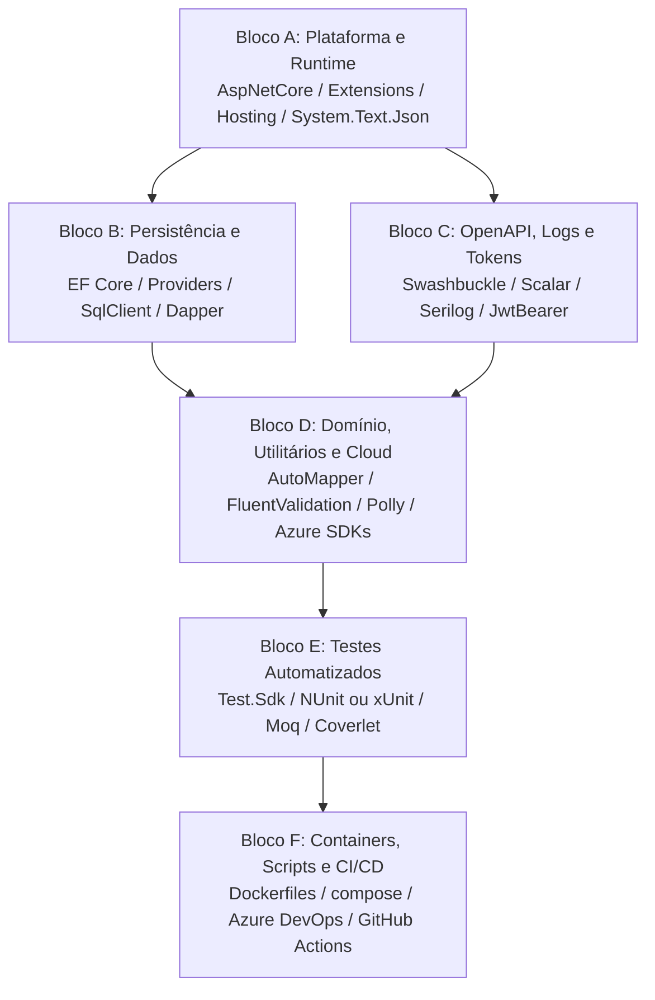

# Guia Genérico — Atualização de Pacotes (.NET NuGet e Central Package Management)

**Documento:** Guia operacional reutilizável para soluções backend .NET  
**Arquivo:** `GuiaGenericoAtualizacaoPacotesNet.md`  
**Data:** 2026-08-22  
**Aplicabilidade:** Qualquer ciclo de atualização de dependências em soluções .NET (Web APIs, Worker Services, Background Jobs, Bibliotecas de Domínio/Dados e SDKs multi-target) gerenciadas via Central Package Management (CPM) ou referências de pacotes diretas no NuGet.  

---

## 1. Objetivo

Padronizar e estruturar o processo de atualização de dependências NuGet em soluções .NET, assegurando:

1. **Estabilidade de Runtime e Zero Regressão**: Garantir que as regras de negócio, contratos de API REST/GraphQL, injeção de dependência (DI), serialização JSON e fluxos de autenticação/autorização (JWT, OAuth, Identity) permaneçam íntegros.
2. **Integridade de Persistência e Schemas**: Evitar alterações involuntárias de schema de banco de dados (DDL), falhas em Entity Framework Core migrations ou incompatibilidades entre provedores de banco (MySQL, SQL Server, PostgreSQL, SQLite, Oracle) e o ORM.
3. **Coesão e Alinhamento por Blocos**: Atualizar conjuntos de pacotes relacionados de forma atômica e coordenada (ex.: toda a plataforma ASP.NET Core e Microsoft.Extensions no mesmo patch do runtime ativo).
4. **Governança Centralizada (CPM)**: Manter versões centralizadas via **Central Package Management (`Directory.Packages.props`)**, eliminando discrepâncias de versão entre projetos e registrando formalmente justificativas para eventuais fixações (*pins*).
5. **Automação de Qualidade e CI/CD**: Garantir compilação com zero erros em modo Release, 100% de testes automatizados aprovados, métricas de cobertura de código preservadas e pipelines de build/deploy operacionais.

---

## 2. Escopo e Não Escopo

### 2.1 Escopo

| Categoria | Ação |
| --------- | ---- |
| **Plataforma .NET** | Atualizar pacotes `Microsoft.AspNetCore.*`, `Microsoft.Extensions.*`, `Microsoft.AspNetCore.Mvc.Testing`, `System.Text.Json` no patch correspondente ao runtime alvo (.NET 8, 9, 10) |
| **Camada de Persistência** | Atualizar `Microsoft.EntityFrameworkCore.*` e provedores de dados (`Pomelo.EntityFrameworkCore.MySql`, `SqlServer`, `Npgsql`, `Sqlite`), respeitando travas de compatibilidade do grafo |
| **OpenAPI, Logging e Observabilidade** | Atualizar geradores de documentação (`Swashbuckle.AspNetCore`, `Scalar.AspNetCore`, `Microsoft.AspNetCore.OpenApi`), engines de log (`Serilog` e sinks) e telemetria (`OpenTelemetry`, `Azure.Monitor`) |
| **Domínio, Resiliência e Utilitários** | Atualizar bibliotecas de utilitários (`AutoMapper`, `FluentValidation`, `Polly`, `Newtonsoft.Json`, `QuestPDF`, `PDFsharp`, `HtmlSanitizer`, `DocumentFormat.OpenXml`, SDKs Azure/AWS/GCP) |
| **Suíte de Testes** | Atualizar frameworks e runners de testes (`NUnit`, `xUnit`, `MSTest`, `Microsoft.NET.Test.Sdk`, `Moq`, `AwesomeAssertions`, `coverlet`), alinhando ferramentas de mock aos pacotes de ORM |
| **SDKs e Pacotes Publicáveis** | Atualizar dependências em bibliotecas multi-target (`TargetFrameworks` com `netstandard2.0`, `net8.0`, `net10.0`), preservando compatibilidade com consumidores legados |
| **Infraestrutura e CI/CD** | Atualizar imagens base em Dockerfiles (`mcr.microsoft.com/dotnet/aspnet` e `sdk`), `docker-compose`, scripts de automação/cobertura e tasks de pipeline (`UseDotNet@2`) |

### 2.2 Não Escopo

- Alteração de regras de negócio, endpoints públicos, rotas ou contratos de integração externa sem requisito explícito
- Refatoração profunda de arquitetura de software (ex.: troca de ORM ou substituição de bibliotecas centrais sem RFC própria)
- Reescrita ampla de suítes de testes além do necessário para compatibilidade de build e execução
- Geração de novas migrations de banco de dados estruturais (DDL) causadas unicamente por atualização de dependências

---

## 3. Princípios Fundamentais de Governança de Dependências .NET

1. **Inventário Antes de Alterar**: Nunca atualizar dependências sem antes gerar o diagnóstico completo de pacotes desatualizados (`dotnet list package --outdated`) e vulneráveis (`dotnet list package --vulnerable --include-transitive`).
2. **Conjunto Homologado por Ciclo**: Cada rotina de atualização (mensal, trimestral ou major) produz um documento filho de **Conjunto Homologado** contendo a tabela de versões anteriores, aplicadas, mais recentes no NuGet e a justificativa para qualquer versão que não seja a *latest*.
3. **Atualização por Blocos Coesos**: Pacotes pertencentes à mesma família ou subsistema devem ser atualizados em conjunto:
   - Toda a plataforma `Microsoft.AspNetCore.*` e `Microsoft.Extensions.*` no mesmo patch do runtime.
   - Todo o ecossistema `Microsoft.EntityFrameworkCore.*` na mesma major/minor, alinhado aos providers de banco.
   - Ferramentas de teste e mocks sincronizadas com suas engines de execução.
4. **Respeito às Travas Rígidas do Grafo**: Quando um pacote de terceiro limita a versão de um pacote central (ex.: provedor de banco de dados que não suporta a nova major do EF Core), o bloco inteiro deve permanecer fixado na versão compatível até a liberação oficial upstream.
5. **Centralização de Versões via CPM**: A solução deve adotar **Central Package Management** utilizando um arquivo `Directory.Packages.props` na raiz. Os arquivos `.csproj` declaram `<PackageReference Include="..." />` sem o atributo `Version=`.
6. **Controle de Dependências Transitivas**: Utilizar `<CentralPackageTransitivePinningEnabled>true</CentralPackageTransitivePinningEnabled>` para forçar versões seguras de dependências transitivas vulneráveis.
7. **Verificação Rígida de Licenciamento**: Avaliar licenças de bibliotecas em upgrades de major (ex.: AutoMapper 15+ e MediatR 13+ possuem modelos comerciais/dual-license).
8. **Técnica da Migration Temporária**: Validar que a atualização do EF Core não introduz alterações indesejadas no modelo de banco gerando uma migration temporária de validação; se o diff contiver operações DDL não planejadas, a causa raiz deve ser investigada antes do commit.
9. **Preservação de Multi-Targeting em SDKs**: Bibliotecas e SDKs distribuídos externamente devem manter suporte aos TFMs estabelecidos, validando a geração dos pacotes com `dotnet pack` e inspecionando as pastas `lib/<tfm>/`.

---

## 4. Blocos Estruturais de Dependências .NET



### 4.1 Descrição dos Blocos

| Bloco | Componentes Típicos | Regra de Governança |
| ----- | ------------------- | ------------------- |
| **Bloco A — Plataforma** | `Microsoft.AspNetCore.*`, `Microsoft.Extensions.*`, `Microsoft.AspNetCore.Mvc.Testing`, `System.Text.Json` | Todos estritamente no mesmo patch correspondente ao runtime .NET ativo |
| **Bloco B — Persistência** | `Microsoft.EntityFrameworkCore.*`, `Pomelo.EntityFrameworkCore.MySql`, `Npgsql.EntityFrameworkCore.PostgreSQL`, `Microsoft.EntityFrameworkCore.SqlServer`, `SQLitePCLRaw.*`, `Microsoft.Data.SqlClient` | Fixados na mesma major/minor, determinada pelo provedor de banco mais restritivo |
| **Bloco C — OpenAPI & Logging** | `Swashbuckle.AspNetCore.*`, `Scalar.AspNetCore`, `Serilog.*`, `Microsoft.IdentityModel.*`, `System.IdentityModel.Tokens.Jwt`, `Scrutor` | Alinhados à versão do ASP.NET Core e famílias de tokens sincronizadas |
| **Bloco D — Utilitários & Cloud** | `AutoMapper`, `FluentValidation`, `Newtonsoft.Json`, `Polly`, `QuestPDF`, `PDFsharp`, `HtmlSanitizer`, `DocumentFormat.OpenXml`, `Azure.*`, `AWS.*` | Latest estável; verificação prévia de breaking changes e licenças |
| **Bloco E — Testes** | `Microsoft.NET.Test.Sdk`, `NUnit` / `xUnit`, `NUnit3TestAdapter` / `xunit.runner.*`, `NUnit.Analyzers`, `Moq`, `AwesomeAssertions`, `coverlet.*`, `Moq.EntityFrameworkCore` | Runners e analisadores atualizados; mocks de EF (`Moq.EntityFrameworkCore`) estritamente na major do Bloco B |
| **Bloco F — Infra & CI/CD** | `Dockerfile`, `docker-compose.yml`, `azure-pipelines.yml`, scripts PowerShell / Bash | Tags de imagens Docker e tasks de SDK alinhadas ao TFM da solução |

---

## 5. Roteiro Operacional de Execução por Fases

### 5.1 Fase 0 — Diagnóstico e Inventário

Executar na raiz da solução .NET:

```powershell
# 1. Listar SDKs instalados na máquina
dotnet --list-sdks

# 2. Listar todos os pacotes com versões mais recentes disponíveis
dotnet list <NomeSolucao>.sln package --outdated

# 3. Auditoria de vulnerabilidades diretas e transitivas
dotnet list <NomeSolucao>.sln package --vulnerable --include-transitive

# 4. Listar grafo de pacotes da solução
dotnet list <NomeSolucao>.sln package
```

Montar a matriz do **Conjunto Homologado do Ciclo**:

| Pacote | Bloco | Versão Atual | Versão Proposta | Latest NuGet | Justificativa se != Latest |
| ------ | ----- | ------------ | --------------- | ------------ | -------------------------- |

---

### 5.2 Fase 1 — Bibliotecas Base, Domínio e SDKs

1. Atualizar as versões em `Directory.Packages.props` para os blocos de Domínio e Utilitários (Bloco D).
2. Compilar os projetos de domínio e SDKs de forma incremental:
```powershell
dotnet build <CaminhoProjetoDominio>.csproj -c Release
```
3. Se houver SDKs multi-target publicáveis:
```powershell
dotnet pack <CaminhoProjetoSDK>.csproj -c Release
```

---

### 5.3 Fase 2 — Camada de Persistência e Dados

1. Atualizar versões do Bloco B (`Microsoft.EntityFrameworkCore.*`, Provedores de Banco, SqlClient, SQLitePCLRaw).
2. Compilar os projetos de dados/infraestrutura:
```powershell
dotnet build <CaminhoProjetoData>.csproj -c Release
```
3. Executar a técnica da migration temporária de validação:
```powershell
dotnet ef migrations add ValidacaoPosUpdateTemp --project <ProjetoData> --startup-project <ProjetoAPI>
```
   - Inspecionar os métodos `Up()` e `Down()`.
   - Se estiverem vazios (ou contiverem apenas seeds de timestamp já esperados), o modelo está consistente.
   - Remover a migration temporária:
```powershell
dotnet ef migrations remove --force --project <ProjetoData> --startup-project <ProjetoAPI>
```

---

### 5.4 Fase 3 — APIs, Worker Services e Hosts Executáveis

1. Atualizar Blocos A e C em `Directory.Packages.props`.
2. Compilar os projetos executáveis (Web API, Workers, WebJobs, Consoles):
```powershell
dotnet build <CaminhoProjetoAPI>.csproj -c Release
```
3. Realizar teste de inicialização (*smoke test*):
```powershell
dotnet run --project <CaminhoProjetoAPI>.csproj
```
   - Verificar ausência de exceções de injeção de dependência na inicialização (`InvalidOperationException`).
   - Validar acesso ao Swagger/OpenAPI e endpoints de Health Check (`/health`, `/health/ready`).

---

### 5.5 Fase 4 — Suíte de Testes Automatizados

1. Atualizar Bloco E em `Directory.Packages.props` (`Test.Sdk`, adaptadores, asserções e mocks).
2. Executar toda a suíte de testes da solução em modo Release:
```powershell
dotnet test <NomeSolucao>.sln -c Release --no-build
```
3. Executar análise de cobertura de código:
```powershell
dotnet test <NomeSolucao>.sln -c Release /p:CollectCoverage=true /p:CoverletOutputFormat=opencover
```
   - Validar 100% de aprovação (0 falhas) e conferir estabilidade da cobertura.

---

### 5.6 Fase 5 — Contêineres, Scripts e CI/CD

1. Revisar tags de runtime e SDK em todos os `Dockerfile` do repositório (`mcr.microsoft.com/dotnet/aspnet:<versao>` e `sdk:<versao>`).
2. Testar build local de contêineres:
```powershell
docker compose build --no-cache
```
3. Alinhar referências de SDK em pipelines de CI/CD (`azure-pipelines.yml`, GitHub Actions).

---

## 6. Checklist Geral de Validação e Entrega

- [ ] **Restauração Limpa**: `dotnet restore` executa com 0 erros, sem conflitos `NU1107` ou incompatibilidades `NU1202`.
- [ ] **Compilação Release**: `dotnet build -c Release` conclui com 0 erros. Warnings novos foram corrigidos ou suprimidos com justificativa formal.
- [ ] **100% de Testes Verdes**: Todos os projetos de teste da solução executam com 100% de sucesso via `dotnet test`.
- [ ] **Cobertura de Código**: Relatórios gerados sem regressão nas métricas homologadas do projeto.
- [ ] **Persistência / EF Core**: Nenhuma alteração estrutural indevida em migrations; `dotnet ef database update` validado em ambiente de homologação/desenvolvimento.
- [ ] **Smoke Test de Runtime**: APIs e Workers iniciam corretamente sem falhas de DI ou configuração.
- [ ] **Documentação do Ciclo**: Documento `<AAAA-MM>-ConjuntoHomologado.md` preenchido com as versões aplicadas e justificativas.

---

## 7. Plano de Rollback

Caso ocorra regressão impeditiva durante qualquer etapa:

```powershell
# 1. Retornar ao commit baseline da branch
git checkout <branch-do-ciclo>
git reset --hard <commit-baseline>

# 2. Restaurar, compilar e testar o estado anterior
dotnet restore <NomeSolucao>.sln
dotnet build <NomeSolucao>.sln -c Release
dotnet test <NomeSolucao>.sln -c Release
```

---

## 8. Matriz de Riscos Recorrentes e Mitigações (.NET)

| Risco / Sintoma | Impacto | Estratégia de Mitigação |
| --------------- | ------- | ----------------------- |
| **Provedor trava major do EF Core** (ex.: Pomelo x EF 10) | Falha de inicialização / `MethodNotFoundException` | Manter o Bloco B completo na major do provedor; documentar condição de destrave |
| **Mistura de patches `Microsoft.*`** | Conflitos de dependência `NU1107` no restore | Utilizar CPM (`Directory.Packages.props`) para forçar todo o Bloco A na mesma versão |
| **Quebra de Mock em EF Core** (`Moq.EntityFrameworkCore 10.x` com EF 9.x) | Erros de compilação em classes de teste | Fixar `Moq.EntityFrameworkCore` rigorosamente na major do EF Core ativo |
| **Major bump com mudança de licença** (ex.: AutoMapper 15+, MediatR 13+) | Insegurança jurídica / cobrança de licença | Revisar termos de licença antes de aprovar major bumps no Conjunto Homologado |
| **Migration temporária com diff de schema** | Alterações acidentais de banco em produção | Investigar anotações de entidade ou convenções do EF Core antes de commitar |
| **Vulnerabilidade transitiva em pacote de terceiro** | Alertas de segurança no pipeline | Utilizar Central Package Transitive Pinning no `Directory.Packages.props` para forçar versão corrigida |
